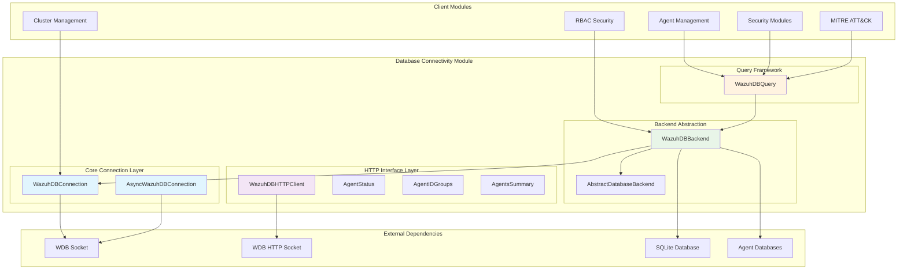
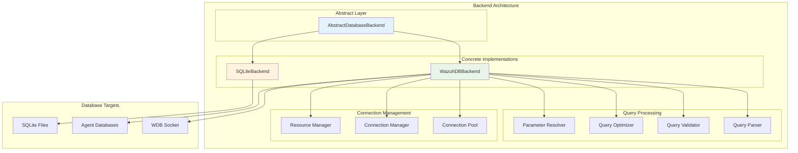
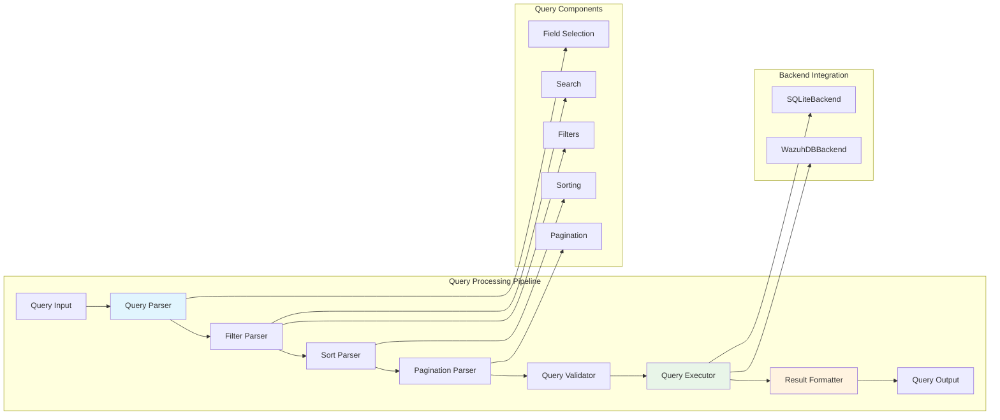
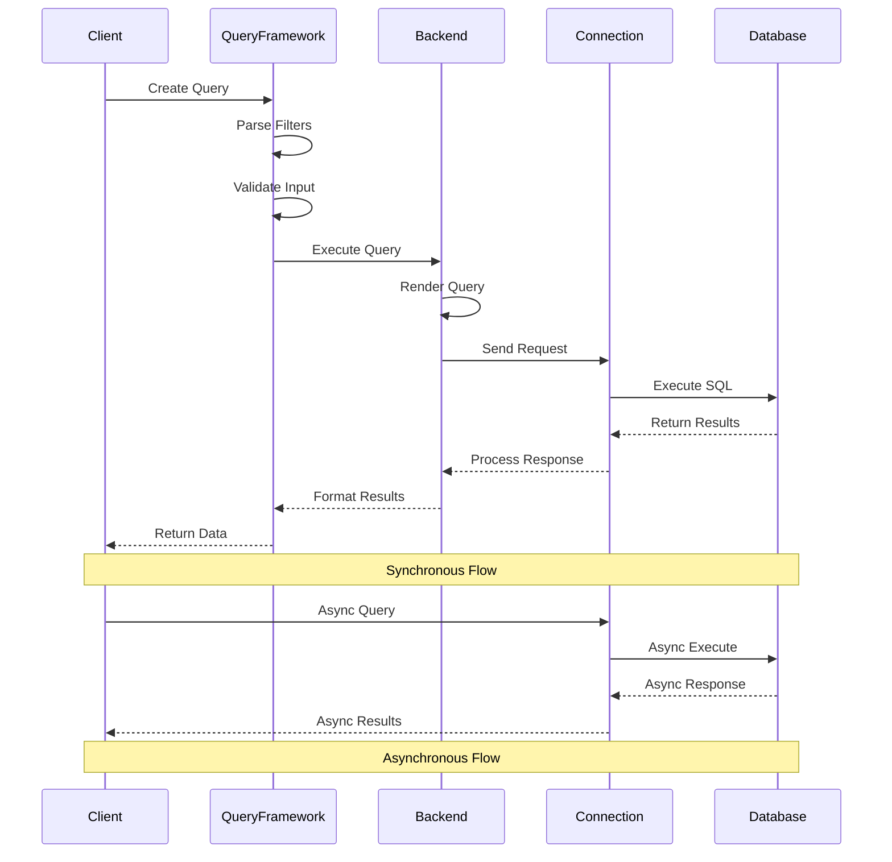
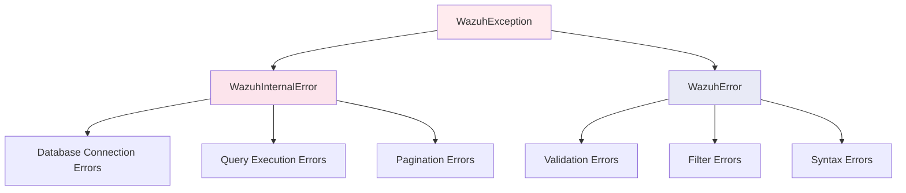

# Database Connectivity

The Database Connectivity module provides comprehensive database access and communication capabilities for the Wazuh security platform. This module serves as the primary interface between Wazuh components and the underlying database systems, offering both synchronous and asynchronous connectivity options along with HTTP-based database operations.

## Architecture Overview

The Database Connectivity module implements a multi-layered architecture that supports various database communication protocols and provides robust error handling, query optimization, and connection management.



## Core Components

### Connection Management

#### WazuhDBConnection
The primary synchronous database connection class that handles communication with the Wazuh database through Unix sockets.

**Key Features:**
- Synchronous socket communication with wazuh-db
- Query validation and input sanitization
- Automatic pagination for large result sets
- JSON response parsing with custom date handling
- Connection pooling and resource management

**Usage Patterns:**
```python
# Basic query execution
with WazuhDBConnection() as conn:
    result = conn.execute("agent 001 sql SELECT * FROM fim_entry")

# Agent database deletion
conn.delete_agents_db(['001', '002', '003'])
```

#### AsyncWazuhDBConnection
Asynchronous counterpart providing non-blocking database operations for high-performance scenarios.

**Key Features:**
- Async/await support for non-blocking operations
- Event loop integration
- Concurrent query execution
- Automatic connection management
- Error handling with proper exception propagation

**Usage Patterns:**
```python
# Asynchronous query execution
async with AsyncWazuhDBConnection() as conn:
    result = await conn.run_wdb_command("global sql SELECT * FROM agent")
```

### HTTP Interface Layer

#### WazuhDBHTTPClient
Modern HTTP-based interface for database operations, providing RESTful access to database functionality.

**Key Features:**
- HTTP/REST API interface over Unix domain sockets
- Async HTTP client with connection pooling
- Structured response models
- Timeout and retry mechanisms
- Error handling with detailed exception information

**Supported Operations:**
- Agent management (IDs, groups, status)
- Agent synchronization information
- Agent restart information
- Summary statistics and reporting

### Data Models

#### AgentStatus
Represents agent connectivity status with comprehensive metrics.

```python
class AgentStatus:
    active: int          # Active agents count
    disconnected: int    # Disconnected agents count
    never_connected: int # Never connected agents count
    pending: int         # Pending agents count
```

#### AgentIDGroups
Pairs agent identifiers with their associated groups.

```python
class AgentIDGroups:
    id: str             # Agent ID (zero-padded)
    groups: list[str]   # Associated group names
```

#### AgentsSummary
Comprehensive agent information summary including status, OS distribution, and group membership.

```python
class AgentsSummary:
    status: AgentStatus    # Agent status breakdown
    os: dict              # OS distribution
    groups: dict          # Group membership statistics
```

## Database Backend Architecture

### Backend Abstraction Layer

The module implements a sophisticated backend abstraction that supports multiple database engines and query optimization strategies.



### WazuhDBBackend
Concrete implementation of the database backend specifically designed for Wazuh database operations.

**Key Features:**
- Multi-format query support (agent, global, mitre, task)
- Parameter substitution and SQL injection prevention
- Connection lifecycle management
- Query rendering based on target database type
- Error handling and exception translation

**Query Formats:**
- `agent {id} sql {query}` - Agent-specific database queries
- `global sql {query}` - Global database queries
- `mitre sql {query}` - MITRE ATT&CK database queries
- `task sql {query}` - Task-specific database queries

## Query Framework

### WazuhDBQuery
Comprehensive query builder and executor that provides advanced filtering, sorting, and pagination capabilities.



**Advanced Features:**
- Complex query parsing with regex-based field extraction
- Multi-level filtering with parentheses support
- Date field handling with multiple format support
- RBAC integration for access control
- Distinct value queries
- Legacy filter compatibility
- Oversized query handling for large datasets

**Query Syntax:**
```
field_name operator value separator field_name operator value
```

**Supported Operators:**
- `=` - Equality
- `!=` - Inequality  
- `<` - Less than
- `>` - Greater than
- `~` - Like (pattern matching)

**Separators:**
- `;` - AND logic
- `,` - OR logic

## Data Flow Architecture



## Integration Points

### Core Framework Integration
The Database Connectivity module integrates deeply with the [Core Framework](Core Framework.md) through:
- **WazuhDBBackend**: Extends AbstractDatabaseBackend from core utilities
- **Exception Handling**: Uses WazuhError and WazuhInternalError from core exceptions
- **Configuration**: Leverages common configuration constants and paths

### Agent Management Integration
Provides database access for [Agent Management](Agent Management.md) operations:
- Agent registration and deregistration
- Agent status tracking and updates
- Group membership management
- Agent synchronization data

### Security Modules Integration
Supports [Security Modules](Security Modules.md) with specialized queries:
- Rootcheck database operations
- SCA (Security Configuration Assessment) queries
- Syscheck file integrity monitoring data
- Syscollector system information queries

### MITRE ATT&CK Integration
Enables [MITRE ATT&CK Integration](MITRE ATT&CK Integration.md) through:
- Dedicated MITRE database query format
- Technique, tactic, and mitigation data access
- Relationship mapping between MITRE entities

### RBAC Security Integration
Provides database backend for [RBAC Security](RBAC Security.md):
- User, role, and policy management
- Permission and access control queries
- Token management and blacklisting

### Cluster Management Integration
Supports [Cluster Management](Cluster Management.md) with:
- Distributed database synchronization
- Cluster state management
- Node-specific database operations

## Error Handling and Resilience

### Exception Hierarchy


### Error Categories

**Connection Errors (2005, 2010, 2011, 2014-2016):**
- Socket connection failures
- HTTP client initialization errors
- Timeout and protocol errors

**Query Errors (2003, 2004, 2006, 2007):**
- Invalid query syntax
- Execution failures
- Parameter validation errors

**Data Errors (2009, 2012, 2013):**
- Response size limitations
- HTTP response errors
- Request processing failures

### Resilience Features
- Automatic connection retry mechanisms
- Connection pooling and resource management
- Query timeout handling
- Graceful degradation for oversized queries
- Comprehensive error logging and reporting

## Performance Optimization

### Connection Management
- **Connection Pooling**: Reuse of database connections to minimize overhead
- **Async Operations**: Non-blocking I/O for high-throughput scenarios
- **Resource Cleanup**: Automatic connection cleanup and resource management

### Query Optimization
- **Pagination**: Automatic result set pagination to prevent memory issues
- **Field Selection**: Selective field retrieval to minimize data transfer
- **Query Caching**: Prepared statement reuse for repeated queries
- **Batch Operations**: Bulk operations for multiple database modifications

### Memory Management
- **Streaming Results**: Large result set streaming to prevent memory exhaustion
- **Buffer Management**: Configurable buffer sizes for optimal performance
- **Garbage Collection**: Proper resource disposal and memory cleanup

## Configuration and Deployment

### Socket Configuration
```python
# Default socket paths
WDB_SOCKET = "/var/ossec/queue/db/wdb"
WDB_HTTP_SOCKET = "/var/ossec/queue/db/wdb-http"

# Buffer and limit configurations
MAX_SOCKET_BUFFER_SIZE = 65536
MAXIMUM_DATABASE_LIMIT = 100000
MAX_QUERY_FILTERS_RESERVED_SIZE = 20000
```

### Connection Parameters
- **Request Slice**: Default pagination size (500 items)
- **Timeout Settings**: Configurable timeout values for operations
- **Retry Logic**: Configurable retry attempts for failed connections
- **Buffer Sizes**: Adjustable buffer sizes for data transfer

## Security Considerations

### Input Validation
- **SQL Injection Prevention**: Parameterized queries and input sanitization
- **Query Validation**: Strict validation of query syntax and structure
- **Field Validation**: Whitelist-based field name validation
- **Parameter Sanitization**: Automatic escaping of special characters

### Access Control
- **RBAC Integration**: Role-based access control for database operations
- **Agent Isolation**: Agent-specific database access restrictions
- **Query Filtering**: Automatic filtering based on user permissions
- **Audit Logging**: Comprehensive logging of database access and modifications

### Data Protection
- **Connection Security**: Unix domain socket communication for local security
- **Data Encryption**: Secure data transmission between components
- **Resource Limits**: Protection against resource exhaustion attacks
- **Error Information**: Controlled error message disclosure

## Monitoring and Observability

### Metrics and Monitoring
- Connection pool utilization
- Query execution times
- Error rates and types
- Database response times
- Resource consumption metrics

### Logging Integration
Integration with [Logging System](Logging System.md) for:
- Query execution logging
- Error and exception logging
- Performance metrics logging
- Security event logging

### Health Checks
- Database connectivity monitoring
- Socket availability checks
- Query performance monitoring
- Resource utilization tracking

## Future Enhancements

### Planned Improvements
- **Connection Multiplexing**: Advanced connection sharing and multiplexing
- **Query Optimization**: Enhanced query planning and optimization
- **Caching Layer**: Distributed caching for frequently accessed data
- **Metrics Collection**: Enhanced performance and usage metrics

### Scalability Enhancements
- **Horizontal Scaling**: Support for distributed database architectures
- **Load Balancing**: Intelligent query distribution across database instances
- **Sharding Support**: Data partitioning for large-scale deployments
- **Replication**: Database replication and failover capabilities

The Database Connectivity module serves as the foundation for all database operations within the Wazuh platform, providing reliable, secure, and high-performance access to critical security data while maintaining strict access controls and comprehensive error handling.