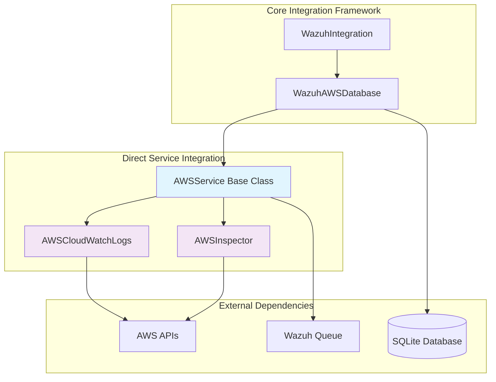
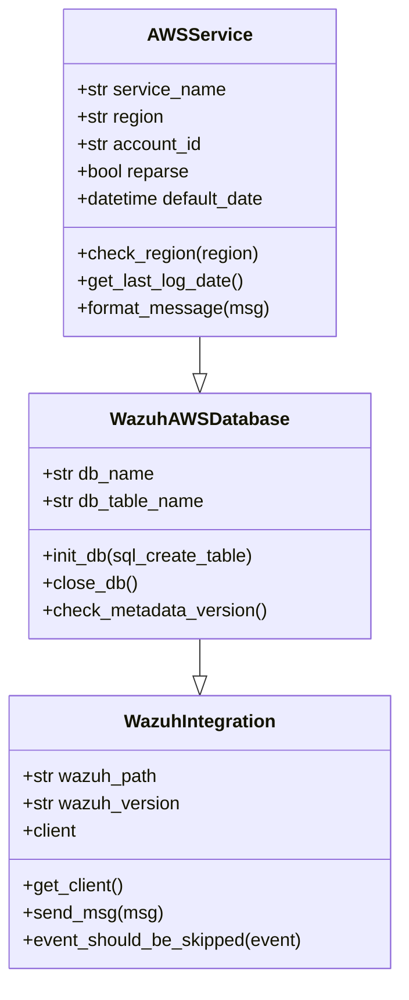
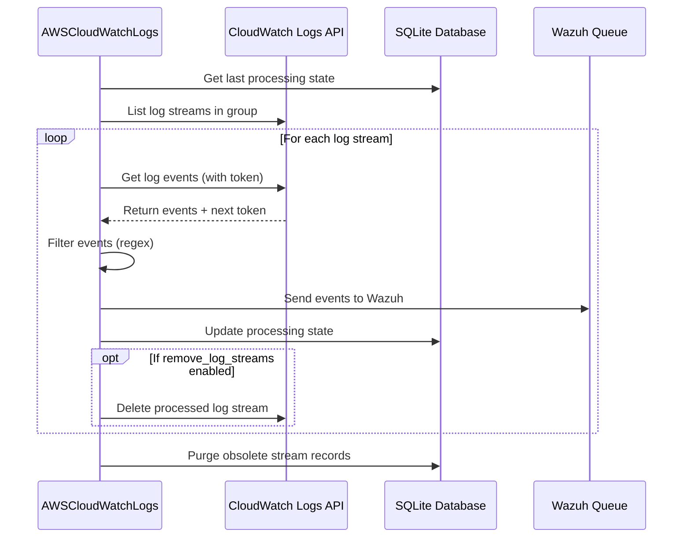
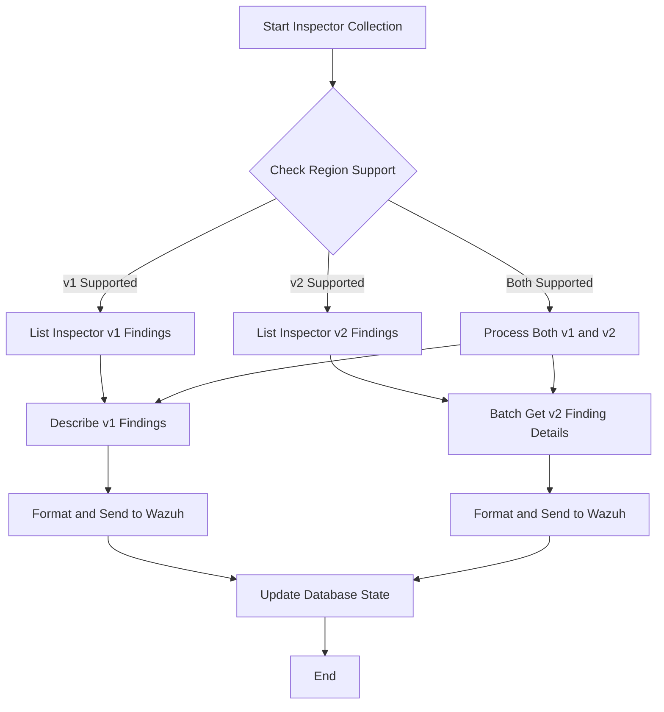
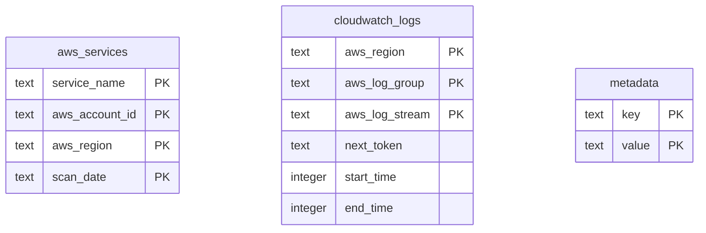

# Direct Service Integration

## Overview

The Direct Service Integration module provides specialized components for collecting security events and logs directly from AWS services through their native APIs. This module is part of the broader AWS Integration framework and focuses on real-time data collection from services like CloudWatch Logs and AWS Inspector, bypassing traditional S3-based log storage patterns.

## Architecture

The Direct Service Integration module implements a service-specific approach to AWS data collection, where each service has its own specialized handler that understands the service's API patterns, data formats, and operational characteristics.



## Core Components

### AWSService (Base Class)

The foundational class that provides common functionality for all AWS service integrations.

**Key Responsibilities:**
- AWS authentication and client management
- Database operations for tracking service state
- Message formatting and standardization
- Region validation and service configuration

**Key Features:**
- Inherits from `WazuhAWSDatabase` for persistent state management
- Implements standardized message templates for Wazuh integration
- Provides region validation for service availability
- Manages service-specific database tables



### AWSCloudWatchLogs

Specialized service for collecting logs from AWS CloudWatch Logs service.

**Key Responsibilities:**
- Stream-based log collection from CloudWatch Log Groups
- Token-based pagination for continuous log retrieval
- Timestamp-based filtering to avoid duplicate events
- Optional log stream cleanup after processing

**Key Features:**
- Supports multiple log groups simultaneously
- Maintains processing state per log stream in SQLite database
- Implements time-range based log retrieval
- Provides regex-based event filtering
- Optional automatic log stream removal after processing

**Data Flow:**


### AWSInspector

Specialized service for collecting security findings from AWS Inspector (v1 and v2).

**Key Responsibilities:**
- Retrieval of security findings from both Inspector v1 and v2
- Time-based filtering for incremental collection
- Region-specific service availability handling
- Batch processing for Inspector v2 API limitations

**Key Features:**
- Supports both Inspector v1 and v2 APIs
- Automatic region compatibility detection
- Batch processing for v2 findings (10 findings per request)
- Time-range based finding retrieval
- Maintains scan history in database

**Processing Flow:**


## Integration Patterns

### Database State Management

All direct service integrations maintain persistent state using SQLite databases:



### Message Standardization

All services implement a standardized message format for Wazuh integration:

```json
{
  "integration": "aws",
  "aws": {
    "source": "service_name",
    "region": "aws_region",
    "account_id": "account_id",
    "service_specific_data": "..."
  }
}
```

### Error Handling and Resilience

The module implements comprehensive error handling:

- **Connection Errors**: Automatic retry with exponential backoff
- **Authentication Errors**: Clear error messages and exit codes
- **Rate Limiting**: Built-in retry configuration to handle AWS throttling
- **Data Corruption**: Validation and graceful handling of malformed data
- **Service Unavailability**: Region-specific availability checks

## Configuration and Usage

### Service-Specific Configuration

Each service requires specific configuration parameters:

**CloudWatch Logs:**
- `aws_log_groups`: Comma-separated list of log group names
- `remove_log_streams`: Boolean flag for automatic stream cleanup
- `only_logs_after`: Date filter for log collection

**Inspector:**
- Automatic region detection for service availability
- Support for both v1 and v2 APIs based on region
- Time-based incremental collection

### Authentication Methods

The module supports multiple AWS authentication methods:
- IAM roles with temporary credentials
- AWS profiles from `~/.aws/credentials`
- Access key and secret key (deprecated)
- Cross-account role assumption with external ID

## Dependencies

### Internal Dependencies
- [Core Integration Framework](Core%20Integration%20Framework.md): Base integration classes and utilities
- [AWS Integration](AWS%20Integration.md): Parent module providing AWS-specific functionality

### External Dependencies
- **boto3**: AWS SDK for Python
- **botocore**: Low-level AWS service access
- **sqlite3**: Database operations for state management
- **socket**: Communication with Wazuh queue

## Performance Considerations

### Optimization Strategies

1. **Batch Processing**: Inspector v2 processes findings in batches of 10
2. **Token-based Pagination**: CloudWatch Logs uses tokens to avoid re-processing
3. **Database Optimization**: Regular PRAGMA optimize operations
4. **Memory Management**: Streaming processing for large log volumes

### Scalability Factors

- **Rate Limiting**: Built-in retry mechanisms handle AWS API limits
- **Concurrent Processing**: Each service can process multiple regions simultaneously
- **State Persistence**: Database state allows for interrupted processing recovery
- **Memory Efficiency**: Streaming approach minimizes memory footprint

## Monitoring and Troubleshooting

### Debug Levels

The module provides multiple debug levels for troubleshooting:
- Level 1: High-level operation status
- Level 2: Detailed processing information
- Level 3: Full message content and API responses

### Common Issues

1. **Authentication Failures**: Verify IAM permissions and credentials
2. **Region Availability**: Check service availability in target regions
3. **Rate Limiting**: Monitor AWS CloudTrail for throttling events
4. **Database Corruption**: Verify SQLite database integrity

### Performance Metrics

- Events processed per minute
- API call success/failure rates
- Database operation latency
- Memory and CPU utilization

## Security Considerations

### Data Protection
- Events are transmitted securely to Wazuh queue via Unix domain sockets
- Temporary credentials are used when possible
- Database files are stored with appropriate file permissions

### Access Control
- IAM role-based authentication preferred over static credentials
- Cross-account access supported with external ID validation
- Principle of least privilege for AWS permissions

### Audit Trail
- All API calls are logged to AWS CloudTrail
- Processing state is maintained in audit-friendly database format
- Event filtering and processing decisions are logged

## Future Enhancements

### Planned Features
- Support for additional AWS services (GuardDuty, Security Hub)
- Enhanced filtering capabilities with complex rule engines
- Real-time streaming integration with AWS Kinesis
- Multi-region parallel processing optimization

### Integration Opportunities
- Enhanced correlation with [S3 Bucket Processing](S3%20Bucket%20Processing.md) for comprehensive coverage
- Integration with [Message Queue Processing](Message%20Queue%20Processing.md) for event-driven architectures
- Coordination with [Core Framework](Core%20Framework.md) for centralized configuration management