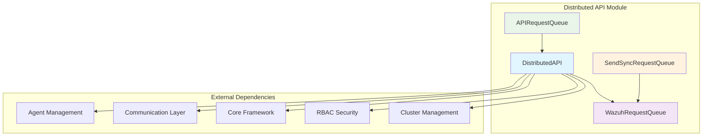
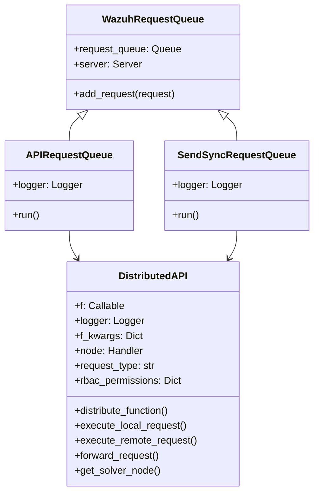
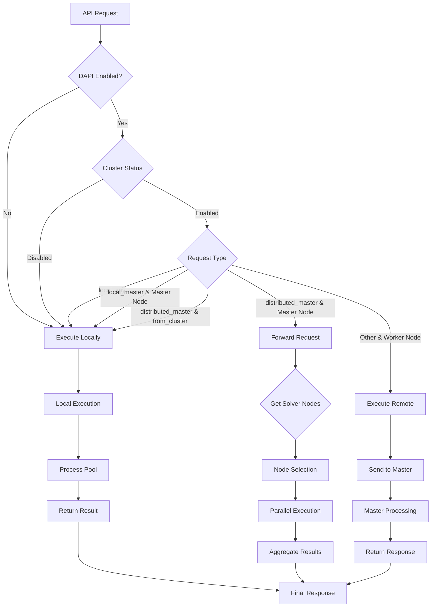
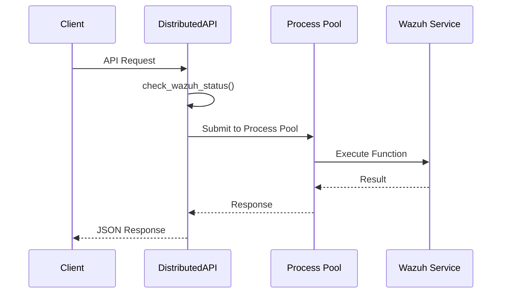
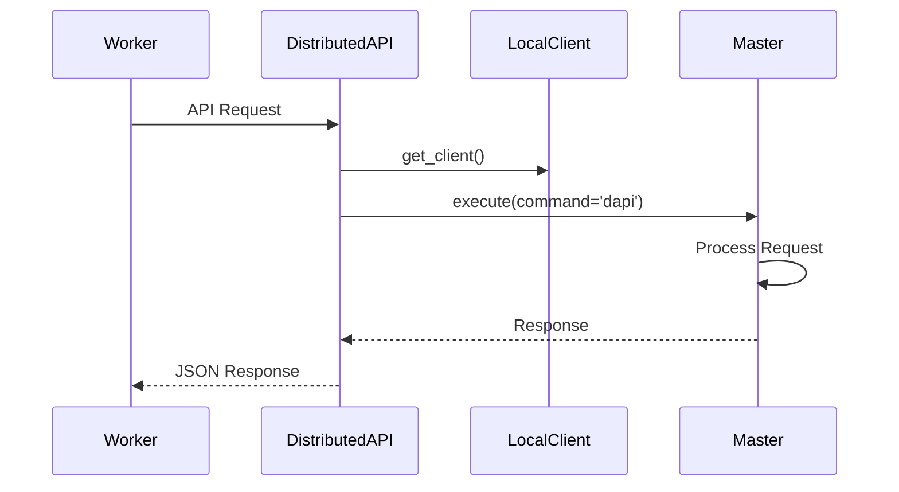
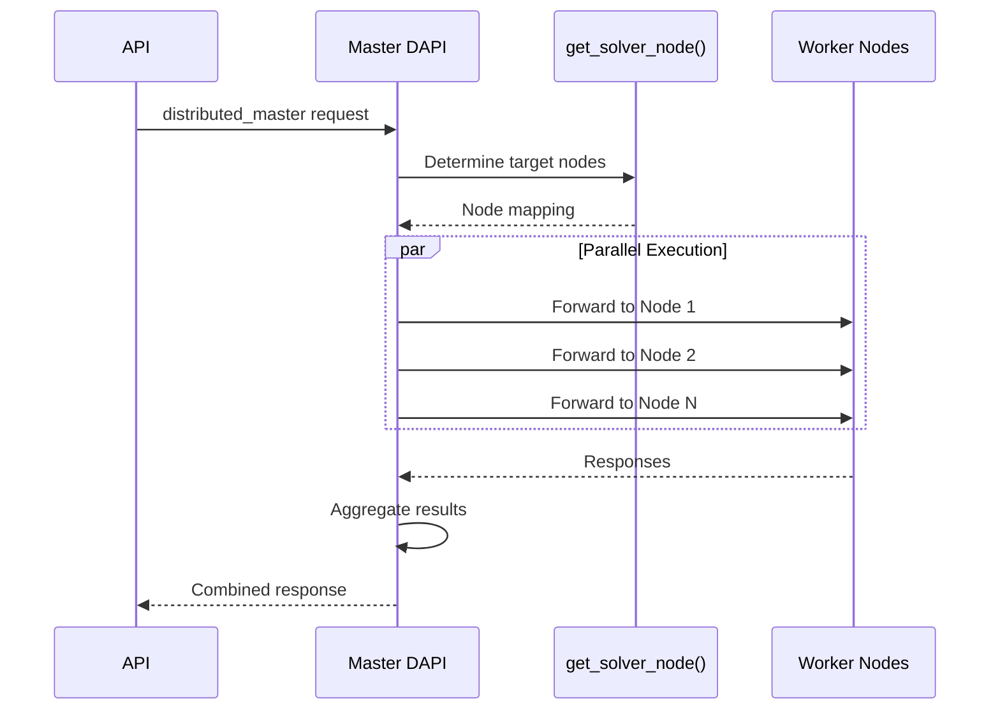
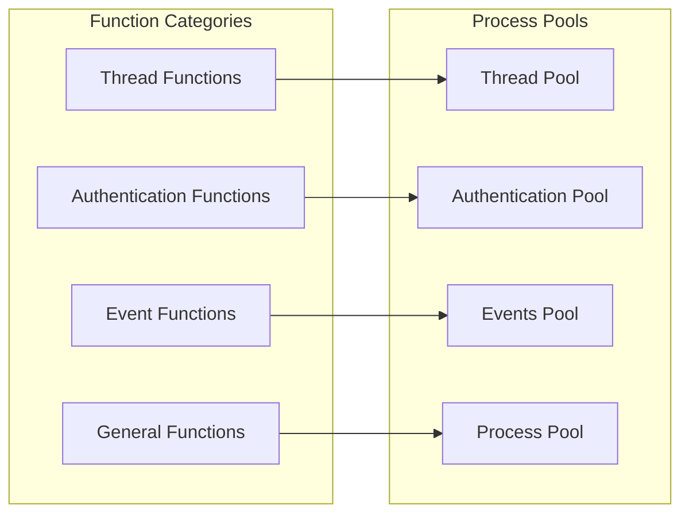
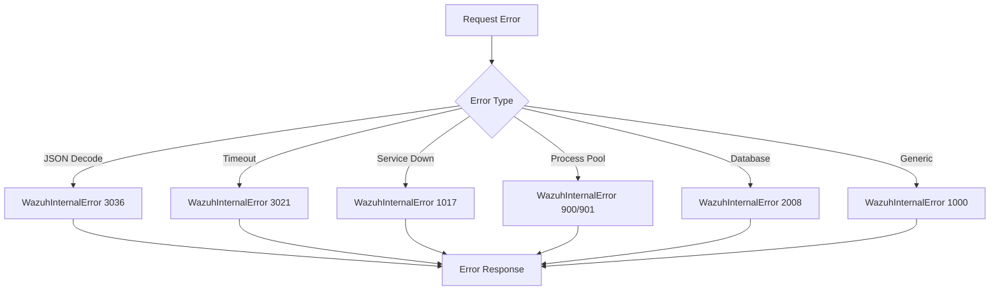

# Distributed API Module

## Overview

The Distributed API (DAPI) module is a critical component of Wazuh's cluster architecture that enables seamless distribution and execution of API requests across multiple nodes in a clustered environment. It provides intelligent request routing, load balancing, and fault tolerance for API operations in distributed Wazuh deployments.

The module acts as a middleware layer that abstracts the complexity of cluster communication, allowing API requests to be executed on the most appropriate node based on data locality, node capabilities, and system state. It supports both synchronous and asynchronous operations while maintaining security through RBAC integration and ensuring data consistency across the cluster.

## Architecture

### Core Components

The Distributed API module consists of four main components that work together to provide distributed request processing:

### Component Relationships

## Core Components

### DistributedAPI

The `DistributedAPI` class is the central orchestrator that handles the distribution logic for API requests across cluster nodes.

**Key Responsibilities:**
- **Request Routing**: Determines whether to execute requests locally, remotely, or forward them to other nodes
- **Node Selection**: Identifies the optimal node(s) to handle specific requests based on data locality
- **Error Handling**: Provides comprehensive error management with detailed error information
- **Security Integration**: Enforces RBAC permissions and user context across distributed operations
- **Performance Optimization**: Manages timeouts, process pools, and asynchronous execution

**Request Types:**
- `local_master`: Execute on master node only
- `local_any`: Execute on current node regardless of type
- `distributed_master`: Distribute across cluster from master node

### WazuhRequestQueue

Base class for request queue management that provides the foundation for asynchronous request processing.

**Features:**
- **Asynchronous Queue**: Uses asyncio.Queue for non-blocking request handling
- **Request Buffering**: Manages incoming requests in a FIFO manner
- **Server Integration**: Maintains reference to cluster server for node communication

### APIRequestQueue

Specialized queue for handling distributed API requests with comprehensive logging and error management.

**Capabilities:**
- **Background Processing**: Continuously processes API requests in the background
- **Node Resolution**: Resolves target nodes for request forwarding
- **Response Management**: Handles successful responses and error conditions
- **Logging Integration**: Provides detailed logging with cluster-specific filters

### SendSyncRequestQueue

Dedicated queue for handling synchronous communication requests between cluster nodes.

**Functions:**
- **Sync Operations**: Manages synchronous inter-node communication
- **Daemon Integration**: Handles requests to specific Wazuh daemons
- **Error Recovery**: Provides robust error handling for sync operations

## Request Flow Architecture

## Data Flow Patterns

### Local Execution Flow

### Remote Execution Flow

### Forward Request Flow

## Integration Points

### Cluster Management Integration

The Distributed API integrates deeply with the [Cluster Management](Cluster%20Management.md) module:

- **Node Discovery**: Uses cluster topology information for request routing
- **Health Monitoring**: Integrates with cluster health checks before request execution
- **Communication Protocols**: Leverages cluster communication channels for inter-node requests

### RBAC Security Integration

Security is enforced through integration with [RBAC Security](RBAC%20Security.md):

- **Permission Validation**: Checks user permissions before request execution
- **Context Propagation**: Maintains user context across distributed operations
- **Node Access Control**: Enforces node-level access restrictions

### Agent Management Integration

Works closely with [Agent Management](Agent%20Management.md) for agent-specific operations:

- **Agent Location**: Determines which node manages specific agents
- **Agent Grouping**: Handles agent group operations across nodes
- **Load Distribution**: Distributes agent-related requests based on agent distribution

## Process Pool Management

The module implements sophisticated process pool management for optimal performance:

**Pool Selection Logic:**
- **Authentication Pool**: For user authentication and token validation functions
- **Events Pool**: For event processing and analysis functions
- **Thread Pool**: For I/O-bound operations
- **Process Pool**: For CPU-intensive operations (default)

## Error Handling and Resilience

### Error Classification

The module provides comprehensive error handling with detailed error information:

### Resilience Features

- **Service Health Checks**: Validates required Wazuh services before request execution
- **Timeout Management**: Configurable timeouts with graceful degradation
- **Node Failover**: Automatic handling of node failures during request processing
- **Error Propagation**: Detailed error information with node-specific context

## Configuration and Tuning

### Key Configuration Parameters

- **Request Timeout**: `api_conf['intervals']['request_timeout']`
- **Authentication Pool Size**: `api_conf['authentication_pool_size']`
- **Distributed API Enable**: `cluster_items['distributed_api']['enabled']`

### Performance Tuning

- **Process Pool Sizing**: Adjust pool sizes based on workload characteristics
- **Timeout Configuration**: Balance responsiveness with operation completion
- **Node Selection Strategy**: Optimize based on network topology and data locality

## Security Considerations

### Authentication and Authorization

- **Token Validation**: Secure token handling across distributed operations
- **Permission Inheritance**: Proper RBAC permission propagation
- **User Context**: Maintains user identity throughout request lifecycle

### Data Protection

- **Sensitive Data Masking**: Automatic masking of passwords and tokens in logs
- **Secure Communication**: Encrypted communication between cluster nodes
- **Access Logging**: Comprehensive audit trail for distributed operations

## Monitoring and Observability

### Logging Framework

The module provides extensive logging capabilities:

- **Request Tracing**: Detailed logging of request flow and timing
- **Error Tracking**: Comprehensive error logging with stack traces
- **Performance Metrics**: Execution time tracking and performance analysis

### Health Monitoring

- **Service Status**: Continuous monitoring of required Wazuh services
- **Node Connectivity**: Real-time cluster node health assessment
- **Queue Monitoring**: Request queue depth and processing metrics

## Best Practices

### Development Guidelines

1. **Error Handling**: Always implement comprehensive error handling with proper error codes
2. **Timeout Management**: Set appropriate timeouts for different operation types
3. **Resource Cleanup**: Ensure proper cleanup of local clients and resources
4. **Security Context**: Maintain proper RBAC context throughout request processing

### Operational Guidelines

1. **Cluster Health**: Monitor cluster health before deploying distributed operations
2. **Load Balancing**: Consider agent distribution when planning cluster topology
3. **Performance Monitoring**: Regular monitoring of request processing times and queue depths
4. **Security Auditing**: Regular review of distributed API access patterns and permissions

## Related Documentation

- [Cluster Management](Cluster%20Management.md) - Core cluster functionality and node management
- [RBAC Security](RBAC%20Security.md) - Role-based access control and security framework
- [Agent Management](Agent%20Management.md) - Agent lifecycle and distribution management
- [Communication Layer](Communication%20Layer.md) - Low-level cluster communication protocols
- [Core Framework](Core%20Framework.md) - Base framework components and utilities
- [API Framework](API%20Framework.md) - REST API implementation and middleware