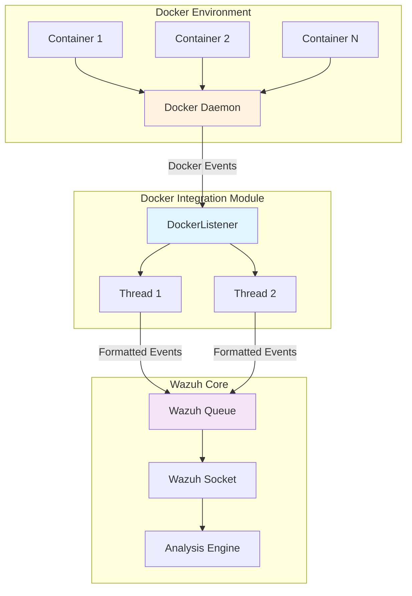
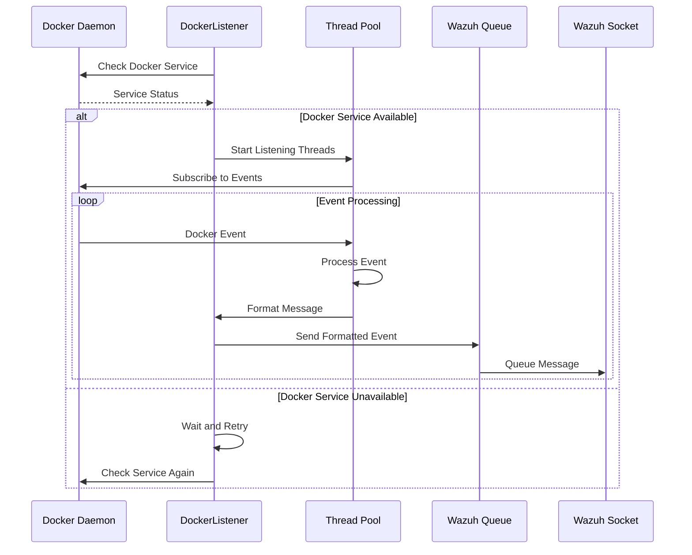
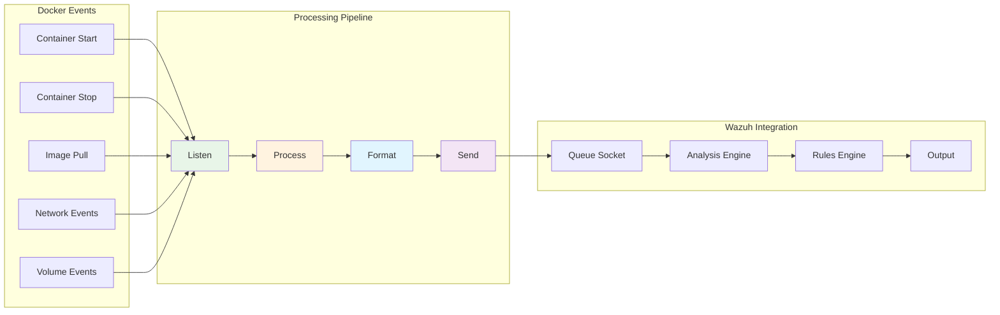
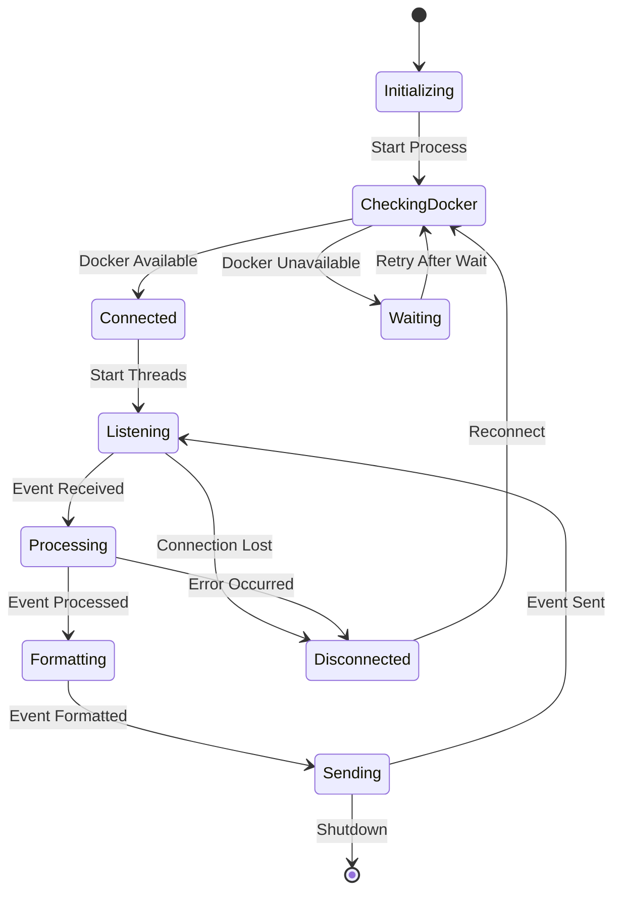

# Docker Integration Module

The Docker Integration module provides real-time monitoring and event collection from Docker containers and services within the Wazuh security platform. This module enables comprehensive container security monitoring by capturing Docker events and forwarding them to the Wazuh analysis engine for threat detection and compliance monitoring.

## Overview

The Docker Integration module consists of a single core component that establishes a persistent connection to the Docker daemon, listens for container events, and forwards them to Wazuh's processing pipeline. This integration enables organizations to monitor container lifecycle events, security incidents, and operational changes in containerized environments.

### Key Features

- **Real-time Event Monitoring**: Continuous listening to Docker daemon events
- **Automatic Reconnection**: Resilient connection handling with automatic retry mechanisms
- **Multi-threaded Processing**: Concurrent event processing for high-throughput environments
- **Wazuh Queue Integration**: Direct integration with Wazuh's message processing system
- **Event Formatting**: Standardized event formatting for consistent analysis
- **Error Handling**: Comprehensive error handling and logging capabilities

## Architecture



## Core Components

### DockerListener

The `DockerListener` class is the primary component responsible for Docker event monitoring and processing.

#### Key Responsibilities

1. **Docker Service Connection Management**
   - Establishes connection to Docker daemon
   - Monitors Docker service availability
   - Implements automatic reconnection logic

2. **Event Processing**
   - Listens for Docker events in real-time
   - Processes and formats events for Wazuh consumption
   - Handles event serialization and transmission

3. **Multi-threaded Operation**
   - Manages multiple listening threads for reliability
   - Ensures continuous monitoring even during reconnections
   - Provides thread lifecycle management

4. **Wazuh Integration**
   - Formats events according to Wazuh standards
   - Sends events through Unix domain sockets
   - Implements proper error handling and logging

## Component Interactions



## Data Flow



## Event Processing Workflow



## Integration Points

### Communication Layer Integration

The Docker Integration module leverages Wazuh's [Communication Layer](Communication%20Layer.md) for reliable message transmission:

- **Unix Domain Sockets**: Direct communication with Wazuh queue system
- **Message Formatting**: Standardized JSON message structure
- **Error Handling**: Robust error detection and recovery mechanisms

### Core Framework Integration

Integration with the [Core Framework](Core%20Framework.md) provides:

- **Logging Infrastructure**: Centralized logging through Wazuh's logging system
- **Configuration Management**: Integration with Wazuh configuration framework
- **Error Handling**: Standardized exception handling and reporting

## Configuration

### Basic Configuration

```json
{
  "docker-listener": {
    "enabled": true,
    "wait_time": 5,
    "max_event_size": 65536
  }
}
```

### Advanced Configuration Options

| Parameter | Description | Default | Type |
|-----------|-------------|---------|------|
| `enabled` | Enable/disable Docker integration | `true` | boolean |
| `wait_time` | Reconnection wait time (seconds) | `5` | integer |
| `max_event_size` | Maximum event size in bytes | `65536` | integer |
| `debug` | Enable debug logging | `false` | boolean |

## Event Types

### Container Events
- Container creation, start, stop, destroy
- Container pause, unpause, restart
- Container health status changes
- Container resource limit events

### Image Events
- Image pull, push, delete
- Image build completion
- Image tag operations

### Network Events
- Network creation, deletion
- Container network attachment/detachment
- Network configuration changes

### Volume Events
- Volume creation, deletion
- Volume mount/unmount operations
- Volume permission changes

## Error Handling

### Connection Errors
- **Docker Service Unavailable**: Automatic retry with exponential backoff
- **Socket Connection Failures**: Graceful degradation and reconnection
- **Permission Errors**: Clear error messages and resolution guidance

### Processing Errors
- **Event Parsing Failures**: Event skipping with error logging
- **Queue Full Conditions**: Backpressure handling and event buffering
- **Resource Exhaustion**: Memory and thread pool management

### Recovery Mechanisms
- **Automatic Reconnection**: Seamless service recovery
- **Thread Management**: Dynamic thread pool adjustment
- **State Persistence**: Minimal state loss during failures

## Performance Considerations

### Scalability
- **Multi-threaded Design**: Concurrent event processing
- **Efficient Memory Usage**: Streaming event processing
- **Connection Pooling**: Optimized socket management

### Monitoring
- **Event Throughput**: Real-time event processing metrics
- **Connection Health**: Docker service connectivity monitoring
- **Resource Usage**: Memory and CPU utilization tracking

## Security Considerations

### Access Control
- **Docker Socket Permissions**: Secure access to Docker daemon
- **User Privileges**: Minimal required permissions
- **Network Security**: Secure communication channels

### Event Sanitization
- **Input Validation**: Event content validation and sanitization
- **Size Limits**: Protection against oversized events
- **Content Filtering**: Sensitive information filtering

## Troubleshooting

### Common Issues

1. **Docker Service Not Running**
   ```
   Error: Docker service is not running
   Solution: Start Docker service and verify connectivity
   ```

2. **Permission Denied**
   ```
   Error: Permission denied accessing Docker socket
   Solution: Add user to docker group or adjust socket permissions
   ```

3. **Queue Connection Failed**
   ```
   Error: Wazuh must be running
   Solution: Ensure Wazuh service is active and queue socket is accessible
   ```

### Diagnostic Commands

```bash
# Check Docker service status
systemctl status docker

# Verify Docker socket permissions
ls -la /var/run/docker.sock

# Test Docker connectivity
docker info

# Check Wazuh queue socket
ls -la /var/ossec/queue/sockets/queue
```

## Dependencies

### External Dependencies
- **Docker Python SDK**: Container interaction library
- **Python Threading**: Concurrent processing support
- **Unix Sockets**: System-level communication

### Internal Dependencies
- **[Communication Layer](Communication%20Layer.md)**: Message transmission infrastructure
- **[Core Framework](Core%20Framework.md)**: Base framework services
- **[Logging System](Logging%20System.md)**: Centralized logging infrastructure

## Future Enhancements

### Planned Features
- **Container Security Scanning**: Integration with vulnerability scanners
- **Kubernetes Support**: Extended container orchestration monitoring
- **Custom Event Filtering**: User-defined event filtering rules
- **Performance Metrics**: Enhanced monitoring and alerting capabilities

### Integration Roadmap
- **Cloud Integration**: Enhanced cloud container monitoring
- **Compliance Reporting**: Automated compliance assessment
- **Threat Intelligence**: Container-specific threat detection
- **Orchestration Integration**: Deep integration with container orchestrators

## Related Documentation

- [Communication Layer](Communication%20Layer.md) - Message transmission infrastructure
- [Core Framework](Core%20Framework.md) - Base framework services
- [Logging System](Logging%20System.md) - Centralized logging
- [AWS Integration](AWS%20Integration.md) - Cloud container monitoring
- [Azure Integration](Azure%20Integration.md) - Azure container services
- [Google Cloud Integration](Google%20Cloud%20Integration.md) - GCP container monitoring