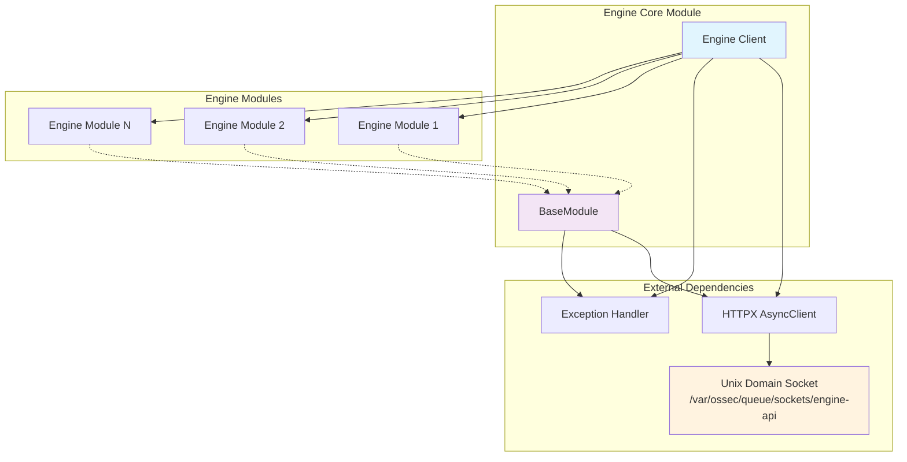
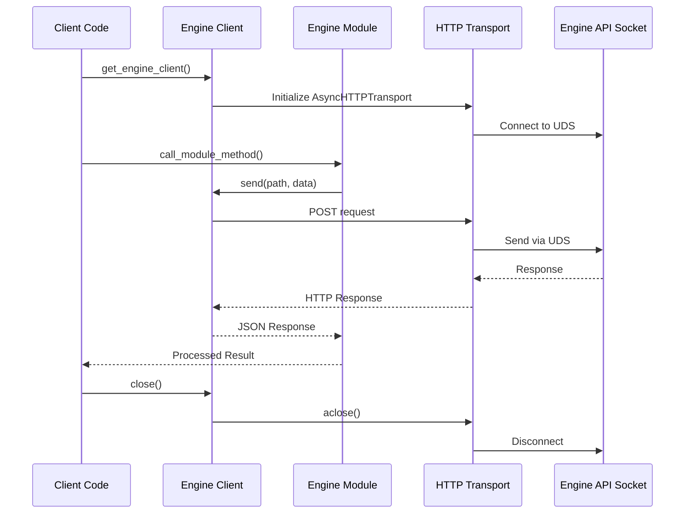
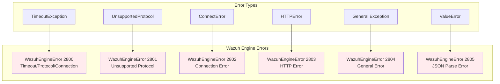
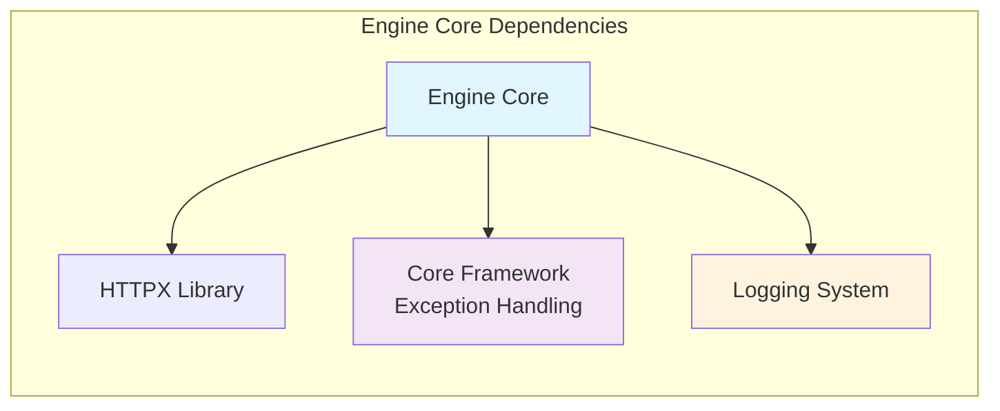

# Engine Core

The Engine Core module provides the foundational client infrastructure for communicating with the Wazuh Engine API. It serves as the primary interface for all engine-related operations, offering a standardized HTTP client with Unix Domain Socket (UDS) support, error handling, and a modular architecture for extending engine functionality.

## Architecture Overview

The Engine Core module is built around two primary components that work together to provide a robust and extensible engine communication framework:



## Core Components

### Engine Client (`framework.wazuh.core.engine.__init__.Engine`)

The main client class that provides the entry point for all engine communications:

**Key Features:**
- **Unix Domain Socket Communication**: Uses UDS for high-performance local communication
- **Async HTTP Transport**: Built on HTTPX with async support for non-blocking operations
- **Configurable Retry Logic**: Automatic retry mechanism for failed requests
- **Timeout Management**: Configurable timeout settings for request handling
- **Module Registration**: Central registry for engine modules
- **Resource Management**: Proper cleanup and connection management

**Configuration Parameters:**
- `socket_path`: Path to the engine API socket (default: `/var/ossec/queue/sockets/engine-api`)
- `retries`: Number of retry attempts (default: 5)
- `timeout`: Request timeout in seconds (default: 5)

### BaseModule (`framework.wazuh.core.engine.base.BaseModule`)

Abstract base class for all engine modules, providing standardized communication patterns:

**Key Features:**
- **Standardized Request Handling**: Common interface for sending requests to the engine
- **Error Management**: Comprehensive error handling and exception mapping
- **Logging Integration**: Built-in logging support for debugging and monitoring
- **HTTP Method Abstraction**: Simplified API for making HTTP requests
- **Response Processing**: Automatic JSON parsing and validation

## Communication Flow



## Error Handling

The Engine Core implements a comprehensive error handling strategy that maps various failure scenarios to specific Wazuh engine errors:



**Error Code Mapping:**
- **2800**: Timeout, protocol, or connection issues
- **2801**: Unsupported protocol error
- **2802**: Connection error to engine socket
- **2803**: HTTP-level errors from the engine
- **2804**: General unexpected errors
- **2805**: JSON parsing errors in response

## Integration Patterns

### Context Manager Pattern

The Engine Core uses the context manager pattern for proper resource management:

```python
async with get_engine_client() as engine:
    # Engine operations
    result = await engine.some_module.operation()
    # Automatic cleanup on exit
```

### Module Extension Pattern

New engine modules should inherit from `BaseModule`:

```python
class CustomEngineModule(BaseModule):
    MODULE = "custom"
    
    async def custom_operation(self, data: dict) -> dict:
        return await self.send("/custom/endpoint", data)
```

## Dependencies

The Engine Core module has the following key dependencies:



**External Dependencies:**
- **HTTPX**: Modern async HTTP client library
- **asyncio**: Python async/await support

**Internal Dependencies:**
- **[Core Framework](Core Framework.md)**: Exception handling and utilities
- **[Logging System](Logging System.md)**: Centralized logging infrastructure

## Usage Examples

### Basic Engine Client Usage

```python
from wazuh.core.engine import get_engine_client

async def example_usage():
    async with get_engine_client() as engine:
        # Engine is ready for use
        # Modules will be registered here
        pass
```

### Custom Module Implementation

```python
from wazuh.core.engine.base import BaseModule

class PolicyModule(BaseModule):
    MODULE = "policy"
    
    async def create_policy(self, policy_data: dict) -> dict:
        """Create a new policy in the engine."""
        return await self.send("/policy/create", policy_data)
    
    async def get_policy(self, policy_id: str) -> dict:
        """Retrieve a policy by ID."""
        return await self.send(f"/policy/{policy_id}", {})
```

## Performance Considerations

### Connection Pooling
- Uses persistent connections through HTTPX's connection pooling
- Unix Domain Socket provides optimal local communication performance
- Async operations prevent blocking on I/O operations

### Retry Strategy
- Configurable retry mechanism for transient failures
- Exponential backoff handled by HTTPX transport layer
- Fail-fast approach for permanent errors

### Resource Management
- Automatic connection cleanup through context managers
- Proper async resource disposal
- Memory-efficient request/response handling

## Security Considerations

### Socket Security
- Uses Unix Domain Socket for local-only communication
- No network exposure of engine API
- File system permissions control access

### Error Information
- Sanitized error messages to prevent information leakage
- Structured error codes for programmatic handling
- Detailed logging for debugging (internal only)

## Future Extensions

The Engine Core is designed to support future enhancements:

1. **Module Auto-Discovery**: Automatic registration of engine modules
2. **Health Monitoring**: Built-in health checks and monitoring
3. **Metrics Collection**: Performance and usage metrics
4. **Configuration Management**: Dynamic configuration updates
5. **Load Balancing**: Support for multiple engine instances

## Related Modules

- **[Core Framework](Core Framework.md)**: Provides base exception handling and utilities
- **[Logging System](Logging System.md)**: Centralized logging infrastructure
- **[Engine Testing Suite](Engine Testing Suite.md)**: Testing tools and integration tests
- **[Communication Layer](Communication Layer.md)**: Alternative communication mechanisms

The Engine Core serves as the foundation for all engine-related operations in the Wazuh system, providing a clean, async-first interface that can be extended with specialized modules for different engine functionalities.