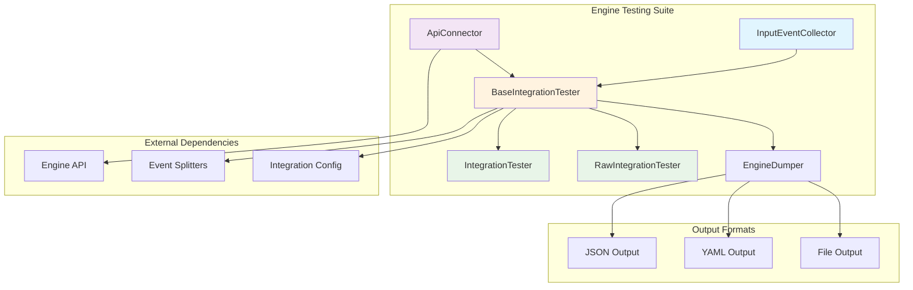
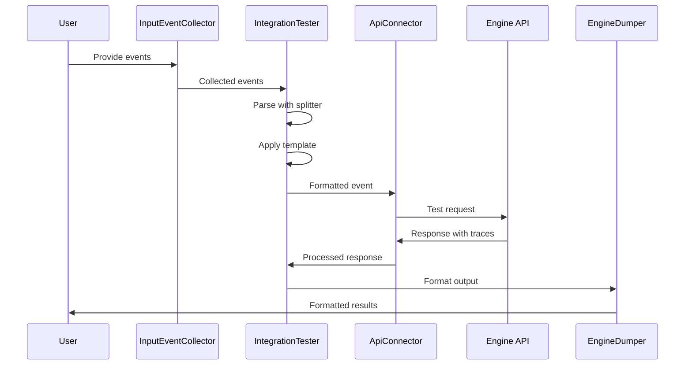

# Engine Testing Suite

The Engine Testing Suite is a comprehensive testing framework designed to validate and test the Wazuh Engine's event processing capabilities. It provides tools for integration testing, event simulation, and performance validation through a structured API-based testing approach.

## Overview

The Engine Testing Suite serves as the primary testing infrastructure for the Wazuh Engine, enabling developers and QA teams to:

- Test event processing pipelines with real-world data
- Validate rule execution and asset behavior
- Perform integration testing with various data sources
- Debug and trace event processing flows
- Automate testing workflows for continuous integration

The suite operates through a client-server architecture, communicating with the Engine via Protocol Buffers (protobuf) over socket connections, providing both interactive and batch testing capabilities.

## Architecture



## Core Components

### API Communication Layer

#### ApiConfig
Configuration enumeration that defines default settings for API communication:

```python
class ApiConfig(Enum):
    OriginName = "engine-test"
    OriginModule = "engine-test"
    Component = "test"
    SessionName = "engine_test"
    Lifespan = 0
    Description = "Automatically created by engine-test"
```

**Key Features:**
- Standardized configuration constants
- Session management parameters
- Default testing environment settings

#### ApiConnector
Primary interface for communicating with the Wazuh Engine API:

**Core Responsibilities:**
- Establish and manage API socket connections
- Handle session lifecycle (create, manage, delete)
- Execute test runs with event data
- Process API responses and error handling

**Key Methods:**
- `tester_run(event)`: Executes a test with the provided event
- `create_session()`: Establishes a testing session
- `delete_session()`: Cleans up testing sessions
- `get_session_name()`: Generates unique session identifiers

### Testing Framework

#### BaseIntegrationTester
Abstract base class providing common testing functionality:

**Core Features:**
- Event processing pipeline management
- Output formatting (JSON/YAML)
- Trace handling and visualization
- File output management
- Event splitter integration

**Key Methods:**
- `process_event(event)`: Processes events through the API
- `response_to_yml(response)`: Converts responses to YAML format
- `write_output_file(events_parsed)`: Handles file output
- `get_splitter(iconf)`: Returns appropriate event splitter

#### IntegrationTester
Concrete implementation for standard integration testing:

**Functionality:**
- Template-based event processing
- Queue and location management
- Event formatting with protocol compliance
- Interactive and batch testing modes

**Event Processing Flow:**
1. Collect events via InputEventCollector
2. Parse events using configured splitter
3. Apply integration template
4. Format events with queue and location data
5. Send to Engine API for processing
6. Format and output results

#### RawIntegrationTester
Specialized tester for raw event processing:

**Use Cases:**
- Testing with pre-formatted events
- Direct event injection without templates
- Low-level event processing validation
- Custom event format testing

### Input/Output Management

#### InputEventCollector
Handles event collection from various input sources:

**Input Sources:**
- Interactive terminal input
- Piped data from files or commands
- Multiline event support
- Batch processing capabilities

**Collection Modes:**
- Single-line events (default)
- Multiline events (for complex log formats)
- Interactive mode with user prompts
- Batch mode for automated testing

#### EngineDumper
Custom YAML dumper for formatted output:

**Features:**
- Intelligent quote handling for special characters
- Literal style for multiline content
- Consistent formatting across outputs
- Unicode support for international content

## Component Interactions



## Data Flow

```mermaid
flowchart LR
    subgraph "Input Processing"
        A[Raw Events] --> B[Event Splitter]
        B --> C[Template Application]
        C --> D[Protocol Formatting]
    end
    
    subgraph "API Communication"
        D --> E[Session Management]
        E --> F[Test Execution]
        F --> G[Response Processing]
    end
    
    subgraph "Output Generation"
        G --> H[Trace Processing]
        H --> I[Format Selection]
        I --> J[Output Delivery]
    end
    
    style A fill:#ffebee
    style D fill:#e3f2fd
    style G fill:#e8f5e8
    style J fill:#fff3e0
```



## Integration Points

### Engine Core Integration
The testing suite integrates closely with the [Engine Core](Engine%20Core.md) module:
- Utilizes Engine API for event processing
- Leverages Engine's rule execution capabilities
- Accesses asset tracing and debugging features

### API Framework Integration
Connects with the [API Framework](API%20Framework.md) for:
- Protocol buffer communication
- Session management
- Request/response handling
- Error management and reporting

### Communication Layer Integration
Uses the [Communication Layer](Communication%20Layer.md) for:
- Socket-based API communication
- Asynchronous protocol handling
- Message serialization/deserialization

## Testing Modes

### Interactive Testing
- Real-time event input and processing
- Immediate feedback and results
- Trace visualization for debugging
- Manual test case execution

### Batch Testing
- Automated processing of event files
- Bulk testing capabilities
- Output file generation
- CI/CD integration support

### Raw Event Testing
- Direct event injection without templates
- Custom format validation
- Low-level protocol testing
- Edge case scenario testing

## Configuration and Customization

### Session Configuration
- Custom session names for organized testing
- Policy-based testing environments
- Configurable session lifespans
- Namespace-specific testing

### Output Configuration
- JSON or YAML output formats
- Verbose tracing options
- Asset-specific trace filtering
- File output management

### Integration Configuration
- Event collection modes
- Template customization
- Splitter selection
- Queue and location mapping

## Error Handling and Debugging

### Comprehensive Error Management
- API communication error handling
- Session management error recovery
- Event processing error reporting
- Graceful failure handling

### Debugging Features
- Multi-level trace output
- Asset-specific tracing
- Success/failure indicators
- Detailed error messages

### Logging and Monitoring
Integration with the [Logging System](Logging%20System.md) for:
- Test execution logging
- Error tracking and analysis
- Performance monitoring
- Audit trail maintenance

## Performance Considerations

### Efficient Processing
- Streaming event processing
- Memory-efficient event handling
- Optimized API communication
- Batch processing capabilities

### Scalability Features
- Session pooling for concurrent testing
- Asynchronous processing support
- Resource management
- Load testing capabilities

## Security Considerations

### Secure Communication
- Socket-based secure connections
- Session-based access control
- Input validation and sanitization
- Error message sanitization

### Access Control
Integration with [RBAC Security](RBAC%20Security.md) for:
- User authentication
- Permission-based testing
- Audit logging
- Secure session management

## Usage Patterns

### Development Testing
- Rule development validation
- Asset behavior testing
- Integration debugging
- Performance profiling

### Quality Assurance
- Regression testing
- Integration validation
- Performance benchmarking
- Compliance testing

### Production Validation
- Configuration testing
- Data pipeline validation
- Performance monitoring
- Troubleshooting support

## Future Enhancements

### Planned Features
- Enhanced visualization capabilities
- Advanced performance metrics
- Automated test generation
- Integration with external testing frameworks

### Extensibility
- Plugin architecture for custom testers
- Custom output formatters
- Extended event splitter support
- API extension capabilities

The Engine Testing Suite provides a robust, flexible, and comprehensive testing framework that ensures the reliability and performance of the Wazuh Engine's event processing capabilities while supporting both development and production testing scenarios.