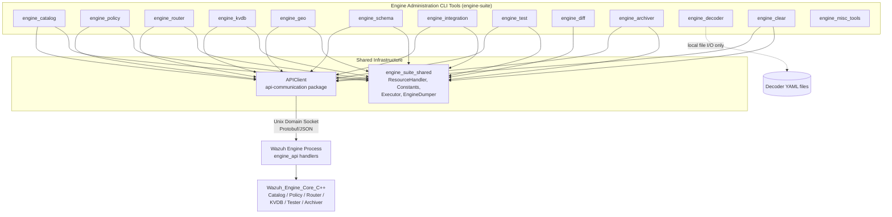
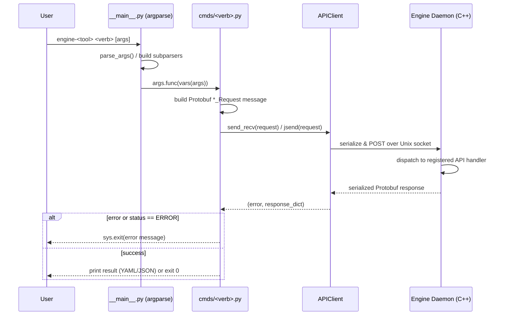
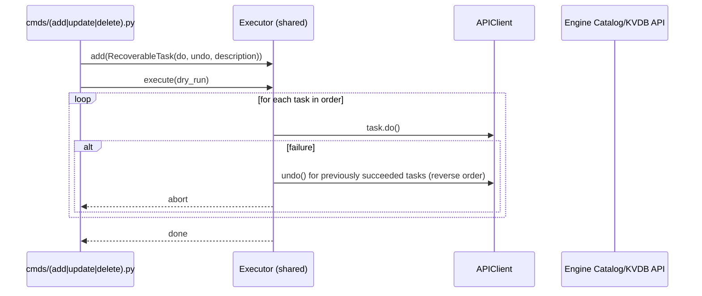
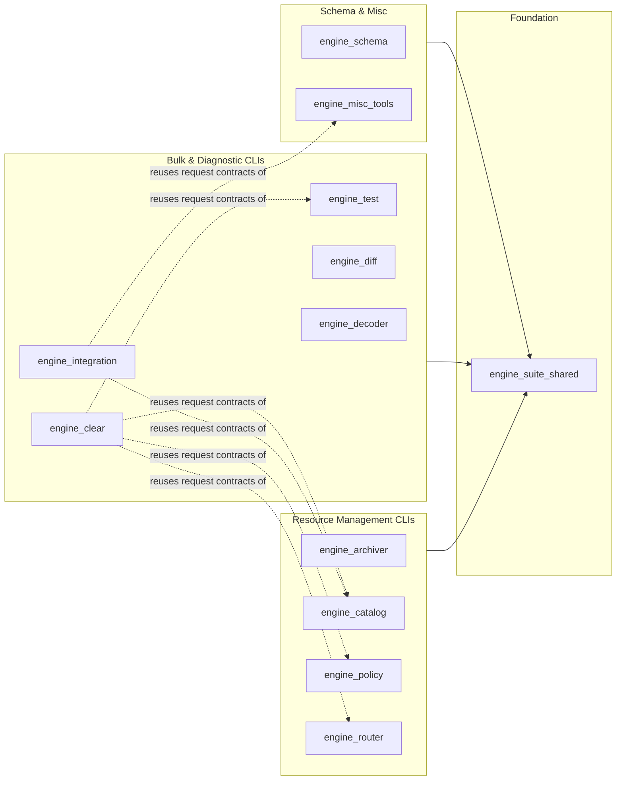

# Engine Administration CLI Tools (Python)

## 1. Purpose

The **Engine Administration CLI Tools (Python)** module (`engine-suite`, located under `src/engine/tools`) is a collection of standalone Python command-line utilities used by administrators, integration developers, and CI/testing pipelines to operate, configure, and troubleshoot the **Wazuh Engine** (the C++ analysis/decoding core documented separately in *Wazuh_Engine_Core_(C++)*).

Rather than being a single monolithic program, this module is a **suite of thin CLI clients**, each dedicated to a specific engine resource or workflow:

- **Resource lifecycle management**: `engine_catalog` (decoders/rules/outputs/filters), `engine_policy` (policies, assets, namespaces), `engine_kvdb` (key-value databases), `engine_router` (routes, EPS throttling, event ingestion), `engine_geo` (GeoIP databases).
- **Bulk operations**: `engine_integration` (packages multiple assets/KVDBs as an installable "integration"), `engine_clear` (bulk-deletes engine resources across namespaces).
- **Diagnostics & testing**: `engine_test` (interactive/batch decoder testing via Tester sessions), `engine_diff` (compares expected vs actual event output).
- **Schema & content maintenance**: `engine_schema` (generates/pushes ECS-based field schemas, index templates, and logpar overrides), `engine_decoder` (inspects/refactors decoder YAML files on disk).
- **Operational control**: `engine_archiver` (toggles the engine's raw-event archiver on/off).
- **Shared infrastructure**: `engine_suite_shared` (common constants, YAML/JSON dumpers, transactional task executor, resource handler) and `engine_misc_tools` (the `APIClient` transport plus assorted developer utilities like `agent_simulator`, `engine_bench`, `compare_expected`, `evtx2xml`).

Most tools communicate with a **running `wazuh-engine` process** over a local Unix domain socket using a Protobuf-over-HTTP protocol (via the shared `APIClient`), while a few (`engine_decoder`, parts of `engine_test`/`update_expected.py`) operate directly on local files or spawn the engine binary for testing purposes.

## 2. Architecture

### 2.1 High-Level Composition

### 2.2 Typical Request Flow (e.g., `engine-catalog create`)

### 2.3 Transactional Task Pattern (bulk operations)

Tools that mutate multiple resources atomically (`engine_integration`, parts of `engine_policy`) rely on a shared **do/undo task executor**:

### 2.4 Sub-module Breakdown

## 3. Core Components & References

| Sub-module | Responsibility | Documentation |
|---|---|---|
| `engine_archiver` | Activate/deactivate/query the engine's raw-event archiver | [engine_archiver.md](engine_archiver.md) |
| `engine_catalog` | CRUD + validate operations on catalog assets (decoders, rules, outputs, filters, integrations) | [engine_catalog.md](engine_catalog.md) |
| `engine_clear` | Bulk-discovers and deletes routes, sessions, policies, KVDBs, and catalog assets | [engine_clear.md](engine_clear.md) |
| `engine_decoder` | Inspects extracted fields and bulk-renames helper functions in local decoder YAML files | [engine_decoder.md](engine_decoder.md) |
| `engine_diff` | Compares two JSON/YAML event documents and reports differences | [engine_diff.md](engine_diff.md) |
| `engine_integration` | Packages/publishes/updates/removes multi-asset "integrations"; generates docs and dependency graphs | [engine_integration.md](engine_integration.md) |
| `engine_policy` | Manages policy lifecycle, asset attachment, namespace/default-parent hierarchy | [engine_policy_store.md](engine_policy_store.md), [engine_policy_assets.md](engine_policy_assets.md), [engine_policy_hierarchy.md](engine_policy_hierarchy.md) |
| `engine_router` | Manages routes, routing table inspection, manual event ingestion, EPS throttling | [engine_router.md](engine_router.md) |
| `engine_schema` | Generates/pushes ECS-based schemas, indexer templates, and logpar overrides | [engine_schema_cli.md](engine_schema_cli.md), [engine_schema_field_model.md](engine_schema_field_model.md) |
| `engine_test` | Interactive/batch testing of decoders/rules via engine Tester sessions | [engine_test_cli.md](engine_test_cli.md), [engine_test_session_cli.md](engine_test_session_cli.md), [engine_test_config.md](engine_test_config.md), [engine_test_execution.md](engine_test_execution.md), [engine_test_splitters.md](engine_test_splitters.md) |
| `engine_suite_shared` | Shared constants, YAML/JSON dumpers, `Executor`/`RecoverableTask`, `ResourceHandler` | [engine_suite_shared.md](engine_suite_shared.md) |
| `engine_misc_tools` | `APIClient` transport, agent simulator, benchmarking, expected-output comparison/flattening, EVTX conversion | [engine_misc_tools.md](engine_misc_tools.md) |

### Related External Modules

- [Wazuh_Engine_Core_(C++)](Wazuh_Engine_Core_(C++).md) — the C++ engine process these CLIs administer (`engine_api`, `builder_policy`, `Router`, `engine_kvdb`, `Store`, `Schemf`).
- [engine_geo](engine_geo_cli.md) / [engine_kvdb](engine_kvdb_cli.md) — sibling CLI tools following the identical `argparse` + `APIClient` pattern (documented alongside the C++ engine module tree).