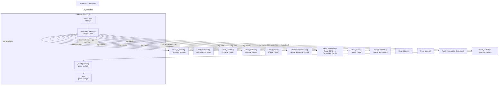
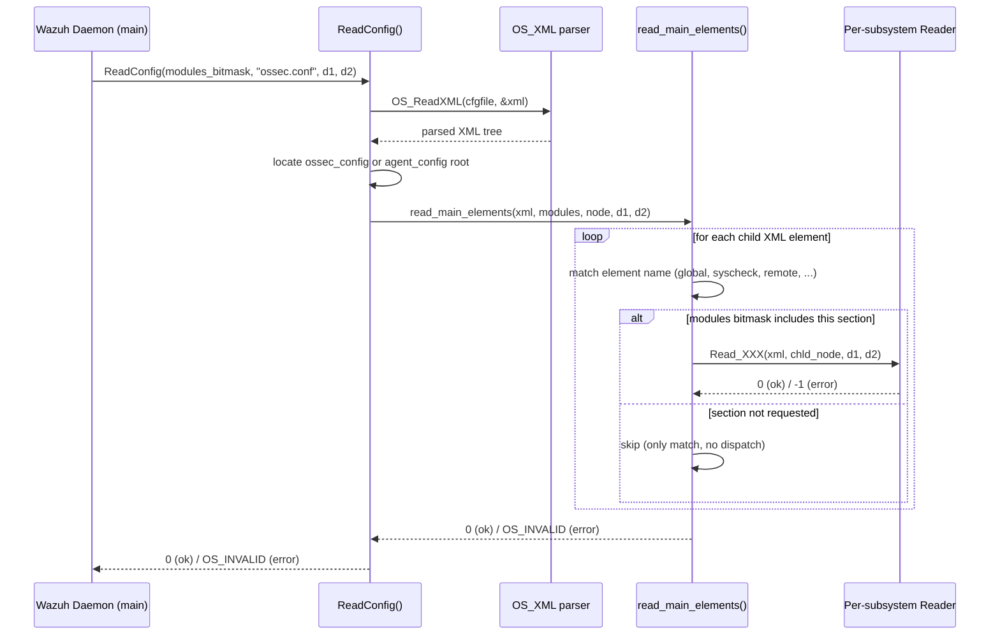

# Global Config Core

## 1. Purpose and Overview

`Global_Config_Core` is the **central configuration dispatcher and global settings container** used by Wazuh's manager and agent C daemons. It is part of the larger [Configuration_Data_Structures_(C_Headers)](Configuration_Data_Structures_C_Headers.md) family of modules, sitting alongside sibling modules such as [Active_Response_Config](Active_Response_Config.md), [Authd_Config](Authd_Config.md), [Client_Config](Client_Config.md), [Localfile_Config](Localfile_Config.md), [Remote_Config](Remote_Config.md), [Rootcheck_Config](Rootcheck_Config.md), [Syscheck_Config](Syscheck_Config.md), [Wazuh_DB_Config](Wazuh_DB_Config.md), and [Wmodules_Config](Wmodules_Config.md).

While each of those sibling modules defines the configuration schema (structs and parsers) for **one specific subsystem** (syscheck, rootcheck, remoted, wazuh-db, wodles, etc.), `Global_Config_Core` provides:

1. **`ReadConfig()`** — the single, unified entry point that all Wazuh C daemons (`wazuh-analysisd`, `wazuh-remoted`, `wazuh-logcollector`, `wazuh-syscheckd`, the agent daemon, etc.) call to parse `ossec.conf` (or `agent.conf` for shared configuration).
2. **`_Config` (`Config`)** — the top-level, manager-oriented global settings structure (`<global>` XML block) that stores cross-cutting settings shared by many daemons: EPS throttling, agent disconnection timers, IP/hostname allow-lists, log forwarding sockets, labels, and cluster identity.
3. **`_eps` (`eps`)** — a small nested structure holding Events-Per-Second (EPS) limiting parameters.

In effect, this module is the **"router" and "root schema"** of the entire native (C) configuration subsystem: it does not know how to parse `<syscheck>` or `<remote>` internally, but it knows *which* per-subsystem reader to invoke for each XML block found in `ossec.conf`, and it owns the handful of settings that don't belong to any single subsystem.

## 2. Architecture

### 2.1 Component Relationship



### 2.2 Configuration Loading Flow

`ReadConfig()` is bitmask-driven: the caller passes a set of `C*` flags (e.g. `CGLOBAL`, `CSYSCHECK`, `CROOTCHECK`, `CLOCALFILE`, `CREMOTE`, `CCLIENT`, `CBUFFER`, `CAR`, `CWMODULE`, `CLABELS`, `CCLUSTER`, `CLGCSOCKET`, `CAUTHD`, `WAZUHDB`, `CAGENT_CONFIG`, `ATAMPERING`) indicating which XML blocks it is interested in and which output structures (`d1`, `d2`) should receive the parsed data. This allows the very same `config.c` file to be linked into many different daemons, each requesting only the sections relevant to it.



Special handling in `ReadConfig()`:
- **Agent shared configuration (`agent_config` blocks)**: when `CAGENT_CONFIG` is set (i.e., reading `agent.conf` pushed from the manager), it evaluates `name=`, `os=`, and `profile=` XML attributes against the local agent's identity (via `os_read_agent_name()`, `getuname()`, `os_read_agent_profile()`) to decide whether a given `<agent_config>` block applies to *this* agent before dispatching to `read_main_elements()`.
- **`remote_conf` internal option gate**: agent-side shared configuration reading can be disabled entirely via the `agent.remote_conf` internal option.
- **Error reporting**: `PrintErrorAcordingToModules()` downgrades syscheck/rootcheck config errors to warnings (since these are non-fatal for daemon startup) while other module errors are treated as hard errors.

### 2.3 The Global Settings Structure (`_Config`)

`_Config` (typedef'd as `Config`) is populated from the `<global>` XML block (mainly by `Read_Global()`, defined outside this module) and is passed around as `d1`/`d2` to `ReadConfig()` by manager daemons. Key fields include:

| Category | Fields | Purpose |
|---|---|---|
| Integrity/Syscheck-Rootcheck toggles | `integrity`, `syscheck_auto_ignore`, `syscheck_ignore_frequency`, `syscheck_ignore_time`, `syscheck_alert_new`, `rootcheck`, `hostinfo`, `logfw` | Global on/off and tuning switches shared across FIM/rootcheck |
| Agent lifecycle | `agents_disconnection_time`, `agents_disconnection_alert_time` | Thresholds for marking/alerting on agent disconnection |
| Active Response | `ar` | Global AR enable flag |
| Allow-lists | `syscheck_ignore` (string array), `white_list` (`os_ip**`), `hostname_white_list` (`OSMatch**`) | IP/hostname/file exclusion lists |
| Log forwarding | `forwarders_list`, `socket_list` (`socket_forwarder*`) | Targets for forwarding logs from `logcollector`/`analysisd` |
| Labels | `labels` (`wlabel_t*`), `label_cache_maxage`, `show_hidden_labels` | Global agent labeling defaults |
| Cluster identity | `cluster_name`, `node_name`, `node_type`, `hide_cluster_info` | Basic cluster self-identification (consumed more deeply by the `cluster_module` family) |
| Queue sizing | `queue_size` | Internal queue capacity |
| EPS throttling | `eps` (`_eps`) | See below |
| CTI | `cti_url` | URL for the CTI (Cyber Threat Intelligence) feed, defaulting to `CTI_URL_DEFAULT`; related to vulnerability detection configuration handled by `Read_Vulnerability_Detection()` |

`config_free(Config *config)` releases all dynamically allocated members of the structure.

#### `_eps` — EPS Limiting

```c
typedef struct __eps {
    unsigned int maximum;      // max events per timeframe
    unsigned int timeframe;    // window size in seconds
    bool maximum_found;        // whether "maximum" was explicitly configured
} _eps;
```

Bounded by compile-time constants:
- `EPS_LIMITS_DEFAULT_TIMEFRAME` = 10s, `EPS_LIMITS_MIN_TIMEFRAME` = 1s, `EPS_LIMITS_MAX_TIMEFRAME` = 3600s
- `EPS_LIMITS_MIN_EPS` = 0, `EPS_LIMITS_MAX_EPS` = 100000

This structure is the manager-side configuration counterpart to the analysis-engine EPS counting logic (see `EpsCounter` in the Router sub-module of the Wazuh Engine Core (C++), and `RulesetReloadResponse`/related APIs in `framework/wazuh/core/analysis.py`).

## 3. Relationship to Other Modules

`Global_Config_Core` is purely a **native C** module — it has no Python counterpart of its own. However, it is the parsing backbone that ultimately feeds data consumed elsewhere:

- **Sibling native configuration modules** ([Active_Response_Config](Active_Response_Config.md), [Authd_Config](Authd_Config.md), [Client_Config](Client_Config.md), [Localfile_Config](Localfile_Config.md), [Remote_Config](Remote_Config.md), [Rootcheck_Config](Rootcheck_Config.md), [Syscheck_Config](Syscheck_Config.md), [Wazuh_DB_Config](Wazuh_DB_Config.md), [Wmodules_Config](Wmodules_Config.md)) — each provides one `Read_XXX()` function that `read_main_elements()` invokes when the corresponding XML tag is encountered and the relevant bitmask flag is set. `Global_Config_Core` has no knowledge of *how* those sections are parsed — only *when* to call them.
- **Native daemons** (Agent & Manager Native Daemons (C)) — e.g., `logcollector`, `remoted`, `monitord`, `os_execd`, `client-agent` — all call `ReadConfig()` at startup to load their piece of `ossec.conf`, typically passing a subset of the bitmask flags relevant to their own subsystem plus `CGLOBAL` to also receive the shared `_Config` structure.
- **`framework/wazuh/manager.py`** (`read_ossec_conf`, `update_ossec_conf`, `validation`) in the API/Management Framework's manager module expose the *result* of this configuration (via `wazuh-control`/socket queries or direct file parsing) as REST API endpoints for retrieving/validating manager configuration — they do not call `ReadConfig()` directly but rely on daemons that already parsed it, or on the XML-to-JSON conversion helpers in `framework/wazuh/core/configuration.py` (`get_file_conf`, `get_internal_options_value`).
- **Wazuh Modules Daemon** (C) — the `<wodle>` dispatch inside `read_main_elements()` is the entry point through which all `wm_*` module configurations (AWS, Azure, GCP, SCA, CIS-CAT, Docker, GitHub, Office365, MS Graph, vulnerability scanner, agent-upgrade, task-manager, etc.) are parsed, delegating to `Wmodules_Config` readers.
- **Cluster identity fields** (`cluster_name`, `node_name`, `node_type`) populated here are consumed more extensively by the cluster module (see `framework/wazuh/core/cluster/utils.py`, `framework/wazuh/cluster.py`) in the API & Management Framework, for cluster status/health reporting.

## 4. Key API Reference

| Symbol | File | Description |
|---|---|---|
| `int ReadConfig(int modules, const char *cfgfile, void *d1, void *d2)` | `config.c` | Public entry point. Opens/parses the XML config file and dispatches to `read_main_elements()`. Returns `0` on success, `OS_INVALID` on failure. |
| `static int read_main_elements(...)` | `config.c` | Internal dispatcher that maps each top-level XML tag to its corresponding per-subsystem reader, gated by the `modules` bitmask. |
| `void PrintErrorAcordingToModules(int modules, const char *cfgfile)` | `config.c` | Emits a warning (for syscheck/rootcheck) or error (otherwise) log message on configuration parse failure. |
| `typedef struct __Config _Config` (`Config`) | `global-config.h` | Global configuration structure for manager-wide settings. |
| `typedef struct __eps _eps` (`eps`) | `global-config.h` | EPS (events-per-second) limiting sub-structure, nested inside `_Config`. |
| `void config_free(_Config *config)` | (declared in `global-config.h`) | Frees all dynamically-allocated members of a `_Config` instance. |

## 5. Design Notes

- **Single Responsibility, Broad Reach**: This module intentionally stays thin — it is a switchboard, not a parser. This keeps `config.c` maintainable even as the number of supported XML sections grows, since each new feature simply adds one more `else if` branch calling into an independently-versioned reader module.
- **Compile-time Feature Gating**: Many branches are wrapped in `#ifndef WIN32`, `#ifndef CLIENT`, `#if defined(WIN32) || defined(__linux__) || defined(__MACH__)` guards, reflecting that the same `config.c` is compiled into agent binaries (Windows/Linux/macOS) and manager binaries with different available subsystems (e.g., `auth`, `vulnerability-detection`, `wdb`, `task-manager` are manager/non-Windows only).
- **Deprecation Path Example**: The handling of `<vulnerability-detector>` (old tag) vs `<vulnerability-detection>` (new tag) illustrates the pattern used for smoothly migrating configuration schemas — the old tag is still parsed but a deprecation warning is logged and the same reader function is reused with an `is_legacy` flag.
