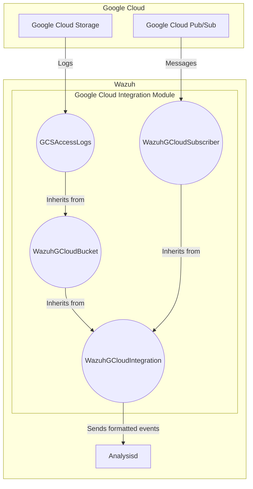
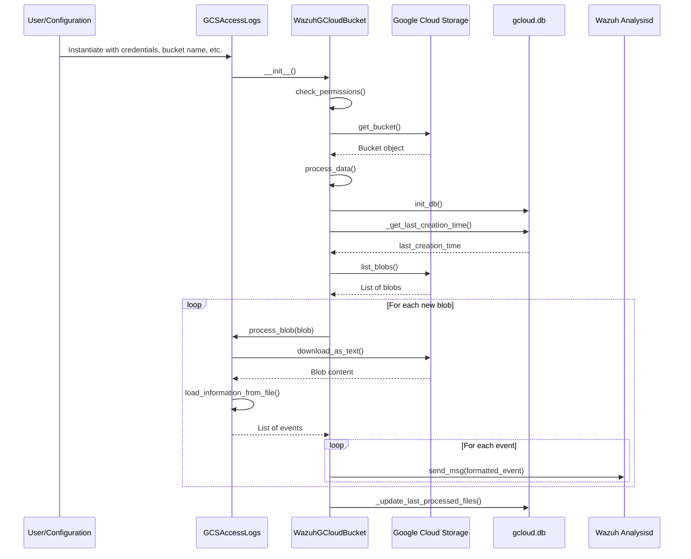
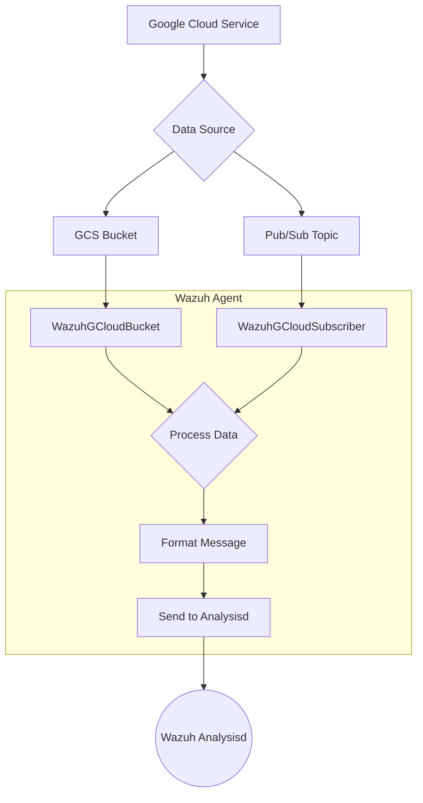

# Google Cloud Integration Module

## Introduction

The Google Cloud Integration module is designed to collect and process logs and events from various Google Cloud Platform (GCP) services. This integration enables Wazuh to monitor and analyze activities within a GCP environment, providing visibility into security-relevant events. The module can ingest data from Google Cloud Storage (GCS) buckets and Google Cloud Pub/Sub subscriptions.

## Architecture

The Google Cloud Integration module is composed of several key components that work together to fetch, process, and forward logs to the Wazuh analysis engine. The architecture is designed to be extensible, allowing for the integration of various GCP services.

### Core Components

- **WazuhGCloudIntegration**: The base class for all Google Cloud integrations. It handles the communication with the Wazuh analysis engine (`analysisd`) through a socket connection. See [Communication Layer](Communication Layer.md) for more details.
- **WazuhGCloudBucket**: A subclass of `WazuhGCloudIntegration` that provides the core functionality for retrieving logs from GCS buckets. It maintains a local SQLite database (`gcloud.db`) to keep track of processed log files, preventing data duplication.
- **GCSAccessLogs**: A specific implementation of `WazuhGCloudBucket` for processing GCS access logs. It demonstrates how to extend the base bucket class to handle specific log formats.
- **WazuhGCloudSubscriber**: A subclass of `WazuhGCloudIntegration` responsible for pulling messages from a Google Cloud Pub/Sub subscription. This is used for real-time event ingestion.

## Component Interaction

The following diagram illustrates the interaction between the components when processing logs from a GCS bucket.

## Data Flow

The data flow from Google Cloud services to the Wazuh analysis engine is as follows:

1.  **Data Generation**: Google Cloud services generate logs and events.
2.  **Data Collection**: These logs are collected in either a GCS bucket or a Pub/Sub topic.
3.  **Data Ingestion**:
    - `WazuhGCloudBucket` periodically scans the specified GCS bucket for new log files.
    - `WazuhGCloudSubscriber` pulls new messages from the specified Pub/Sub subscription.
4.  **Data Processing**: The integration module processes the collected data, parsing and formatting it into a JSON structure that Wazuh can analyze.
5.  **Event Forwarding**: The formatted events are sent to the Wazuh analysis engine via a secure socket connection.

## Dependencies

The Google Cloud Integration module relies on several other modules within the Wazuh framework:

- **[Communication Layer](Communication Layer.md)**: For sending events to the `analysisd` process.
- **[Database Connectivity](Database Connectivity.md)**: The `WazuhGCloudBucket` component uses a local SQLite database to track the state of processed files.
- **[Core Framework](Core Framework.md)**: Utilizes core utilities and the overall Wazuh framework structure.
