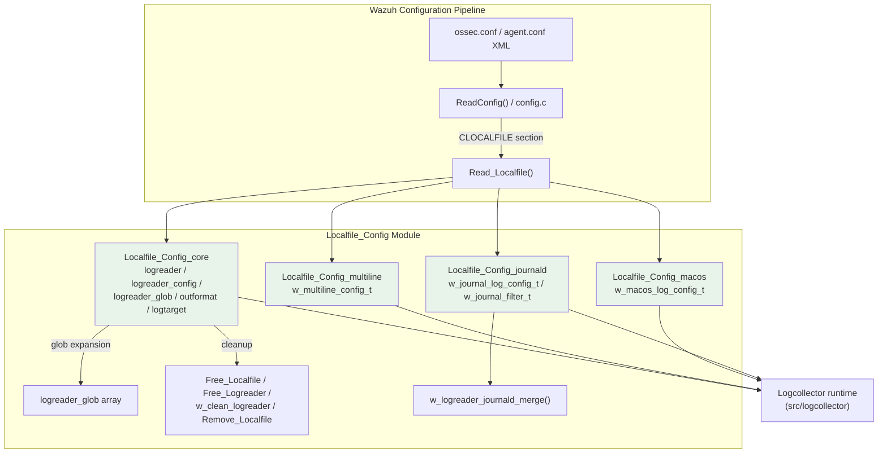
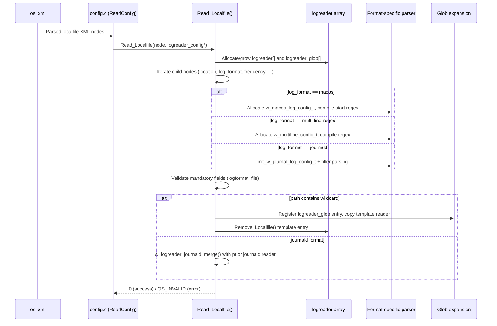

# Localfile Config Module

## 1. Purpose & Overview

The **Localfile_Config** module implements the parsing, validation, in-memory representation, and lifecycle management of the `<localfile>` configuration blocks used by the **Logcollector** daemon (`src/logcollector`) in Wazuh agents and managers. A `<localfile>` block tells Logcollector *what* to read (a file, a Windows Event Channel, a command output, the macOS Unified Logging system, or the systemd journal) and *how* to read it (log format, multiline handling, filters, labels, output targets, etc.).

This module is implemented in two files:

| File | Responsibility |
|---|---|
| `src/config/localfile-config.h` | Data structure definitions (`logreader`, `logreader_config`, `logreader_glob`, `outformat`, `logtarget`) and the specialized sub-configuration structures for multiline, macOS log, and journald log formats. Also declares the public API used by Logcollector and the config subsystem. |
| `src/config/localfile-config.c` | The XML parsing entry point `Read_Localfile()` plus supporting logic: glob expansion, regex-type detection, resource cleanup (`Free_Localfile`, `Free_Logreader`, `Remove_Localfile`, `w_clean_logreader`), and specialized helpers for multiline, macOS, and journald sub-configurations, including the journald merge logic (`w_logreader_journald_merge`). |

Functionally, this module acts as a **configuration compiler**: it consumes the generic XML node tree produced by `src/os_xml` (via the shared `ReadConfig`/`Read_Localfile` dispatch mechanism, see [Global_Config_Core](Global_Config_Core.md)) and produces validated, ready-to-use `logreader` structures that the runtime Logcollector engine (`src/logcollector`, C source not part of this module's core components) consumes directly.

## 2. Architecture Overview

### Key Design Points

- **Single dynamic array of `logreader`**: All `<localfile>` blocks are parsed into one growable array (`logreader_config.config`), while wildcard/glob paths are tracked separately in `logreader_config.globs` so they can be re-expanded at runtime as files appear/disappear.
- **Per-log-format specialization**: Rather than embedding every possible option directly in `logreader`, format-specific state is isolated into dedicated, independently allocated/freed sub-structures: `w_multiline_config_t` (format `multi-line-regex`), `w_macos_log_config_t` (format `macos`), and `w_journal_log_config_t` (format `journald`). This keeps the core struct lean and makes format-specific logic easy to test and free correctly.
- **Regex abstraction**: Ignore/restrict/multiline/journald-filter expressions all go through the shared `w_expression_t` abstraction (`src/headers/expression.h`), supporting `osmatch`, `osregex`, and `pcre2` engines interchangeably, selected via `w_check_regex_type()`.
- **Merge semantics for journald**: Because systemd's journal is a single global log source, multiple `<localfile>` blocks with `log_format=journald` are merged into a single effective reader via `w_logreader_journald_merge()`, combining their filters instead of running duplicate journal readers.

## 3. Sub-Modules

This module's components are grouped into four documented sub-modules based on functional area:

| Sub-module | Focus | Documentation |
|---|---|---|
| **Localfile_Config_core** | The primary `logreader`/`logreader_config`/`logreader_glob` data structures, the `Read_Localfile()` XML parsing entry point, glob/wildcard deployment, resource lifecycle (`Free_Localfile`, `Free_Logreader`, `Remove_Localfile`, `w_clean_logreader`), and shared helpers (`w_check_regex_type`, output/target structures `outformat`/`logtarget`). | [Localfile_Config_core.md](Localfile_Config_core.md) |
| **Localfile_Config_multiline** | The `multi-line-regex` log format: `w_multiline_config_t`, per-file `w_multiline_ctxt_t` timeout/backup context, match/replace attribute parsing. | [Localfile_Config_multiline.md](Localfile_Config_multiline.md) |
| **Localfile_Config_macos** | The `macos` log format (Unified Logging via the `log` CLI tool): `w_macos_log_config_t`, `w_macos_log_ctxt_t`, `w_macos_log_pinfo_t`, `w_macos_log_procceses_t`, and query type/level attribute parsing. | [Localfile_Config_macos.md](Localfile_Config_macos.md) |
| **Localfile_Config_journald** | The `journald` log format: `w_journal_log_config_t`, `w_journal_filter_t`/`_w_journal_filter_unit_t` filter trees, filter parsing (`journald_add_condition_to_filter`), and the multi-block merge algorithm (`w_logreader_journald_merge`). | [Localfile_Config_journald.md](Localfile_Config_journald.md) |

## 4. Data Flow: Parsing a `<localfile>` Block

## 5. Relationship to Other Modules

- **[Global_Config_Core](Global_Config_Core.md)** — supplies the generic `ReadConfig`/XML dispatch mechanism (`config.c`) that invokes `Read_Localfile()` for every `<localfile>` block found in `ossec.conf`/`agent.conf`.
- **Agent_&_Manager_Native_Daemons_(C) / logcollector** — the runtime consumer of the `logreader`/`logreader_config` structures produced here; it performs the actual file tailing, command execution, and event dispatch (`src/logcollector/*.c`, not part of this module's core components but directly dependent on it).
- **[Remote_Config](Remote_Config.md)**, **[Client_Config](Client_Config.md)** — sibling configuration modules under `src/config` that follow the same XML-parsing pattern for other daemons/sections.
- **Unit Tests - Logcollector** (`src/unit_tests/logcollector/test_localfile-config.c`, part of `logcollector_localfile_config_tests`) — the dedicated unit-test suite validating this module's parsing and helper functions (multiline attribute parsing, journald filter/condition logic, macOS log type detection, etc.).
- **`src/headers/expression.h`** (shared header) — provides `w_expression_t`, the common regex abstraction used by ignore/restrict lists, multiline regex, and journald filters.
- **`src/headers/labels_op.h`** (shared header) — provides `wlabel_t`, used for the `<label>` sub-element attached to each `logreader`.

## 6. Public API Summary

| Function | Purpose |
|---|---|
| `Read_Localfile()` | Main XML→struct parser for a single `<localfile>` block; entry point invoked by the config dispatcher. |
| `Test_Localfile()` | Validates a configuration file in isolation (`--test-config` style checks). |
| `Free_Localfile()` | Frees an entire `logreader_config` (all readers + globs + sockets). |
| `Free_Logreader()` | Frees a single `logreader` and its nested format-specific sub-configs. |
| `w_clean_logreader()` | Frees a `logreader` in place and zeroes it out (reusable slot). |
| `Remove_Localfile()` | Removes and compacts one entry from a `logreader` array (used after glob template extraction or on error). |
| `w_check_regex_type()` | Resolves the `type` XML attribute (`osmatch`/`osregex`/`pcre2`) for `<ignore>`/`<restrict>` elements. |
| `w_logreader_journald_merge()` | Merges a newly parsed journald `logreader` into a previously existing journald reader, combining filters. |

See the sub-module pages for details on multiline, macOS, and journald-specific APIs.
