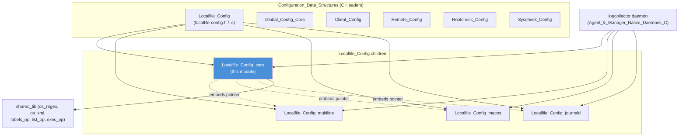
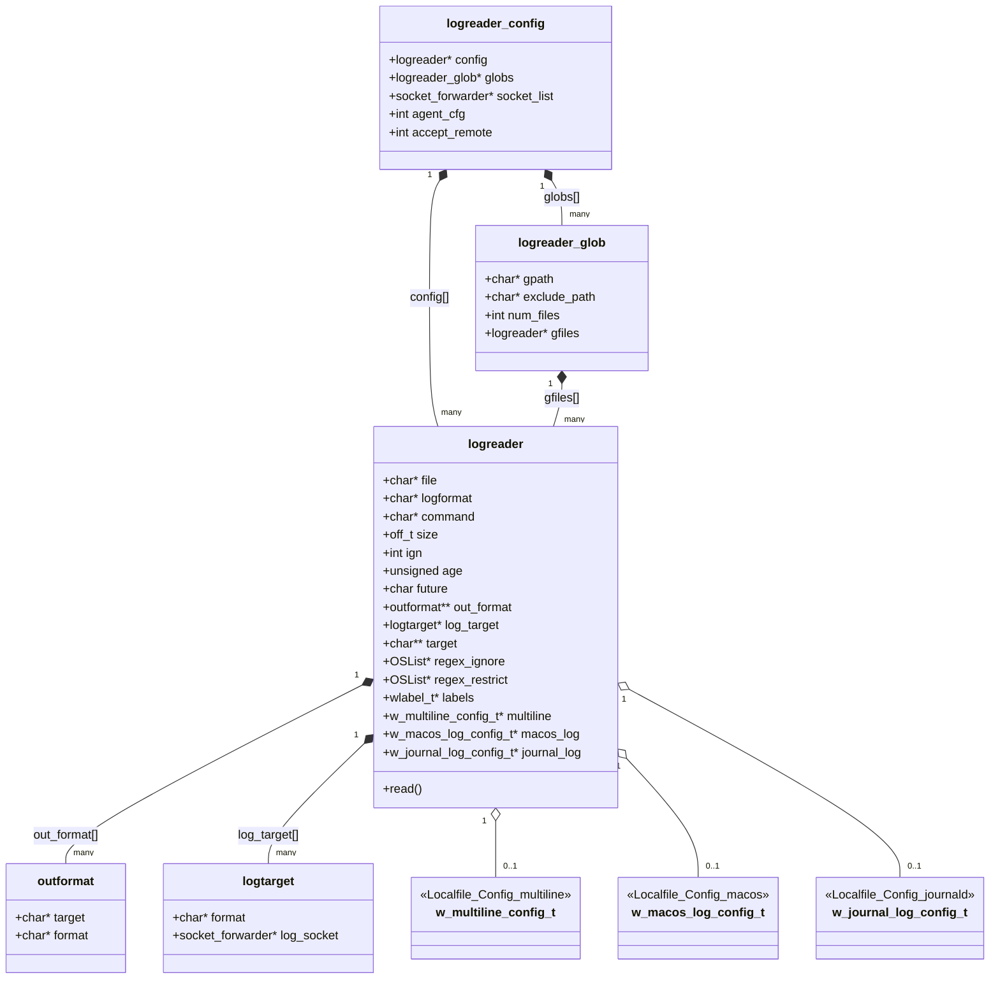
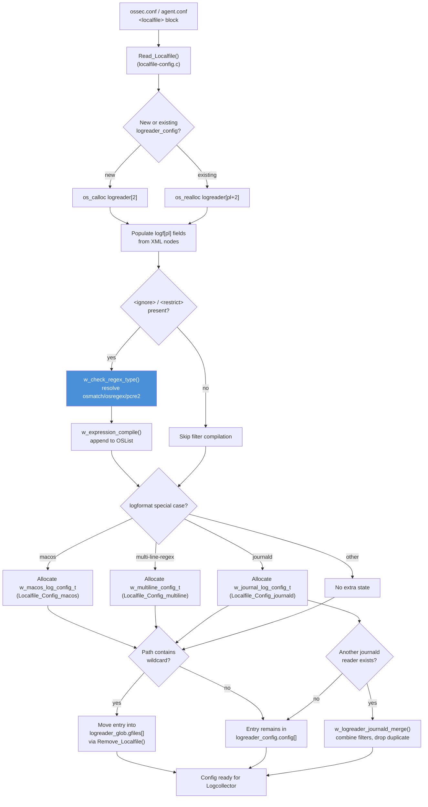
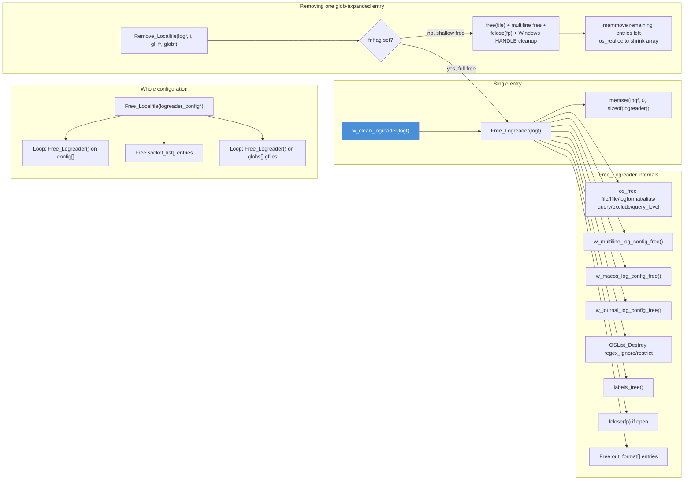

# Localfile Config Core

## Introduction

`Localfile_Config_core` is the foundational C data-structure and lifecycle-management layer for Wazuh's **Logcollector** subsystem. It defines the primary in-memory representation of every `<localfile>` block found in `ossec.conf`/`agent.conf` — the `logreader` struct — together with the container structures that group multiple log-file readers (`logreader_config`), handle wildcard-expanded file sets (`logreader_glob`), and describe how collected log lines are formatted and forwarded (`outformat`, `logtarget`).

This module does **not** implement the XML parsing logic itself (that lives in the sibling `Localfile_Config` file, `src/config/localfile-config.c::Read_Localfile`), but it does provide:

* The canonical struct definitions used throughout the agent/manager to describe a monitored log source.
* Low-level regex-type resolution (`w_check_regex_type`) used when compiling `<ignore>`/`<restrict>` filters.
* Safe cleanup/reset primitives (`w_clean_logreader`, and the related `Free_Logreader`/`Free_Localfile`) that guarantee no memory leaks when a `logreader` is reloaded, removed, or the whole configuration is torn down.

Because a single `<localfile>` block can describe many different log formats (plain text, Windows Event Channel, Syslog, macOS Unified Logging, systemd Journald, multiline regex, etc.), this core module intentionally keeps the "univeral" fields in `logreader` while delegating format-specific state to companion sub-modules:

* [Localfile_Config_multiline.md](Localfile_Config_multiline.md) — `w_multiline_config_t` / `w_multiline_ctxt_t`
* [Localfile_Config_macos.md](Localfile_Config_macos.md) — `w_macos_log_config_t` and related process/context structs
* [Localfile_Config_journald.md](Localfile_Config_journald.md) — `w_journal_log_config_t` / `w_journal_filter_t`

The structures defined here are consumed directly by the **Logcollector daemon** (`src/logcollector/*`, part of the `Agent_&_Manager_Native_Daemons_(C)` module) which performs the actual file tailing, command execution, and event forwarding to `analysisd`/`agentd`.

---

## Module Position in the System



---

## Core Data Structures

### `logreader` (aka `_logreader`)

The `logreader` struct is the central "recipe" for monitoring a single log source. One instance exists per `<localfile>` entry (or per file matched by a glob pattern). Key field groups:

| Group | Fields | Purpose |
|---|---|---|
| Identity / file state | `file`, `ffile`, `fd`, `dev`, `size`, `position`, `fp`, `exists` | Path, inode/handle bookkeeping, and open `FILE*` for tailing |
| Format selection | `logformat`, `command`, `query`, `query_type`, `query_level`, `channel_str` | Determines which reader routine (`read_*`) processes the source |
| Format-specific state (pointers) | `multiline`, `macos_log`, `journal_log` | Delegate to companion sub-modules (see links above) |
| Filtering | `regex_ignore`, `regex_restrict`, `exclude`, `filter_binary` | `OSList` of compiled `w_expression_t` filters |
| Output shaping | `out_format` (array of `outformat`), `log_target` (array of `logtarget`), `target` (string array) | Controls per-target output string templates and socket routing |
| Scheduling / lifecycle | `ign` (frequency), `age`, `age_str`, `reconnect_time`, `future`, `diff_max_size` | Rotation/retention and "only future events" behavior |
| Concurrency | `mutex` | Guards concurrent access from reader threads |
| Metadata | `alias`, `labels`, `duplicated` | Labels attached to generated events; alias overrides displayed source name |
| Function pointer | `read` | Points to the specific parsing routine (e.g., `read_syslog`, `read_json`, `read_win_el`) selected by Logcollector at runtime based on `logformat` |

### `logreader_glob` (aka `_logreader_glob`)

Represents one `<location>` entry that contains wildcard characters (`*`, `?`, `[`). Holds:
- `gpath` — the original glob pattern.
- `exclude_path` — resolved exclusion pattern (supports `%`-based date expansion).
- `gfiles` — a dynamically-sized array of `logreader` instances, one per file currently matched by the glob (`num_files` tracks the count).

Logcollector periodically re-evaluates globs to add newly created files and remove entries for deleted ones.

### `logreader_config` (aka `_logreader_config`)

The top-level aggregate produced by parsing `ossec.conf`/`agent.conf`:
```
config      -> logreader*        (flat, NULL(file)-terminated array of all direct <localfile> entries)
globs       -> logreader_glob*   (NULL(gpath)-terminated array of wildcard groups)
socket_list -> socket_forwarder* (custom <target><socket> definitions)
agent_cfg   -> int                (1 if parsed from agent.conf, restricting remote 'command' usage)
accept_remote -> int              (whether remote commands are permitted)
```

### `outformat` (aka `_outformat`) & `logtarget` (aka `_logtarget`)

Small value structs used to customize how an event is rendered/forwarded per output target:
- `outformat`: `{ target, format }` — a printf-like template string associated with a named target (`"agent"`, or a custom socket name).
- `logtarget`: `{ format, log_socket }` — resolved runtime pairing of a format string with an actual `socket_forwarder*` connection.

---

## Component Relationships



---

## Configuration Parsing Flow

Although `Read_Localfile` (the XML→struct parser) is documented in the parent `Localfile_Config` module, understanding how it *populates* the core structures clarifies the purpose of `w_check_regex_type` and `w_clean_logreader`.



**Error handling note:** whenever a partially-constructed `logreader` must be discarded mid-parse (e.g., an invalid journald filter), the parser calls `w_clean_logreader()` on that single entry rather than aborting the whole configuration — this function fully frees all owned sub-structures (multiline, macos, journal, regex lists, labels, out_format array) and zeroes the struct so it is safe to reuse or skip.

---

## Memory Lifecycle & Cleanup

Correct cleanup is critical because a `logreader` can own several dynamically-allocated sub-objects (compiled regexes, `OSList`s, label chains, journald filter trees, and even a live `FILE*`/socket handle). The core module exposes three levels of teardown:



Key invariants enforced by this module:

1. **No double-free of format-specific state** — `Free_Logreader` always routes through the dedicated `w_*_config_free()` functions (implemented in the respective sibling modules) rather than freeing those pointers directly.
2. **Glob-expanded entries never own a duplicate multiline config** — during `Read_Localfile`'s glob-deployment step, the multiline pointer is explicitly set to `NULL` on the *template* logreader before `Remove_Localfile` runs, since ownership transfers to the copies inside `gfiles[]`.
3. **Journald merge transfers ownership, never duplicates** — `w_logreader_journald_merge()` moves (not copies) filter lists and the `target` string array from the source entry to the destination entry before removing the source, preventing leaks and dangling pointers.

---

## Key Functions

### `w_check_regex_type(xml_node *node, const char *element)`

Inspects the `type` XML attribute on `<ignore>`/`<restrict>` elements and returns the matching `w_exp_type_t` enum value (defined in `shared/expression.h`, part of `headers` in `Agent_&_Manager_Native_Daemons_(C)`):

| Attribute value | Returned type |
|---|---|
| `osregex` | `EXP_TYPE_OSREGEX` |
| `osmatch` | `EXP_TYPE_OSMATCH` |
| `pcre2` (or unspecified/invalid) | `EXP_TYPE_PCRE2` (default, with a warning log if invalid) |

This function centralizes regex-engine selection so both `<ignore>` and `<restrict>` filters share identical validation logic.

### `w_clean_logreader(logreader *logf)`

Idempotent reset primitive: frees every owned resource inside a single `logreader` and zeroes the memory, leaving the struct safe for reuse (e.g., retry after a validation failure) or safe destruction. Internally delegates to `Free_Logreader`.

---

## Related / Dependent Modules

| Module | Relationship |
|---|---|
| [Localfile_Config_multiline.md](Localfile_Config_multiline.md) | Provides `w_multiline_config_t`/`w_multiline_ctxt_t` referenced by `logreader.multiline` |
| [Localfile_Config_macos.md](Localfile_Config_macos.md) | Provides `w_macos_log_config_t` and process-tracking structs referenced by `logreader.macos_log` |
| [Localfile_Config_journald.md](Localfile_Config_journald.md) | Provides `w_journal_log_config_t`/`w_journal_filter_t` referenced by `logreader.journal_log`, and the merge logic `w_logreader_journald_merge` (implemented in this file but operating on journald-specific state) |
| `Localfile_Config` (parent) | Owns `Read_Localfile`, the XML parser that populates all structures defined here |
| `Global_Config_Core`, `Client_Config`, `Remote_Config`, `Rootcheck_Config`, `Syscheck_Config` (siblings under Configuration_Data_Structures) | Other `ossec.conf` section parsers following the same `XML_NODE` convention |
| `logcollector` (in `Agent_&_Manager_Native_Daemons_(C)`) | Primary consumer: iterates `logreader_config.config[]`/`globs[]`, dispatches to format-specific `read_*` functions via `logreader.read`, and manages runtime state (`w_lc_state_*` in `logcollector/state.h`) |
| `headers` (`Agent_&_Manager_Native_Daemons_(C)`) | Supplies foundational types used by `logreader`: `w_expression_t` (`expression.h`), `wlabel_t` (`labels_op.h`), `OSList` (`list_op.h`), `wfd_t` (`exec_op.h`), `_socket_forwarder` (`shared.h`) |
| `shared_lib` (`Agent_&_Manager_Native_Daemons_(C)`) | Supplies runtime utilities used during parsing/cleanup: `os_regex`, `os_xml`, `labels_op.c`, `list_op.c` |

---

## Usage Notes for Maintainers

- **Adding a new `logformat` value**: extend the format-dispatch `if/else` chain in `Read_Localfile` (parent module) and, if the format needs persistent state beyond generic fields, add a new pointer field to `logreader` (mirroring `multiline`/`macos_log`/`journal_log`) plus a paired `w_<format>_config_free()` function invoked from `Free_Logreader`.
- **Adding a new filter attribute** (beyond `type` on `<ignore>`/`<restrict>`): extend `w_check_regex_type` or introduce a sibling attribute-resolution function following the same `w_get_attr_val_by_name` pattern used for multiline attributes (`w_get_attr_match`, `w_get_attr_replace`, `w_get_attr_timeout`).
- **Thread-safety**: the `mutex` field in `logreader` must be locked by any Logcollector thread that reads/writes file-position (`position`, `fd`, `dev`) state concurrently; this module only defines the field, initialization/locking occurs in the logcollector daemon.
- **Windows-specific fields** (`h`, `fd` as `DWORD`) are conditionally compiled (`#ifdef WIN32`) and must be released via `CloseHandle`/`pthread_mutex_destroy` as shown in `Remove_Localfile` — do not assume POSIX-only cleanup when extending this code path.
