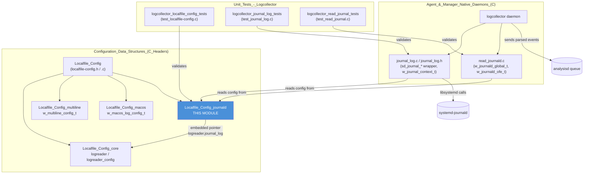
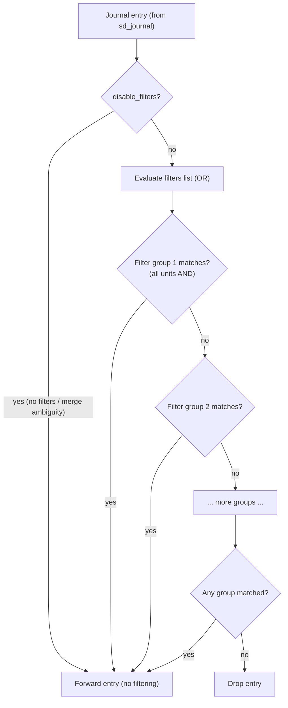
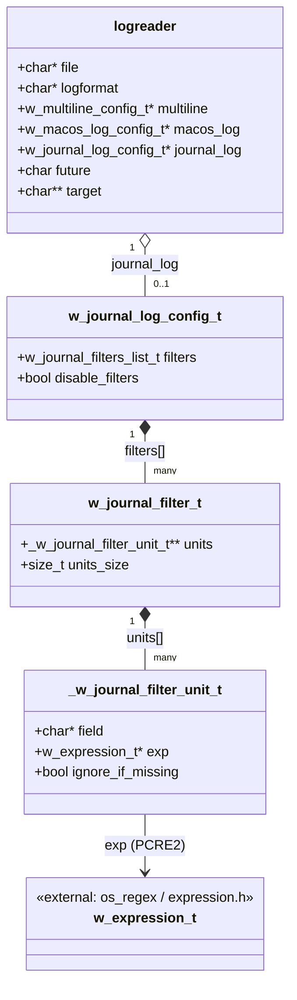
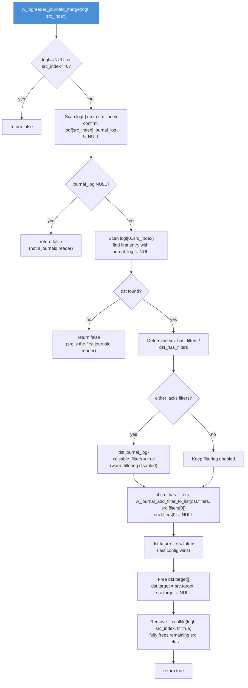
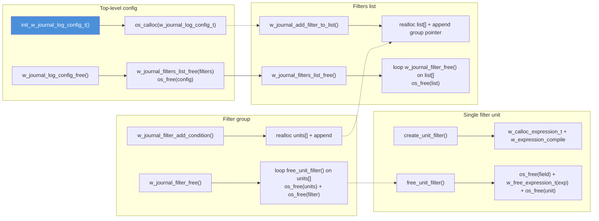
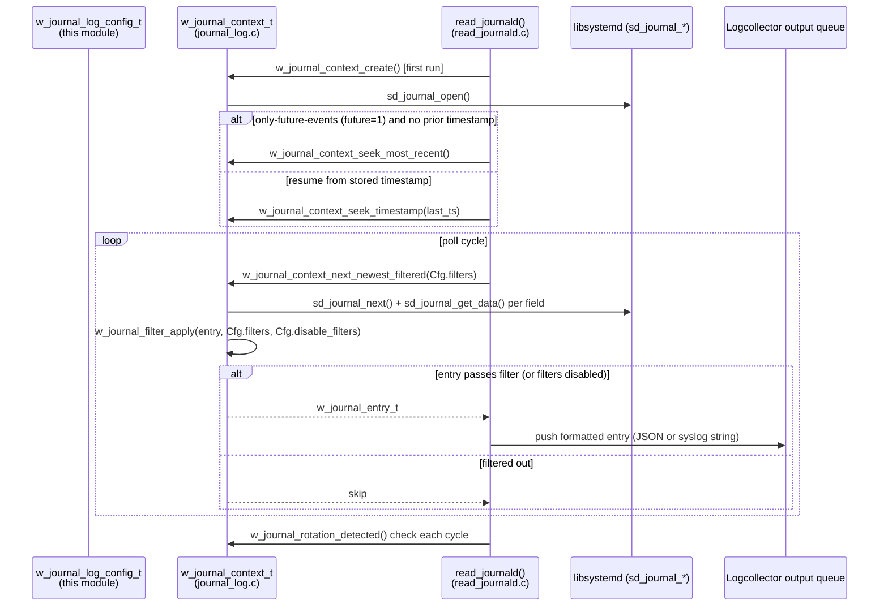

# Localfile_Config_journald

## Introduction

`Localfile_Config_journald` is the configuration sub-module of Wazuh's **Logcollector** that models how the agent reads log entries from the **systemd Journal** (`journald`). It is a small, tightly-scoped part of `src/config/localfile-config.h` / `src/config/localfile-config.c` that defines:

- **`w_journal_log_config_t`** — the top-level configuration attached to a `<localfile>` block whose `log_format` is `journald`.
- **`w_journal_filter_t`** and **`_w_journal_filter_unit_t`** — a two-level filter tree that lets administrators restrict which journal entries are forwarded, based on field/value matching (e.g. `_SYSTEMD_UNIT`, `PRIORITY`, etc.).
- **`w_logreader_journald_merge()`** — the merge algorithm that consolidates multiple `<localfile log_format="journald">` blocks into a single effective reader, since the systemd journal is one global, singleton log source (unlike ordinary files, which can be tailed independently).

Unlike file-based log formats, journald is read through `libsystemd`'s native API (`sd_journal_*` calls) rather than `fopen`/`fgets`. This module therefore focuses purely on **filter configuration and merge semantics** — the actual journal-reading engine (`sd_journal` iteration, entry-to-JSON/syslog conversion, rotation detection) lives in the sibling `logcollector` component (`src/logcollector/journal_log.c`, `journal_log.h`, `read_journald.c`), which is documented as part of [Agent_&_Manager_Native_Daemons_(C)](Agent_&_Manager_Native_Daemons_(C).md).

This module is one of three specialized "format extensions" hanging off the generic `logreader` struct, alongside:
- [Localfile_Config_multiline.md](Localfile_Config_multiline.md) — `multi-line-regex` format
- [Localfile_Config_macos.md](Localfile_Config_macos.md) — `macos` format (Unified Logging)

For the parent, format-agnostic structures (`logreader`, `logreader_config`, `outformat`, `logtarget`) see [Localfile_Config_core.md](Localfile_Config_core.md). For the overall parsing pipeline see [Localfile_Config.md](Localfile_Config.md).

---

## Position in the System



---

## Purpose and Core Functionality

Because systemd exposes **one global journal** per host (optionally scoped to the local/system journal, not per-file), the configuration model for `journald` differs fundamentally from file-based `<localfile>` entries:

1. **No file path semantics** — the `<location>` value is conventionally the literal string `journald`; there is nothing to glob or rotate in the traditional sense (rotation is instead detected at the `sd_journal` file-descriptor level by the runtime reader).
2. **Filtering instead of path selection** — since all journald readers observe the *same* underlying data source, the way to scope what an individual `<localfile>` block cares about is through **field/value filters** (`<filter field="...">expression</filter>`), not through path patterns.
3. **Singleton merge requirement** — if an administrator defines **more than one** `<localfile log_format="journald">` block (e.g., one to forward `_SYSTEMD_UNIT=sshd.service` entries to one target, another for `PRIORITY<=3` critical entries), Logcollector must not spawn two independent `sd_journal` readers against the same journal; instead, this module merges the *filters* of the second block into the first, producing one effective reader with a filter list holding both filter groups.

To support this, the module provides:

| Component | Responsibility |
|---|---|
| `w_journal_log_config_t` | Aggregates the list of filters (`filters`) applied to journal entries and a `disable_filters` flag used when merges make filtering ambiguous. |
| `w_journal_filter_t` | Represents **one filter group**: a set of `_w_journal_filter_unit_t` "AND" conditions that must **all** match for an entry to pass this filter. |
| `_w_journal_filter_unit_t` | The atomic condition: a `field` name, a compiled `w_expression_t` (PCRE2) `exp`, and an `ignore_if_missing` flag controlling behavior when the field is absent from a given journal entry. |
| `w_journal_filters_list_t` (`w_journal_filter_t **`) | An array of filter groups; entries are combined with **OR** semantics — an entry is forwarded if it matches **any** filter group in the list. |
| `w_logreader_journald_merge()` | Locates a prior journald `logreader` in the array and merges the newly parsed one into it (filters, `future`, `target`), then removes the redundant entry. |

### Filter Semantics Summary



Within a single filter group (`w_journal_filter_t`), **all** `_w_journal_filter_unit_t` conditions must match (logical AND). Across the top-level `filters` list, **any** matching group is sufficient (logical OR) — this is precisely what allows two separately-configured `<localfile>` blocks (each contributing one filter group) to be merged without losing either administrator's intent.

---

## Core Data Structures



### `w_journal_log_config_t`

The struct embedded as `logreader.journal_log` (only populated when `logformat == "journald"`):

```c
typedef struct w_journal_log_config_t {
    w_journal_filters_list_t filters; // List of filter groups (OR semantics)
    bool disable_filters;             // Disable filtering entirely
} w_journal_log_config_t;
```

- **`filters`** (`w_journal_filter_t **`, NULL-terminated) — the ordered list of filter groups. An empty/NULL list means *no filtering* (every journal entry is read).
- **`disable_filters`** — set to `true` by `w_logreader_journald_merge()` whenever merging two journald blocks would result in ambiguous or incomplete filtering (e.g., one block has no filter at all) — in that case, the merged reader falls back to *unfiltered* behavior rather than silently dropping entries the administrator expected to receive.

### `w_journal_filter_t`

Represents one filter group — a conjunction ("AND") of conditions:

```c
typedef struct w_journal_filter_t {
    _w_journal_filter_unit_t ** units; // Array of unit filters (AND'ed together)
    size_t units_size;                 // Number of units currently stored
} w_journal_filter_t;
```

Built incrementally via `w_journal_filter_add_condition()`, which reallocates `units` and appends a new `_w_journal_filter_unit_t` each time a `<filter>` XML element is parsed for the same group.

### `_w_journal_filter_unit_t`

The atomic filter condition — "does field X match regex Y?":

```c
typedef struct _w_journal_filter_unit_t {
    char * field;           // Journal field name to test (e.g. "_SYSTEMD_UNIT")
    w_expression_t * exp;   // Compiled PCRE2 expression to match against the field value
    bool ignore_if_missing; // If true, missing field => treated as "condition satisfied"/skipped
} _w_journal_filter_unit_t;
```

- Always compiled as `EXP_TYPE_PCRE2` (see `create_unit_filter()` in `localfile-config.c`) — journald filters do not support the `osmatch`/`osregex` engine selection available for `<ignore>`/`<restrict>` on file-based sources.
- `ignore_if_missing` maps directly to the `ignore_if_missing="yes|no"` XML attribute on `<filter>`, letting administrators decide whether entries **lacking** the target field should be excluded (strict) or tolerated (lenient) by that particular condition.

---

## Configuration Parsing Flow

```mermaid
sequenceDiagram
    participant XML as ossec.conf<br/>(&lt;localfile log_format="journald"&gt;)
    participant RL as Read_Localfile()<br/>(Localfile_Config_core)
    participant Init as init_w_journal_log_config_t
    participant Add as journald_add_condition_to_filter
    participant Unit as create_unit_filter
    participant Merge as w_logreader_journald_merge

    XML->>RL: Parse &lt;localfile&gt; child nodes
    RL->>RL: logformat == "journald" detected
    loop for each &lt;filter field="..." ignore_if_missing="..."&gt;expr&lt;/filter&gt;
        RL->>Init: init_w_journal_log_config_t() [first time only]
        RL->>Add: journald_add_condition_to_filter(node, &filters[0])
        Add->>Unit: create_unit_filter(field, expression, ignore_if_missing)
        Unit->>Unit: w_calloc_expression_t(EXP_TYPE_PCRE2)<br/>w_expression_compile()
        Unit-->>Add: _w_journal_filter_unit_t* or NULL (compile error)
        Add-->>RL: true/false
    end
    RL->>RL: Validate mandatory fields<br/>(force file="journald", warn on ignored options)
    RL->>Merge: w_logreader_journald_merge(&logf, current_index)
    Merge->>Merge: Search earlier journald logreader in array
    alt earlier journald reader found
        Merge->>Merge: Merge filters, future, target<br/>Remove_Localfile(current_index)
    else no earlier reader
        Merge-->>RL: false (this is the first/only journald reader)
    end
    RL-->>XML: 0 (success) / OS_INVALID (error)
```

### Validation Rules Applied by `Read_Localfile()`

When `logformat == JOURNALD_LOG` ("journald"), the parser (implemented in the sibling `Localfile_Config_core` file `localfile-config.c`) enforces:

| Rule | Behavior |
|---|---|
| `<location>` must equal `journald` | If different, a warning is logged and the value is forcibly overwritten to `journald`. |
| Missing `<location>` | Warning logged; defaults to `journald` (not a hard error, unlike generic file sources). |
| `<frequency>`, `<age>`, `<ignore_binaries>`, `<exclude>`, `<multi_line_regex>`, `<label>`, `<alias>`, `<ignore>`, `<restrict>`, non-default `<reconnect_time>` | All logged as **ignored** (`LOGCOLLECTOR_OPTION_IGNORED`) since they are meaningless for a `sd_journal`-backed source. |
| `<filter>` elements | Parsed into the **first** filter group (`filters[0]`) of the reader's `journal_log` config via `journald_add_condition_to_filter()`. |
| Multiple `journald` `<localfile>` blocks | Automatically merged via `w_logreader_journald_merge()` after the current block finishes parsing — see below. |

---

## The Merge Algorithm: `w_logreader_journald_merge()`

```c
bool w_logreader_journald_merge(logreader ** logf_ptr, size_t src_index);
```

**Purpose:** Because the systemd journal is a single, non-partitionable log source, Wazuh does not allow multiple independent `sd_journal` reader instances. Instead, every `<localfile log_format="journald">` block beyond the first is folded into the *first* journald reader found in the `logreader` array, combining their filter groups with OR semantics.



### Key Merge Semantics

1. **Ownership transfer, not duplication** — filter groups and the `target` string array are **moved** (pointer reassignment + source nulled) from the source (`src_index`) reader to the destination (first-found) reader. This avoids double-frees and unnecessary allocation.
2. **"Last configuration wins" for `future`/`target`** — the `only-future-events` flag and output `target` list from the *most recently parsed* (later in the file) journald block take precedence, since they are simple scalar/array overwrites rather than filter merges.
3. **Fail-safe disabling of filters** — if *either* the source or destination reader has no filters at all (i.e., one block filters nothing), the merged filter set is intentionally disabled (`disable_filters = true`) rather than silently only applying one side's filter — this prevents surprising data loss where an administrator's unfiltered block would otherwise be unexpectedly restricted by another block's filter.
4. **Full cleanup of the source entry** — `Remove_Localfile()` is called with `fr = true` (full free flag), ensuring `Free_Logreader()` runs on the remaining owned fields (already-nulled filters/target are safely skipped) before the array is compacted.

---

## Filter Construction & JSON Serialization Helpers

Several supporting functions (declared in `localfile-config.h`, implemented in `localfile-config.c`) manage the filter lifecycle and expose it for introspection (e.g., via the Logcollector control socket / `GET /manager/configuration` style dumps):

| Function | Responsibility |
|---|---|
| `init_w_journal_log_config_t(w_journal_log_config_t **config)` | Allocates a zeroed `w_journal_log_config_t` if `*config` is NULL. Idempotent (returns `false` if already initialized). |
| `w_journal_log_config_free(w_journal_log_config_t **config)` | Frees the filters list and the config struct itself; sets `*config = NULL`. |
| `journald_add_condition_to_filter(xml_node *node, w_journal_filter_t **filter)` | Parses one `<filter field="..." ignore_if_missing="...">expr</filter>` XML node, validating that `field` and the expression content are non-empty, then delegates to `w_journal_filter_add_condition()`. |
| `w_journal_filter_add_condition(w_journal_filter_t **filter, const char *field, char *expression, bool ignore_if_missing)` | Compiles the expression (via `create_unit_filter`) and appends the resulting unit to the filter group, lazily allocating the group if needed. |
| `w_journal_add_filter_to_list(w_journal_filters_list_t *list, w_journal_filter_t *filter)` | Appends an entire filter group to the top-level `filters` list (used both during normal parsing and during merges). |
| `w_journal_filter_free(w_journal_filter_t *filter)` | Frees all units in a filter group and the group itself. |
| `w_journal_filters_list_free(w_journal_filters_list_t list)` | Frees every filter group in the list, then the list array itself. |
| `w_journal_filter_list_as_json(w_journal_filters_list_t filter_lst)` | Serializes the entire filters list to a `cJSON` array of arrays of `{field, expression, ignore_if_missing}` objects — used for configuration dump/debugging endpoints. |
| `w_check_regex_type` / `create_unit_filter` (internal, `STATIC`) | Compile the PCRE2 expression backing a filter unit; unit tests (`test_localfile-config.c`) access these via the `STATIC` macro relaxation under `WAZUH_UNIT_TESTING`. |

### JSON Shape Produced by `w_journal_filter_list_as_json`

```json
[
  [
    { "field": "_SYSTEMD_UNIT", "expression": "sshd\\.service", "ignore_if_missing": false }
  ],
  [
    { "field": "PRIORITY", "expression": "^[0-3]$", "ignore_if_missing": true }
  ]
]
```
Each outer array element corresponds to one `w_journal_filter_t` (OR'ed group); each inner object corresponds to one `_w_journal_filter_unit_t` (AND'ed within the group).

---

## Memory Lifecycle



This module fully participates in the generic `logreader` cleanup chain documented in [Localfile_Config_core.md](Localfile_Config_core.md): `Free_Logreader()` always calls `w_journal_log_config_free(&(logf->journal_log))` rather than freeing the pointer directly, guaranteeing the filters list and every nested unit/expression is released without leaks — this is critical for `journald` blocks specifically because merges can produce filter lists containing groups originally allocated by *different* `logreader` entries that have since been removed from the array.

---

## Runtime Consumers (Sibling `logcollector` Components)

While this documented module only covers the **configuration** structures, the actual journal reading is implemented by closely related files in `Agent_&_Manager_Native_Daemons_(C)`:

| File | Role |
|---|---|
| `src/logcollector/journal_log.h` / `journal_log.c` | Defines `w_journal_context_t` (wraps an open `sd_journal*` handle + rotation/inode tracking), `w_journal_entry_t` (one decoded entry), and `w_journal_lib_t` (dynamically-loaded `libsystemd` function pointers, since `libsystemd` may not be present at build time on all platforms). Implements entry iteration, timestamp-based seeking, filter application (consulting `w_journal_filter_t` from this module), and JSON/syslog-style rendering of entries. |
| `src/logcollector/read_journald.c` | The `read_journald()` reader-loop entry point registered as `logreader.read` when `logformat == "journald"`. Defines `w_journald_global_t` (shared context reused across `can_read`/next-entry calls) and `w_journald_ofe_t` ("only future events" bookkeeping), consulting `logreader.journal_log` and `logreader.future` from this module's structures. |



For details on `logcollector`'s file-status persistence (`w_lc_state_file_t`, storing the last journal timestamp/vault similarly to the macOS log vault), see [Localfile_Config_macos.md](Localfile_Config_macos.md) for the analogous pattern, and the `logcollector` sub-module of [Agent_&_Manager_Native_Daemons_(C).md](Agent_&_Manager_Native_Daemons_(C).md).

---

## Relationship to Other `localfile-config` Sub-Modules

| Sub-module | Format identifier | Struct | Data source model |
|---|---|---|---|
| [Localfile_Config_core](Localfile_Config_core.md) | any | `logreader`, `logreader_config` | Owns generic fields; embeds format-specific pointers (`multiline`, `macos_log`, `journal_log`). |
| [Localfile_Config_multiline](Localfile_Config_multiline.md) | `multi-line-regex` | `w_multiline_config_t` | Plain file, multiple physical lines per logical entry. |
| [Localfile_Config_macos](Localfile_Config_macos.md) | `macos` | `w_macos_log_config_t` | External `log` CLI process (stream/show), one instance per `<localfile>` (not a singleton). |
| **Localfile_Config_journald** (this module) | `journald` | `w_journal_log_config_t` | Native `libsystemd` API against the **single, global** system journal — requires filter-based merging across multiple `<localfile>` blocks (unique among the four formats). |

All four formats are selected mutually-exclusively via `logreader.logformat`; only the pointer matching the configured format is populated (the others remain `NULL`).

---

## Key Constants

| Constant | Value | Purpose |
|---|---|---|
| `JOURNALD_LOG` | `"journald"` | The `log_format` string value that activates this configuration path; also the expected/forced `<location>` value. |

*(Journald parsing does not introduce its own timeout/size constants at the configuration-header level; rotation/timeout constants such as those bounding "only future events" seeking are defined in the runtime `journal_log.h`/`read_journald.c` files.)*

---

## Practical Example

```xml
<!-- Block 1: forward sshd unit logs -->
<localfile>
  <log_format>journald</log_format>
  <location>journald</location>
  <filter field="_SYSTEMD_UNIT" ignore_if_missing="yes">sshd\.service</filter>
</localfile>

<!-- Block 2: forward critical-priority logs (merged into Block 1 at parse time) -->
<localfile>
  <log_format>journald</log_format>
  <location>journald</location>
  <only-future-events>no</only-future-events>
  <filter field="PRIORITY">^[0-3]$</filter>
</localfile>
```

After parsing, `w_logreader_journald_merge()` collapses these into a **single** `logreader` entry whose `journal_log->filters` contains **two** OR'ed groups:
1. `_SYSTEMD_UNIT` matches `sshd\.service` (missing field tolerated).
2. `PRIORITY` matches `^[0-3]$` (missing field would reject, since `ignore_if_missing` defaults to `false`).

The merged reader's `future` flag reflects Block 2's value (`no`, i.e., read historical entries too), since the second/later block's scalar settings win.

---

## Unit Test Coverage

The dedicated unit-test suite `logcollector_localfile_config_tests` (`src/unit_tests/logcollector/test_localfile-config.c`) exercises this module extensively, including:

- Filter unit creation/compilation success and failure paths (`test_create_unit_filter_*`).
- Condition parsing from XML nodes, including all `ignore_if_missing` value permutations (`test_journald_add_condition_to_filter_*`).
- Filter/unit JSON serialization (`test_filter_as_json_*`, `test_unit_filter_as_json_*`, `test_w_journal_filter_list_as_json_*`).
- Adding filters/conditions to lists, including null-parameter guards (`test_w_journal_add_filter_to_list_*`, `test_w_journal_filter_add_condition_*`).
- Config init/free correctness (`test_init_w_journal_log_config_t_*`, `test_w_journal_log_config_free_*`).

Complementary runtime-level tests validating the merged configuration's effect on actual journal reading live in `logcollector_journal_log_tests` (`test_journal_log.c`) and `logcollector_read_journal_tests` (`test_read_journal.c`) — see [Unit_Tests_-_Logcollector.md](Unit_Tests_-_Logcollector.md).

---

## Summary

| Aspect | Description |
|---|---|
| **Language** | C (struct definitions in `localfile-config.h`; logic in `localfile-config.c`) |
| **Core Types** | `w_journal_log_config_t`, `w_journal_filter_t`, `_w_journal_filter_unit_t` |
| **Type Alias** | `w_journal_filters_list_t` = `w_journal_filter_t **` |
| **Key Function** | `w_logreader_journald_merge()` — consolidates multiple journald `<localfile>` blocks into one reader |
| **Filter Semantics** | AND within a group (`_w_journal_filter_unit_t` units), OR across groups (`filters` list) |
| **Regex Engine** | Always `EXP_TYPE_PCRE2` (via `w_expression_t`) |
| **Configuration Source** | `<localfile log_format="journald">` with nested `<filter field="..." ignore_if_missing="...">` elements |
| **Primary Runtime Consumer** | `logcollector` daemon — `journal_log.c` / `read_journald.c` (native `libsystemd` bindings) |
| **Related Modules** | `Localfile_Config_core` (parent struct), `Localfile_Config_multiline`, `Localfile_Config_macos` (sibling formats) |
| **Test Coverage** | `logcollector_localfile_config_tests`, `logcollector_journal_log_tests`, `logcollector_read_journal_tests` |
