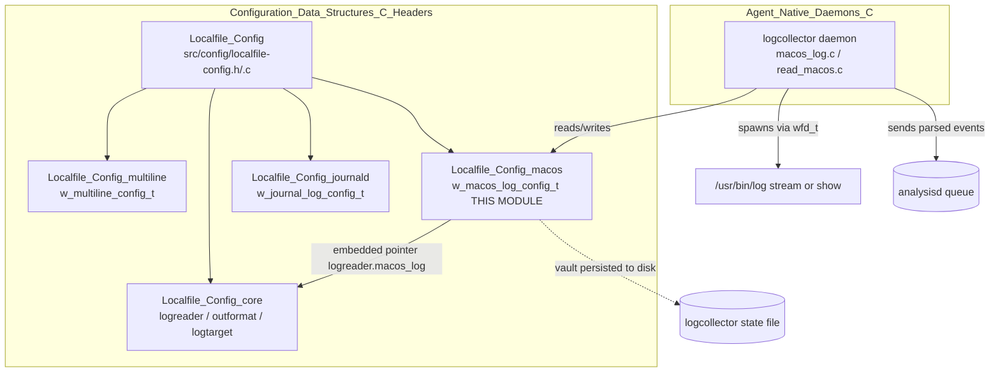
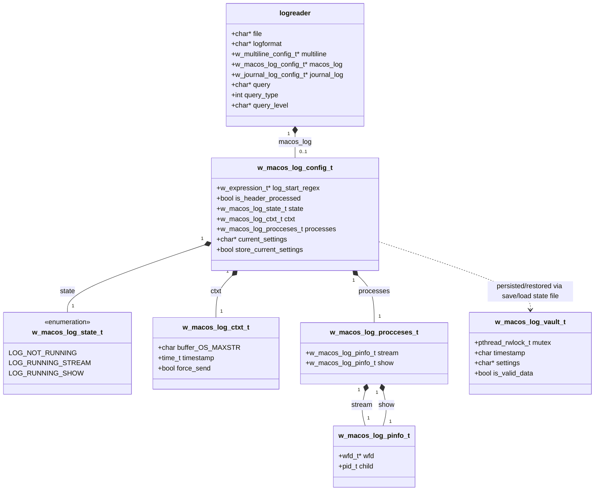
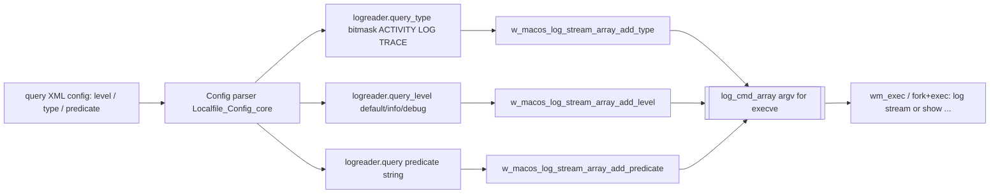
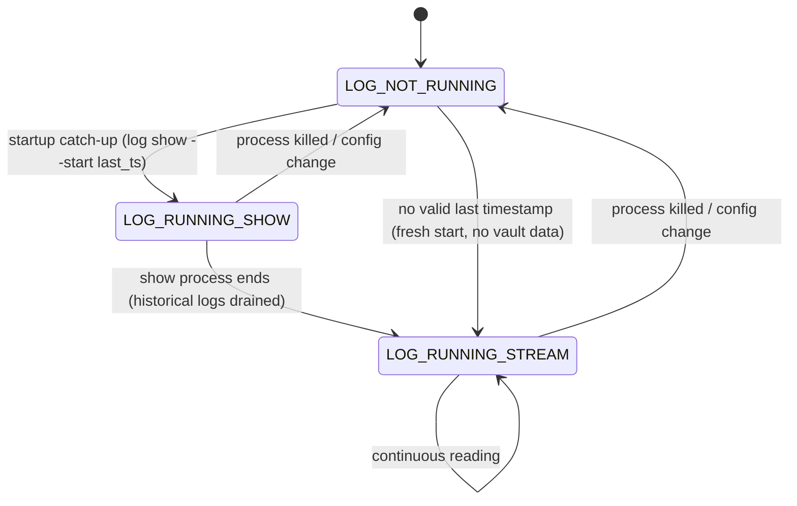
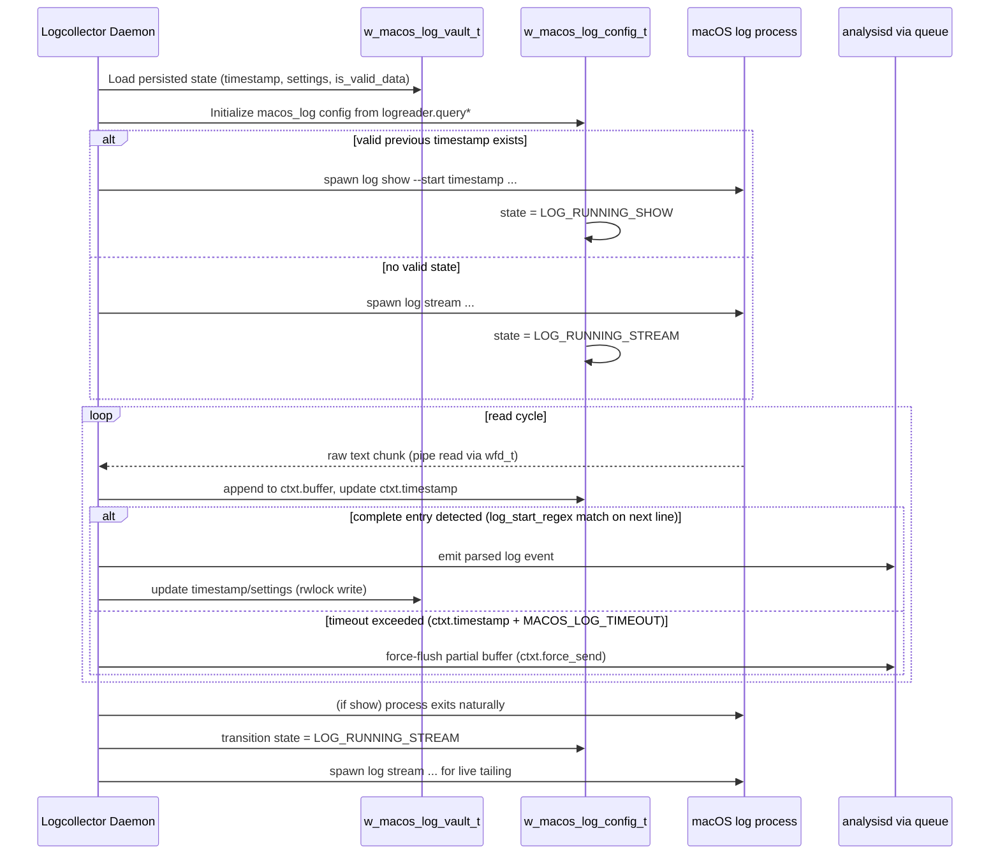

# Localfile_Config_macos

## Introduction

`Localfile_Config_macos` is a focused sub-module of the Wazuh agent's **Logcollector** configuration layer. It defines the C data structures that hold the runtime state and configuration needed to collect logs from the native macOS unified logging system (the `log stream` / `log show` command-line tools introduced in macOS 10.12+).

Unlike the other `localfile` sub-modules — which describe *what* to read (a plain file, a multiline pattern, or the systemd journal) — this module describes *how to drive an external OS process* (`log`) that streams or dumps structured log entries, and how to preserve enough context across agent restarts so that log collection can resume without duplicating or losing entries.

This module contains **only header/struct declarations plus small inline helper functions** used to build the `log` command-line argument array; the actual process-spawning, parsing and event-emission logic lives in the sibling `logcollector` component (`src/logcollector/macos_log.c` / `read_macos.c`), which is documented separately.

## Position in the System

Related documentation:
- [Localfile_Config.md](Localfile_Config.md) — parent module overview (all `localfile-config.h` structures)
- [Localfile_Config_core.md](Localfile_Config_core.md) — the generic `logreader` structure that embeds `w_macos_log_config_t`
- [Localfile_Config_multiline.md](Localfile_Config_multiline.md) — sibling multi-line regex configuration
- [Localfile_Config_journald.md](Localfile_Config_journald.md) — sibling systemd-journal configuration
- [Agent_&_Manager_Native_Daemons_(C).md](Agent_&_Manager_Native_Daemons_(C).md) — the daemon (`logcollector`) that consumes this configuration and executes the `log` process

## Purpose

The macOS unified log has no simple "read file line-by-line" model: entries are obtained by running the `log` binary in one of two modes:

- **`log stream`** — continuously streams live entries.
- **`log show`** — dumps buffered historical entries (used to catch up after a restart or to backfill during startup).

Because Logcollector may switch between these two executions, and because the read loop happens over many iterations (potentially split across agent restarts), this module provides:

1. **Command construction helpers** — Small `STATIC INLINE` functions that append `--level`, `--predicate`, and `--type` flags to the array of arguments passed to `exec`, based on the user's `<query>` configuration.
2. **Process bookkeeping** (`w_macos_log_procceses_t` / `w_macos_log_pinfo_t`) — Tracks the OS process handles (`wfd_t`) and PIDs of the two possible `log` sub-processes (stream and show) so Logcollector can read from their pipes, detect termination, and clean up file descriptors.
3. **Partial-read context** (`w_macos_log_ctxt_t`) — Since a single log entry can span a `read()` call boundary, this buffer holds a log fragment until a complete entry (bounded by a timestamp regex) is available, along with a timeout to force-flush stale partial data.
4. **Top-level configuration/state** (`w_macos_log_config_t`) — Aggregates the regex used to detect a new log's start, the current running mode (`LOG_NOT_RUNNING` / `LOG_RUNNING_STREAM` / `LOG_RUNNING_SHOW`), the process handles, the partial-read context, and the exact command line last used to launch `log` (needed to detect configuration changes across restarts).
5. **Persistence vault** (`w_macos_log_vault_t`, in `macos_log.h`) — A thread-safe (rwlock-protected) structure used to persist/restore the last-seen timestamp and command settings to the Logcollector state file, enabling resume-after-restart semantics without re-reading already-processed logs.

## Core Data Structures

### `w_macos_log_config_t`
The central struct, embedded as `logreader.macos_log`. It captures:
- **`log_start_regex`**: A compiled `w_expression_t` (PCRE2/OSRegex wrapper) matching the macOS log timestamp pattern `^\d\d\d\d-\d\d-\d\d \d\d:\d\d:\d\d`, used to detect where one log entry ends and the next begins in the streamed text.
- **`is_header_processed`**: Whether the initial multi-line header block that `log stream`/`log show` emit at startup has been consumed and discarded.
- **`state`**: One of `LOG_NOT_RUNNING`, `LOG_RUNNING_STREAM`, `LOG_RUNNING_SHOW` — drives the daemon's decision of whether to (re)spawn a process or simply keep reading.
- **`current_settings`**: The exact serialized command line used to invoke `log`. Compared against a newly-computed command line on reconfiguration/restart to decide whether the existing process can be kept or must be relaunched.
- **`store_current_settings`**: Flag indicating whether `current_settings` should be persisted into the vault.

### `w_macos_log_ctxt_t`
Holds an in-progress (incomplete) log line read from the process pipe:
- **`buffer`**: Accumulates bytes read so far for the current entry (bounded by `OS_MAXSTR`).
- **`timestamp`**: Time of the last successful partial read — used with `MACOS_LOG_TIMEOUT` (5s) to decide when to force-flush a stalled partial buffer.
- **`force_send`**: Explicit flag to bypass the timeout and flush immediately (e.g., on shutdown).

### `w_macos_log_procceses_t` / `w_macos_log_pinfo_t`
Since `log stream` and `log show` are mutually distinct sub-process launches (show is typically used once at startup to catch up on buffered history, then stream takes over for live tailing), the config keeps **both** process handles simultaneously so the reading logic can transparently switch and clean up. `wfd_t` (defined in `src/headers/exec_op.h`, part of [Agent_&_Manager_Native_Daemons_(C).md](Agent_&_Manager_Native_Daemons_(C).md)) wraps the pipe file descriptors used for inter-process communication.

### `w_macos_log_vault_t` (from `macos_log.h`)
A separate, rwlock-guarded structure (not part of `logreader`) used purely for **cross-restart persistence**:
- Stores the **last log timestamp** seen (fixed-size buffer `OS_LOGCOLLECTOR_TIMESTAMP_SHORT_LEN`) so that on restart, Logcollector can issue `log show --start <timestamp>` to avoid re-emitting already-processed entries.
- Stores the **settings** string (command line) to detect if the user's `<query>` configuration changed between restarts, in which case history should not be assumed contiguous.
- **`is_valid_data`**: Marks whether the persisted state is trustworthy (e.g., `false` if the last `log` invocation used an invalid predicate and no meaningful timestamp was captured).
- The `pthread_rwlock_t mutex` allows concurrent reads (e.g., state-dump thread) while a single writer (the log-reading thread) updates it.

## Command-Line Construction Helpers

Three small `STATIC INLINE` functions (in `macos_log.c`) translate the `<query>` XML configuration (parsed into `logreader.query`, `query_type`, and `query_level`) into arguments appended to the `log stream`/`log show` argv array:

| Function | Responsibility |
|---|---|
| `w_macos_log_stream_array_add_level` | Appends `--level <level>` if a level string is configured. |
| `w_macos_log_stream_array_add_predicate` | Appends `--predicate <predicate>` only if `w_macos_is_log_predicate_valid()` accepts the predicate syntax (guards against malformed NSPredicate expressions crashing `log`). |
| `w_macos_log_stream_array_add_type` | Appends one `--type <activity\|log\|trace>` pair per bit set in the `type` bitmask (a single configuration can request multiple types simultaneously). |

These helpers are pure argv-builders; they do not validate business rules beyond predicate syntax and are designed to be called sequentially while incrementing a shared array index (`log_cmd_array_idx`), keeping the caller (`w_macos_create_log_stream_array` / `w_macos_create_log_show_array` in `macos_log.c`) simple and centralizing the repetitive `w_strdup` + index-increment pattern.

## State Machine: `w_macos_log_state_t`

## Data Flow: Startup, Read Loop, and Persistence

## Relationship to Other `localfile-config` Sub-Modules

| Sub-module | Format identifier | Struct | Notes |
|---|---|---|---|
| [Localfile_Config_core](Localfile_Config_core.md) | any | `logreader`, `logreader_config`, `outformat`, `logtarget` | Owns the generic file/format-agnostic fields and embeds format-specific pointers (`macos_log`, `multiline`, `journal_log`). |
| [Localfile_Config_multiline](Localfile_Config_multiline.md) | `multi-line-regex` | `w_multiline_config_t` | Similar "partial context + timeout" pattern to `w_macos_log_ctxt_t`, but for plain-file multi-line matching rather than external process output. |
| **Localfile_Config_macos** (this module) | `macos` | `w_macos_log_config_t` | Drives an external `log` process rather than reading a file descriptor directly. |
| [Localfile_Config_journald](Localfile_Config_journald.md) | `journald` | `w_journal_log_config_t` | Uses `libsystemd` bindings instead of spawning a CLI tool, but shares the same conceptual goal of filtered structured-log ingestion. |

All four are selected mutually-exclusively per `<localfile>` block via `logreader.logformat` (`"macos"` string constant `MACOS`), and the `logreader` struct only populates the pointer relevant to the configured format — the other three remain `NULL`.

## Key Constants

| Constant | Value | Purpose |
|---|---|---|
| `MACOS` | `"macos"` | `logformat` string identifying this configuration type. |
| `MACOS_LOG_LEVEL_DEFAULT_STR` / `_INFO_STR` / `_DEBUG_STR` | `"default"`/`"info"`/`"debug"` | Valid values for `--level`. |
| `MACOS_LOG_TYPE_ACTIVITY` / `_LOG` / `_TRACE` | bit flags `0x1<<0/1/2` | Bitmask values combined in `logreader.query_type`. |
| `MACOS_LOG_START_REGEX` | `^\d\d\d\d-\d\d-\d\d \d\d:\d\d:\d\d` | Detects the start of a new macOS log entry (compiled into `log_start_regex`). |
| `MACOS_LOG_TIMEOUT` | `5` (seconds) | Max wait before force-flushing a stale partial buffer (`w_macos_log_ctxt_t`). |

## Consumers and Downstream Impact

- **`src/logcollector/macos_log.c`** — Implements the command-array builders declared/used by this module's structs and the higher-level `w_macos_create_log_stream_array` / `w_macos_create_log_show_array` / `w_macos_log_exec` functions.
- **`src/logcollector/read_macos.c`** (part of [Agent_&_Manager_Native_Daemons_(C).md](Agent_&_Manager_Native_Daemons_(C).md) → `logcollector` sub-module) — The actual read-loop (`read_macos`) that pulls bytes from the `wfd_t` pipes, applies `log_start_regex`, manages `w_macos_log_ctxt_t`, and pushes completed events onto Logcollector's internal message queue for forwarding to `analysisd`.
- **Logcollector state file** (`src/logcollector/state.c`/`state.h`) — Serializes `w_macos_log_vault_t` alongside other file-state entries (`w_lc_state_file_t`) so that timestamps/settings survive agent restarts.
- **Unit tests**: `src/unit_tests/logcollector/test_macos_log.c` and `test_read_macos.c` (see [Unit_Tests_-_Logcollector.md](Unit_Tests_-_Logcollector.md)) extensively cover the command-array builders, state-machine transitions, and partial-buffer handling defined by these structures.

## Summary

`Localfile_Config_macos` is a small but critical piece of configuration/state glue that allows Wazuh's Logcollector to treat macOS's unified logging subsystem as just another `<localfile>` source. It encapsulates:
- The **process lifecycle** needed to run and monitor the external `log` binary (stream vs. show, PIDs, pipes).
- The **partial-entry buffering context** required because log output arrives as an unstructured byte stream rather than discrete messages.
- The **cross-restart persistence vault** that avoids gaps or duplicate emission of log entries when the agent restarts.
- Lightweight **argv-construction helpers** that translate the user-facing `<query>` XML configuration (level/type/predicate) into the correct `log` command-line invocation.

For the broader configuration model this fits into, see [Localfile_Config.md](Localfile_Config.md) and [Localfile_Config_core.md](Localfile_Config_core.md); for the runtime engine that consumes these structures, see the `logcollector` sub-module documentation under [Agent_&_Manager_Native_Daemons_(C).md](Agent_&_Manager_Native_Daemons_(C).md).
