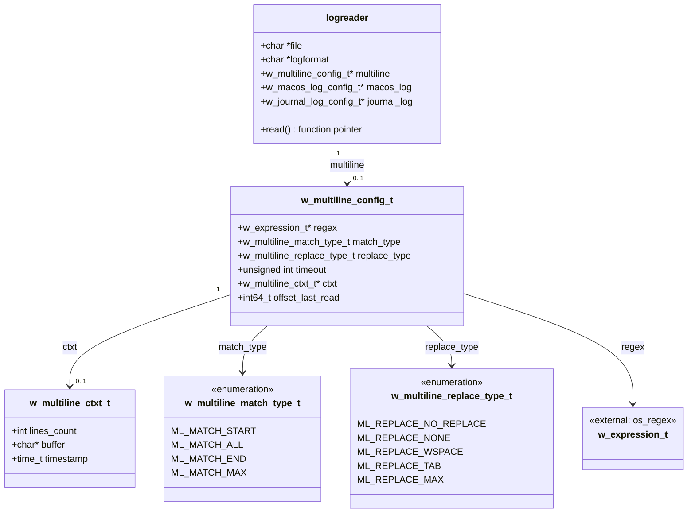
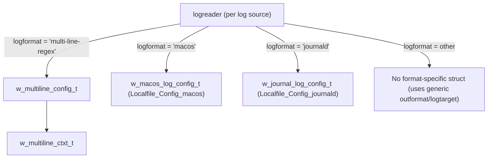
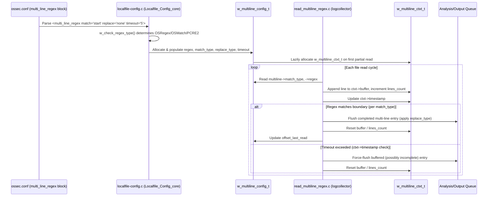
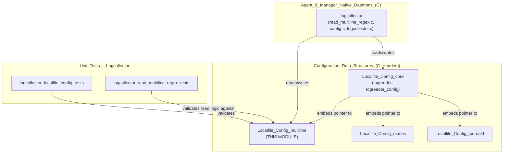

# Localfile_Config_multiline

## Introduction

The **Localfile_Config_multiline** module defines the core data structures used by the Wazuh **Logcollector** daemon to support **multi-line log parsing**. It is a small, highly-focused C header module (`src/config/localfile-config.h`) that models the configuration and runtime state required to read logs whose logical entries span multiple physical lines — a common pattern in application logs, stack traces, and structured log formats (e.g., Java exceptions, multi-line JSON, etc.).

This module does not contain executable logic itself; it purely defines the **data contracts** (`w_multiline_config_t` and `w_multiline_ctxt_t`) that are populated by the configuration parser (`localfile-config.c`) and consumed by the log-reading engine (`src/logcollector/read_multiline_regex.c`, part of the `logcollector` component). Understanding this module is essential for anyone extending or debugging Wazuh's multi-line log collection capability.

---

## 1. Purpose and Core Functionality

When Logcollector reads a log file configured with `<log_format>multi-line-regex</log_format>`, it must decide **where one logical log entry ends and the next begins**, since a single event may occupy several lines in the file. This module provides:

1. **`w_multiline_config_t`** — the *static configuration* for a multi-line log source, derived from the `<multi_line_regex>` XML block in `ossec.conf`. It specifies:
   - The **regex** used to detect entry boundaries (`w_expression_t * regex`).
   - The **match type** (`w_multiline_match_type_t`): whether the regex identifies the **start**, **end**, or **the whole** of an entry.
   - The **replace type** (`w_multiline_replace_type_t`): how newline characters are replaced when lines are concatenated (none, whitespace, tab, or no-replace).
   - A **timeout** value controlling how long Logcollector waits for more lines before flushing a partially-read entry.
   - A pointer to the **runtime context** (`ctxt`) and an **offset** bookkeeping field (`offset_last_read`) used for resuming reads after restarts.

2. **`w_multiline_ctxt_t`** — the *mutable runtime state* tracked while an entry is being accumulated across multiple `read()` calls:
   - `lines_count`: number of lines read so far for the in-progress entry.
   - `buffer`: the accumulated text buffer.
   - `timestamp`: the time of the last successful read, used to detect timeouts and flush stale buffers.

Together, these two structures let Logcollector correctly detect, buffer, and emit multi-line log entries as single, coherent alerts, even when reads are interrupted or a file is being tailed in near-real time.

---

## 2. Architecture and Data Model

### 2.1 Structure Relationships



### 2.2 Position within `logreader`

The `w_multiline_config_t` pointer is one of several optional, format-specific configuration blocks embedded in the parent `logreader` struct (defined in the same header, part of the sibling module `Localfile_Config_core`). Only one of `multiline`, `macos_log`, or `journal_log` is populated per log source, depending on `logformat`:



This module is a **sibling** of:
- `Localfile_Config_core` — defines `logreader`, `logreader_config`, `logtarget`, `outformat` (the base structures this module attaches to).
- `Localfile_Config_macos` — the macOS `log` command analog of multi-line handling.
- `Localfile_Config_journald` — the systemd journal analog.

See `Localfile_Config_core.md`, `Localfile_Config_macos.md`, and `Localfile_Config_journald.md` for those related structures.

---

## 3. Enumerations Explained

### 3.1 `w_multiline_match_type_t`
Determines **which line** of a multi-line entry the configured regex is expected to match:

| Value | Meaning |
|---|---|
| `ML_MATCH_START` | The regex matches the **first line** (header) of a new entry. All subsequent non-matching lines are appended until the next match (or timeout). Default if the `match` attribute is absent. |
| `ML_MATCH_ALL` | The regex must match **every line** for it to be included in the entry — effectively a filter-and-join mode. |
| `ML_MATCH_END` | The regex matches the **last line** (footer) of an entry; lines are buffered until a match closes the entry. |
| `ML_MATCH_MAX` | Sentinel/boundary value (not a valid runtime state) used for validation loops. |

### 3.2 `w_multiline_replace_type_t`
Controls how the newline separators between the physically-distinct lines are represented once joined into a single logical log line:

| Value | Meaning |
|---|---|
| `ML_REPLACE_NO_REPLACE` | Keep the original line endings (no substitution). Default. |
| `ML_REPLACE_NONE` | Strip the newline character entirely (lines are concatenated with nothing in between). |
| `ML_REPLACE_WSPACE` | Replace the newline with a single space (`' '`). |
| `ML_REPLACE_TAB` | Replace the newline with a tab character (`'\t'`). |
| `ML_REPLACE_MAX` | Sentinel/boundary value for validation. |

---

## 4. Data Flow: How the Structures Are Used



### Lifecycle Summary
1. **Configuration parsing**: `localfile-config.c` (in `Localfile_Config_core`) reads the `<multi_line_regex>` XML element and its `match`, `replace`, and `timeout` attributes using helper functions such as `w_get_attr_match`, `w_get_attr_replace`, and `w_get_attr_timeout` (declared in this header, implemented in `localfile-config.c`). The regex type itself (OSRegex/OSMatch/PCRE2) is resolved via `w_check_regex_type`.
2. **Structure allocation**: A `w_multiline_config_t` is allocated and attached to the owning `logreader`. Its `ctxt` field starts `NULL` and is lazily created when the first partial (unterminated) multi-line entry is encountered.
3. **Runtime reading**: The `logcollector` component's `read_multiline_regex.c` reader function consults `match_type` to decide how to test each new line against `regex`, accumulates matched lines into `ctxt->buffer`, and applies `replace_type` when joining lines.
4. **Timeout handling**: If no new line arrives within `timeout` seconds (measured against `ctxt->timestamp`), the reader force-flushes whatever has been buffered, preventing indefinite delay of partial log data.
5. **State persistence**: `offset_last_read` records the file offset of the last fully-processed multi-line entry, supporting resumption after Logcollector restarts (working together with the broader file-status persistence mechanism in `logcollector.c`).
6. **Cleanup**: `w_multiline_log_config_free` releases the regex, context buffer, and the structure itself; `w_multiline_log_config_clone` performs a deep copy (used when merging/duplicating log source configurations, e.g., for glob-expanded paths).

---

## 5. Key Declared Functions (Implemented in `localfile-config.c`)

While this module (per the module tree) covers only the header declarations `w_multiline_config_t` and `w_multiline_ctxt_t`, the header also declares the functions that operate on them. These are implemented in the sibling `Localfile_Config_core` module's `localfile-config.c` file:

| Function | Responsibility |
|---|---|
| `w_multiline_log_config_free` | Frees a `w_multiline_config_t*` and its nested `regex`/`ctxt`, nulling the pointer. |
| `w_multiline_log_config_clone` | Deep-clones a `w_multiline_config_t*`, including regex recompilation, for use in duplicated log-reader entries (e.g., glob expansion). |
| `w_get_attr_match` | Parses the `match` XML attribute into a `w_multiline_match_type_t`. |
| `w_get_attr_replace` | Parses the `replace` XML attribute into a `w_multiline_replace_type_t`. |
| `w_get_attr_timeout` | Parses the `timeout` XML attribute (bounded by `MULTI_LINE_REGEX_TIMEOUT` default and `MULTI_LINE_REGEX_MAX_TIMEOUT` ceiling). |
| `multiline_attr_match_str` / `multiline_attr_replace_str` | Convert enum values back to their string representation (used for config dump/serialization, e.g., `GET /localfile/config` API responses). |

---

## 6. Relevant Constants

Defined alongside the structures in `localfile-config.h`:

| Constant | Value | Purpose |
|---|---|---|
| `MULTI_LINE_REGEX` | `"multi-line-regex"` | The `logformat` string value that activates this configuration path. |
| `MULTI_LINE_REGEX_TIMEOUT` | `5` | Default timeout (seconds) before flushing an incomplete multi-line buffer. |
| `MULTI_LINE_REGEX_MAX_TIMEOUT` | `120` | Maximum allowed configured timeout. |

---

## 7. System Context and Module Relationships



### How This Module Fits the Overall System
- **Upstream dependency**: This module depends on `w_expression_t` (declared in `src/headers/expression.h`, part of `Agent_&_Manager_Native_Daemons_(C) → headers`) for its regex abstraction, and on `xml_node` (from `src/os_xml/os_xml.h`, part of `os_xml`) for the config-parsing function signatures declared alongside it.
- **Downstream consumers**:
  - The **`logcollector`** daemon (`Agent_&_Manager_Native_Daemons_(C) → logcollector`) is the primary runtime consumer — specifically `read_multiline_regex.c`, `logcollector.c` (state save/load), and `lccom.c` (control-socket config dump).
  - **Unit tests** in `Unit_Tests_-_Logcollector` (`logcollector_localfile_config_tests` and `logcollector_read_multiline_regex_tests`) directly exercise this module's structures and the associated parsing/free/clone functions.
- **Sibling structures**: `w_macos_log_config_t` and `w_journal_log_config_t` follow an analogous "config + runtime context" pattern for their respective log formats, documented in `Localfile_Config_macos.md` and `Localfile_Config_journald.md`.
- **Parent module**: For the full `logreader` structure that embeds `w_multiline_config_t`, and for the shared `outformat`/`logtarget` types, see `Localfile_Config_core.md`.
- **Top-level context**: For how Logcollector's configuration fits into the broader Wazuh agent/manager configuration system (alongside `active-response`, `client-config`, `syscheck-config`, etc.), see `Configuration_Data_Structures_(C_Headers).md`.

---

## 8. Practical Example

A typical `ossec.conf` snippet that populates a `w_multiline_config_t` instance:

```xml
<localfile>
  <log_format>multi-line-regex</log_format>
  <location>/var/log/app/app.log</location>
  <multi_line_regex match="start" replace="wspace" timeout="10">^\d{4}-\d{2}-\d{2}</multi_line_regex>
</localfile>
```

Resulting configuration semantics:
- `match_type = ML_MATCH_START` — any line beginning with a date (`YYYY-MM-DD`) starts a new entry; all following non-matching lines belong to it.
- `replace_type = ML_REPLACE_WSPACE` — line breaks within an entry become spaces in the final joined string.
- `timeout = 10` — if no new line arrives within 10 seconds, the buffered (possibly incomplete) entry is flushed as-is.

---

## 9. Summary

| Aspect | Description |
|---|---|
| **Language** | C (header-only definitions) |
| **File** | `src/config/localfile-config.h` |
| **Core Types** | `w_multiline_config_t`, `w_multiline_ctxt_t` |
| **Supporting Enums** | `w_multiline_match_type_t`, `w_multiline_replace_type_t` |
| **Primary Consumer** | Logcollector daemon (`src/logcollector`) |
| **Configuration Source** | `<multi_line_regex>` XML block under `<localfile>` in `ossec.conf` |
| **Related Modules** | `Localfile_Config_core`, `Localfile_Config_macos`, `Localfile_Config_journald` |
| **Test Coverage** | `logcollector_localfile_config_tests`, `logcollector_read_multiline_regex_tests` |
