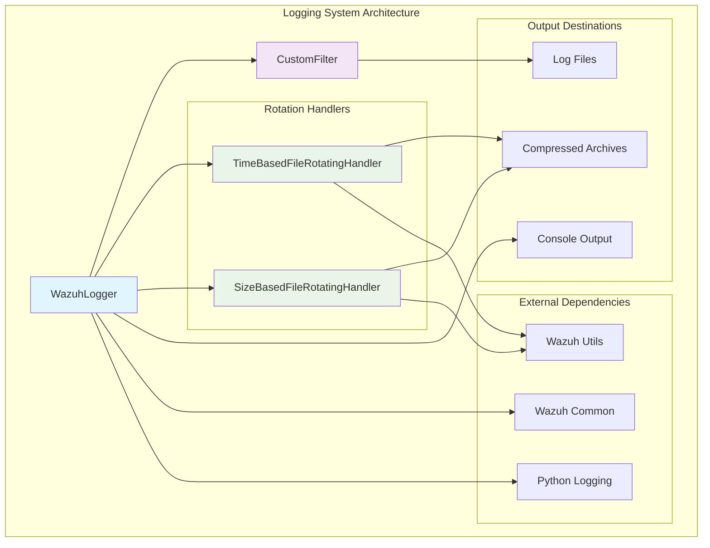
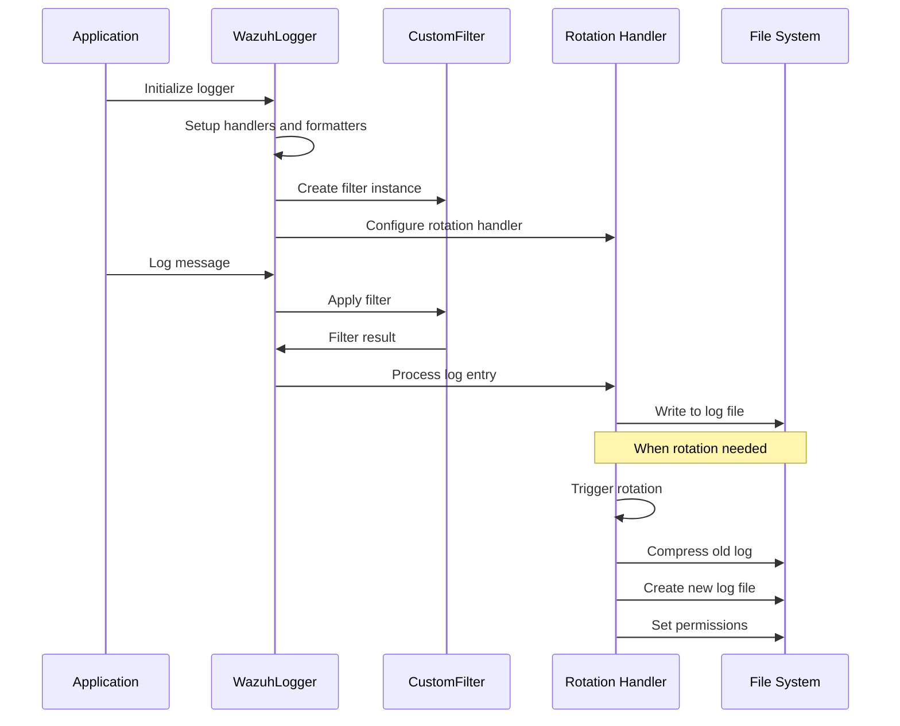
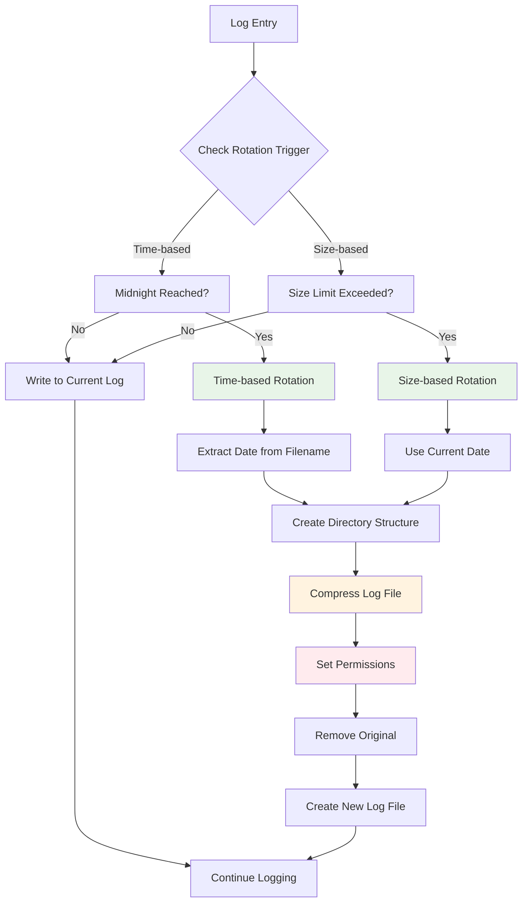

# Logging System

The Logging System module provides a comprehensive, enterprise-grade logging infrastructure for the Wazuh security platform. It extends Python's standard logging capabilities with specialized features for security monitoring, including intelligent log rotation, compression, filtering, and structured logging support.

## Overview

The Logging System serves as the central logging infrastructure for all Wazuh components, providing:

- **Intelligent Log Rotation**: Time-based and size-based rotation strategies with automatic compression
- **Structured Logging**: Support for both traditional text logs and JSON-formatted structured logs
- **Security-Focused Features**: Proper file permissions, organized storage, and filtering capabilities
- **Multi-Handler Support**: Simultaneous file and console logging with different formatting
- **Enhanced Debug Levels**: Extended debugging capabilities with custom DEBUG2 level

## Architecture



## Core Components

### WazuhLogger

The main logger class that orchestrates all logging functionality for Wazuh daemons and services.

**Key Features:**
- Configurable rotation strategies (time-based or size-based)
- Support for custom formatters and filters
- Foreground/background mode operation
- Enhanced error logging with automatic exception info
- Custom DEBUG2 level for detailed debugging

**Configuration Options:**
- `foreground_mode`: Enable console output alongside file logging
- `log_path`: Target log file path (relative to Wazuh installation)
- `debug_level`: Logging verbosity level
- `max_size`: Maximum log file size before rotation (0 = time-based rotation)
- `custom_formatter`: Optional custom log message formatter

### TimeBasedFileRotatingHandler

Handles log rotation based on time intervals (default: midnight rotation).

**Features:**
- Automatic rotation at midnight
- Organized storage in year/month directory structure
- Gzip compression of rotated logs
- Secure file permissions (0o640 for archives, 0o750 for directories)
- Intelligent directory creation

**Directory Structure:**
```
logs/
├── api/
│   ├── 2024/
│   │   ├── Jan/
│   │   │   ├── api-01.gz
│   │   │   └── api-02.gz
│   │   └── Feb/
│   └── current.log
```

### SizeBasedFileRotatingHandler

Handles log rotation based on file size limits.

**Features:**
- Rotation when file exceeds configured size limit
- Automatic iteration numbering for same-day rotations
- Same compression and permission model as time-based rotation
- Organized storage with date-based naming

**Naming Convention:**
```
api-01_1.gz  # First rotation on day 01
api-01_2.gz  # Second rotation on day 01
```

### CustomFilter

Provides log type differentiation and filtering capabilities.

**Functionality:**
- Filters logs based on log type ('log' or 'json')
- Supports multiple output formats simultaneously
- Enables selective logging to different handlers

## Component Interactions



## Integration with Wazuh Ecosystem

The Logging System integrates with multiple Wazuh modules:

### API Framework Integration
- **API Logger**: Uses `WazuhJsonFormatter` for structured API logs
- **Middleware Logging**: Integrates with [API Framework](API Framework.md) middleware components
- **Access Logging**: Supports `WazuhAccessLoggerMiddleware` for request tracking

### Cluster Management Integration
- **Distributed Logging**: Supports [Cluster Management](Cluster Management.md) logging across nodes
- **Synchronization Logs**: Tracks cluster synchronization activities
- **Node Communication**: Logs inter-node communication events

### Security Module Integration
- **RBAC Logging**: Integrates with [RBAC Security](RBAC Security.md) for authentication events
- **Security Events**: Logs security-related activities and violations
- **Audit Trail**: Maintains comprehensive audit logs

## Log Rotation Process



## Configuration Examples

### Basic Logger Setup
```python
from framework.wazuh.core.wlogging import WazuhLogger

# Time-based rotation (default)
logger = WazuhLogger(
    foreground_mode=False,
    log_path='logs/api/api.log',
    debug_level='INFO',
    logger_name='wazuh-api'
)
logger.setup_logger()
```

### Size-based Rotation
```python
# Size-based rotation (10MB limit)
logger = WazuhLogger(
    foreground_mode=True,
    log_path='logs/cluster/cluster.log',
    debug_level='DEBUG',
    logger_name='wazuh-cluster',
    max_size=10485760  # 10MB
)
logger.setup_logger()
```

### Custom Formatter
```python
from framework.wazuh.core.wlogging import WazuhLogger
import logging

class CustomFormatter(logging.Formatter):
    def format(self, record):
        # Custom formatting logic
        return super().format(record)

logger = WazuhLogger(
    foreground_mode=False,
    log_path='logs/custom/custom.log',
    debug_level='DEBUG2',
    custom_formatter=CustomFormatter
)
logger.setup_logger()
```

## Security Features

### File Permissions
- **Log Files**: Standard permissions for active logs
- **Compressed Archives**: Restricted permissions (0o640)
- **Directories**: Secure directory permissions (0o750)

### Log Isolation
- **Type-based Filtering**: Separate handling for different log types
- **Component Isolation**: Each component can have dedicated loggers
- **Access Control**: Proper file system permissions prevent unauthorized access

## Performance Considerations

### Compression Benefits
- **Storage Efficiency**: Gzip compression reduces storage requirements
- **I/O Optimization**: Compressed archives reduce disk I/O for historical logs
- **Network Transfer**: Compressed logs are more efficient for log forwarding

### Rotation Strategies
- **Time-based**: Predictable rotation schedule, suitable for consistent load
- **Size-based**: Responsive to actual log volume, prevents oversized files
- **Hybrid Approach**: Can be combined based on specific requirements

## Troubleshooting

### Common Issues

1. **Permission Errors**
   - Ensure Wazuh process has write access to log directories
   - Check directory permissions (should be 0o750)

2. **Rotation Failures**
   - Verify disk space availability
   - Check for file locks on log files
   - Ensure proper directory structure exists

3. **Missing Logs**
   - Verify log level configuration
   - Check filter settings
   - Ensure logger is properly initialized

### Debug Logging
```python
# Enable enhanced debugging
logger = WazuhLogger(
    foreground_mode=True,
    log_path='logs/debug/debug.log',
    debug_level='DEBUG2',  # Enhanced debug level
    logger_name='debug-logger'
)
logger.setup_logger()

# Use enhanced debug logging
logger.debug2("Detailed debug information")
```

## Dependencies

### Internal Dependencies
- **[Core Framework](Core Framework.md)**: Common utilities and constants
- **Wazuh Utils**: Directory creation and permission management

### External Dependencies
- **Python Logging**: Standard library logging framework
- **Python Standard Library**: os, glob, gzip, shutil, calendar, datetime, re

## Best Practices

### Logger Configuration
1. **Use Appropriate Log Levels**: Configure based on environment (production vs. development)
2. **Choose Rotation Strategy**: Time-based for predictable loads, size-based for variable loads
3. **Enable Foreground Mode**: For development and debugging scenarios
4. **Custom Formatters**: Use for specialized logging requirements

### Log Management
1. **Monitor Disk Usage**: Implement log retention policies
2. **Regular Cleanup**: Archive or remove old compressed logs
3. **Security Auditing**: Regularly review log access and permissions
4. **Performance Monitoring**: Monitor logging performance impact

### Integration Guidelines
1. **Consistent Naming**: Use descriptive logger names for different components
2. **Filter Usage**: Implement appropriate filters for log type separation
3. **Error Handling**: Ensure proper error logging with exception information
4. **Documentation**: Document custom formatters and filters

The Logging System provides a robust foundation for all logging needs within the Wazuh ecosystem, ensuring reliable, secure, and efficient log management across all platform components.