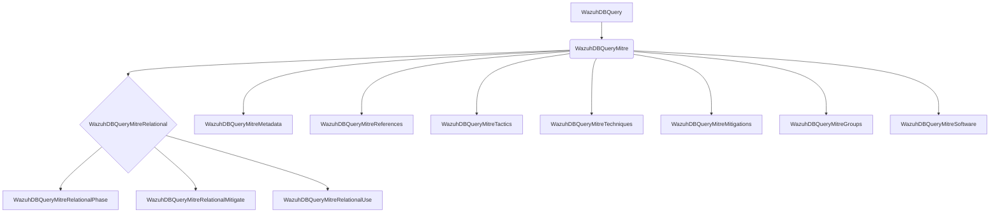
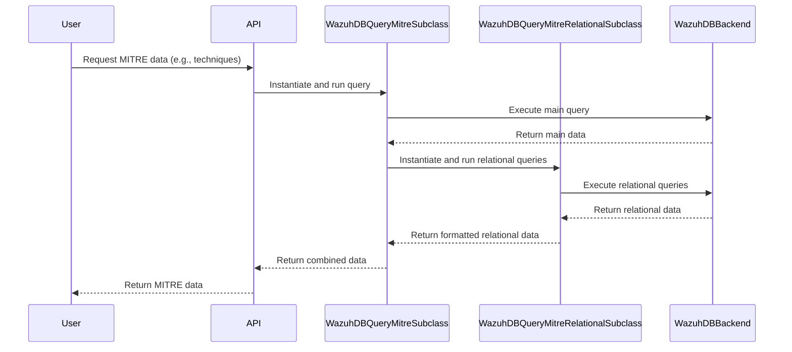
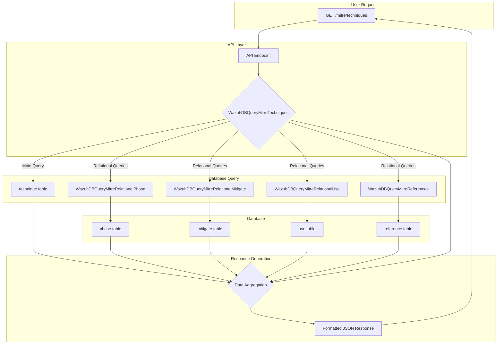

# MITRE ATT&CK Integration

The MITRE ATT&CK Integration module provides a comprehensive framework for querying and retrieving information from the Wazuh database related to the MITRE ATT&CK framework. This module allows users to explore relationships between different ATT&CK entities, such as techniques, tactics, mitigations, groups, and software.

## Architecture

The module is designed around a set of specialized classes that inherit from a common base class, `WazuhDBQueryMitre`. This base class extends the functionality of the [Core Framework's](Core-Framework.md) `WazuhDBQuery` to interact with the Wazuh database using a MITRE-specific query format.

### Component Interaction

The following diagram illustrates how the different components interact to retrieve and format MITRE ATT&CK data.

## Core Components

The module is composed of the following core components:

### `WazuhDBQueryMitre`

This is the base class for all MITRE-related database queries. It inherits from `WazuhDBQuery` and configures the `WazuhDBBackend` to use the `mitre` query format. It also introduces the concept of `relation_fields`, which are fields that are not directly in the database but are computed based on relationships between different MITRE entities.

### `WazuhDBQueryMitreRelational`

This abstract class is the base for handling many-to-many relationships between MITRE entities. It provides a common interface for querying and formatting relational data.

- **`WazuhDBQueryMitreRelationalPhase`**:  Handles the relationship between techniques and tactics.
- **`WazuhDBQueryMitreRelationalMitigate`**: Handles the relationship between techniques and mitigations.
- **`WazuhDBQueryMitreRelationalUse`**: Handles the relationship between techniques, groups, and software.

### Main Entity Query Classes

These classes are responsible for querying the main MITRE entities. They use the relational query classes to fetch and embed related information.

- **`WazuhDBQueryMitreTactics`**: Queries MITRE tactics and their related techniques and references.
- **`WazuhDBQueryMitreTechniques`**: Queries MITRE techniques and their related tactics, mitigations, software, groups, and references.
- **`WazuhDBQueryMitreMitigations`**: Queries MITRE mitigations and their related techniques and references.
- **`WazuhDBQueryMitreGroups`**: Queries MITRE groups and their related software, techniques, and references.
- **`WazuhDBQueryMitreSoftware`**: Queries MITRE software and their related groups, techniques, and references.

### Other Components

- **`WazuhDBQueryMitreMetadata`**: Queries metadata about the MITRE ATT&CK data in the database.
- **`WazuhDBQueryMitreReferences`**: Queries the references associated with MITRE entities.

## Data Flow

The following diagram shows the data flow when a user requests information about MITRE techniques.

## External Dependencies

- **[Core Framework](Core-Framework.md)**: The MITRE ATT&CK Integration module relies on the `WazuhDBQuery` and `WazuhDBBackend` classes from the Core Framework to interact with the Wazuh database.
