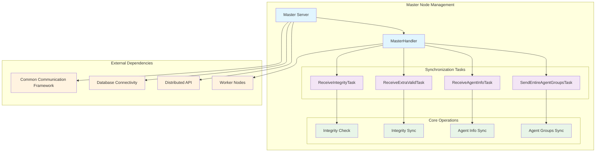
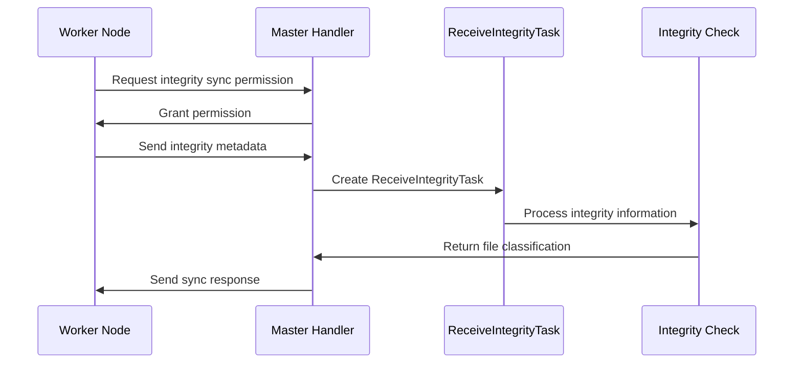
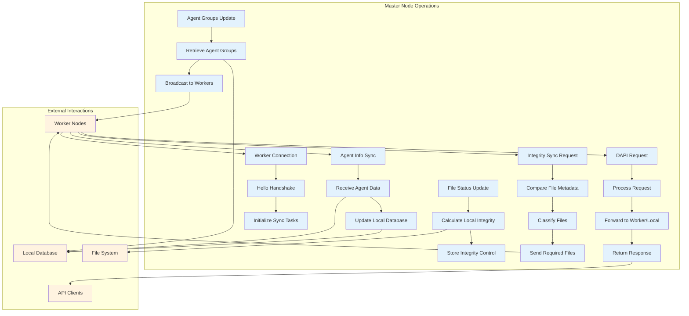
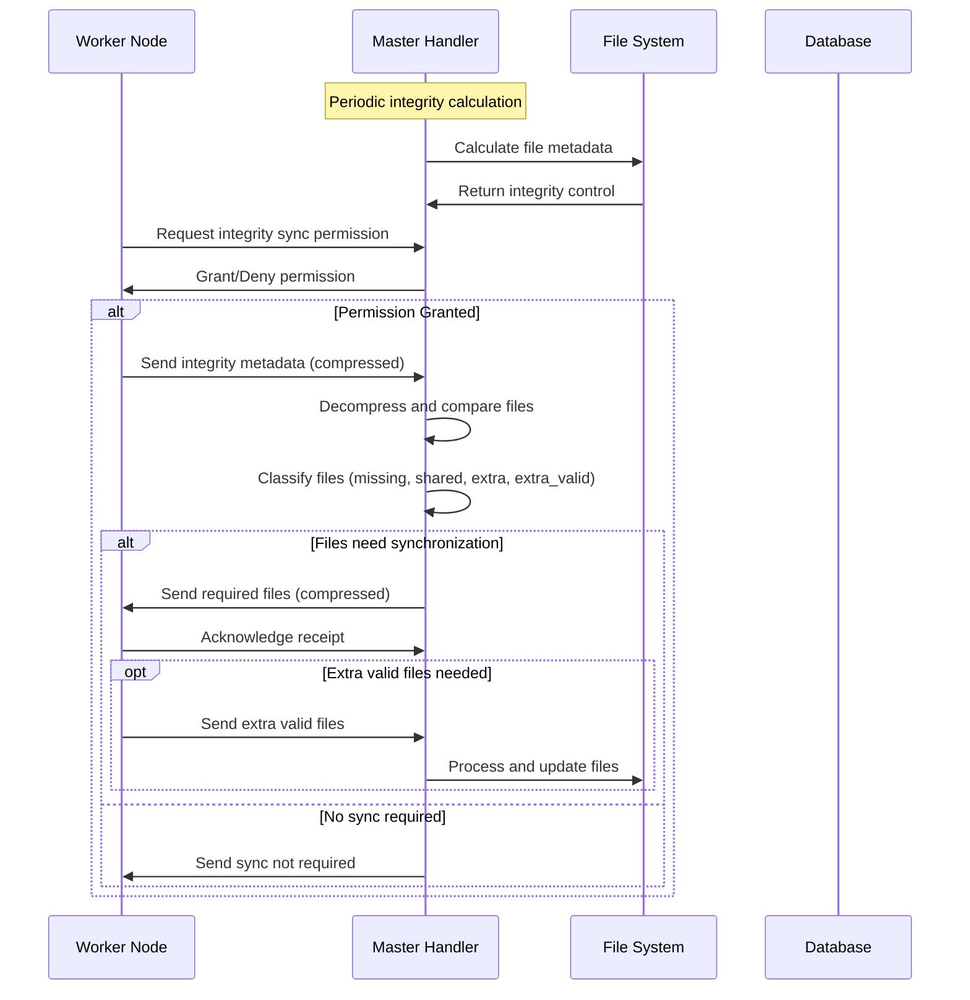
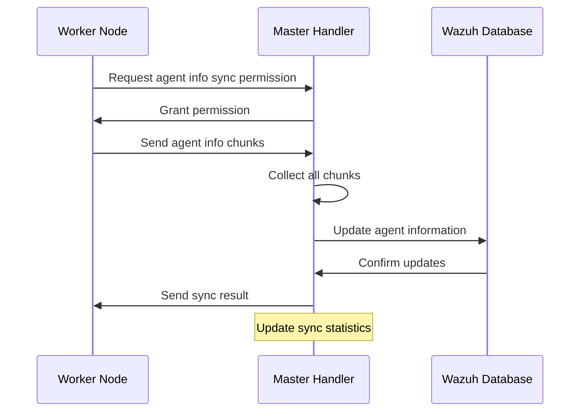
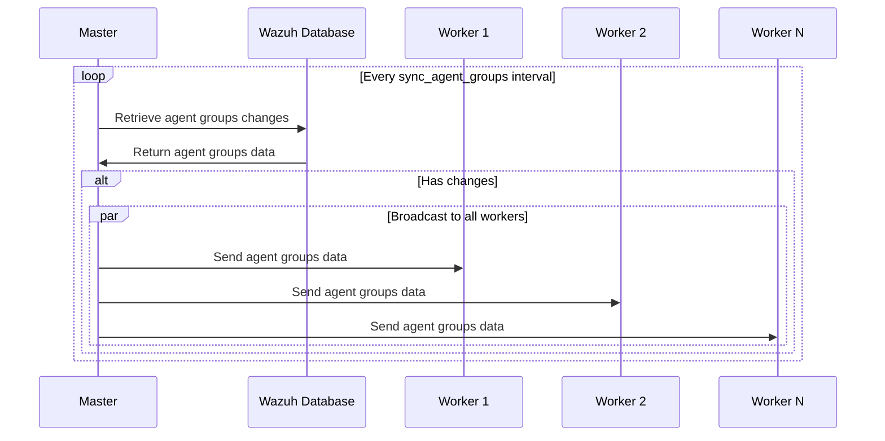

# Master Node Management

The Master Node Management module is a critical component of Wazuh's cluster architecture that handles the coordination and synchronization of worker nodes in a distributed security monitoring environment. This module implements the master node functionality, managing file integrity, agent information synchronization, and distributed API operations across the cluster.

## Overview

The Master Node Management module serves as the central coordination point in Wazuh's cluster architecture. It manages multiple worker nodes, handles synchronization processes, and ensures data consistency across the distributed system. The module implements sophisticated task management, file synchronization protocols, and real-time communication mechanisms to maintain cluster integrity and performance.

## Architecture



## Core Components

### Master Server (`Master`)

The main server class that orchestrates cluster operations and manages worker connections.

**Key Responsibilities:**
- Initialize and manage the cluster server infrastructure
- Handle multiple worker node connections
- Coordinate distributed API requests
- Manage file integrity monitoring
- Oversee agent group synchronization

**Key Features:**
- Process pool management for parallel operations
- Integrity control system for file monitoring
- Distributed API request queue management
- Health monitoring and status reporting

### Master Handler (`MasterHandler`)

Handles individual worker node connections and manages synchronization processes.

**Key Responsibilities:**
- Process incoming requests from worker nodes
- Manage synchronization task lifecycles
- Handle file and data transfer operations
- Coordinate distributed API responses

**Synchronization Status Tracking:**
- Integrity check status and timing
- Integrity sync progress and metrics
- Agent information sync statistics
- Agent groups synchronization status

### Synchronization Tasks

#### ReceiveIntegrityTask
Manages the reception and processing of integrity information from worker nodes.



#### ReceiveExtraValidTask
Handles the reception of extra valid files during integrity synchronization.

#### ReceiveAgentInfoTask
Manages the reception and processing of agent information from worker nodes.

#### SendEntireAgentGroupsTask
Coordinates the transmission of complete agent group information to worker nodes.

## Data Flow



## Process Flows

### Integrity Synchronization Process



### Agent Information Synchronization



### Agent Groups Broadcasting



## Component Interactions

### Master-Worker Communication Protocol

The master node implements a sophisticated communication protocol with worker nodes:

1. **Connection Establishment**: Workers connect and perform handshake
2. **Permission Management**: Master controls sync process permissions
3. **Data Transfer**: Efficient file and data synchronization
4. **Error Handling**: Robust error recovery and reporting
5. **Keep-Alive Monitoring**: Connection health monitoring

### Distributed API Integration

The master node integrates with the [Distributed API](Distributed%20API.md) module to:
- Queue and process API requests from workers
- Forward requests to appropriate nodes
- Aggregate and return responses
- Handle request timeouts and errors

### Database Integration

Integration with [Database Connectivity](Database%20Connectivity.md) for:
- Agent information synchronization
- Agent groups management
- Integrity metadata storage
- Cluster status tracking

## Configuration and Tuning

### Key Configuration Parameters

- **Process Pool Size**: Controls parallel processing capacity
- **Sync Intervals**: Timing for various synchronization processes
- **Timeout Values**: Request and operation timeout settings
- **Compression Limits**: File transfer optimization parameters

### Performance Optimization

- **Adaptive Zip Limits**: Dynamic adjustment of transfer sizes
- **Process Pool Management**: Efficient resource utilization
- **Connection Pooling**: Optimized worker connection handling
- **Memory Management**: Efficient handling of large data transfers

## Error Handling and Recovery

### Synchronization Error Recovery

- **Task Cancellation**: Graceful handling of interrupted tasks
- **File Cleanup**: Automatic cleanup of temporary files
- **Permission Reset**: Automatic release of stuck permissions
- **Connection Recovery**: Robust handling of connection failures

### Monitoring and Diagnostics

- **Health Check Endpoints**: Real-time cluster health monitoring
- **Sync Status Tracking**: Detailed synchronization metrics
- **Performance Metrics**: Transfer speeds and processing times
- **Error Logging**: Comprehensive error tracking and reporting

## Security Considerations

### Access Control

- **Node Authentication**: Secure worker node authentication
- **Permission Management**: Controlled access to sync operations
- **SSL/TLS Support**: Encrypted communication channels

### Data Integrity

- **File Verification**: Checksum-based integrity verification
- **Atomic Operations**: Consistent data updates
- **Rollback Capabilities**: Error recovery mechanisms

## Dependencies

### Internal Dependencies

- **[Common Communication Framework](Common%20Communication%20Framework.md)**: Base communication protocols
- **[Database Connectivity](Database%20Connectivity.md)**: Database operations
- **[Distributed API](Distributed%20API.md)**: API request handling
- **[Core Framework](Core%20Framework.md)**: Fundamental utilities

### External Dependencies

- **AsyncIO**: Asynchronous I/O operations
- **ProcessPoolExecutor**: Parallel processing
- **SSL/TLS**: Secure communications
- **File System**: Local file operations

## Usage Examples

### Basic Master Node Initialization

```python
# Initialize master node with configuration
master = Master(
    performance_test=0,
    concurrency_test=0,
    configuration=cluster_config,
    cluster_items=cluster_items,
    enable_ssl=True,
    logger=logger
)

# Start the master server
await master.start()
```

### Health Monitoring

```python
# Get cluster health information
health_info = master.get_health(filter_node=None)

# Get connected nodes information
nodes_info = master.get_connected_nodes(
    filter_type='worker',
    limit=100
)
```

## Best Practices

### Deployment Considerations

1. **Resource Planning**: Ensure adequate CPU and memory for process pools
2. **Network Configuration**: Optimize network settings for cluster communication
3. **Storage Management**: Plan for temporary file storage during sync operations
4. **Monitoring Setup**: Implement comprehensive cluster monitoring

### Operational Guidelines

1. **Regular Health Checks**: Monitor cluster health and sync status
2. **Performance Tuning**: Adjust sync intervals based on cluster size
3. **Error Monitoring**: Set up alerts for sync failures and errors
4. **Capacity Planning**: Scale resources based on cluster growth

## Troubleshooting

### Common Issues

1. **Sync Permission Locks**: Automatic release after timeout
2. **File Transfer Failures**: Retry mechanisms and error reporting
3. **Worker Disconnections**: Connection monitoring and recovery
4. **Database Sync Issues**: Error handling and rollback procedures

### Diagnostic Tools

- **Cluster Status Commands**: Real-time status information
- **Log Analysis**: Detailed logging for troubleshooting
- **Performance Metrics**: Transfer and processing statistics
- **Health Endpoints**: API-based health monitoring

The Master Node Management module is essential for maintaining a robust, scalable, and efficient Wazuh cluster deployment, providing the coordination and synchronization capabilities necessary for distributed security monitoring operations.