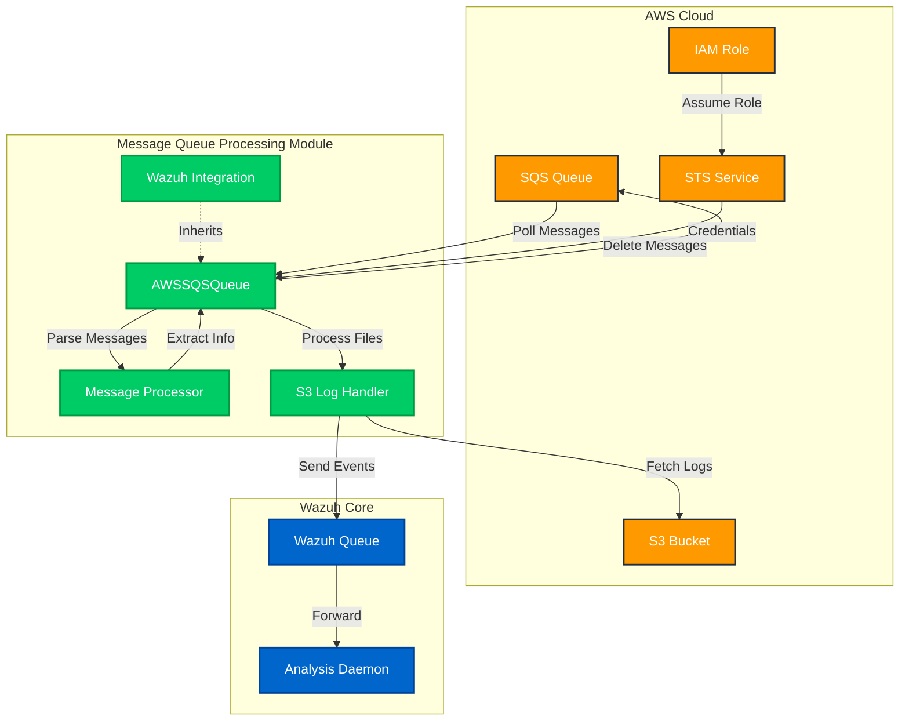
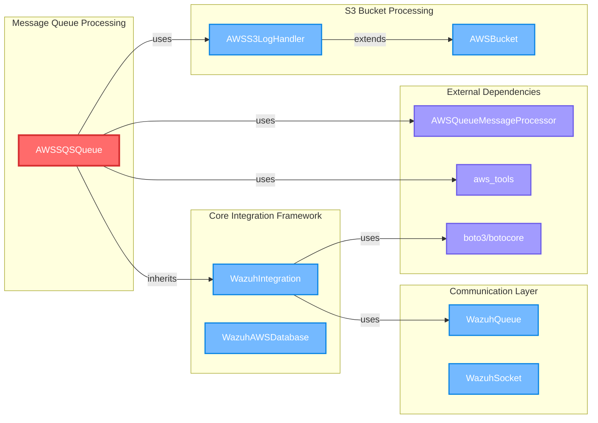
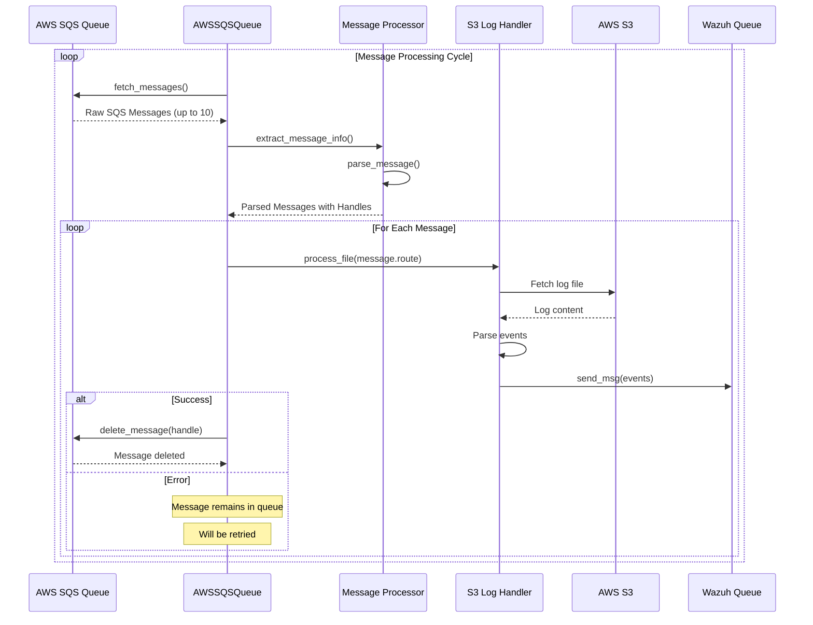
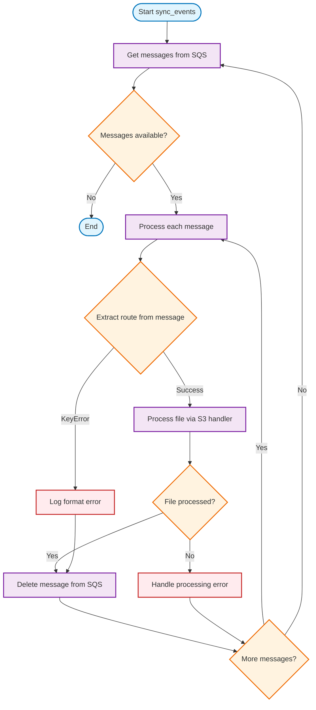

# Message Queue Processing

## Overview

The Message Queue Processing module provides AWS SQS (Simple Queue Service) integration capabilities for the Wazuh security platform. This module enables real-time processing of AWS security events by consuming messages from SQS queues, parsing their content, and forwarding relevant security data to Wazuh's analysis engine. It serves as a critical component in cloud-native security monitoring architectures where AWS services publish security events to SQS queues for downstream processing.

The module implements an event-driven architecture that continuously polls SQS queues for new messages, processes them through configurable message processors, and ensures reliable delivery to Wazuh's analysis pipeline while maintaining message acknowledgment and error handling capabilities.

## Architecture



## Component Dependencies



## Core Components

### AWSSQSQueue

The primary class responsible for AWS SQS queue integration and message processing orchestration.

**Key Responsibilities:**
- **Queue Management**: Establishes connection to AWS SQS queues using IAM roles or credentials
- **Message Polling**: Continuously retrieves messages from SQS queues with configurable batch sizes
- **Message Processing**: Coordinates message parsing and event extraction through pluggable processors
- **Error Handling**: Implements retry logic and error recovery mechanisms
- **Message Acknowledgment**: Ensures proper message deletion after successful processing

**Configuration Parameters:**
- `name`: SQS queue name for message retrieval
- `iam_role_arn`: IAM role for secure AWS service access
- `message_processor`: Pluggable message parsing implementation
- `bucket_handler`: S3 log processing handler for file-based events
- `skip_on_error`: Error handling behavior configuration

## Data Flow



## Message Processing Workflow



## Integration Points

### AWS Services Integration
- **SQS Service**: Primary message queue interface for event consumption
- **S3 Service**: Secondary integration for log file retrieval and processing
- **IAM/STS**: Authentication and authorization through role assumption
- **CloudWatch**: Potential integration for monitoring and metrics

### Wazuh Core Integration
- **[Communication Layer](Communication Layer.md)**: Uses WazuhQueue for event forwarding
- **[Core Integration Framework](Core Integration Framework.md)**: Inherits from WazuhIntegration base class
- **[S3 Bucket Processing](S3 Bucket Processing.md)**: Leverages S3 log handlers for file processing
- **[Database Connectivity](Database Connectivity.md)**: Potential integration for state management

### External Dependencies
- **boto3/botocore**: AWS SDK for Python providing SQS client functionality
- **Message Processors**: Pluggable components for parsing different message formats
- **Log Handlers**: Specialized processors for various AWS service log formats

## Configuration

### Basic SQS Queue Configuration
```python
sqs_queue = AWSSQSQueue(
    name="security-events-queue",
    iam_role_arn="arn:aws:iam::123456789012:role/WazuhSQSRole",
    message_processor=CustomMessageProcessor,
    bucket_handler=S3LogHandler,
    profile="wazuh-profile",
    skip_on_error=True
)
```

### Advanced Configuration Options
- **Authentication**: Support for IAM roles, profiles, and direct credentials
- **Regional Configuration**: Multi-region SQS queue support
- **Error Handling**: Configurable error recovery and skip behaviors
- **Message Processing**: Pluggable message processors for different event formats
- **Batch Processing**: Configurable message batch sizes (up to 10 messages)

## Error Handling and Resilience

### Message Processing Errors
- **Format Validation**: Handles malformed messages gracefully
- **Route Extraction**: Validates message structure before processing
- **File Processing**: Manages S3 access errors and file format issues

### Queue Management Errors
- **Connection Failures**: Automatic retry with exponential backoff
- **Authentication Issues**: Clear error reporting for credential problems
- **Queue Availability**: Handles queue deletion or access permission changes

### Recovery Mechanisms
- **Message Retention**: Failed messages remain in SQS for retry
- **Dead Letter Queues**: Support for DLQ configuration for persistent failures
- **Skip on Error**: Configurable behavior to continue processing despite errors

## Performance Considerations

### Throughput Optimization
- **Batch Processing**: Retrieves up to 10 messages per API call
- **Long Polling**: Uses 20-second wait times to reduce API calls
- **Concurrent Processing**: Single-threaded but efficient message handling

### Resource Management
- **Connection Pooling**: Reuses AWS client connections
- **Memory Efficiency**: Streams large log files without full memory loading
- **Queue Cleanup**: Automatic message deletion after successful processing

### Monitoring and Metrics
- **Debug Logging**: Comprehensive logging at multiple verbosity levels
- **Processing Statistics**: Message counts and processing times
- **Error Tracking**: Detailed error reporting and categorization

## Security Features

### AWS Authentication
- **IAM Role Assumption**: Secure credential management through STS
- **External ID Support**: Additional security layer for cross-account access
- **Session Duration Control**: Configurable credential lifetime management

### Data Protection
- **In-Transit Encryption**: HTTPS/TLS for all AWS API communications
- **Message Integrity**: Ensures message content integrity during processing
- **Access Control**: Leverages AWS IAM for fine-grained permissions

## Usage Examples

### Basic Message Queue Processing
```python
# Initialize SQS queue processor
queue_processor = AWSSQSQueue(
    name="wazuh-security-events",
    iam_role_arn="arn:aws:iam::account:role/WazuhRole",
    message_processor=SecurityEventProcessor,
    bucket_handler=SecurityLogHandler
)

# Start processing messages
queue_processor.sync_events()
```

### Custom Message Processing
```python
class CustomMessageProcessor(AWSQueueMessageProcessor):
    def parse_message(self, message: dict) -> dict:
        # Custom parsing logic for specific message formats
        return {
            'route': message['Records'][0]['s3']['object']['key'],
            'bucket': message['Records'][0]['s3']['bucket']['name'],
            'timestamp': message['Records'][0]['eventTime']
        }
```

## Related Documentation

- **[Core Integration Framework](Core Integration Framework.md)**: Base integration patterns and authentication
- **[S3 Bucket Processing](S3 Bucket Processing.md)**: Log file processing and event extraction
- **[Communication Layer](Communication Layer.md)**: Event forwarding and queue management
- **[AWS Integration](AWS Integration.md)**: Complete AWS integration architecture
- **[Database Connectivity](Database Connectivity.md)**: State management and persistence

## Troubleshooting

### Common Issues
1. **Queue Not Found**: Verify queue name and AWS account permissions
2. **Authentication Failures**: Check IAM role configuration and external ID
3. **Message Format Errors**: Validate message processor implementation
4. **Processing Delays**: Monitor SQS queue depth and processing capacity

### Debug Configuration
Enable detailed logging by setting appropriate debug levels in the AWS tools configuration to trace message processing flow and identify bottlenecks or errors.