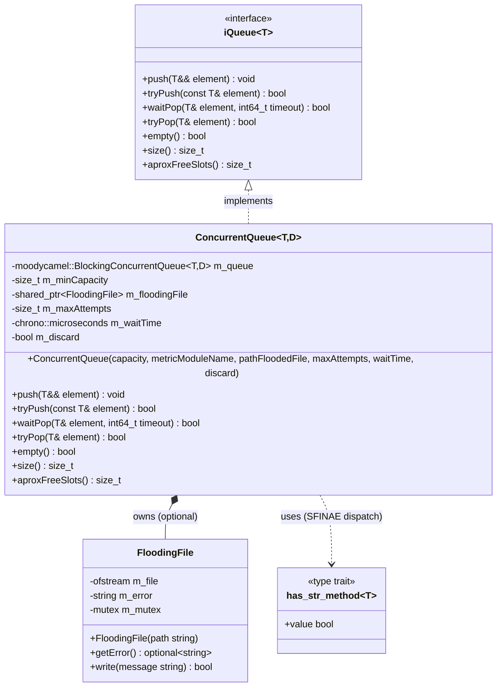
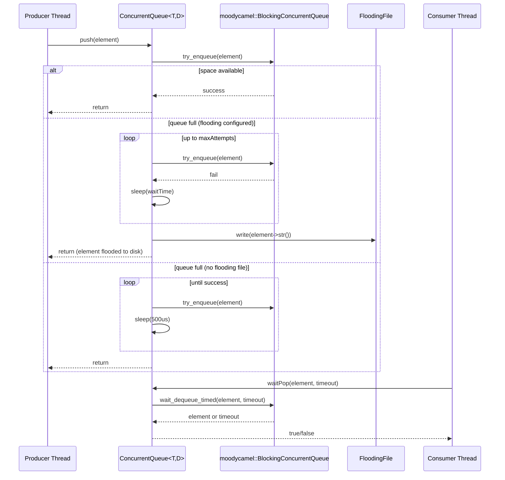

# Queue Module

## 1. Purpose

The **Queue** module is a small, self-contained C++ library that lives inside the [Wazuh Engine Core (C++)](Wazuh_Engine_Core_(C++).md) source tree (`src/engine/source/queue`). It provides a **generic, thread-safe, blocking concurrent queue abstraction** that is used throughout the engine to decouple producer and consumer threads — most notably between the event ingestion path and the [Router](Router.md) orchestrator that dispatches events to the analysis pipeline.

Its responsibilities are:

- Define a minimal, implementation-agnostic **queue interface** (`iQueue<T>`) that the rest of the engine depends on, allowing the concrete queue implementation to be swapped or mocked in tests.
- Provide a concrete, production-ready implementation (`ConcurrentQueue<T, D>`) built on top of the third-party `moodycamel::BlockingConcurrentQueue`, adding:
  - Bounded capacity with back-pressure (blocking) semantics.
  - Optional **"flooding" behavior**: when the queue is saturated, instead of blocking forever, events can be dumped to disk (a *flooding file*) after a configurable number of retries, preventing producer threads from stalling indefinitely.
  - Optional **discard mode**: silently drop elements that cannot be enqueued after a few attempts (no disk write), useful for best-effort/low-priority pipelines.
  - Basic instrumentation hooks (currently disabled/commented pending unification with the metrics subsystem) for observing queue occupancy, throughput, and flooding rate.

Because it only depends on the `base` utilities (logging) and a header-only third-party library, the Queue module is intentionally lightweight and can be reused by any engine component that needs a producer/consumer buffer (event pipeline stages, the [Router](Router.md), test harnesses, etc.).

## 2. Architecture Overview

The module is composed of exactly two headers:

| File | Core Components | Role |
|---|---|---|
| `interface/queue/iqueue.hpp` | `iQueue<T>` | Abstract interface describing the operations any queue implementation must support. |
| `include/queue/concurrentQueue.hpp` | `ConcurrentQueue<T, D>`, `FloodingFile`, `has_str_method` | Concrete, production implementation of `iQueue<T>` plus supporting utilities. |

### Design notes

- **Interface segregation**: `iQueue<T>` exposes only the operations that consumers of the queue actually need (`push`, `tryPush`, `waitPop`, `tryPop`, `empty`, `size`, `aproxFreeSlots`). Any component in the engine that needs a queue (e.g. the [Router](Router.md) orchestrator) programs against this interface, not against `ConcurrentQueue` directly, which keeps the dependency direction inverted and testable.
- **SFINAE-based dispatch**: `ConcurrentQueue::push` uses the `has_str_method<T>` trait to decide, at compile time, whether the stored type `T` exposes a `->str()` method. This is required because the flooding mechanism serializes dropped elements to disk by calling `element->str()`; if `T` does not support this, the code path that would need it is compiled out and replaced by a `throw std::logic_error` fallback (`pushWithoutStr`).
- **Blocking vs. flooding vs. discarding**: the constructor of `ConcurrentQueue` selects one of three behaviors when the queue is full:
  1. **Discard mode** (`discard = true`): retries `maxAttempts` times then silently drops the element.
  2. **Flooding mode** (`pathFloodedFile` provided): retries `maxAttempts` times (each separated by `waitTime`), then serializes the element to the flooding file via `FloodingFile::write`.
  3. **Blocking mode** (default, no flooding file): spins with a short sleep until space becomes available — this is the safest but can stall the producer thread under sustained overload.

## 3. Data Flow

## 4. Core Components

### `iQueue<T>` (interface)
Pure virtual interface declaring the contract for any blocking concurrent queue used in the engine:
- `push(T&&)` — blocking/flooding push (no return value).
- `tryPush(const T&)` — non-blocking push, returns `false` if full.
- `waitPop(T&, timeout)` — blocking pop with timeout.
- `tryPop(T&)` — non-blocking pop.
- `empty()`, `size()`, `aproxFreeSlots()` — introspection helpers (all approximate, since the underlying queue is lock-free and sizes are eventually consistent).

### `ConcurrentQueue<T, D>` (implementation)
Template class parameterized by the stored element type `T` and an optional `moodycamel` traits type `D` (must derive from `moodycamel::ConcurrentQueueDefaultTraits`). Wraps a `moodycamel::BlockingConcurrentQueue<T, D>` and adds:
- Capacity bounding (`m_minCapacity`).
- Configurable overflow strategy: block / discard / flood-to-file.
- Metrics integration points (currently disabled, pending unification with the engine `metrics` module).

### `FloodingFile`
Thin, mutex-protected wrapper around an `std::ofstream` opened in append mode. Used exclusively by `ConcurrentQueue` to persist elements that could not be enqueued after exhausting retry attempts, preventing silent data loss when the "flood to disk" strategy is selected. It surfaces open/write errors via `getError()` so the constructing `ConcurrentQueue` can fail fast (`throw std::runtime_error`) if the file cannot be opened.

### `has_str_method<T>`
A `void_t`-based compile-time trait used to detect whether `T` (typically a `shared_ptr`/`unique_ptr` to an event/message class) exposes a `.str()`-like accessor (`operator->()->str()`). Drives the SFINAE branch in `ConcurrentQueue::push` that decides whether flooding-to-file is even possible for the given element type.

## 5. Relationship to Other Modules

- **[Wazuh Engine Core (C++)](Wazuh_Engine_Core_(C++).md)** — the Queue module is one of the foundational libraries of the engine, alongside `engine_base` (logging, expressions, utilities) and `engine_bk` (backend execution).
- **[Router](Router.md)** — the Router's `EpsCounter`, `Environment`, and orchestrator components rely on queue-like buffering semantics to move events between the ingestion boundary and the policy-evaluation pipeline; `iQueue<T>` is the abstraction they are expected to consume.
- **engine_main** (`src/engine/source/main.cpp`) — the engine's entry point (`Options`, `QueueTraits`) configures and instantiates concrete `ConcurrentQueue` objects that are injected into the router/orchestrator at start-up.
- Distinct from the Python **`framework/wazuh/core/wazuh_queue.py::BaseQueue`** component (part of the API & Management Framework's communication layer), which talks to the local Unix socket message queue (`/queue/sockets/queue`) of the classic C daemons. The two are unrelated implementations solving conceptually similar (in-process vs. inter-process) buffering problems in different layers of the stack.

## 6. Usage Considerations

- **Capacity must be > 0**; the constructor throws `std::runtime_error` otherwise.
- If flooding is enabled (`pathFloodedFile` non-empty), `maxAttempts` and `waitTime` must both be `> 0`, and the file must be writable, or construction fails immediately.
- All size/empty queries are **approximate** (`size_approx()` from moodycamel) — callers must not rely on them for exact synchronization logic.
- `push` on a type `T` without a `.str()` accessor will compile only if flooding is never triggered at compile time in a discardable way; attempting to actually flood such a type results in a runtime `std::logic_error` via `pushWithoutStr`.
