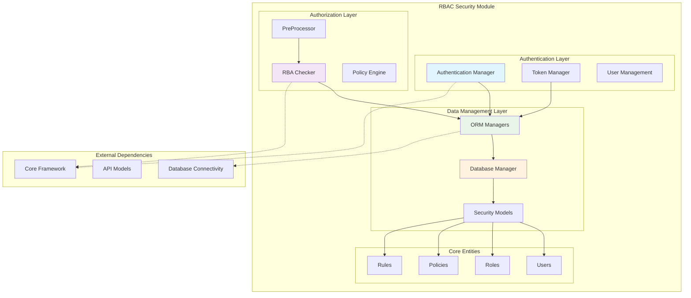
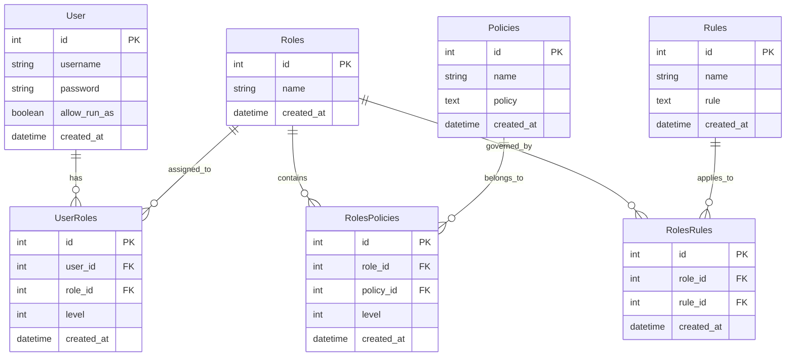
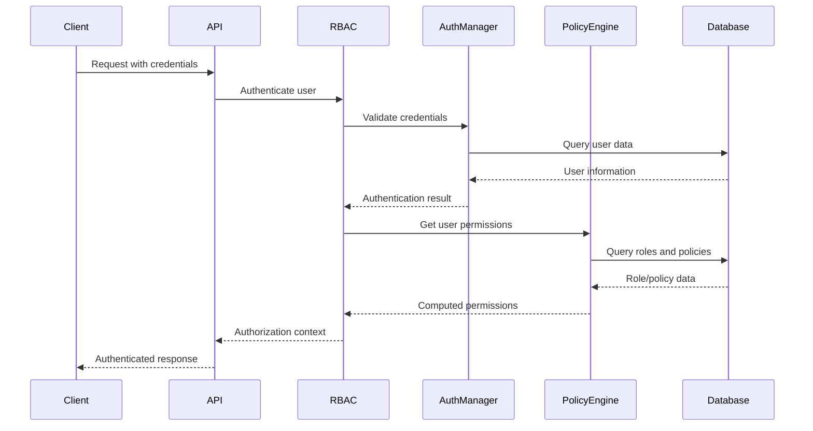

# RBAC Security Module

## Overview

The RBAC (Role-Based Access Control) Security module is a comprehensive authentication and authorization system that provides fine-grained access control for the Wazuh platform. This module implements a sophisticated security framework that manages users, roles, policies, and rules to ensure secure access to system resources and operations.

## Purpose

The RBAC Security module serves as the central security gateway for the Wazuh platform, providing:

- **User Authentication**: Secure user login and session management
- **Role-Based Authorization**: Hierarchical role assignment and permission management
- **Policy Enforcement**: Dynamic policy evaluation and resource access control
- **Token Management**: JWT token lifecycle management and blacklisting
- **Authorization Context**: Context-aware permission evaluation
- **Database Security**: Secure storage and management of security entities

## Architecture Overview

The RBAC Security module follows a layered architecture with clear separation of concerns:



## Sub-Module Architecture

The RBAC Security module is organized into three main sub-modules:

### 1. Authentication and User Management
**File**: `Authentication and User Management.md`

Handles user authentication, session management, and user lifecycle operations.

### 2. Authorization and Policy Engine
**File**: `Authorization and Policy Engine.md`

Manages role-based access control, policy evaluation, and permission checking.

### 3. Data Management and ORM
**File**: `Data Management and ORM.md`

Provides database operations, entity management, and data persistence.

## Core Functionality

### Security Entity Management
- **User Management**: Create, update, delete, and authenticate users
- **Role Management**: Define and manage hierarchical roles
- **Policy Management**: Create and enforce access policies
- **Rule Management**: Define authorization rules and contexts

### Access Control
- **Permission Evaluation**: Dynamic permission checking based on roles and policies
- **Resource Protection**: Fine-grained access control for system resources
- **Context-Aware Authorization**: Authorization based on runtime context
- **Token-Based Security**: JWT token management and validation

### Security Features
- **Password Security**: Secure password hashing and validation
- **Token Blacklisting**: Revocation and invalidation of compromised tokens
- **Session Management**: Secure session lifecycle management
- **Audit Trail**: Comprehensive logging of security events

## Integration Points

### Core Framework Integration
The RBAC Security module integrates with the [Core Framework](Core Framework.md) for:
- **Input Validation**: Using `InputValidator` for secure data validation
- **Result Handling**: Leveraging `WazuhResult` for consistent response formatting
- **Database Connectivity**: Utilizing [Database Connectivity](Database Connectivity.md) for data operations

### API Framework Integration
Integration with the [API Framework](API Framework.md) provides:
- **Security Models**: Shared data models for API operations
- **Middleware Integration**: Security middleware for request processing
- **Authentication Endpoints**: Secure API authentication mechanisms

### Cluster Management Integration
Works with [Cluster Management](Cluster Management.md) for:
- **Distributed Authentication**: Multi-node authentication coordination
- **Role Synchronization**: Consistent role management across cluster nodes
- **Security Policy Distribution**: Cluster-wide security policy enforcement

## Security Model

### Entity Relationships



### Authorization Flow



## Configuration and Setup

### Database Configuration
The RBAC module uses SQLite for data persistence with automatic schema migration:

```python
# Database configuration
DB_FILE = os.path.join(SECURITY_PATH, "rbac.db")
CURRENT_ORM_VERSION = 1
```

### Default Security Resources
The module includes default users, roles, policies, and rules loaded from YAML configuration files:

- **Default Users**: System administrators and service accounts
- **Default Roles**: Predefined role hierarchy
- **Default Policies**: Base access control policies
- **Default Rules**: Core authorization rules

### Security Constants
```python
# Reserved ID ranges
WAZUH_USER_ID = 1
WAZUH_WUI_USER_ID = 2
MAX_ID_RESERVED = 99
CLOUD_RESERVED_RANGE = 89
```

## Error Handling

The module implements comprehensive error handling through the `SecurityError` enumeration:

- **ALREADY_EXIST**: Resource already exists
- **INVALID**: Invalid input or format
- **ROLE_NOT_EXIST**: Referenced role not found
- **POLICY_NOT_EXIST**: Referenced policy not found
- **USER_NOT_EXIST**: Referenced user not found
- **ADMIN_RESOURCES**: Protected system resources
- **RELATIONSHIP_ERROR**: Relationship constraint violations

## Performance Considerations

### Database Optimization
- **Connection Pooling**: Efficient database connection management
- **Query Optimization**: Optimized queries for permission checking
- **Index Usage**: Strategic indexing for performance
- **Session Management**: Proper session lifecycle management

### Caching Strategy
- **Token Caching**: Cached token validation results
- **Permission Caching**: Cached permission evaluations
- **Policy Caching**: Cached policy compilations

## Security Best Practices

### Password Security
- **Secure Hashing**: Werkzeug password hashing
- **Salt Generation**: Automatic salt generation
- **Hash Verification**: Secure password verification

### Token Security
- **JWT Implementation**: Secure token generation and validation
- **Token Expiration**: Configurable token lifetimes
- **Blacklist Management**: Comprehensive token revocation

### Access Control
- **Principle of Least Privilege**: Minimal required permissions
- **Role Hierarchy**: Structured permission inheritance
- **Context Validation**: Runtime context verification

## Monitoring and Auditing

### Security Logging
The module provides comprehensive security event logging:

- **Authentication Events**: Login attempts and results
- **Authorization Events**: Permission checks and denials
- **Administrative Events**: User and role management operations
- **Security Events**: Token revocations and security violations

### Audit Trail
- **User Activity**: Complete user action history
- **Permission Changes**: Role and policy modifications
- **Security Incidents**: Failed authentication attempts
- **System Events**: Database migrations and updates

## Migration and Upgrades

### Database Migration
The module includes automatic database migration capabilities:

- **Version Detection**: Automatic version checking
- **Schema Updates**: Seamless schema migrations
- **Data Preservation**: Safe data migration between versions
- **Rollback Support**: Migration rollback capabilities

### Backward Compatibility
- **API Compatibility**: Maintained API interfaces
- **Data Format**: Compatible data formats
- **Configuration**: Backward-compatible configuration

## Related Documentation

- [Authentication and User Management](Authentication and User Management.md) - Detailed user management operations
- [Authorization and Policy Engine](Authorization and Policy Engine.md) - Policy evaluation and authorization logic
- [Data Management and ORM](Data Management and ORM.md) - Database operations and entity management
- [Core Framework](Core Framework.md) - Core system functionality
- [API Framework](API Framework.md) - API integration and security
- [Database Connectivity](Database Connectivity.md) - Database connection management

## Conclusion

The RBAC Security module provides a robust, scalable, and secure foundation for access control in the Wazuh platform. Its comprehensive feature set, flexible architecture, and strong security practices make it suitable for enterprise-grade security requirements while maintaining ease of use and administration.