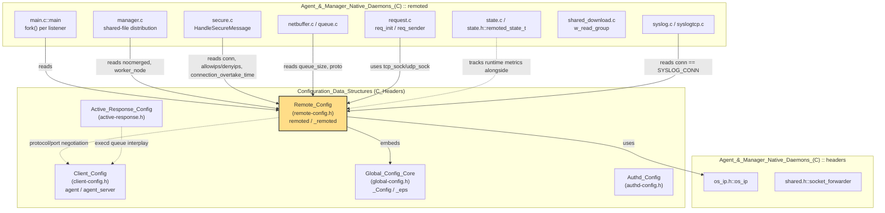
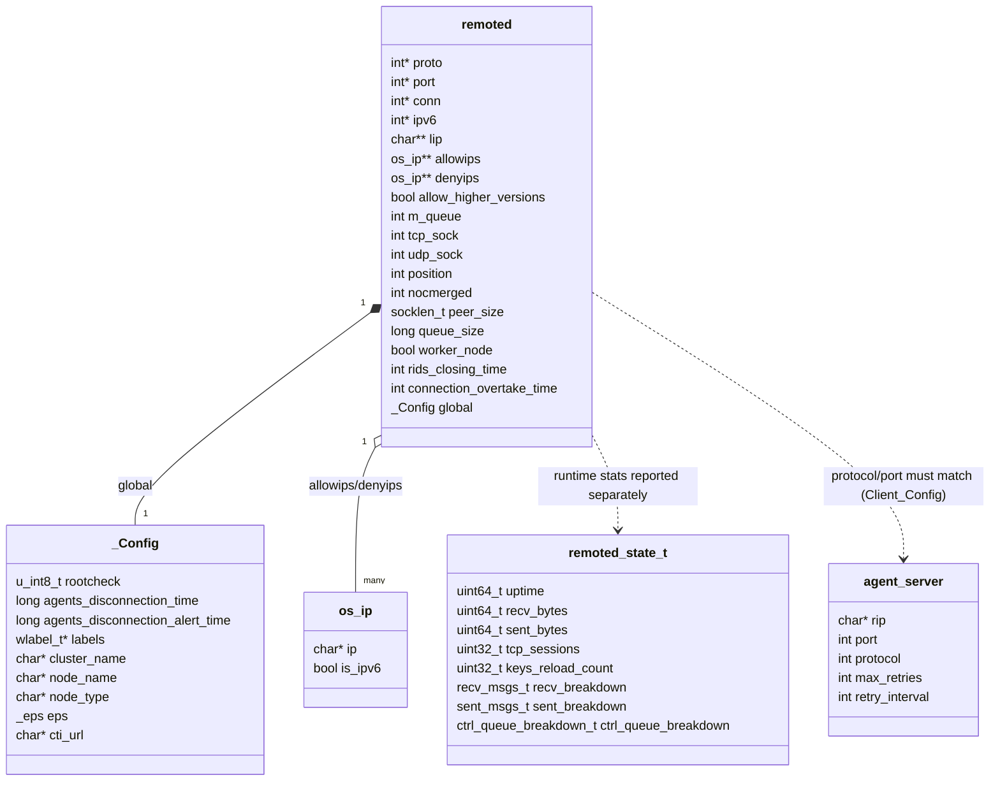

# Remote_Config

## 1. Introduction and Purpose

**Remote_Config** is the C configuration model for **`remoted`** (`wazuh-remoted`), the Wazuh manager daemon that listens for incoming agent connections over TCP/UDP, decrypts/authenticates agent traffic, and forwards shared configuration, group files, and active-response commands back to agents. The module is defined in a single header — `src/config/remote-config.h` — which declares the `remoted` (`_remoted`) structure: the canonical, fully-parsed, in-memory representation of the `<remote>` block(s) found in `ossec.conf`.

Like its sibling headers, Remote_Config is a **pure data-structure module**: it contains no XML-parsing logic of its own. Parsing is performed by the generic configuration dispatcher (`ReadConfig()` / `read_main_elements()`) documented in [Global_Config_Core](Global_Config_Core.md), which — upon encountering a `<remote>` tag — invokes a `Read_Remote()` routine (part of the native `remoted` sources) that populates a `remoted` instance. That instance is then used for the entire lifetime of the `remoted` process to drive socket creation, connection filtering, protocol selection, and IP allow/deny-listing.

Remote_Config is the **manager-side counterpart** to [Client_Config](Client_Config.md) (the agent's `agent`/`agent_server` structures): together they define the two ends of the encrypted agent↔manager communication channel — the client picks a server from its `agent_server[]` list, while the manager's `remoted` structure decides which protocols/ports/IPs it will accept connections on.

## 2. Module Purpose and Scope

| Aspect | Description |
|---|---|
| **Language** | C (header-only definition) |
| **File** | `src/config/remote-config.h` |
| **Owning subsystem** | [Configuration_Data_Structures_(C_Headers)](Configuration_Data_Structures_(C_Headers).md) |
| **Primary consumer daemon** | `remoted` — see [Agent_&_Manager_Native_Daemons_(C)](Agent_&_Manager_Native_Daemons_(C).md) → `remoted` sub-module |
| **Sibling config modules** | [Client_Config](Client_Config.md), [Global_Config_Core](Global_Config_Core.md), [Authd_Config](Authd_Config.md), [Active_Response_Config](Active_Response_Config.md), [Syscheck_Config](Syscheck_Config.md), [Rootcheck_Config](Rootcheck_Config.md), [Localfile_Config](Localfile_Config.md), [Wazuh_DB_Config](Wazuh_DB_Config.md), [Wmodules_Config](Wmodules_Config.md) |
| **API exposure** | Read (and partially updated) via `manager_module` (`framework/wazuh/manager.py::read_ossec_conf`, `update_ossec_conf`) and `cluster_module` (`get_configuration_node`) in the [API_&_Management_Framework_(Python)](API_&_Management_Framework_(Python).md) |

The header exposes a single public type:

- **`remoted` / `_remoted`** — the top-level configuration object for the whole `remoted` process: listener protocols/ports/connection-types, IPv6 toggle, bind addresses, allow/deny IP lists, higher-version-agent policy, internal queue/socket descriptors, worker/merge behavior, and RIDs/connection-overtake timing.

Several `#define` constants in the same header establish the protocol/connection-type vocabulary shared throughout the `remoted` codebase (`SYSLOG_CONN`, `SECURE_CONN`, `REMOTED_NET_PROTOCOL_TCP`, `REMOTED_NET_PROTOCOL_UDP`, `REMOTED_NET_PROTOCOL_TCP_UDP`, and their string counterparts), plus default values (`REMOTED_NET_PROTOCOL_DEFAULT` = TCP, `REMOTED_RIDS_CLOSING_TIME_DEFAULT` = 5 minutes, `REMOTED_ALLOW_AGENTS_HIGHER_VERSIONS_DEFAULT` = `false`).

## 3. Core Data Structure: `remoted` (`_remoted`)

```c
typedef struct _remoted {
    int *proto;
    int *port;
    int *conn;
    int *ipv6;

    char **lip;
    os_ip **allowips;
    os_ip **denyips;

    bool allow_higher_versions;

    int m_queue;
    int tcp_sock;
    int udp_sock;
    int position;
    int nocmerged;
    socklen_t peer_size;
    long queue_size;
    bool worker_node;
    int rids_closing_time;
    int connection_overtake_time;
    _Config global;
} remoted;
```

### Field-by-field description

| Field | Type | Purpose |
|---|---|---|
| `proto` | `int*` (array) | Per-listener network protocol bitmask (`REMOTED_NET_PROTOCOL_TCP` / `_UDP` / `_TCP_UDP`), one entry per `<remote>` block configured. Allows `remoted` to run multiple listeners simultaneously (e.g., one TCP + one UDP). |
| `port` | `int*` (array) | Listening port per `<remote>` block (default `1514`). |
| `conn` | `int*` (array) | Connection type per listener: `SYSLOG_CONN` (1) or `SECURE_CONN` (2, the encrypted agent protocol). |
| `ipv6` | `int*` (array) | Whether IPv6 is enabled for the corresponding listener. |
| `lip` | `char**` (array) | Local bind IP address per listener (`<local_ip>`), if explicitly configured. |
| `allowips` | `os_ip**` (array) | List of source IPs/CIDRs explicitly **allowed** to connect (`<allowed-ips>`), shared `os_ip` type defined in the native `headers` module. |
| `denyips` | `os_ip**` (array) | List of source IPs/CIDRs explicitly **denied** (`<denied-ips>`). |
| `allow_higher_versions` | `bool` | Whether agents running a **newer** Wazuh version than the manager are allowed to connect (`<allow_higher_versions>`), default `false`. |
| `m_queue` | `int` | File descriptor of the internal analysisd message queue (`/queue/sockets/queue`) that `remoted` forwards decoded agent events into. |
| `tcp_sock` | `int` | Dedicated socket used to receive **local requests** over TCP (e.g., from `remoted`'s control socket API used by `wazuh-control`/API queries). |
| `udp_sock` | `int` | Equivalent local-request socket over UDP. |
| `position` | `int` | Index identifying which forked child process (one per configured listener — see `main()`'s `fork()` loop) this instance corresponds to; lets each child access only its own protocol/port/conn entry. |
| `nocmerged` | `int` | Disables generation of `merged.mg` (bundled shared-config file); forced to `1` on cluster **worker** nodes since only the master distributes shared files. |
| `peer_size` | `socklen_t` | Cached size of the peer socket address structure, used across `accept()`/`recvfrom()` calls. |
| `queue_size` | `long` | Capacity of internal buffering queues (e.g., the input/output message queues used by `logcollector`-style buffering inside `remoted`). |
| `worker_node` | `bool` | Whether this manager is a **cluster worker** (as opposed to master); read via `w_is_worker()` at startup and drives the `nocmerged` decision above. |
| `rids_closing_time` | `int` | Time (seconds, default `REMOTED_RIDS_CLOSING_TIME_DEFAULT` = 300s) after which idle agent RIDS (message-counter) files are closed to free file descriptors. |
| `connection_overtake_time` | `int` | Timeout controlling how long a new connection may "overtake" (replace) an existing stale one from the same agent, part of the *close idle socket* logic in `HandleSecureMessage`. |
| `global` | `_Config` | An **embedded copy** of the manager-wide `_Config` structure (see [Global_Config_Core](Global_Config_Core.md)) — gives `remoted` direct access to global EPS limits, agent disconnection timers, and label defaults without needing a separate global pointer. |

> Note: Most array-typed fields (`proto`, `port`, `conn`, `ipv6`, `lip`) are **null/zero terminated arrays**, one element per `<remote>` XML block — `remoted` supports declaring several listeners (e.g., a `secure` connection on port 1514/TCP and a `syslog` listener on port 514/UDP) in the same `ossec.conf`.

## 4. Architecture: Where Remote_Config Fits



## 5. Configuration Loading Flow

```mermaid
sequenceDiagram
    participant XML as ossec.conf (&lt;remote&gt; blocks)
    participant Dispatcher as ReadConfig() / read_main_elements()<br/>(Global_Config_Core)
    participant Reader as Read_Remote()<br/>(native remoted sources)
    participant Struct as remoted struct<br/>(Remote_Config)
    participant Main as remoted main()

    XML->>Dispatcher: OS_ReadXML parses ossec.conf
    Dispatcher->>Dispatcher: match tag == "remote" (CREMOTE bitmask)
    Dispatcher->>Reader: Read_Remote(xml, node, &logr)
    Reader->>Struct: Append proto[], port[], conn[], ipv6[], lip[]
    Reader->>Struct: Parse allowed-ips/denied-ips into os_ip** arrays
    Reader->>Struct: Set allow_higher_versions, rids_closing_time, connection_overtake_time
    Dispatcher->>Dispatcher: also dispatch global tag - populates logr.global (_Config)
    Dispatcher-->>Main: 0 (ok) / OS_INVALID (error)
    Main->>Main: w_is_worker() -> logr.worker_node
    Main->>Main: nocmerged = worker_node ? 1 : !merge_shared option
    Main->>Struct: logr.conn[i] != 0 -> fork() one child per listener
    Main->>Main: child sets logr.position = i, calls HandleRemote(uid)
```

Key points illustrated above:
- `remoted`'s `main()` (see `src/remoted/main.c`) forks **one child process per configured listener** (`while (logr.conn[i] != 0) fork()`), and each child records its own index in `logr.position` so it only services its assigned protocol/port/connection-type.
- The `<global>` block is parsed by the same dispatcher pass and stored inside `remoted.global`, so `remoted` never needs to hold a second, separate `_Config*` pointer — see [Global_Config_Core](Global_Config_Core.md) for the full `_Config` schema.
- Cluster role detection (`w_is_worker()`, from the `cluster_module`'s [cluster_utils](cluster_utils.md)) directly feeds the `worker_node`/`nocmerged` decision, tying Remote_Config to the [cluster_module](cluster_module.md).

## 6. Runtime Consumption: `remoted` Daemon Internals

The `remoted` structure (conventionally instantiated as the global variable `logr`) is read from virtually every source file in the `remoted` sub-module of [Agent_&_Manager_Native_Daemons_(C)](Agent_&_Manager_Native_Daemons_(C).md):

| Consumer file | Fields used | Behavior driven |
|---|---|---|
| `main.c` | `conn[]`, `worker_node`, `nocmerged` | Process forking, cluster role detection, merged-shared-file gating |
| `remoted.c` | `rlimit` sizing (via `nofile` internal option), overall listener bootstrap | File-descriptor limits sized for expected connection volume |
| `secure.c` | `conn`, `allowips`, `denyips`, `connection_overtake_time`, `allow_higher_versions` | Accepting/rejecting secure agent connections; idle-socket eviction; version-gate enforcement |
| `manager.c` | `nocmerged`, `worker_node`, `global` (labels) | Building/distributing `merged.mg` per agent group; skipping this on workers |
| `netbuffer.c`, `queue.c` | `queue_size`, `proto` | Sizing per-connection buffers; branching TCP vs UDP receive paths |
| `request.c` | `tcp_sock`, `udp_sock` | Local request/response socket handling (`req_init`, `req_sender`, `req_pool_post`) used by the manager API/CLI to query `remoted` state |
| `syslog.c` / `syslogtcp.c` | `conn == SYSLOG_CONN`, `port`, `proto` | Legacy syslog listener support, separate from the encrypted `SECURE_CONN` path |
| `shared_download.c` | `global` (via shared config download logic) | Determines shared group file refresh behavior |
| `state.c` / `state.h` (`remoted_state_t`) | independent of `remoted` struct but reported alongside it | Runtime statistics (`recv_breakdown`, `sent_breakdown`, `ctrl_queue_breakdown`) exposed via `remoted`'s local socket API and consumed by `manager_module`'s `get_stats_remoted` |

### Related runtime types (not part of Remote_Config itself, but tightly coupled)

- **`remoted_state_t`** (`state.h`) — runtime counters (`uptime`, `recv_bytes`, `sent_bytes`, `tcp_sessions`, `keys_reload_count`, plus nested `recv_msgs_t`/`sent_msgs_t`/`ctrl_queue_breakdown_t` breakdowns) exposed through the `remoted` control socket and surfaced by the API's `manager_module` (`get_stats_remoted`) and `cluster_module` (`get_stats_remoted_node`).
- **`message_t` / `netbuffer_t` / `sockbuffer_t` / `pending_data_t`** (`remoted.h`) — per-connection buffering structures used by `netbuffer.c`/`queue.c`/`manager.c`; they operate *alongside* a `remoted` instance but are not stored inside it.
- **`os_ip`** (`headers/os_ip.h`) — the shared IPv4/IPv6 address-matching type used for `allowips`/`denyips`, also used by [Global_Config_Core](Global_Config_Core.md)'s `_Config.white_list`.
- **`socket_forwarder`** (`headers/shared.h`) — used by the embedded `_Config.socket_list` for log-forwarding targets, not directly by `remoted` fields but reachable through `remoted.global`.

## 7. Component Relationship Diagram



## 8. Process Flow: `remoted` Startup and Connection Handling

```mermaid
flowchart TD
    A[remoted process starts] --> B["ReadConfig(CREMOTE|CGLOBAL, ossec.conf, &logr, NULL)"]
    B --> C{"logr.conn == NULL?"}
    C -- Yes --> D[merror_exit: Remoted connection is not configured]
    C -- No --> E["w_is_worker() -> logr.worker_node"]
    E --> F{worker_node?}
    F -- Yes --> G["logr.nocmerged = 1"]
    F -- No --> H["logr.nocmerged = !merge_shared option"]
    G --> I[Privsep_GetUser / Privsep_GetGroup]
    H --> I
    I --> J[Daemonize unless -f foreground flag]
    J --> K["for each i where logr.conn[i] != 0: fork()"]
    K --> L[Child: logr.position = i]
    L --> M["HandleRemote(uid) - services logr.proto[i]/port[i]/conn[i]"]
    M --> N{conn[i] == SECURE_CONN?}
    N -- Yes --> O["secure.c: accept, decrypt, validate against allowips/denyips"]
    N -- No --> P["syslog.c/syslogtcp.c: legacy syslog forwarding path"]
    O --> Q{"allow_higher_versions and version check"}
    Q -- Blocked --> R[Reject / disconnect agent]
    Q -- Allowed --> S["manager.c: distribute merged.mg unless nocmerged"]
    S --> T["Forward decoded events to m_queue (analysisd)"]
    T --> U["state.c: update remoted_state_t counters"]
```

## 9. Interaction with Other Modules

- **[Client_Config](Client_Config.md)** — The agent-side counterpart. `agent_server.protocol`/`port` (agent) must match a `remoted.proto[]`/`port[]` entry (manager) for a connection to succeed; both sides share the same TCP/UDP protocol vocabulary and crypto conventions.
- **[Global_Config_Core](Global_Config_Core.md)** — `remoted.global` is a direct embedding of `_Config`, so any manager-wide setting (EPS limits, agent disconnection timers, labels, cluster identity) is available to `remoted` without extra plumbing. The same `ReadConfig()`/`read_main_elements()` dispatcher that parses `<remote>` also parses `<global>` in the same pass.
- **[Authd_Config](Authd_Config.md)** — While `remoted` handles the ongoing encrypted channel, initial agent enrollment (key issuance) is handled by `authd`; the two daemons share the same `client.keys` key store and crypto method conventions but are configured independently.
- **[Active_Response_Config](Active_Response_Config.md)** — Active-response commands dispatched to agents are transmitted over the same secure channel that `remoted` manages; `remoted`'s `SendMsg`/queue plumbing forwards AR payloads originating from `analysisd`/`execd`.
- **[Agent_&_Manager_Native_Daemons_(C)](Agent_&_Manager_Native_Daemons_(C).md) → `remoted`** — The primary consumer sub-module; virtually every file under `src/remoted/` (`main.c`, `manager.c`, `secure.c`, `netbuffer.c`, `queue.c`, `request.c`, `sendmsg.c`, `state.c`, `syslog.c`, `syslogtcp.c`, `shared_download.c`) reads from a `remoted`-typed global (`logr`).
- **[cluster_module](cluster_module.md)** — `worker_node` is populated via `w_is_worker()` (see [cluster_utils](cluster_utils.md)), and `nocmerged` behavior directly implements the master/worker split for shared-configuration distribution described in [cluster_master](cluster_master.md)/[cluster_worker](cluster_worker.md).
- **[manager_module](manager_module.md)** (API) — `framework/wazuh/manager.py::read_ossec_conf`/`update_ossec_conf` and the `manager_controller.py::get_stats_remoted` endpoint expose (read-only or via config update) the effective `<remote>` configuration and `remoted_state_t` runtime statistics to REST API clients, without linking against this C header directly (the API reads the rendered JSON produced by `remoted`'s own config-dump socket command or the raw XML file).
- **`headers` (shared low-level structures)** — `os_ip` (`os_ip.h`) is reused for both `remoted.allowips`/`denyips` and `_Config.white_list`; `socket_forwarder` (`shared.h`) is reachable transitively via `remoted.global.socket_list`.
- **[Unit_Tests_-_Remoted](Unit_Tests_-_Remoted.md)** — Extensively exercises the behaviors driven by this structure: `test_remote-config.c` tests protocol-string parsing helpers (`w_remoted_get_net_protocol_content_*`, `w_remoted_parse_agents_*`); `test_manager.c`, `test_secure.c`, `test_netbuffer.c`, `test_remote-state.c`, and `test_sendmsg.c` all set up a `remoted`-shaped fixture (`logr`) to validate group distribution, secure-message handling, buffering, and state reporting logic that reads these fields.

## 10. Key API Reference

| Symbol | File | Description |
|---|---|---|
| `typedef struct _remoted remoted` | `remote-config.h` | The manager-wide `remoted` daemon configuration structure. Conventionally instantiated as the global `remoted logr;`. |
| `SYSLOG_CONN` / `SECURE_CONN` | `remote-config.h` | Integer constants (`1`/`2`) identifying a listener's connection type. |
| `REMOTED_NET_PROTOCOL_TCP` / `_UDP` / `_TCP_UDP` | `remote-config.h` | Bitmask flags selecting transport protocol(s) for a listener. |
| `REMOTED_NET_PROTOCOL_DEFAULT` | `remote-config.h` | Default protocol (TCP) when none is explicitly configured. |
| `REMOTED_RIDS_CLOSING_TIME_DEFAULT` | `remote-config.h` | Default idle-RIDS-file closing time (300 seconds). |
| `REMOTED_ALLOW_AGENTS_HIGHER_VERSIONS_DEFAULT` | `remote-config.h` | Default value (`false`) for `allow_higher_versions`. |
| `Read_Remote(...)` *(implemented outside this header, in native `remoted`/config sources)* | — | Parses a `<remote>` XML block and appends a new listener entry (`proto`/`port`/`conn`/`ipv6`/`lip`, plus `allowips`/`denyips`) to a `remoted` instance. |

## 11. Design Notes

- **Array-of-listeners design**: Rather than modeling a single listener, `remoted` uses parallel arrays (`proto`, `port`, `conn`, `ipv6`, `lip`) indexed identically, so that one `<remote>` XML block per listener produces one array slot across all these fields. This is a compact but implicit contract — code iterating any one array must keep the others in lock-step by index.
- **Embedded, not pointed-to, global config**: Unlike many Wazuh structures that hold a `_Config *`, `remoted` embeds `_Config global` **by value**. This avoids an extra allocation/lifetime concern (the global config is parsed once and lives exactly as long as `logr` does) at the cost of a larger struct.
- **Process-per-listener model**: The `position` field only makes sense in the context of `remoted`'s fork-per-listener startup model (`main.c`) — after forking, each child logically "owns" one index into the array fields, even though the full `remoted` struct (all arrays) remains present in each child's memory (copy-on-write from `fork()`).
- **Cluster-awareness at the edge**: `worker_node`/`nocmerged` are the only fields in this header that encode cluster topology awareness; all deeper cluster logic (sync protocols, master/worker RPC) lives in the [cluster_module](cluster_module.md) family and is intentionally kept out of this configuration header.
