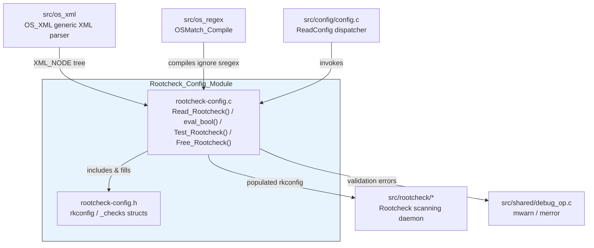
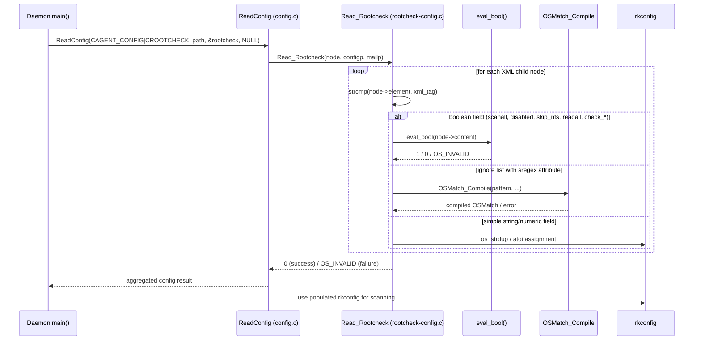
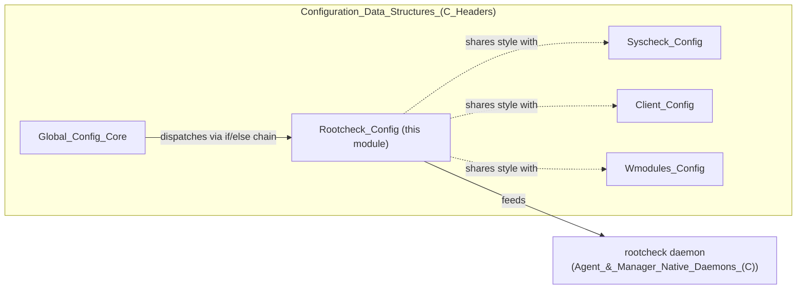

# Rootcheck_Config

## 1. Purpose & Overview

**Rootcheck_Config** is the configuration sub-system for the **Rootcheck** policy-monitoring engine of Wazuh. It is a small, focused C module belonging to the broader `Configuration_Data_Structures_(C_Headers)` family of modules that define and parse the `<rootcheck>` block found in `ossec.conf` (agent-side) and `agent.conf` (shared configuration).

Its two responsibilities are:

1. **Data modeling** — define the in-memory representation of a Rootcheck configuration (`rkconfig` and the nested `_checks` bitfield-like structure) that the Rootcheck daemon component (part of the `Agent_&_Manager_Native_Daemons_(C)` module, `rootcheck` sub-module) consumes at runtime.
2. **XML parsing & validation** — read the `<rootcheck>` XML nodes from the Wazuh configuration files, populate an `rkconfig` instance, validate values (booleans, numeric frequency, ignore-list regular expressions), and report malformed configuration via the shared logging/error macros (`mwarn`, `merror`).

This module does **not** perform any scanning itself — it only prepares the configuration object that is later handed to the actual Rootcheck scanning logic (`src/rootcheck/*.c`, e.g. `common_rcl.c`, `run_rk_check.c`) documented as part of the native daemons module. It is analogous in role to sibling modules such as `Syscheck_Config`, `Client_Config`, and `Wmodules_Config`, all of which follow the same "config struct + `Read_*` parser function" pattern used throughout the Wazuh C codebase.

## 2. Architecture Overview

### 2.1 Component Diagram

### 2.2 Data Flow — Configuration Loading

### 2.3 Position in the Overall System

## 3. Core Components

### 3.1 `rootcheck-config.h`

Defines the data model used throughout the module and consumed by the Rootcheck daemon:

| Component | Description |
|---|---|
| `rkconfig` (`struct _rkconfig`) | The top-level configuration object. Holds file paths (`rootkit_files`, `rootkit_trojans`, `winaudit`, `winmalware`, `winapps`, `unixaudit[]`), the `ignore[]` / `ignore_sregex[]` exclusion lists, scan-scheduling fields (`time`, `tsleep`, `scanall`, `readall`, `disabled`, `skip_nfs`), and a nested `checks` structure. |
| `_checks` (nested in `rkconfig`) | Bit-like collection of `short` flags that enable/disable individual check categories: `rc_dev`, `rc_files`, `rc_if`, `rc_pids`, `rc_ports`, `rc_sys`, `rc_trojans`, and platform-specific flags (`rc_unixaudit` on non-Windows; `rc_winaudit`, `rc_winmalware`, `rc_winapps` on Windows). |
| `RK_CONF_UNPARSED` / `RK_CONF_UNDEFINED` | Sentinel constants (`-2` / `-1`) used to distinguish "never touched by the parser" from "explicitly undefined" state for the `disabled` field, enabling the "enabled by default once the `<rootcheck>` block exists" behavior. |
| `Free_Rootcheck(rkconfig *)` | Public destructor that releases all dynamically allocated strings/arrays inside an `rkconfig` instance (declared here, implemented in the `.c` file). |

### 3.2 `rootcheck-config.c`

Implements the parsing logic:

| Component | Description |
|---|---|
| `eval_bool(const char *str)` (static, core component) | Tiny helper that converts the XML textual values `"yes"`/`"no"` into `1`/`0`, returning `OS_INVALID` for `NULL` or any other string. Used pervasively for every boolean XML tag (`scanall`, `disabled`, `skip_nfs`, `readall`, and all the `check_*` toggles). |
| `Read_Rootcheck(XML_NODE node, void *configp, void *mailp)` | The main entry point, registered with the generic configuration reader (`ReadConfig` in `src/config/config.c`) for the `CROOTCHECK` section. Iterates the XML node array, matching each `element` name against a long list of known tags (`rootkit_files`, `rootkit_trojans`, `windows_audit`, `system_audit`, `windows_apps`, `windows_malware`, `scanall`, `readall`, `frequency`, `disabled`, `skip_nfs`, `base_directory`, `ignore`, and the various `check_*` flags) and populating the corresponding field of the `rkconfig` struct passed in as `configp`. Compiles `ignore` entries tagged with `type="sregex"` into `OSMatch` objects via `OSMatch_Compile`. Returns `0` on success or `OS_INVALID` on any malformed value, logging via `mwarn`/`merror`. |
| `Test_Rootcheck(const char *path)` | Configuration self-test utility (used by `--test-config` / `-t` daemon flags) that loads a temporary `rkconfig`, invokes `ReadConfig`, reports errors, and always calls `Free_Rootcheck` to avoid leaks. |
| `Free_Rootcheck(rkconfig *config)` | Destructor implementation: frees `workdir`, `basedir`, `rootkit_files`, `rootkit_trojans`, each element of `unixaudit[]` and `ignore[]`, `winaudit`, `winmalware`, `winapps`, each element of `alert_msg[]`, and closes `fp` if open. |

## 4. Integration Points

- **Upstream caller**: `src/config/config.c` (`Global_Config_Core`, sibling module) dispatches to `Read_Rootcheck` when it encounters a `<rootcheck>` XML block while walking the master configuration tree (see the generic `if/else if` chain pattern shown in that file's `if` core component).
- **XML infrastructure**: relies on the shared `OS_XML` node representation (`XML_NODE`) produced by `src/os_xml`, and on `src/os_regex`'s `OSMatch_Compile` for `sregex`-flavored ignore patterns — both documented in `Agent_&_Manager_Native_Daemons_(C)`.
- **Downstream consumer**: the populated `rkconfig` struct is used by the Rootcheck scanning engine (`src/rootcheck/*.c`, part of the `rootcheck` sub-module of `Agent_&_Manager_Native_Daemons_(C)`) to decide which checks to run (`checks.rc_*` flags), which files/directories to ignore, and how often to scan (`time`, `tsleep`). The `Proc_Info` struct defined in `src/rootcheck/rootcheck.h` (process name/path pair) is one example of a runtime data structure used by that scanning engine once configuration has been applied.
- **Sibling configuration modules**: shares the exact same architectural pattern (struct + `Read_*` + `Test_*` + `Free_*`) with `Syscheck_Config`, `Client_Config`, `Authd_Config`, `Remote_Config`, and `Wmodules_Config` — all part of the parent `Configuration_Data_Structures_(C_Headers)` module family. See those modules' documentation for comparison of configuration-parsing conventions across Wazuh.

## 5. Notable Design Notes

- **Platform conditional compilation**: several fields and checks (`rc_winaudit`, `rc_winmalware`, `rc_winapps` vs. `rc_unixaudit`) are guarded by `#ifdef WIN32`, meaning the effective shape of `_checks` differs between Windows-agent builds and Unix-agent/manager builds compiled from the same source.
- **"Enabled by default" semantics**: the `RK_CONF_UNPARSED` → `RK_CONF_UNDEFINED` transition in `Read_Rootcheck` ensures that simply having a `<rootcheck>` block (even empty) implicitly enables the module, distinguishing it from a config file that omits the block entirely.
- **No sub-modules**: given the very small footprint (one header, one source file, a single non-trivial parsing function), this module is documented as a single unit rather than split into sub-module pages.
