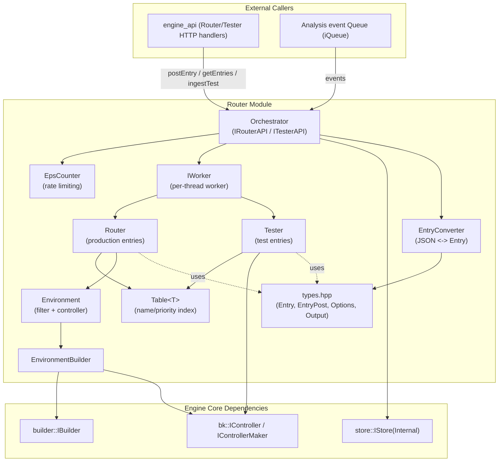
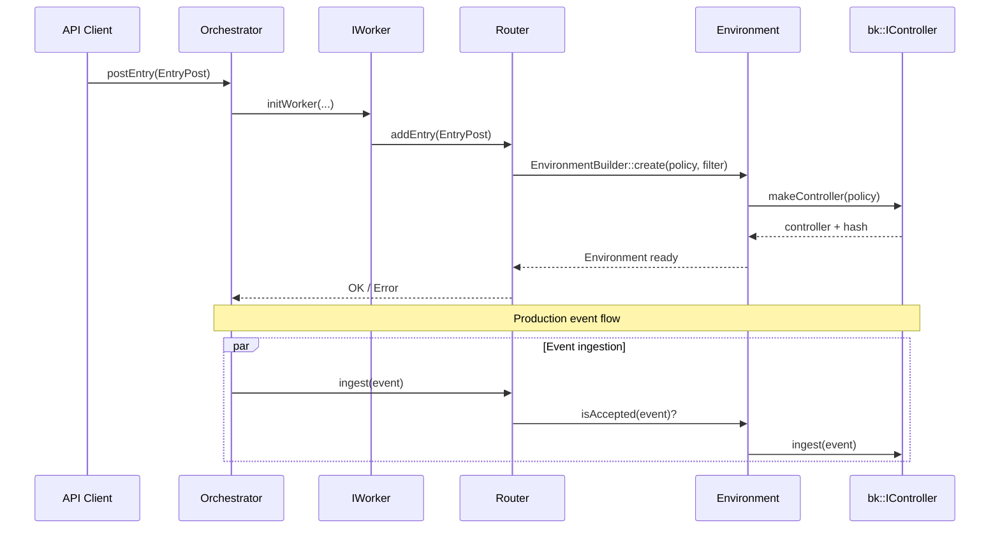

# Router Module

## Introduction

The **Router** module is a core component of the **Wazuh Engine (C++)**. It is responsible for directing incoming
events to the correct **policy** (a compiled decoder/rule/output pipeline built by the `builder` module) based on
configurable **filters** and **priorities**. It provides two parallel operating surfaces:

- **Production routing** — a set of prioritized routes that continuously ingest live events (from the analysis
  queue) and forward them to the matching policy pipeline.
- **Testing** — an on-demand surface that lets operators run ad-hoc events through a policy (optionally tracing
  specific assets) without affecting production traffic.

Both surfaces share the same underlying mechanism for turning a *policy name* into a running, executable pipeline
(an **Environment**, built via the **Environment Builder**) and for controlling the *rate* at which events are
processed (**EPS Counter**). All the state exposed through the HTTP API (`engine_api_router_tester`, see
[engine_api.md](engine_api.md)) is stored and manipulated through the **Orchestrator**, which is the single
external-facing entry point for the module and delegates the actual work to internal **Workers**.

## Architecture Overview

The Router module is organized around a central `Orchestrator` that owns a pool of `IWorker` instances. Each worker
wraps one production `Router` and one `Tester`, both of which manage collections of named, prioritized entries
backed by a generic `Table<T>` container. Entries are turned into runtime `Environment` objects (production) or
controller-backed test contexts (testing) through the shared `EnvironmentBuilder`, which in turn depends on the
Engine's `builder::IBuilder` and `bk::IControllerMaker` abstractions.

### Request / Event Flow

## Sub-modules

The Router module is documented across the following focused sub-modules:

| Sub-module | Description |
|------------|--------------|
| [Router_types.md](Router_types.md) | Public data contracts (`EntryPost`, `Entry`, `Options`, `Output`) and the `EntryConverter` used to translate between JSON payloads and internal/API types. |
| [Router_environment.md](Router_environment.md) | `Environment` (filter + running controller) and `EnvironmentBuilder`, responsible for turning a policy name into an executable pipeline. |
| [Router_production.md](Router_production.md) | The production-facing `Router` class and the generic `Table<T>` container used to manage prioritized, named entries. |
| [Router_testing.md](Router_testing.md) | The `Tester` class, its `RuntimeEntry`/`InternalOutput` helpers, and the on-demand event testing/tracing flow. |
| [Router_orchestrator.md](Router_orchestrator.md) | The top-level `Orchestrator` (implements `IRouterAPI`/`ITesterAPI`), the `IWorker` abstraction, and the `EpsCounter` rate limiter. |

## Relationship to Other Modules

The Router module does not operate in isolation; it depends on and is used by several other parts of the Wazuh
Engine:

- **`engine_builder`** ([engine_builder.md](engine_builder.md)) — provides `builder::IBuilder`, used by
  `EnvironmentBuilder` to compile policies and filters into executable expressions/controllers.
- **`engine_bk`** ([engine_bk.md](engine_bk.md)) — provides `bk::IController` / `bk::IControllerMaker`, the runtime
  execution engine that actually processes events through a compiled policy graph.
- **`Store`** ([Store.md](Store.md)) — the `Orchestrator` persists router/tester/EPS state (`router/router/0`,
  `router/tester/0`, `router/eps/0`) through `store::IStoreInternal`.
- **`Queue`** ([Queue.md](Queue.md)) — production events and test requests are consumed from `iQueue`-based queues
  (`ProdQueueType`, `TestQueueType`).
- **`engine_base`** ([engine_base.md](engine_base.md)) — supplies fundamental types (`base::Event`,
  `base::Expression`, `base::Name`, `base::Error`/`base::OptError`) used throughout the module.
- **`engine_api`** ([engine_api.md](engine_api.md)) — the `engine_api_router_tester` sub-module exposes the
  `Orchestrator`'s `IRouterAPI`/`ITesterAPI` surface over the Engine's HTTP API, allowing the `engine_router` CLI tool
  (part of the Engine Administration CLI Tools) to manage routes and run tests remotely.

## Key Concepts

- **Entry**: A named, prioritized configuration linking a *policy* to either a *filter* (production) or a *lifetime*
  (testing).
- **Environment**: The runtime materialization of an entry — a filter expression plus a running `bk::IController`.
- **Priority**: Production entries are evaluated in priority order; the first matching filter wins.
- **EPS Counter**: An optional global rate limiter that can pause event ingestion once a configured
  events-per-second threshold is exceeded within a time window.
- **Worker**: A per-thread unit that owns a `Router` and a `Tester`, allowing the Orchestrator to parallelize event
  processing while presenting a single logical API.
