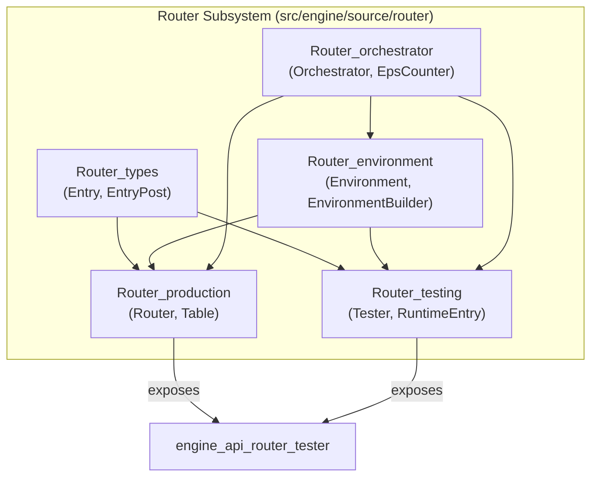
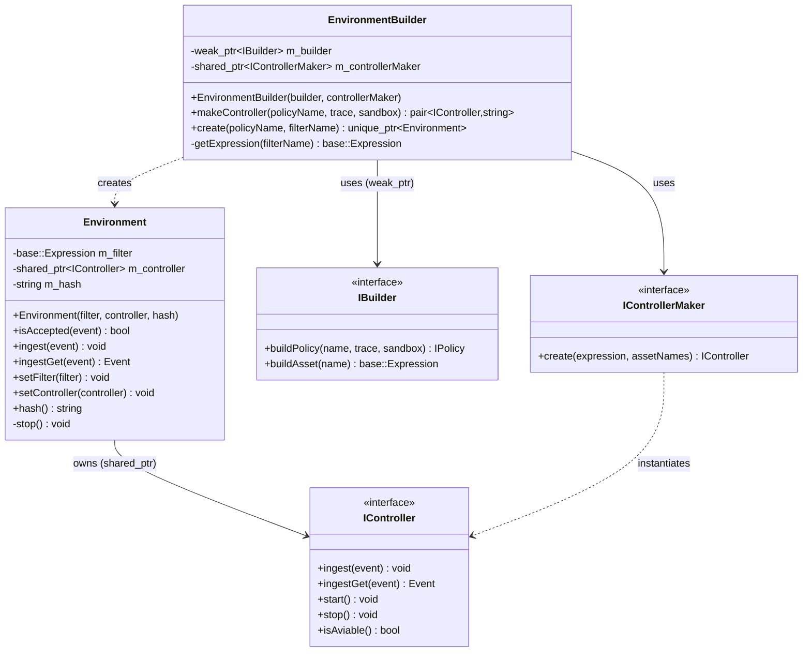
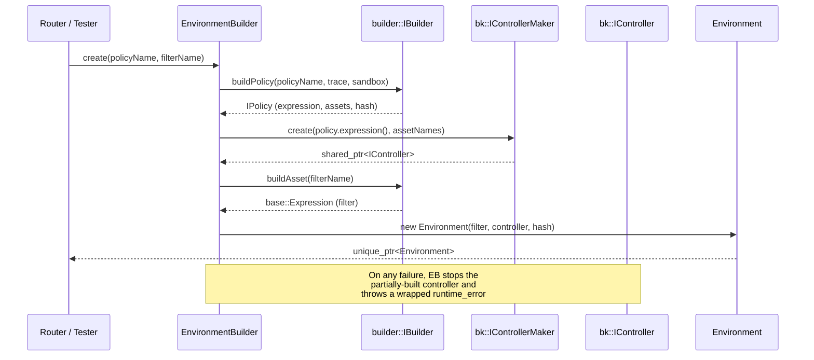
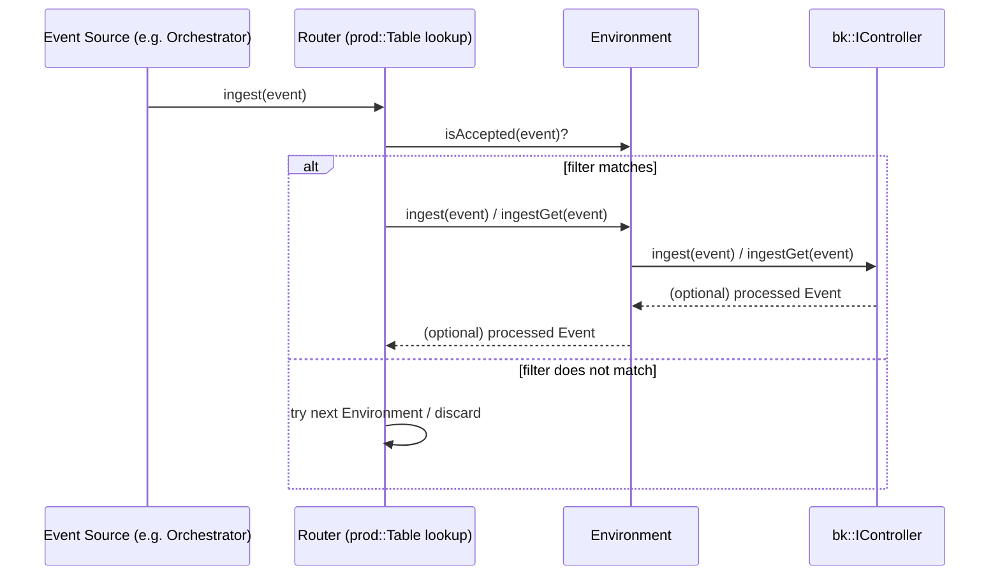
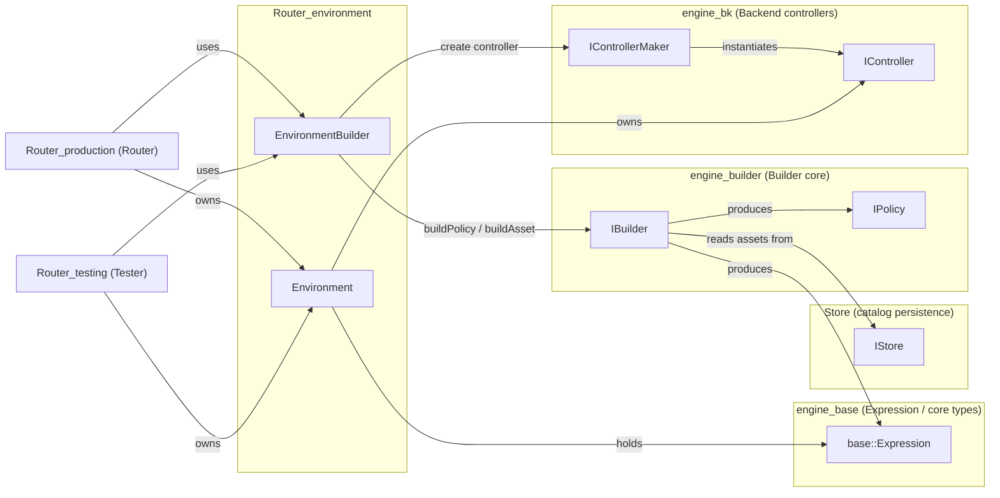

# Router Environment

## Introduction

The **Router Environment** module is a small but critical piece of the Wazuh Engine's [Router](Router_orchestrator.md) subsystem. It defines the runtime unit that binds a compiled **policy** (the decoding/normalization/detection pipeline built by the [Engine Builder](engine_builder.md)) with a **filter** expression that decides which events the policy should process.

An `Environment` is the actual, executable representation of a routing entry: it wraps a `bk::IController` (the compiled policy graph, see [Engine Bk](engine_bk.md)) together with the `base::Expression` filter used to accept or reject incoming events, and the content hash of the policy that produced it. The `EnvironmentBuilder` is the factory responsible for turning policy/filter names (as stored in the [Store](Store.md)) into fully constructed, ready-to-run `Environment` instances.

This module sits at the boundary between the static configuration world (named policies and filters stored in the catalog) and the dynamic runtime world (live controllers processing events), and it is a direct dependency of both the [Router_production](Router_production.md) and [Router_testing](Router_testing.md) modules.

## Objectives

* Provide a lightweight runtime object (`Environment`) that couples a policy controller with its routing filter.
* Provide a builder (`EnvironmentBuilder`) that resolves named policies/filters through the `IBuilder` interface and instantiates the corresponding `bk::IController` through `IControllerMaker`.
* Offer a uniform lifecycle (construction, event ingestion, teardown) that higher-level components (`Router`, `Tester`) can rely on without needing to know how policies are compiled or how controllers execute expressions.
* Guarantee safe resource management: an `Environment`'s controller is automatically stopped when the `Environment` is destroyed.

---

## Architecture Overview

### Position within the Router subsystem

### Internal composition

---

## Core Components

### `Environment` (`src/engine/source/router/src/environment.hpp`)

`Environment` is the runtime object representing one active route. It holds:

| Member | Type | Purpose |
|---|---|---|
| `m_filter` | `base::Expression` | Compiled filter expression (built from a `filter/...` asset) used to decide if an event belongs to this route. |
| `m_controller` | `std::shared_ptr<bk::IController>` | The compiled policy pipeline (decoders, rules, outputs) that actually processes accepted events. See [Engine Bk](engine_bk.md) and its `Router_production`/`Router_testing` consumers. |
| `m_hash` | `std::string` | Content hash of the policy used to build the controller; used to detect when a policy needs to be rebuilt (e.g., after a catalog update). |

Key behaviors:

* **`isAccepted(event)`** — evaluates `m_filter` against the incoming event to determine whether the environment should process it (used by the [Router](Router_production.md) to select the right entry among many).
* **`ingest(event)` / `ingestGet(event)`** — forward the event to the underlying controller, either fire-and-forget or awaiting the (possibly enriched) processed event, respectively. This is a thin delegation to `bk::IController::ingest` / `ingestGet`.
* **`setFilter` / `setController`** — allow hot-swapping the filter or controller (e.g., during a policy reload), throwing if an invalid (null) controller is supplied.
* **RAII teardown** — the destructor calls `stop()`, which stops the controller if present, ensuring no dangling subscriptions or resources when the entry is removed or the environment is replaced.

### `EnvironmentBuilder` (`src/engine/source/router/src/environmentBuilder.hpp`)

`EnvironmentBuilder` is the factory that turns catalog names into a working `Environment`. It depends on two abstractions:

* **`builder::IBuilder`** (weak reference) — from the [Engine Builder](engine_builder.md) module — used to:
  * `buildPolicy(name, trace, sandbox)` → produces an `IPolicy` (expression graph + asset list + hash).
  * `buildAsset(filterName)` → produces the `base::Expression` for a `filter/...` asset.
* **`bk::IControllerMaker`** — from the [Engine Bk](engine_bk.md) module — used to instantiate a concrete `bk::IController` (backend-specific: `rx` or `taskf`, see `engine_bk_rx` / `engine_bk_taskf`) from the policy's expression and the set of "traceable" asset names.

Two public operations:

1. **`makeController(policyName, trace, sandbox)`** — builds only the controller (no filter), returning `{controller, hash}`. This is used directly by [Router_production](Router_production.md)'s `Router::rebuildEntry`/`addEntry` when the caller does not need a filter-bound `Environment` object right away, or by [Router_testing](Router_testing.md)'s `Tester` for test sessions.
2. **`create(policyName, filterName)`** — the full flow: builds the controller via `makeController`, builds the filter expression via `getExpression`, and wraps both (plus the hash) into a new `Environment`. On any failure it ensures the partially built controller is stopped before propagating a descriptive `std::runtime_error`.

Validation performed by `EnvironmentBuilder`:
* Rejects filter names that do not start with the `filter` namespace segment.
* Rejects policy names that do not start with the `policy` namespace segment.
* Rejects policies with an empty asset list.
* Fails fast if the `IBuilder` weak reference has expired, or if `IControllerMaker` is null.

---

## Data Flow

### Environment creation flow

### Event ingestion flow

---

## Component Relationships

Key upstream/downstream relationships:

* **Upstream dependencies** (what `Router_environment` needs):
  * [`engine_builder`](engine_builder.md) — supplies `IBuilder` for compiling policies/filters from catalog assets (which in turn come from the [Store](Store.md)).
  * [`engine_bk`](engine_bk.md) — supplies `IControllerMaker`/`IController` abstractions and their concrete `rx`/`taskf` implementations that actually execute the compiled expression graph.
  * [`engine_base`](engine_base.md) — supplies `base::Expression` and core result/event types used throughout.
* **Downstream consumers** (who uses `Router_environment`):
  * [`Router_production`](Router_production.md) — the `Router` class maintains a `Table` of `RuntimeEntry` objects, each owning an `Environment`, and dispatches production traffic to the correct one based on `isAccepted`.
  * [`Router_testing`](Router_testing.md) — the `Tester` class uses `EnvironmentBuilder::makeController` (and conceptually `Environment`-like wrapping) to run ad-hoc test sessions against a policy without affecting production routing.
  * [`Router_orchestrator`](Router_orchestrator.md) — the `Orchestrator` composes `EnvironmentBuilder` together with `Router` and `Tester` to expose the unified router/tester API consumed by [`engine_api_router_tester`](engine_api.md).

---

## Error Handling

Both classes favor fail-fast behavior using `std::runtime_error`:

* `EnvironmentBuilder` constructor throws if the `IBuilder` weak pointer is expired/null or if `IControllerMaker` is null.
* `getExpression` throws if the given name is not under the `filter` namespace or if the underlying builder is gone.
* `makeController` throws if the given name is not under the `policy` namespace, or if the resulting policy has no assets.
* `create` wraps any exception raised during controller/filter construction into a single descriptive error (including policy and filter names) and guarantees the partially constructed controller is stopped before the exception propagates — preventing leaked/running controllers.
* `Environment`'s constructor throws if given a null controller, and its setters (`setController`) similarly reject null controllers to preserve the invariant that a valid `Environment` always has an executable controller.

---

## Summary

The `Router_environment` module is a narrow, well-encapsulated layer that:

1. Defines what it means to have a "runtime route" (`Environment` = filter + controller + hash).
2. Provides the single place (`EnvironmentBuilder`) where named policies/filters from the catalog are turned into live, executable objects, bridging the [Engine Builder](engine_builder.md) (compile-time) and [Engine Bk](engine_bk.md) (run-time execution) subsystems.
3. Is consumed uniformly by both the production [`Router`](Router_production.md) and the [`Tester`](Router_testing.md), ensuring consistent semantics (filtering, ingestion, hashing, safe teardown) across production and test routing paths within the [Router_orchestrator](Router_orchestrator.md).
