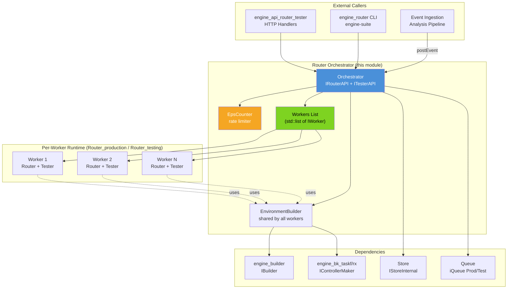
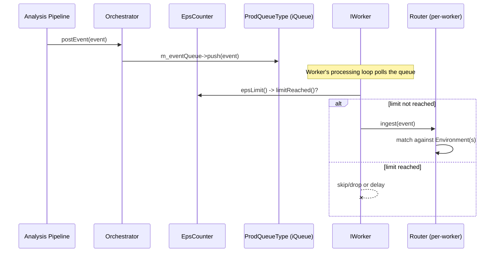
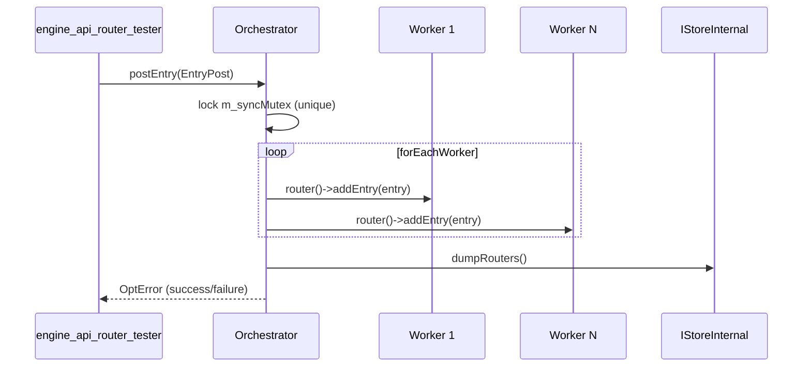
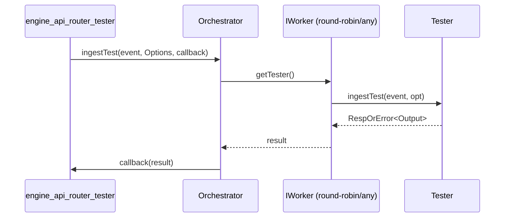
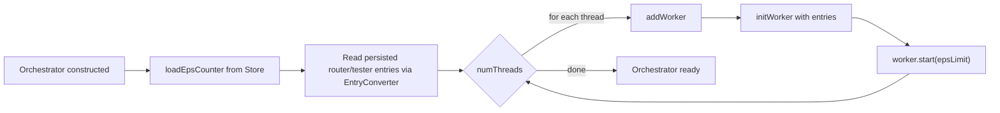
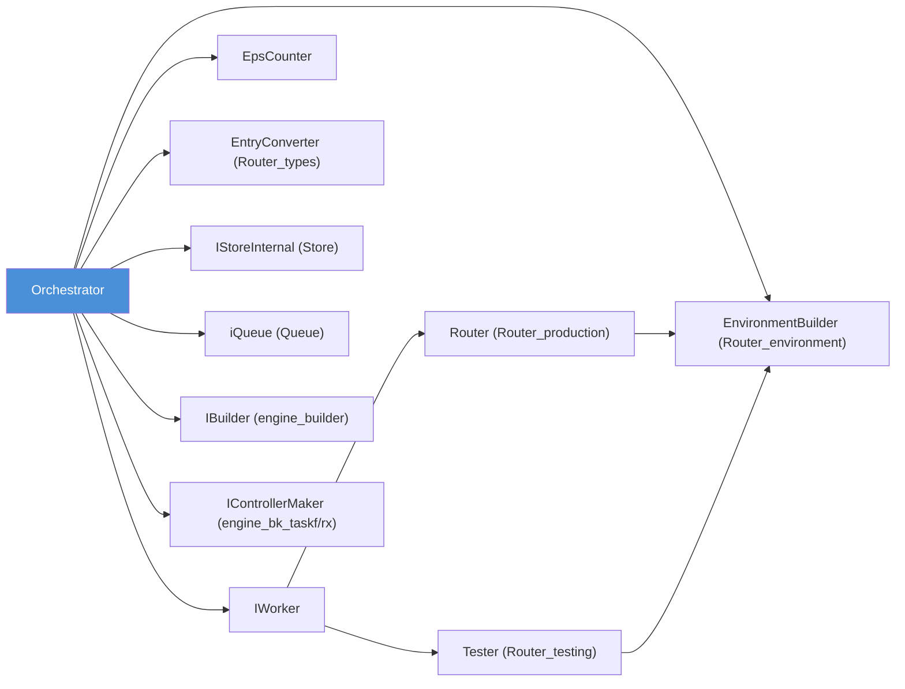

# Router Orchestrator

## Introduction

The **Router Orchestrator** is the top-level coordination component of the Wazuh Engine's [Router](Router.md) subsystem. It is the single public entry point (`router::Orchestrator`) through which the rest of the engine — the HTTP API handlers, the CLI tools, and the event ingestion pipeline — interacts with the routing subsystem. The Orchestrator owns and coordinates a pool of parallel **workers** (each wrapping an independent [Router_production](Router_production.md) instance and a [Router_testing](Router_testing.md) instance), throttles the overall event throughput through an **EPS (Events-Per-Second) counter**, and persists/restores router and tester state to the [Store](Store.md).

This document focuses on the components that make up the orchestration layer itself:

* `router::Orchestrator` (and its nested `Options` configuration struct) — declared in `orchestrator.hpp`
* `router::IWorker` — the abstraction the Orchestrator uses to fan out work to parallel router/tester pairs
* `router::Orchestrator::EpsCounter` — the sliding-window rate limiter used to cap ingestion throughput

Closely related sibling modules — not duplicated here — are:

* [Router_types](Router_types.md) — `EntryPost`/`Entry`/`Options` value objects and the `EntryConverter` (de)serialization helper used by the Orchestrator to talk to the API/JSON layer and to persist state.
* [Router_environment](Router_environment.md) — `Environment`/`EnvironmentBuilder`, used indirectly by workers to compile policies into runnable pipelines.
* [Router_production](Router_production.md) — the `Router` class (production entry table) that each worker owns.
* [Router_testing](Router_testing.md) — the `Tester` class (test entry table) that each worker owns.
* [engine_api_router_tester](engine_api_router_tester.md) — the HTTP handlers that expose the Orchestrator's `IRouterAPI`/`ITesterAPI` surface to the outside world.
* [engine_builder](engine_builder.md) — supplies the `IBuilder` used to compile policies/filters.
* [engine_bk_taskf](engine_bk_taskf.md) / [engine_bk_rx](engine_bk_rx.md) — supply the `IControllerMaker`/`IController` used to execute compiled pipelines.
* [Queue](Queue.md) — supplies the `iQueue` event/test queues consumed by the Orchestrator and its workers.

## Purpose and Responsibilities

The Orchestrator exists to solve three cross-cutting problems that individual `Router`/`Tester` instances cannot solve on their own:

1. **Parallelism** — A single `Router`/`Tester` pair is not thread-safe for high-throughput concurrent event processing. The Orchestrator creates `N` identical **workers** (one per configured thread), each with its own `Router` + `Tester` pair, and keeps their entry tables **synchronized** so that all workers expose the same logical set of routes/tests to API clients.
2. **Rate limiting** — Through the `EpsCounter`, the Orchestrator can cap the number of events accepted per second (configurable window and limit), protecting downstream systems from overload. This can be toggled on/off and reconfigured at runtime via the `IRouterAPI`.
3. **Durability** — Router entries, tester entries, and EPS settings are persisted to the [Store](Store.md) (under `router/router/0`, `router/tester/0`, `router/eps/0`) so that engine restarts can recover the previous routing configuration.

The Orchestrator implements two public interfaces (defined in the sibling [Router_types](Router_types.md)/interface headers):

* **`IRouterAPI`** — production route management (add/remove/reload/reprioritize entries, ingest events, EPS control).
* **`ITesterAPI`** — test route management (add/remove/reload test entries, synchronous/asynchronous test ingestion, asset introspection).

## Architecture Overview



## Component Reference

### `Orchestrator`

`router::Orchestrator` (in `orchestrator.hpp`) is the concrete implementation of `IRouterAPI` and `ITesterAPI`. Internally it:

* Holds a `std::list<std::shared_ptr<IWorker>> m_workers` and a `std::shared_mutex m_syncMutex` guarding it — every mutating API call (`postEntry`, `deleteEntry`, `reloadEntry`, …) is applied to **all** workers via the private `forEachWorker` helper, ensuring consistent state across threads.
* Owns a `std::shared_ptr<EnvironmentBuilder> m_envBuilder`, constructed once from the `IBuilder`/`IControllerMaker` supplied in `Options`, and shared by every worker so policy compilation logic and caching are consistent.
* Owns `m_eventQueue` (production events) and `m_testQueue` (test events), both `iQueue` instances from the [Queue](Queue.md) module, which are handed to workers so they can pull events to process.
* Owns the `EpsCounter` (`m_epsCounter`), used to gate `postEvent` when EPS limiting is active.
* Persists state via `dumpRouters()`, `dumpTesters()`, `dumpEps()` to `IStoreInternal`, and restores EPS settings on startup via `loadEpsCounter()`.

#### `Orchestrator::Options`

Configuration struct passed to the constructor:

| Field | Type | Purpose |
|---|---|---|
| `m_numThreads` | `int` | Number of workers (parallel Router/Tester pairs) to spawn |
| `m_wStore` | `weak_ptr<store::IStore>` | Store used to read namespaces/policies and persist state |
| `m_builder` | `weak_ptr<builder::IBuilder>` | Compiles policies/filters into expressions (see [engine_builder](engine_builder.md)) |
| `m_controllerMaker` | `shared_ptr<bk::IControllerMaker>` | Creates runtime `IController` pipelines (see [engine_bk_taskf](engine_bk_taskf.md)) |
| `m_prodQueue` / `m_testQueue` | `shared_ptr<iQueue<...>>` | Event/test queues consumed by workers |
| `m_testTimeout` | `int` | Timeout (ms) applied to synchronous test ingestion calls |

`Options::validate()` throws `std::runtime_error` if the configuration is inconsistent (e.g., zero threads, expired builder).

### `IWorker`

`router::IWorker` (in `iworker.hpp`) is the abstraction the Orchestrator uses to manage each parallel processing unit. Each concrete worker implementation bundles:

* A `std::shared_ptr<IRouter>` — a [Router_production](Router_production.md) `Router` instance managing the production entry table.
* A `std::shared_ptr<ITester>` — a [Router_testing](Router_testing.md) `Tester` instance managing the test entry table.
* Its own processing thread(s) that pull events off the shared queues and run them through the appropriate `IController`.

Key operations:

```cpp
virtual void start(const EpsLimit& epsLimit) = 0; // begin processing, honoring the EPS gate function
virtual void stop() = 0;
virtual const std::shared_ptr<IRouter>& getRouter() const = 0;
virtual const std::shared_ptr<ITester>& getTester() const = 0;
```

The `EpsLimit` callback (`std::function<bool()>`) is supplied by the Orchestrator and wraps `EpsCounter::limitReached()`, letting each worker's processing loop decide whether to skip/delay event ingestion.

### `EpsCounter` (Orchestrator::EpsCounter)

A lightweight, lock-free (atomics-based) sliding-window rate limiter nested inside `Orchestrator` (`epsCounter.hpp`). It supports:

* `limitReached()` — increments an internal atomic counter and, once the configured `eps * intervalSec` budget is exceeded, checks the elapsed time; if a full interval has elapsed, exactly one thread (via `compare_exchange_strong` on `m_canReset`) resets the counter — otherwise returns `true` (limit reached) so callers can back off.
* `start()` / `stop()` / `isActive()` — enable/disable EPS gating without destroying accumulated counters/settings.
* `changeSettings(eps, intervalSec)` — reconfigure the limiter at runtime (used by `Orchestrator::changeEpsSettings`).
* `getEps()` / `getRefreshInterval()` — introspection used when serializing settings for `getEpsSettings()` and `dumpEps()`.

Default configuration: `DEFAULT_EPS = 1000`, `DEFAULT_INTERVAL = 10` seconds, `DEFAULT_STATE = false` (disabled by default).

## Data Flow

### Event Ingestion (Production Path)



### Managing Production Entries



### Test Ingestion (Synchronous)



## Worker Initialization and State Recovery

On construction / `start()`, the Orchestrator:

1. Loads persisted EPS settings from the Store (`loadEpsCounter`).
2. Reads persisted router/tester entries (serialized as JSON via [`EntryConverter`](Router_types.md)) from `STORE_PATH_ROUTER_TABLE` / `STORE_PATH_TESTER_TABLE`.
3. Creates `m_numThreads` workers (`addWorker`), each initialized with the same set of router/tester entries (`initWorker`) so every worker starts with identical routing state.
4. Calls `start(epsLimit)` on every worker, where `epsLimit` is a closure delegating to `m_epsCounter->limitReached()`.



## Dependency Diagram



## API Surface Summary

The Orchestrator exposes the union of `IRouterAPI` and `ITesterAPI` (both defined in the [Router_types](Router_types.md) interface header set):

**IRouterAPI (production):**
- `postEntry` / `deleteEntry` / `getEntry` / `getEntries`
- `reloadEntry` — rebuild a route's environment (e.g., after policy update)
- `changeEntryPriority` — reorder route evaluation priority
- `postEvent` — enqueue an event for ingestion
- `changeEpsSettings` / `getEpsSettings` / `activateEpsCounter` — EPS rate-limiter control

**ITesterAPI (testing):**
- `postTestEntry` / `deleteTestEntry` / `getTestEntry` / `getTestEntries` / `reloadTestEntry`
- `ingestTest` — synchronous (callback-based) and asynchronous (`std::future`-based) overloads
- `getAssets` — list assets composing a tested policy/environment
- `getTestTimeout` — timeout configured for test operations

These methods are consumed directly by the HTTP handlers in [engine_api_router_tester](engine_api_router_tester.md) and by the `engine_router` CLI tool family (`engine-suite`), documented in [Engine_Administration_CLI_Tools_(Python)](Engine_Administration_CLI_Tools_(Python).md).

## Concurrency Model

* **Reader/Writer synchronization**: `m_syncMutex` is a `std::shared_mutex`. Query operations (`getEntry`, `getEntries`, `getTestEntries`, …) take a shared (read) lock, allowing concurrent reads across multiple API calls. Mutating operations (`postEntry`, `deleteEntry`, `reloadEntry`, `changeEntryPriority`, …) take a unique (write) lock and are applied sequentially across all workers via `forEachWorker`, guaranteeing all workers converge to the same state before the lock is released.
* **Per-worker isolation**: Each worker processes events from the shared queues independently and concurrently; only the *entry table* is kept in a globally-consistent state — actual event processing throughput scales with `m_numThreads`.
* **Lock-free EPS gating**: The `EpsCounter` is implemented entirely with `std::atomic` primitives to avoid adding contention/latency to the hot event-processing path.

## Related Modules

| Module | Relationship |
|---|---|
| [Router_types](Router_types.md) | Provides `EntryPost`/`Entry`/`Options` value types and the `EntryConverter` (de)serialization utility used throughout the Orchestrator for API translation and persistence. |
| [Router_environment](Router_environment.md) | Provides `EnvironmentBuilder`/`Environment`, used by workers' `Router`/`Tester` instances to compile and run policies. |
| [Router_production](Router_production.md) | Implements the `Router` class that each `IWorker` owns for production routing. |
| [Router_testing](Router_testing.md) | Implements the `Tester` class that each `IWorker` owns for test routing. |
| [engine_api_router_tester](engine_api_router_tester.md) | HTTP handlers exposing `IRouterAPI`/`ITesterAPI` to the Wazuh API. |
| [engine_builder](engine_builder.md) | Supplies `IBuilder`, compiling policies/filters into runnable expressions. |
| [engine_bk_taskf](engine_bk_taskf.md) / [engine_bk_rx](engine_bk_rx.md) | Supply `IControllerMaker`/`IController` backend execution engines. |
| [Queue](Queue.md) | Supplies the `iQueue` implementations used for production/test event queues. |
| [Store](Store.md) | Persistence layer used to save/restore router, tester, and EPS state. |
