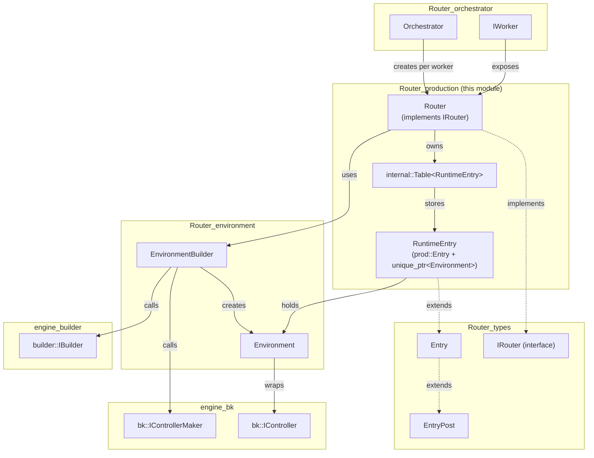
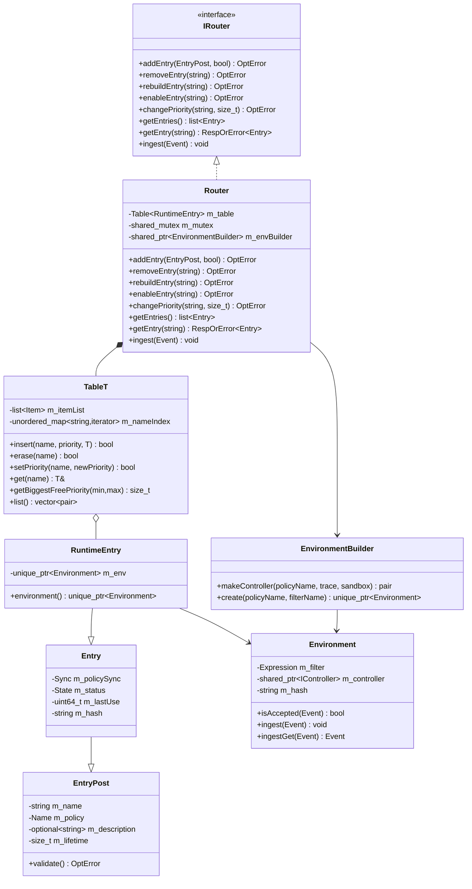
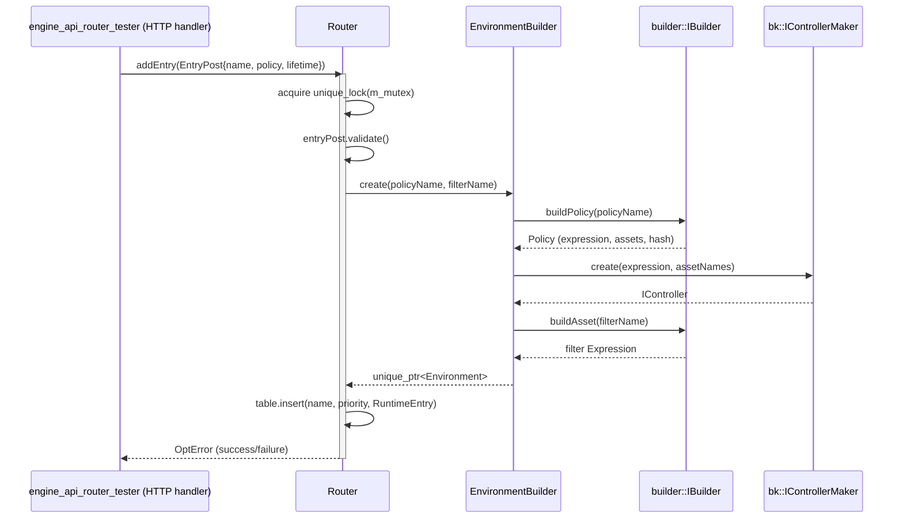
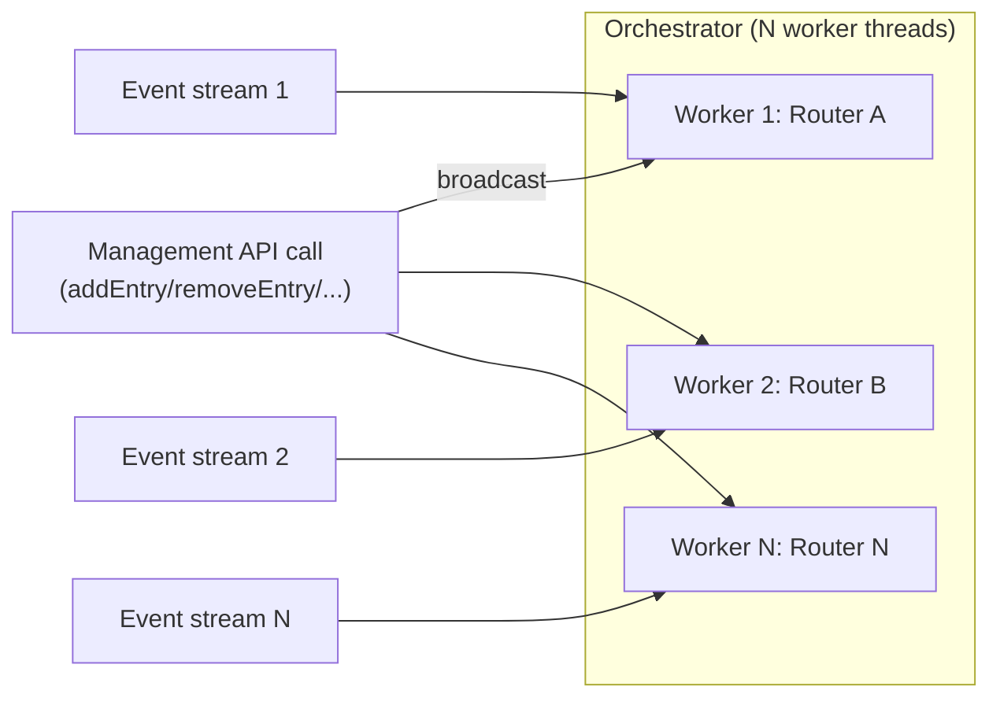
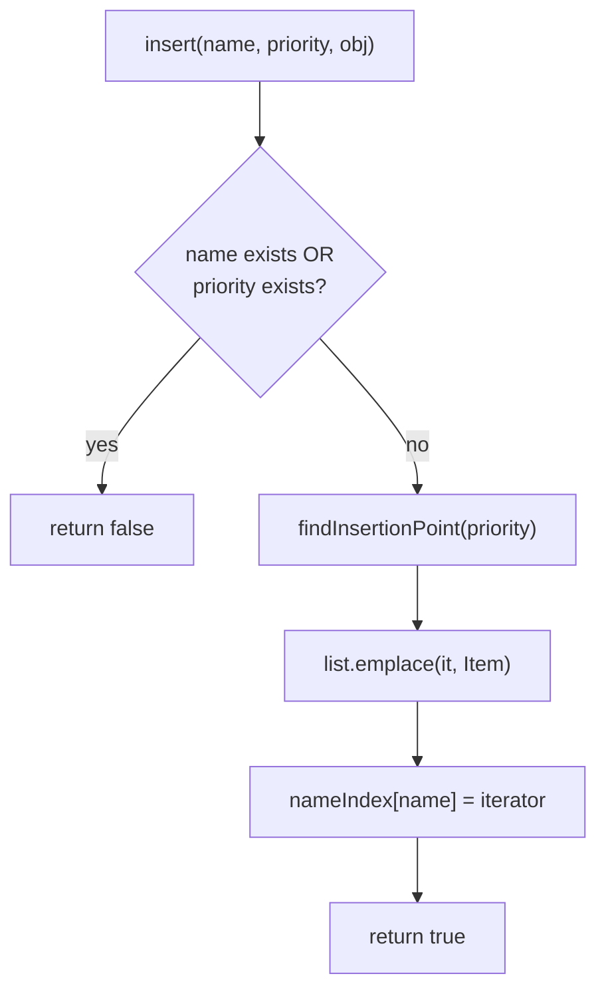
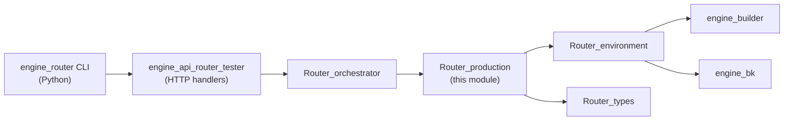

# Router_production

## Introduction

**Router_production** is the runtime core of the Wazuh Engine's routing subsystem. It implements the `Router` class — the concrete, thread-safe manager of **production environments** — together with the generic `internal::Table<T>` container used to index those environments by name and by routing priority.

While the Engine's [Router_orchestrator](Router_orchestrator.md) coordinates multiple worker threads and the [Router_testing](Router_testing.md) module handles ephemeral test sessions, **Router_production** is the component actually responsible for:

- Registering, removing, enabling/disabling and re-prioritizing production environments (policy + filter pairs bound to a name).
- Efficiently selecting, for every incoming event, the correct environment(s) to ingest it into, evaluating environments in priority order.
- Delegating environment (policy) construction to [Router_environment](Router_environment.md)'s `EnvironmentBuilder`.
- Exposing a query API (`getEntries`, `getEntry`) consumed by the `engine_api_router_tester` handlers (part of [engine_api](Wazuh_Engine_Core_(C++).md)) and by the [Engine Administration CLI (`engine_router`)](Engine_Administration_CLI_Tools_(Python).md) tool.

This module is purely in-process C++ (no network/IPC of its own); it is invoked by one or more `IWorker` instances managed by the orchestrator, each of which owns its own `Router` instance and its own copy of the environment table, per-thread, for lock-minimized concurrent ingestion.

---

## Responsibilities and Scope

| Responsibility | Description |
|---|---|
| Environment registry | Maintains a priority-ordered, name-indexed collection of production `Environment` objects. |
| Lifecycle management | Add / remove / rebuild / enable an environment at runtime without stopping the Engine. |
| Priority management | Assign and change the routing priority of an environment; guarantees at most one environment per priority slot. |
| Event dispatch | On `ingest(event)`, walks the priority-ordered table and forwards the event to the first (or all matching, depending on filter semantics) environment whose filter accepts it. |
| Introspection | Provides read access to the full list of entries or a single entry by name (used by the `router` and `tester` HTTP API handlers). |
| Concurrency control | Guards the internal table with a `std::shared_mutex`, allowing many concurrent readers (event ingestion) and exclusive writers (management operations). |

Router_production purposefully does **not**:
- Build policies/filters/controllers itself — that is delegated to `EnvironmentBuilder` (see [Router_environment](Router_environment.md)).
- Manage worker threads or EPS throttling — that is the job of [Router_orchestrator](Router_orchestrator.md).
- Handle test sessions or non-production tracing — that is [Router_testing](Router_testing.md).
- Define the wire types (`Entry`, `EntryPost`, `Options`) shared across the Router subsystem — those live in [Router_types](Router_types.md).

---

## Core Components

### `router::Router` (`src/engine/source/router/src/router.hpp`)

The `Router` class implements the `IRouter` interface (declared in `router/interface/router/irouter.hpp`, part of [Router_types](Router_types.md)). It is the single authoritative object per worker for managing production environments.

Key internal members:

- `internal::Table<RuntimeEntry> m_table` — the priority/name-indexed collection of environments.
- `std::shared_mutex m_mutex` — protects all table operations; write operations (`addEntry`, `removeEntry`, `rebuildEntry`, `enableEntry`, `changePriority`) take an exclusive lock, while `ingest`/`getEntries`/`getEntry` take a shared lock.
- `std::shared_ptr<EnvironmentBuilder> m_envBuilder` — used to construct new `Environment` instances from a policy name and filter name (see [Router_environment](Router_environment.md)).

`Router::RuntimeEntry` is a private nested class extending `prod::Entry` (defined in [Router_types](Router_types.md)) by attaching the actual constructed `std::unique_ptr<Environment>` to the metadata entry. This separates the "descriptive" entry (name, policy, status, sync state, hash) from the "runtime" object (compiled controller graph + filter expression).

Public API (implements `IRouter`):

| Method | Purpose |
|---|---|
| `addEntry(EntryPost, ignoreFail=false)` | Validates and builds a new environment, inserts it into the table at the requested priority. |
| `removeEntry(name)` | Removes an environment by name; stops its underlying controller (via `Environment`'s destructor). |
| `rebuildEntry(name)` | Rebuilds the environment (e.g., after a policy content change) while keeping the same name/priority. |
| `enableEntry(name)` | Marks/activates a previously disabled entry. |
| `changePriority(name, priority)` | Moves an entry to a new priority slot; fails if the target priority is occupied. |
| `getEntries() const` | Returns the metadata (`prod::Entry`) for all registered environments. |
| `getEntry(name) const` | Returns the metadata for one environment, or an error if not found. |
| `ingest(base::Event&&)` | Core dispatch function: for each environment, in priority order, evaluates its filter and forwards the event if accepted. |

### `router::internal::Table<T>` (`src/engine/source/router/src/table.hpp`)

A generic, reusable ordered map/list hybrid container providing:

- **Dual indexing**: a `std::unordered_map<std::string, iterator>` for O(1) name lookup, and a `std::list<Item>` kept sorted by priority for ordered iteration/insertion.
- **Uniqueness guarantees**: both `name` and `priority` must be unique across entries; `insert()` fails (`false`) if either is already taken.
- **Priority helpers**: `priorityExists()`, `getBiggestFreePriority(min, max)` (used by callers, e.g. the API handlers, to auto-assign a free priority slot).
- **Mutation**: `erase(name)`, `setPriority(name, newPriority)` (re-splices the list node to preserve order without reallocating the stored object when possible).
- **Iteration**: custom `iterator` / `const_iterator` classes that wrap the underlying `std::list<Item>::iterator`, dereferencing directly to the stored object `T` (hiding the `Item` wrapper struct that carries `name`/`priority` alongside the object).
- **Introspection**: `size()`, `empty()`, `list()` (returns a vector of `(name, priority)` pairs, used to build API responses).

`Table<T>` is intentionally decoupled from the Router-specific type `RuntimeEntry`; it could be reused for other priority-indexed collections within the Engine.

---

## Architecture



---

## Component Interaction



---

## Data Flow: Event Ingestion

The `ingest()` method is the hot path executed for every event flowing through a production worker.

```mermaid
sequenceDiagram
    participant Worker as IWorker (Router_orchestrator)
    participant Router as Router
    participant Table as internal::Table&lt;RuntimeEntry&gt;
    participant Env as Environment
    participant Ctrl as bk::IController

    Worker->>Router: ingest(event)
    activate Router
    Router->>Router: acquire shared_lock(m_mutex)
    Router->>Table: iterate (priority order)
    loop for each RuntimeEntry
        Table-->>Router: RuntimeEntry (name, status, environment)
        Router->>Env: isAccepted(event)
        alt filter accepts
            Router->>Env: ingest(event) [or ingestGet]
            Env->>Ctrl: ingest(event)
            Ctrl-->>Env: processed
        else filter rejects
            Router->>Router: continue to next entry
        end
    end
    Router->>Router: release lock
    deactivate Router
```

---

## Process Flow: Managing an Environment



---

## Concurrency Model

- **Readers (event ingestion, `getEntries`, `getEntry`)** acquire a `std::shared_lock` on `m_mutex`, allowing multiple ingestion calls (e.g., from concurrent producers within the same worker, or read-only introspection) to proceed in parallel.
- **Writers (`addEntry`, `removeEntry`, `rebuildEntry`, `enableEntry`, `changePriority`)** acquire a `std::unique_lock`, serializing all mutating operations and blocking readers momentarily.
- Because each `IWorker` (see [Router_orchestrator](Router_orchestrator.md)) owns an independent `Router` instance and table, there is **no cross-thread contention between workers** — management API calls are broadcast to every worker's `Router` individually by the orchestrator, and each maintains its own lock.



---

## `internal::Table<T>` Design Details

The `Table<T>` container is the backbone of ordered environment lookup. Its design goals:

1. **O(1) name-based access** via `std::unordered_map<std::string, list::iterator>`.
2. **Priority-ordered iteration** via a `std::list<Item>` kept sorted on insertion (`findInsertionPoint`), so that `ingest()` can simply walk the list in order without a separate sort step.
3. **Stable iterators**: because it's backed by `std::list`, existing iterators remain valid across insertions/erasures elsewhere in the list — important since `RuntimeEntry` objects are non-copyable (`unique_ptr<Environment>` member) and must be moved, not copied, during operations like `setPriority`.



---

## Relationships to Other Modules

| Related Module | Relationship |
|---|---|
| [Router_types](Router_types.md) | Supplies the shared `Entry`, `EntryPost`, `Options`, `AssetTrace` types and the `IRouter` interface that `Router` implements. |
| [Router_environment](Router_environment.md) | Supplies `Environment` and `EnvironmentBuilder`, used by `Router` to materialize policies/filters into running controllers. |
| [Router_orchestrator](Router_orchestrator.md) | Owns and drives one `Router` instance per worker thread; exposes the high-level `Orchestrator` API that fan-outs management calls to all `Router` instances and routes incoming events to the appropriate worker. |
| [Router_testing](Router_testing.md) | Parallel subsystem (`Tester`) for ephemeral test sessions; conceptually mirrors `Router` but does not affect production routing state. |
| [Wazuh_Engine_Core_(C++)](Wazuh_Engine_Core_(C++).md) (`engine_builder` — `builder::IBuilder`) | Used indirectly (via `EnvironmentBuilder`) to compile policies and filters into executable expressions/controllers. |
| [Wazuh_Engine_Core_(C++)](Wazuh_Engine_Core_(C++).md) (`engine_bk` — `bk::IControllerMaker`, `bk::IController`) | Used indirectly (via `EnvironmentBuilder`) to build and run the backend graph controller for each environment. |
| [Wazuh_Engine_Core_(C++)](Wazuh_Engine_Core_(C++).md) (`engine_api_router_tester`) | The HTTP API layer (`api::router::handlers`) that exposes `Router`'s CRUD operations (`addEntry`, `removeEntry`, `changePriority`, list/get) to external clients. |
| [Engine Administration CLI Tools (`engine_router`)](Engine_Administration_CLI_Tools_(Python).md) | Python CLI (`engine_router` command group: `add`, `delete`, `get`, `list`, `update`, `ingest`, `reload`, EPS controls) that talks to the API layer, which ultimately calls into `Router`. |



---

## Summary

Router_production is a small but critical module: it is the data structure and algorithm that decide, for every single event the Wazuh Engine ingests, *which compiled policy pipeline processes it*. Its design emphasizes:

- **Correctness under concurrency** via `shared_mutex` and per-worker isolation.
- **Deterministic priority-based dispatch** via the specialized `internal::Table<T>`.
- **Separation of concerns**: `Router` only orchestrates entries and dispatch; actual policy/controller construction is delegated to [Router_environment](Router_environment.md), and thread/worker management is delegated to [Router_orchestrator](Router_orchestrator.md).

For details on how policies are compiled into `Environment` objects, see [Router_environment](Router_environment.md). For the higher-level multi-worker orchestration and EPS throttling that drives `Router` instances, see [Router_orchestrator](Router_orchestrator.md).
