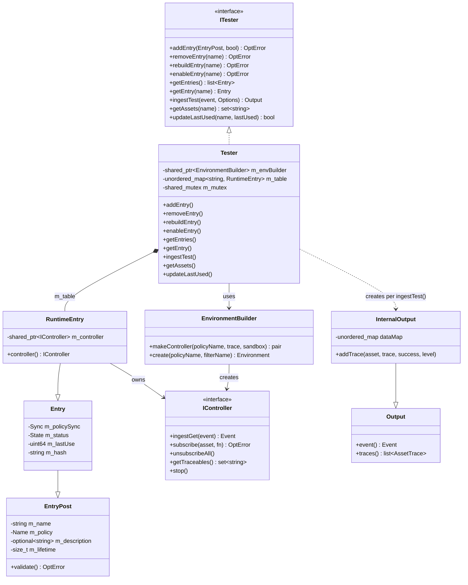
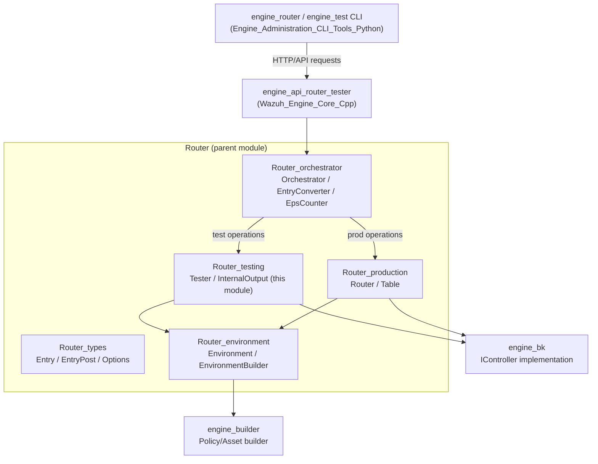
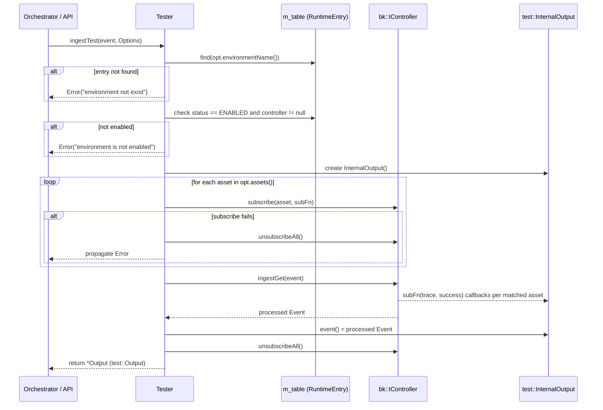
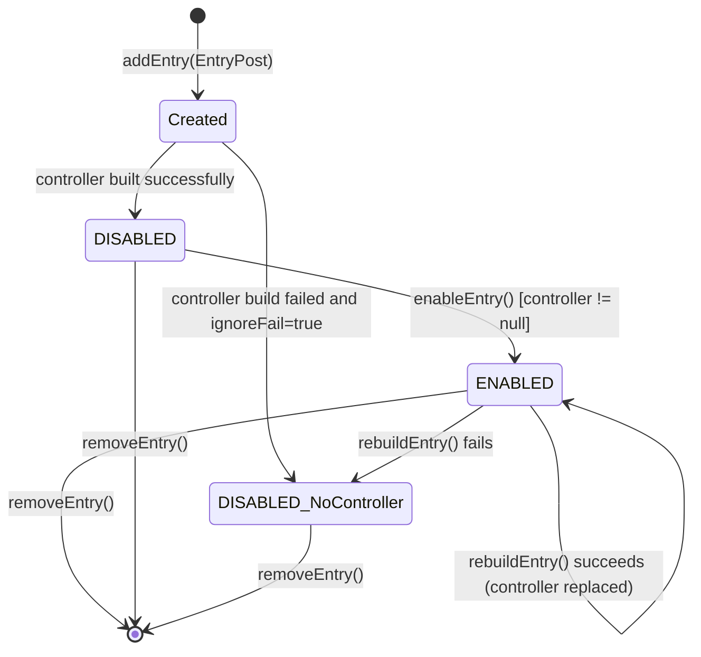

# Router_testing Module

## Introduction

The **Router_testing** module is the sandboxed evaluation layer of the Wazuh Engine's [Router](Router.md) subsystem. It allows operators and automated tools (via the [Router_orchestrator](Router_orchestrator.md) and the `engine-test` / `engine-router` CLI tools, see [Engine_Administration_CLI_Tools_(Python)](Engine_Administration_CLI_Tools_(Python).md)) to load a security policy into an isolated, traceable environment and feed it synthetic or replayed events **without impacting the live production routing table** managed by [Router_production](Router_production.md).

It is implemented almost entirely by two files:

| File | Responsibility |
|---|---|
| `src/engine/source/router/src/tester.hpp` | Declares the `Tester` class (implements `ITester`) and its private `RuntimeEntry` helper, which wraps a `test::Entry` with a live `bk::IController`. |
| `src/engine/source/router/src/tester.cpp` | Implements all `Tester` operations and defines `InternalOutput`, a concrete accumulator of per-asset execution traces used to build the response returned to the caller. |

The module answers the question: *"If I sent this event through policy X, which assets would match, and what would the trace/output look like?"* — a feature indispensable for content authors validating decoders, rules, and pipelines before promoting a policy to production.

---

## Purpose and Core Functionality

`Tester` maintains an in-memory table of **testing environments** (`RuntimeEntry` objects), each one bound to:

- A **policy name** and **lifetime** (via the shared `test::EntryPost` / `test::Entry` value objects defined in [Router_types](Router_types.md)).
- A **backend controller** (`bk::IController`, from [engine_bk](Wazuh_Engine_Core_(C++).md)) that actually executes the built policy graph.
- A **hash** of the compiled policy, used by the orchestrator to detect staleness when the underlying policy asset changes.

Core capabilities exposed through the `ITester` interface:

1. **Entry lifecycle management** — `addEntry`, `removeEntry`, `rebuildEntry`, `enableEntry`.
2. **Introspection** — `getEntries`, `getEntry`, `getAssets` (lists the traceable asset names exposed by the underlying controller).
3. **Event ingestion for testing** — `ingestTest`, which subscribes to a caller-selected subset of assets, runs the event through the controller, collects success/trace information per asset via `InternalOutput`, and returns a `test::Output`.
4. **Usage tracking** — `updateLastUsed`, used by the orchestrator's eviction/expiration logic to reclaim idle testing sessions.

Unlike the production [Router](Router.md), the Tester:

- Builds its controllers with `trace = true` and `sandbox = true` (default parameters of `EnvironmentBuilder::makeController`), enabling per-asset tracing hooks that are stripped out in production for performance.
- Does **not** use a routing table with priorities or filters — each entry is an independent, addressable policy instance selected explicitly by name (`Options::environmentName()`), not by event-content matching.
- Starts new entries in `env::State::DISABLED` so they must be explicitly enabled (`enableEntry`) once ready, avoiding races during creation.

---

## Architecture

### Component Relationships

### Position within the Router Subsystem

The **Router_orchestrator** module (`router::Orchestrator`, `EntryConverter`) is the primary caller of `Tester`. It converts external API request DTOs into `test::EntryPost` / `test::Options` objects, forwards them to `Tester`, and converts `Tester` responses back into API protobuf messages (see [engine_api_router_tester](Wazuh_Engine_Core_(C++).md) handlers). The Tester itself depends only on:

- **[Router_types](Router_types.md)** for the `Entry`, `EntryPost`, `Options`, and `AssetTrace`/`Output` data structures it extends and returns.
- **[Router_environment](Router_environment.md)** (`EnvironmentBuilder`) to compile a policy name into a running `bk::IController`.
- **[engine_bk](Wazuh_Engine_Core_(C++).md)** (`bk::IController`) as the actual execution backend that runs the compiled expression graph and supports per-asset trace subscriptions.

---

## Data Flow: `ingestTest`

The most complex operation is `ingestTest`, which drives a single event through a named testing environment and gathers structured trace data.

Key details captured from the implementation:

- A **shared lock** (`std::shared_lock`) is held for the whole ingestion, allowing concurrent reads/ingests across different environments while still being safe against concurrent structural modifications (add/remove use `unique_lock`).
- `InternalOutput::addTrace` deduplicates by asset name using an internal map (`m_dataMap`) pointing into the `Output::m_traces` list, so multiple trace lines for the same asset are appended together instead of creating duplicate entries.
- The special trace content `"SUCCESS"` is treated as a sentinel marking `AssetTrace::success = true` rather than being stored as a literal trace line.
- Trace lines are only recorded when `Options::TraceLevel::ALL` is requested; with `ASSET_ONLY`, only the success flag is meaningfully tracked (no free-text trace lines are stored), and with `NONE` no assets should have been requested at all (validated in `Options::validate()`).

---

## Entry Lifecycle

- **`addEntry`**: Builds a `RuntimeEntry` from the DTO, asks `EnvironmentBuilder::makeController` to compile the policy into a controller + hash. On failure, if `ignoreFail` is `false` the whole call fails; if `true`, the entry is still stored but with a `nullptr` controller (so it can be fixed later via `rebuildEntry`). New entries always start `DISABLED`. Duplicate names are rejected.
- **`removeEntry`**: Deletes the table entry; the `RuntimeEntry` destructor stops the underlying controller if present.
- **`rebuildEntry`**: Re-invokes `EnvironmentBuilder::makeController` for an existing entry (e.g., after the underlying policy was edited), replacing the controller and hash in place.
- **`enableEntry`**: Transitions a `DISABLED` entry with a valid controller to `ENABLED`, the only state from which `ingestTest`/`getAssets` succeed.
- **`updateLastUsed`**: Refreshes `lastUse` timestamp (defaulting to "now" in epoch seconds via the internal `getStartTime()` helper) — used by the orchestrator to expire idle sessions based on `EntryPost::lifetime()`.

---

## Concurrency Model

`Tester` protects its `m_table` with a single `std::shared_mutex`:

| Operation | Lock type | Rationale |
|---|---|---|
| `addEntry`, `removeEntry`, `rebuildEntry`, `enableEntry`, `updateLastUsed` | `unique_lock` | Structural mutation of the table or of an entry's controller/status. |
| `getEntries`, `getEntry`, `getAssets`, `ingestTest` | `shared_lock` | Read-only access to the table; multiple ingests/reads can proceed concurrently. |

Because `ingestTest` only takes a `shared_lock`, **multiple test ingestions against different (or even the same) environment can run concurrently**, relying on `bk::IController` being safe for concurrent `ingestGet`/`subscribe`/`unsubscribeAll` calls. Structural changes to the same entry (e.g., `rebuildEntry` while an `ingestTest` is in flight) are serialized by the shared_mutex, but note that the controller pointer used inside an in-progress `ingestTest` was already copied under the shared lock before it was taken — callers should avoid rebuilding actively-tested environments to prevent races on the raw controller object.

---

## Relationship to Sibling Router Modules

| Module | Relationship |
|---|---|
| [Router_types](Router_types.md) | Supplies `Entry`, `EntryPost`, `Options`, `Output`/`AssetTrace` reused/extended by `Tester` and `InternalOutput`. |
| [Router_environment](Router_environment.md) | Supplies `EnvironmentBuilder`, the sole mechanism `Tester` uses to compile a policy name into an executable `bk::IController`. |
| [Router_production](Router_production.md) | The production counterpart (`Router`/`Table`) — conceptually parallel to `Tester`, but keyed by routing priority/filter rather than by explicit environment name, and built with tracing disabled for performance. |
| [Router_orchestrator](Router_orchestrator.md) | The façade (`Orchestrator`, `EntryConverter`, `EpsCounter`) that exposes `Tester` operations to the [engine_api_router_tester](Wazuh_Engine_Core_(C++).md) HTTP handlers and to the `engine-test`/`engine-router` CLI tools. |
| [engine_bk](Wazuh_Engine_Core_(C++).md) | Provides the `bk::IController` abstraction (and its `rx`/`taskf` implementations) that actually executes the compiled policy graph and calls back into `InternalOutput` via subscriptions. |
| [engine_builder](Wazuh_Engine_Core_(C++).md) | Indirectly used through `EnvironmentBuilder`, which asks `builder::IBuilder` to compile the named policy into assets and an executable expression. |

---

## Summary

The Router_testing module is a compact but pivotal piece of the Wazuh Engine: it turns a static policy name into a fully live, traceable, on-demand test bench. By cleanly separating environment lifecycle (`addEntry`/`enableEntry`/`removeEntry`/`rebuildEntry`) from event evaluation (`ingestTest`), and by reusing the same `EnvironmentBuilder` abstraction as the production router, it guarantees that testing results closely mirror production behavior while remaining fully isolated, concurrently accessible, and safe to tear down without side effects on live traffic.
