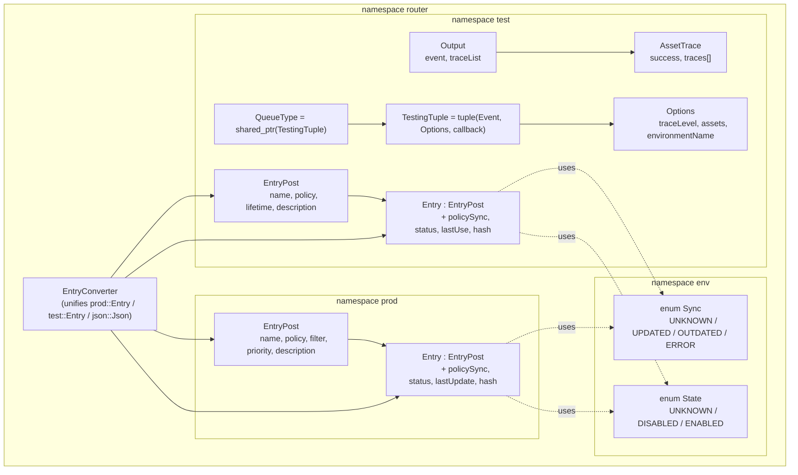
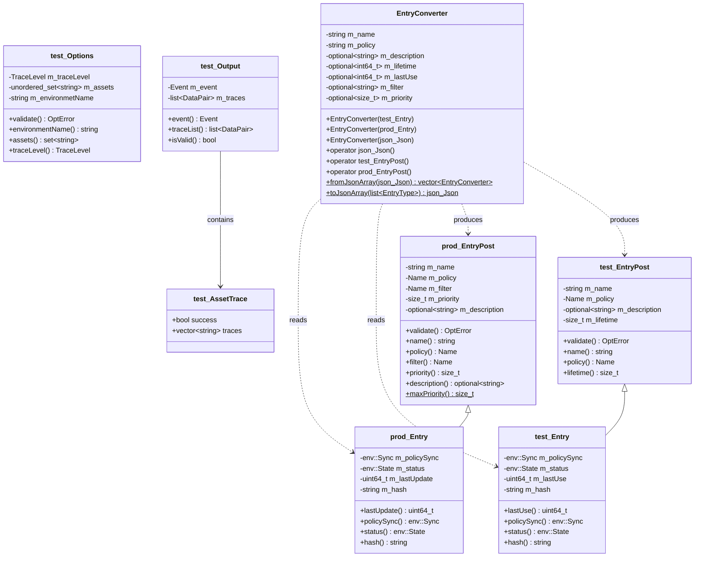
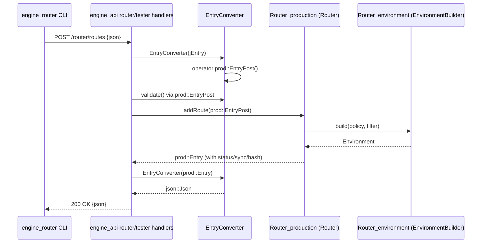
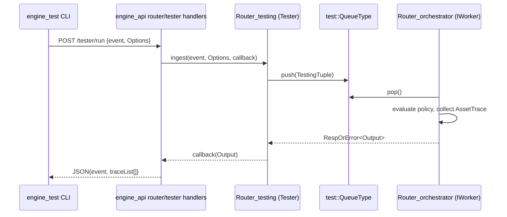
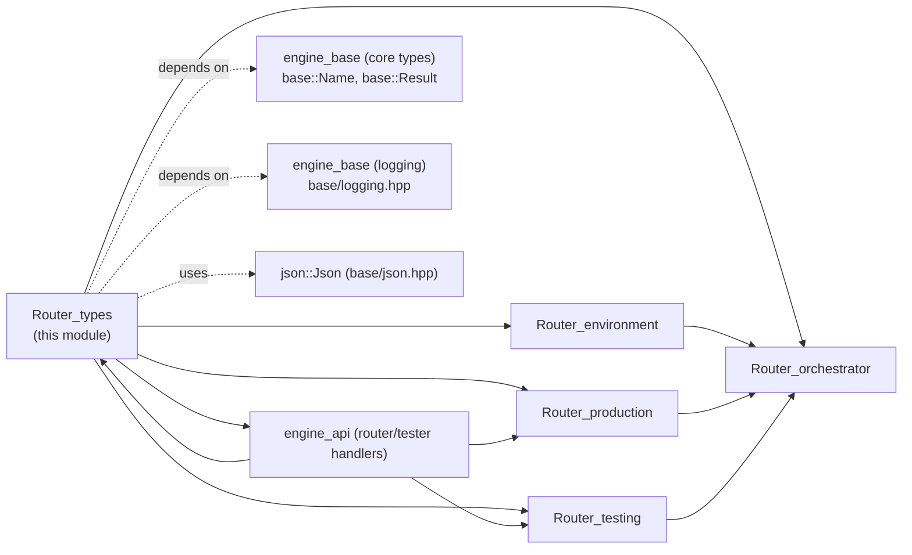

# Router_types

## Introduction

`Router_types` is the foundational data-model module of the Wazuh **Engine Router** subsystem (part of `Wazuh_Engine_Core_(C++)`). It defines the plain data structures — request/response DTOs, state enumerations, and JSON conversion helpers — that are shared by every other Router component: the [Router_production](Router_production.md) table, the [Router_testing](Router_testing.md) tester, the [Router_environment](Router_environment.md) builder, and the [Router_orchestrator](Router_orchestrator.md) façade.

The module does not contain any business logic, threads, or I/O. It exists purely to give the rest of the Router a single, strongly-typed vocabulary for describing **routes** (a policy + filter bound with a priority, running in production) and **test sessions** (a policy bound to a temporary testing environment), together with a converter class (`EntryConverter`) that translates these types to/from the JSON representation used by the [engine_api](engine_api.md) router/tester HTTP handlers and the [Store](Store.md) persistence layer.

## Purpose and Core Functionality

| Responsibility | Component |
|---|---|
| Represent a route creation request (production) | `router::prod::EntryPost` |
| Represent a persisted/queried route (production) | `router::prod::Entry` |
| Represent a test-session creation request | `router::test::EntryPost` |
| Represent a persisted/queried test session | `router::test::Entry` |
| Configure how a test run should be traced | `router::test::Options` |
| Carry the result of a single test run (event + per-asset traces) | `router::test::Output` / `router::test::Output::AssetTrace` |
| Define the async work item used by the tester's queue | `router::test::TestingTuple` / `router::test::QueueType` |
| Represent environment lifecycle state | `router::env::State`, `router::env::Sync` |
| Convert between `prod`/`test` entries and `json::Json` | `router::EntryConverter` |

These types are intentionally decoupled from the runtime engine objects (`Environment`, `Router`, `Tester`) so that the API layer, the persistence layer, and the runtime layer can all depend on a stable, serializable contract instead of on each other's internals.

## Architecture

### Namespace layout

### Class relationships

## Detailed Component Description

### `router::env::State` / `router::env::Sync`
Two lightweight enums shared by both `prod::Entry` and `test::Entry`:
- **`State`**: `UNKNOWN`, `DISABLED`, `ENABLED` — whether an environment (production route or test session) is currently active.
- **`Sync`**: `UNKNOWN`, `UPDATED`, `OUTDATED`, `ERROR` — whether the in-memory policy matches the version stored in the [Store](Store.md).

These are consumed by [Router_environment](Router_environment.md) (`Environment`/`EnvironmentBuilder`) and [Router_production](Router_production.md) (`Router`, `table::Item`) to decide whether a route needs to be rebuilt.

### `router::prod::EntryPost` and `router::prod::Entry`
- `EntryPost` is the **input DTO** for creating a production route: `name`, `policy` (a `base::Name`), `filter` (a `base::Name`), and numeric `priority` (1–1000). It self-validates via `validate()`, returning a `base::OptError` describing the first violation (empty name/policy/filter, zero or too-large priority).
- `Entry` **extends** `EntryPost` (public inheritance) adding runtime/query-only fields: `policySync`, `status`, `lastUpdate`, and `hash`. It is the type returned by GET/list operations exposed through the [engine_api](engine_api.md) router handlers and internally by [Router_production](Router_production.md)'s `Router`/`table::Item`.

### `router::test::EntryPost` and `router::test::Entry`
Mirror the production types but for **test sessions**: instead of `filter`/`priority`, a test session carries a `lifetime` (how long the session is retained). `Entry` adds `lastUse` instead of `lastUpdate`. These are consumed by [Router_testing](Router_testing.md)'s `Tester`/`RuntimeEntry`.

### `router::test::Options`
Encapsulates how a single test invocation should be traced:
- `TraceLevel`: `NONE`, `ASSET_ONLY`, `ALL`.
- `assets`: an optional allow-list of asset names to trace (only meaningful when `TraceLevel != NONE`).
- `environmentName`: the test session against which the event is evaluated.
- `validate()` enforces that the environment name isn't empty and that asset filtering isn't combined with `TraceLevel::NONE`.

### `router::test::Output` and `AssetTrace`
`Output` is the **result** of running one event through a test environment: the produced `base::Event` plus an ordered `list<pair<assetName, AssetTrace>>`. `AssetTrace` records whether an asset stage `success`-fully processed the event and any human-readable `traces` collected along the way. `isValid()` simply checks the event pointer is non-null.

### `router::test::TestingTuple` / `QueueType`
A `std::tuple<base::Event, Options, std::function<void(base::RespOrError<Output>&&)>>` wrapped in a `shared_ptr`. This is the unit of work pushed onto the internal queue consumed by [Router_testing](Router_testing.md)'s `Tester` and by the async worker described in [Router_orchestrator](Router_orchestrator.md) (`IWorker`).

### `router::EntryConverter`
A **format-agnostic adapter** that can be constructed from any of the three representations of a route/test entry — `prod::Entry`, `test::Entry`, or a raw `json::Json` document — and can subsequently be converted (via explicit `operator` overloads) into `json::Json`, `test::EntryPost`, or `prod::EntryPost`. It normalizes field naming differences (`filter`/`priority` only exist for production; `lifetime`/`lastUse` only exist for testing) behind `std::optional` members, so callers can safely round-trip an entry regardless of its origin. Static helpers `fromJsonArray` and `toJsonArray<EntryType>` support bulk (de)serialization of lists, which is how the [engine_api](engine_api.md) handlers implement `router list` / `tester list` endpoints.

## Data Flow

### Creating a production route (API → Router)

### Running a test event

## Component Interaction within the Router Subsystem

- **[Router_environment](Router_environment.md)** consumes `prod::EntryPost`/`test::EntryPost` to construct runtime `Environment` objects and reports back `env::State`/`env::Sync`.
- **[Router_production](Router_production.md)** stores `prod::Entry` objects in its routing `table::Item`s and exposes CRUD operations keyed by `EntryPost` validation rules defined here.
- **[Router_testing](Router_testing.md)** stores `test::Entry` objects per session and uses `test::Options`/`test::Output`/`test::TestingTuple` to drive asynchronous event evaluation.
- **[Router_orchestrator](Router_orchestrator.md)** (`EnvironmentBuilder`, `EpsCounter`, `IWorker`) is the glue that turns `EntryPost` requests into running `Environment`s and dispatches `TestingTuple` work items.
- **`EntryConverter`** is the single point of contact between all of the above and the JSON wire format handled by the [engine_api](engine_api.md) HTTP handlers (`api/router/handlers.hpp`, `api/tester/handlers.hpp`).

## Dependencies

| Dependency | Reason |
|---|---|
| [engine_base](Wazuh_Engine_Core_(C++).md) core types (`base::Name`, `base::Result`/`base::Error`) | `base::Name` for policy/filter identifiers; `base::OptError`/`base::Error` for validation results |
| [engine_base](Wazuh_Engine_Core_(C++).md) logging (`base/logging.hpp`) | Included by `types.hpp` for logging macros used elsewhere in the Router |
| `base/json.hpp` (base JSON utilities, see [YML](Wazuh_Engine_Core_(C++).md)) | Backing type for `EntryConverter`'s JSON (de)serialization |
| `base/baseTypes.hpp` (`base::Event`) | Type of the event carried in `test::Output` and `test::TestingTuple` |

No component in `Router_types` performs I/O, threading, or holds engine state — it is a pure value-type/DTO layer, making it safe to include from API handlers, the store, and the runtime engine alike without introducing circular dependencies.

## Design Notes

- **Inheritance for request/response pairs**: `Entry : EntryPost` in both `prod` and `test` namespaces keeps the "create" and "read" DTOs in sync structurally (an `Entry` *is-a* valid `EntryPost` plus extra read-only metadata), while still allowing `EntryConverter` to slice an `Entry` back down to an `EntryPost` when needed (e.g., to feed `Router_production`'s route creation API from an already-existing entry).
- **Self-validating DTOs**: Business-rule validation (`validate()`) lives directly on the DTO rather than in the API layer, ensuring the same rules apply regardless of whether the entry arrives via HTTP, CLI, or internal C++ calls.
- **Optional-based normalization in `EntryConverter`**: Because production and testing entries share some fields (`name`, `policy`, `description`) but diverge on others (`filter`/`priority` vs. `lifetime`/`lastUse`), `EntryConverter` stores every non-common field as `std::optional`, cleanly modeling "this field doesn't apply to this entry type" instead of using sentinel values.
