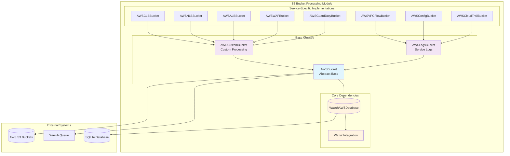
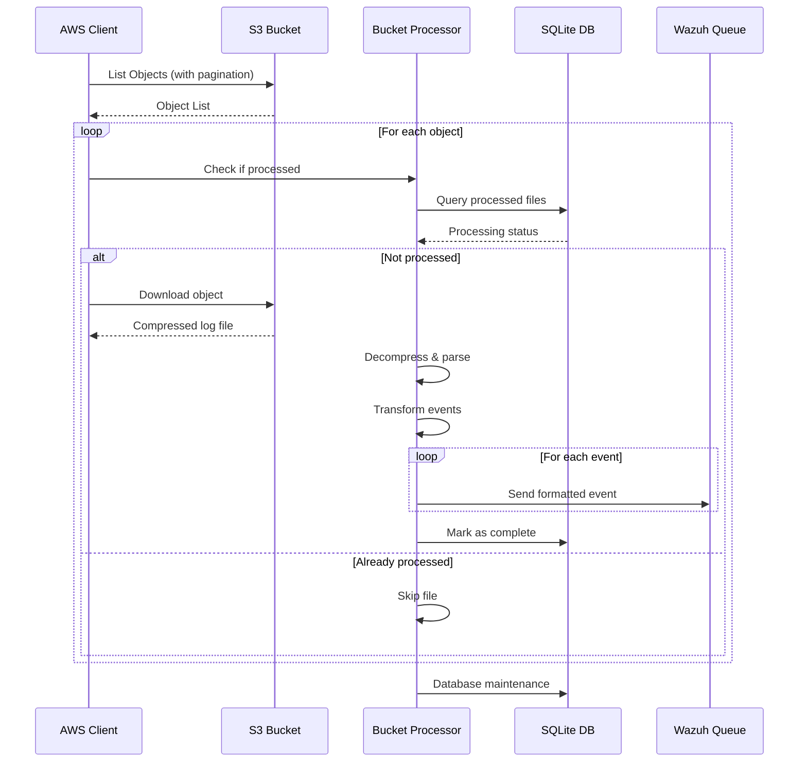
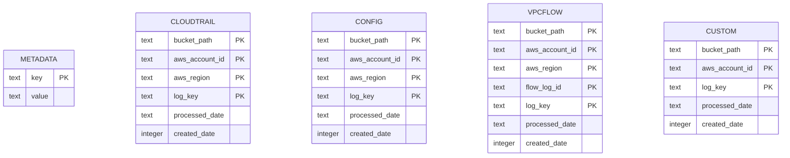
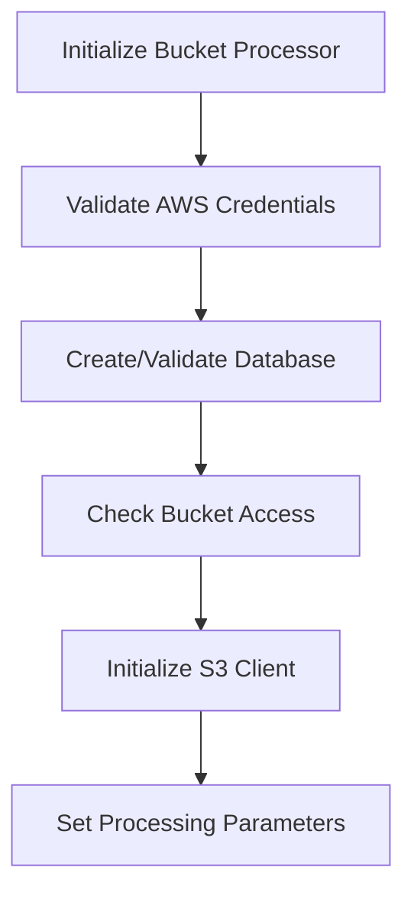
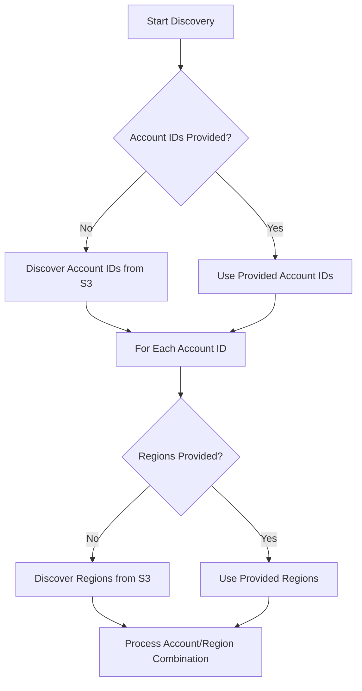
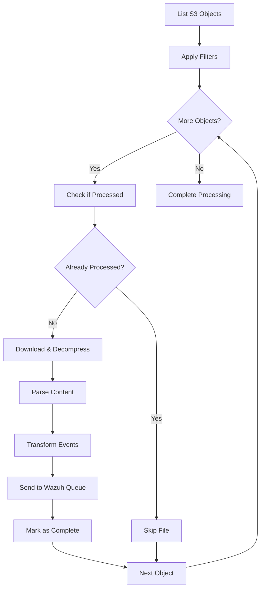

# S3 Bucket Processing Module

## Overview

The S3 Bucket Processing module is a critical component of the Wazuh AWS Integration framework that provides comprehensive functionality for collecting, processing, and forwarding AWS service logs stored in S3 buckets. This module implements a sophisticated architecture for handling various AWS services including CloudTrail, Config, GuardDuty, VPC Flow Logs, WAF, and Load Balancers, with specialized processing logic for each service type.

The module operates as part of the broader [AWS Integration](AWS%20Integration.md) system and leverages the [Core Integration Framework](Core%20Integration%20Framework.md) for database management and message processing capabilities.

## Architecture Overview

## Core Components

### Base Classes

#### AWSBucket
The foundational abstract class that provides core functionality for all S3 bucket processing operations.

**Key Responsibilities:**
- AWS S3 client management and authentication
- Database operations for tracking processed files
- File decompression and content extraction
- Event filtering and message formatting
- Error handling and retry logic

**Core Methods:**
- `iter_bucket()`: Main orchestration method for bucket processing
- `iter_files_in_bucket()`: Iterates through S3 objects with pagination
- `load_information_from_file()`: Abstract method for service-specific file parsing
- `already_processed()`: Checks if a file has been previously processed
- `mark_complete()`: Records successful file processing in database

#### AWSLogsBucket
Specialized base class for AWS service logs that follow the standard AWSLogs structure.

**Features:**
- Standardized prefix handling for AWS service logs
- Account ID and region-based organization
- Creation date extraction from log file names
- Support for AWS Organizations structure

#### AWSCustomBucket
Base class for services with non-standard log formats or custom bucket structures.

**Capabilities:**
- Flexible prefix handling for custom bucket layouts
- Support for various compression formats
- Custom event parsing and transformation
- Enhanced error handling for malformed data

### Service-Specific Implementations

#### CloudTrail Processing (AWSCloudTrailBucket)
Processes AWS CloudTrail audit logs with comprehensive API call tracking.

**Features:**
- JSON record extraction from compressed files
- Dynamic field handling for variable API parameters
- Request/response parameter normalization
- Boolean field type conversion

#### Config Processing (AWSConfigBucket)
Handles AWS Config configuration snapshots and change notifications.

**Specialized Processing:**
- Date format normalization (removes leading zeros)
- Security group and availability zone restructuring
- Configuration content optimization for performance
- Chronological file sorting

#### GuardDuty Processing (AWSGuardDutyBucket)
Processes AWS GuardDuty security findings with dual format support.

**Dual Mode Support:**
- **Native Mode**: Direct S3 storage following AWSLogs structure
- **Kinesis Mode**: Legacy Kinesis Data Firehose delivery (deprecated)

**Advanced Features:**
- Port probe detail expansion for multiple findings
- JSONL format support for native GuardDuty logs
- Automatic format detection and processing

#### VPC Flow Logs Processing (AWSVPCFlowBucket)
Handles AWS VPC Flow Logs with flow log ID-based organization.

**Unique Capabilities:**
- Flow log ID discovery via EC2 API integration
- UNIX timestamp to ISO8601 conversion
- TSV format parsing with predefined field mapping
- Region-specific flow log enumeration

#### WAF Processing (AWSWAFBucket)
Processes AWS WAF access logs with HTTP header normalization.

**HTTP Processing:**
- Standard HTTP header filtering and normalization
- JSON event stream parsing
- Malformed log handling with skip-on-error support
- Header structure validation

#### Load Balancer Processing
Three specialized classes for different load balancer types:

**AWSALBBucket (Application Load Balancer):**
- Complex field parsing with IP/port separation
- Target group and trace ID handling
- SSL/TLS certificate information extraction

**AWSNLBBucket (Network Load Balancer):**
- Connection-level metrics processing
- TLS handshake timing analysis
- ALPN protocol negotiation tracking

**AWSCLBBucket (Classic Load Balancer):**
- Legacy format support
- Backend connection tracking
- Simplified field structure

## Data Flow Architecture

## Database Schema

The module uses SQLite databases to track processing state across different services:

## Processing Workflow

### 1. Initialization Phase

### 2. Discovery Phase

### 3. File Processing Phase

## Configuration and Deployment

### Key Configuration Parameters

| Parameter | Description | Default | Required |
|-----------|-------------|---------|----------|
| `bucket` | S3 bucket name | - | Yes |
| `prefix` | Object prefix filter | "" | No |
| `suffix` | Object suffix filter | "" | No |
| `only_logs_after` | Start date for processing | - | No |
| `reparse` | Reprocess already parsed files | false | No |
| `delete_file` | Delete files after processing | false | No |
| `skip_on_error` | Continue on errors | false | No |
| `aws_organization_id` | AWS Organization ID | - | No |
| `discard_field` | Field for event filtering | - | No |
| `discard_regex` | Regex for event filtering | - | No |

### Authentication Methods

The module supports multiple AWS authentication methods:

1. **IAM Roles** (Recommended)
   - Cross-account access support
   - Temporary credentials
   - Enhanced security

2. **AWS Profiles**
   - Local credential management
   - Multiple environment support

3. **Access Keys** (Deprecated)
   - Direct key specification
   - Legacy support only

## Integration Points

### Dependencies

The S3 Bucket Processing module integrates with several other system components:

- **[Core Integration Framework](Core%20Integration%20Framework.md)**: Database management and base integration functionality
- **[Communication Layer](Communication%20Layer.md)**: Message queuing and socket communication
- **[Logging System](Logging%20System.md)**: Debug and error logging capabilities

### External Services

- **AWS S3**: Primary data source for log files
- **AWS EC2**: VPC Flow Log discovery (VPC processing only)
- **AWS STS**: IAM role assumption for authentication

## Error Handling and Resilience

### Retry Mechanisms
- Configurable retry policies for AWS API calls
- Exponential backoff for rate limiting
- Circuit breaker patterns for service failures

### Error Recovery
- Skip-on-error mode for malformed data
- Graceful degradation for service unavailability
- Database transaction rollback on failures

### Monitoring and Alerting
- Comprehensive debug logging at multiple levels
- Error message forwarding to Wazuh queue
- Processing statistics and metrics

## Performance Optimization

### Database Optimization
- Automatic database maintenance and cleanup
- Configurable record retention limits
- Index optimization for query performance

### Memory Management
- Streaming file processing for large objects
- Efficient decompression algorithms
- Event batching for queue operations

### Concurrency Considerations
- Thread-safe database operations
- Atomic file processing markers
- Pagination for large bucket listings

## Security Considerations

### Access Control
- Least privilege IAM policies
- Secure credential management
- Cross-account access validation

### Data Protection
- In-transit encryption for all AWS communications
- Secure temporary file handling
- Sensitive data filtering capabilities

### Audit Trail
- Complete processing audit logs
- File processing timestamps
- Error tracking and reporting

## Troubleshooting Guide

### Common Issues

1. **Authentication Failures**
   - Verify IAM permissions
   - Check credential configuration
   - Validate cross-account trust relationships

2. **Processing Delays**
   - Monitor AWS API rate limits
   - Check database performance
   - Verify network connectivity

3. **Missing Events**
   - Validate bucket permissions
   - Check prefix/suffix filters
   - Review date range parameters

### Debug Modes
- Multiple debug levels (1-3)
- Detailed AWS API logging
- Event transformation tracing

## Future Enhancements

### Planned Features
- Multi-threaded processing support
- Enhanced compression format support
- Real-time processing capabilities
- Advanced filtering and transformation rules

### Scalability Improvements
- Distributed processing architecture
- Cloud-native deployment options
- Auto-scaling capabilities

---

*This documentation is part of the Wazuh AWS Integration system. For related components, see [AWS Integration](AWS%20Integration.md), [Core Integration Framework](Core%20Integration%20Framework.md), and [Direct Service Integration](Direct%20Service%20Integration.md).*