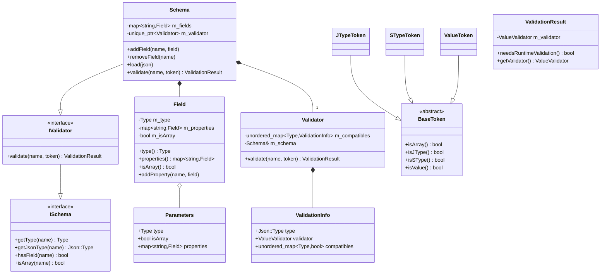
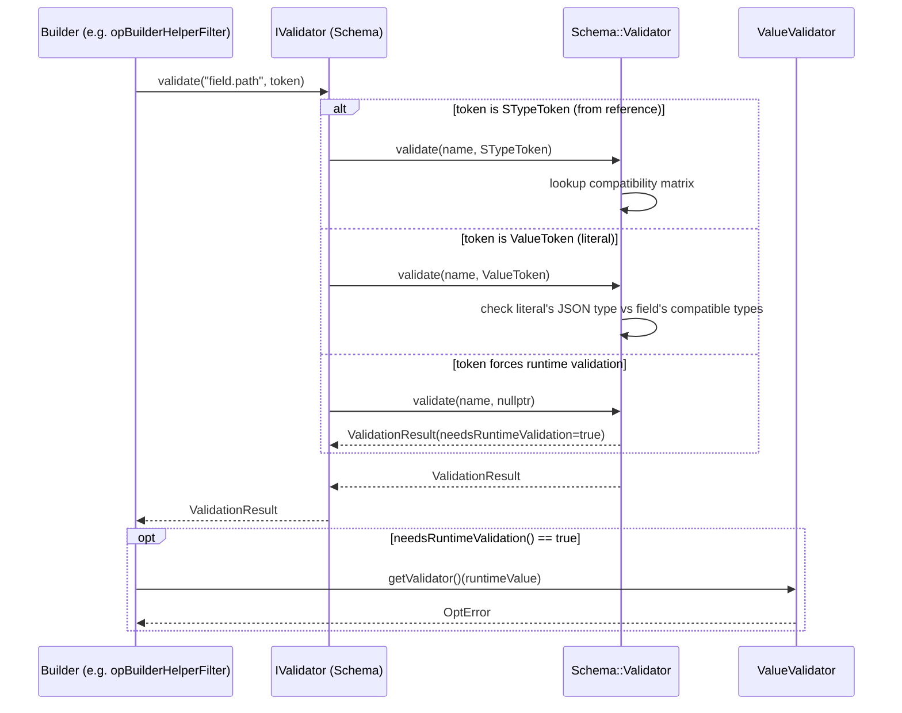

# Schemf (Schema Validation)

## Overview

**Schemf** ("Schema Field") is the C++ library inside the **Wazuh Engine** (`src/engine/source/schemf`) responsible
for defining, storing, and validating the **event schema**. The event schema describes every field that can appear
in a normalized Wazuh event (its Wazuh Common Schema — ECS-like structure): its JSON type, its internal semantic
type (short, long, ip, date, etc.), whether it is an array, and — for object fields — its nested properties.

Schemf answers two fundamental questions that the rest of the Engine relies on constantly while building and running
detection pipelines:

1. **"Does this field exist, and what is its type?"** — used by the [Builder](Wazuh_Engine_Core_(C++).md) when
   compiling decoders, rules and outputs, to catch configuration errors before runtime (build-time validation).
2. **"Is this concrete JSON value valid for this field?"** — used both at build time (when a literal value is known)
   and at runtime (when the value comes from an event) to enforce type-safety of the data pipeline.

Schemf achieves this through:

* A **schema data model** (`Field`) representing the graph of fields and their metadata.
* A **validator interface** (`IValidator`) that decouples consumers (the Builder, HLP-based parsers, etc.) from the
  concrete schema implementation, using a small token-based DSL to describe *what* is being validated.
* A **concrete `Schema` implementation** that stores the field graph, loads it from JSON, and performs the actual
  compatibility checks between schema types and JSON literals or other fields.
* A set of **reusable value validators** for each schema type (bool, integer, long, ip, date, binary, etc.), built
  on top of the [engine_hlp](engine_hlp_core.md) parsing primitives.

## Role in the System

Schemf sits in the lower-level, "cross-cutting" layer of the [Wazuh Engine (C++)](Wazuh_Engine_Core_(C++).md), next
to modules like [engine_base](engine_base_core_types.md) and [engine_hlp](engine_hlp_core.md). It has no knowledge of
policies, decoders or rules; instead, it is consumed by higher-level modules:

* The [engine_builder](builder_core.md) module uses `IValidator`/`Schema` to type-check field references and
  literal values while compiling assets (decoders, rules, filters, maps) — see for example the "assertRef"/"assertValue"
  helpers in `builder_argument_helper` and the allowed-fields mechanism in that same module.
* The [engine_hlp](engine_hlp_core.md) parsers (date, IP, binary) are reused by Schemf's value validators to check
  that literal/runtime values conform to the semantic type declared in the schema.
* The Engine's schema management CLI (`engine_schema`, part of
  [Engine_Administration_CLI_Tools_(Python)](Engine_Administration_CLI_Tools_(Python).md)) generates and uploads the
  JSON schema documents that `Schema::load` consumes at runtime via the [Store](Store.md) module.

```mermaid
graph TB
    subgraph Schemf["Schemf (Schema Validation)"]
        Field["Field / Parameters<br/>(data model)"]
        IValidator["IValidator interface<br/>ValidationToken / ValidationResult"]
        Schema["Schema<br/>(field graph + load)"]
        Validator["Schema::Validator<br/>(compatibility rules)"]
        ValueValidators["Value Validators<br/>(bool, int, ip, date, ...)"]

        Schema --> Field
        Schema --> Validator
        Schema -.implements.-> IValidator
        Validator --> ValueValidators
        Validator --> IValidator
    end

    ISchema["ISchema (base interface)<br/>engine_base"] --> IValidator
    HLP["engine_hlp<br/>date/ip/binary parsers"] --> ValueValidators
    JsonBase["base::json::Json<br/>engine_base"] --> Field
    JsonBase --> IValidator

    Builder["engine_builder<br/>(AllowedFields, opBuilders)"] -->|validate refs & values| IValidator
    Store["Store<br/>(schema JSON documents)"] -->|load()| Schema
    SchemaCLI["engine_schema (CLI)<br/>Engine_Administration_CLI_Tools"] -->|produces JSON schema| Store

    classDef current fill:#cfe8ff,stroke:#2b6cb0;
    class Schemf current;
```

## Architecture

Schemf is organized around three cooperating concerns:

1. **Data model** — how a field is represented (`Field`, `Field::Parameters`) and how fields nest to form the schema
   tree (`Schema` internal `std::map<std::string, Field>`).
2. **Validation interface / DSL** — a small, implementation-agnostic vocabulary (`IValidator`, `ValidationToken`,
   `ValidationResult`) that lets a caller ask "is this operation valid for this field?" without knowing anything
   about how the schema is stored. Tokens (`JTypeToken`, `STypeToken`, `ValueToken`, or the "always runtime" token)
   describe the *thing* being checked (a JSON type, a schema type, a concrete value, or "just check at runtime").
3. **Concrete engine** — the `Schema` class (which also implements `IValidator`) plus its private `Schema::Validator`
   helper that knows the compatibility matrix between schema `Type`s and JSON types/other schema types, and the
   collection of `ValueValidator` lambdas (one per schema `Type`) that actually inspect a `json::Json` value at
   runtime.



## Sub-modules

Schemf's core components are grouped into three documented sub-modules:

| Sub-module | Contents | Description |
|---|---|---|
| [Schemf_Data_Model](Schemf_Data_Model.md) | `field.hpp` (`Field`, `Field::Parameters`) | The metadata representation of a single schema field: its type, array flag, and nested properties (for objects). Building block used by `Schema` to hold the full field graph. |
| [Schemf_Validation_Interface](Schemf_Validation_Interface.md) | `ivalidator.hpp` (`IValidator`, `ValidationResult`, `BaseToken`/`JTypeToken`/`STypeToken`/`ValueToken`, `asArray`, `isArrayToken`, `isNotArrayToken`, `tokenFromReference`) | The abstract, implementation-agnostic contract and token DSL that consumers (mainly the Builder) use to ask "is this valid for this field?" at build time or runtime. |
| [Schemf_Validator_Engine](Schemf_Validator_Engine.md) | `schema.hpp` (`Validator`/`Schema`), `src/validator.hpp` (`ValidationInfo`, `Schema::Validator`), `valueValidators.hpp` (`getBoolValidator`, `getShortValidator`, `getIntegerValidator`, `getLongValidator`, `getFloatValidator`, `getDoubleValidator`, `getStringValidator`, `getDateValidator`, `getIpValidator`, `getBinaryValidator`, `getObjectValidator`) | The concrete implementation: the `Schema` class that stores/loads the field graph and implements `IValidator`, its private compatibility-checking `Validator`, and the library of per-type runtime `ValueValidator`s. |

## Data & Validation Flow

The typical build-time validation flow, e.g. when the Builder checks that a helper function's argument (a literal
value or a reference to another field) is compatible with a target field:



Key points of this flow:

* If the field's schema `Type` is *always* compatible with the token being checked (e.g., a `string` literal against
  a `string` field), validation succeeds at build time with **no runtime cost**.
* If compatibility *depends on the actual value* (e.g., a generic JSON `Number` against a `short` field, which must
  additionally be range-checked), `ValidationResult::needsRuntimeValidation()` returns `true` and the caller must
  invoke the returned `ValueValidator` against the concrete value when it becomes available (at build time for
  literals, at runtime for event data).
* If the referenced field does not exist in the schema, `tokenFromReference` degrades gracefully to
  "always validate at runtime" (`runtimeValidation()`), keeping the Engine flexible for fields not declared
  explicitly in the schema (e.g., custom/decoder-defined fields).

## Loading the Schema

`Schema::load(const json::Json&)` walks a JSON document (produced by the `engine_schema` CLI tool and stored via the
[Store](Store.md) module) and calls `addField` for each entry, building the `m_fields` map and, transitively, the
nested `Field::properties()` for object fields. This is typically done once at Engine startup so that the in-memory
`Schema` instance can be shared (via `IValidator`) with the [Builder](Wazuh_Engine_Core_(C++).md) for the lifetime of
the process.

## Cross-References

* [Wazuh_Engine_Core_(C++).md](Wazuh_Engine_Core_(C++).md) — parent module and high-level architecture of the Engine.
* [engine_base_core_types.md](engine_base_core_types.md) — `base::error`, `Result`, and other primitives used throughout Schemf.
* [engine_hlp_core.md](engine_hlp_core.md) / domain parsers — provide the date/ip/binary parsing logic reused by Schemf's value validators.
* [builder_core.md](builder_core.md) / [builder_argument_helper.md](builder_argument_helper.md) — main consumers of `IValidator` during asset compilation.
* [Store.md](Store.md) — persists and serves the JSON schema documents consumed by `Schema::load`.
* [Engine_Administration_CLI_Tools_(Python).md](Engine_Administration_CLI_Tools_(Python).md) — `engine_schema` CLI used to generate/upload the schema JSON.
