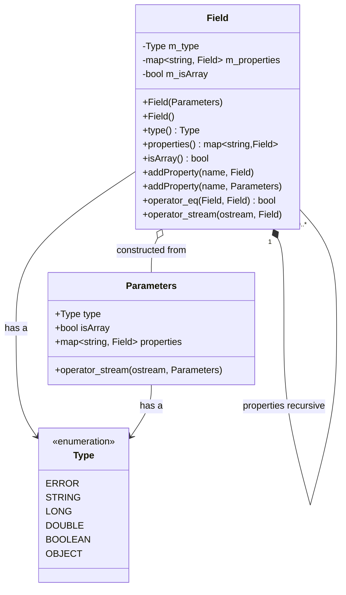
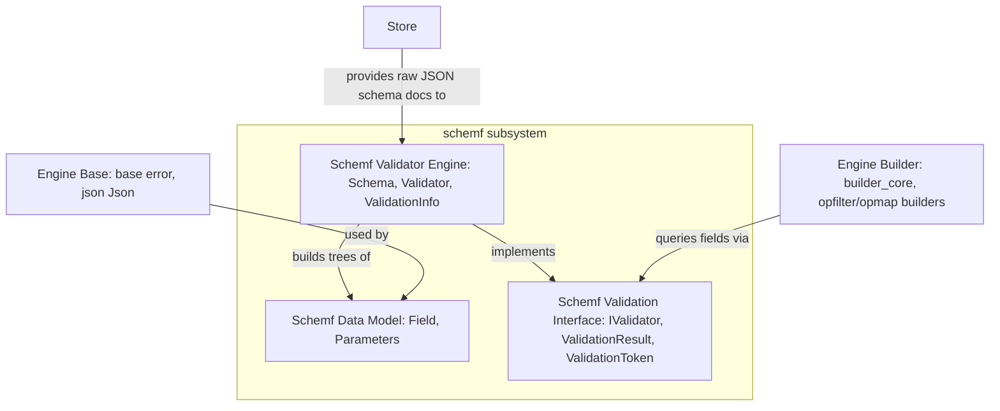
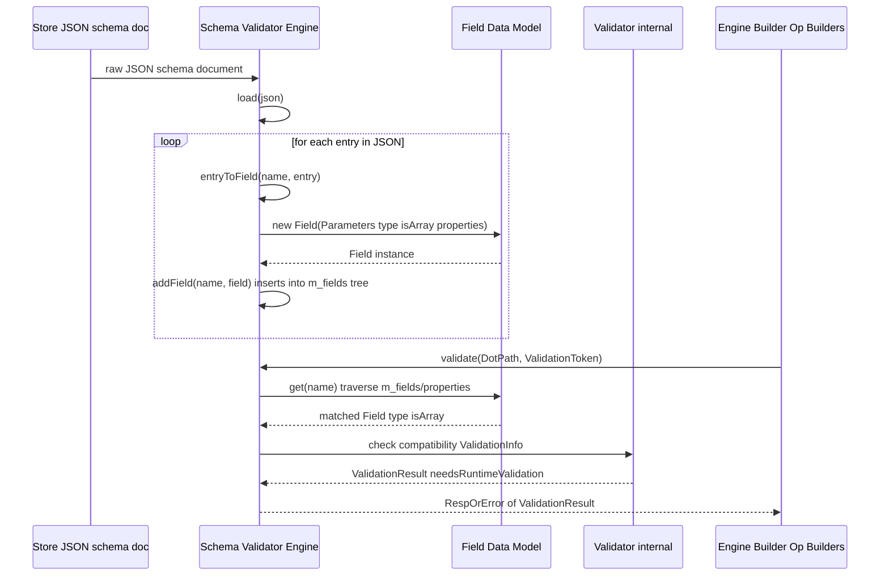
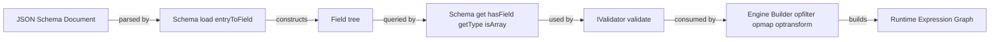

# Schemf Data Model

## Introduction

The **Schemf Data Model** module defines the foundational data structure used by the Wazuh Engine's schema subsystem (`schemf`) to represent the *shape* of fields within an event schema. It is a small, self-contained C++ header (`schemf/field.hpp`) that provides the `Field` class — a recursive, type-safe representation of a schema field, including its JSON-compatible type, whether it is an array, and (for object-like fields) a map of child fields (`properties`).

This module is a **leaf/data-only** component: it has no business logic beyond simple invariant validation and accessors. It is consumed by the higher-level components of the `schemf` subsystem — namely the [Schemf Validator Engine](Schemf_Validator_Engine.md) (`Schema` / `Validator` classes) and exposed indirectly through the [Schemf Validation Interface](Schemf_Validation_Interface.md) (`IValidator`). Understanding `Field` is a prerequisite for understanding how the Wazuh Engine validates and type-checks events against a declared schema.

---

## Purpose and Core Functionality

The `Field` class models a single node in a schema tree. Each `Field`:

- Has a **`Type`** (an enum defined in `schemf/type.hpp`, e.g. `STRING`, `LONG`, `OBJECT`, `ERROR`, etc.) describing the semantic/logical type of the field.
- Has an **`isArray`** flag indicating whether the field represents an array of values of `type`.
- Optionally has a **`properties`** map (`std::map<std::string, Field>`) of child fields, used when the field represents an `OBJECT` (or an array of objects). Accessing `properties()` on a non-object field throws a `std::runtime_error`.

Fields are constructed either:
1. Directly via the `Field::Parameters` aggregate struct (type + isArray + properties), or
2. Indirectly, by the `Schema` class, which parses a JSON schema definition and builds a tree of `Field` objects (see `Schema::entryToField` in the Validator Engine module).

The class is intentionally minimal and value-semantic (copyable, movable, comparable via `operator==`/`operator!=`, and streamable via `operator<<` for debugging/logging), making it easy to store in maps, pass by value, and use as the core "vocabulary" type across the whole `schemf` subsystem.

### Key Responsibilities

| Responsibility | Description |
|---|---|
| Represent field type | Stores a `schemf::Type` enum value per field |
| Represent array-ness | Boolean flag `isArray` |
| Represent nested structure | Recursive `std::map<std::string, Field>` of child fields for objects |
| Enforce structural invariants | Throws `std::runtime_error` if `properties()`/`addProperty()` are called on a non-object field, or if constructed with invalid parameter combinations |
| Provide equality/debug support | `operator==`, `operator!=`, `operator<<` for both `Field` and `Field::Parameters` |

---

## Architecture

### Class Diagram



`Field` composes itself recursively through the `properties` map, forming a tree structure that mirrors the nested-object shape of JSON schema documents (e.g. `agent.name`, `agent.id`, `data.win.eventdata.image`, etc.).

---

## Position in the System

`Field` is the innermost data structure of the `schemf` (Schema) subsystem, which itself is one of the core libraries of the [Wazuh Engine Core (C++)](Wazuh_Engine_Core_(C++).md). The subsystem is split into three sibling documentation areas:

- **Schemf Data Model** (this document) — the `Field` value type.
- [Schemf Validation Interface](Schemf_Validation_Interface.md) — the abstract `IValidator` / `ISchema` contracts (`ValidationToken`, `ValidationResult`, `ValueValidator`) that decouple consumers from the concrete schema implementation.
- [Schemf Validator Engine](Schemf_Validator_Engine.md) — the concrete `Schema` and `Validator` classes that build a tree of `Field` objects (from JSON) and perform runtime/compile-time validation of events against them.



### Upstream Dependencies

- **`base::error`** and **`base::json`** (from [Engine Base](Wazuh_Engine_Core_(C++).md)) — `Field` uses `std::runtime_error`-style exceptions and depends on `json::Json` types transitively through `schemf/type.hpp`.
- **`schemf/type.hpp`** — Defines the `Type` enum and `typeToStr`/`typeToJType` helper functions used by `Field` for display and JSON-type mapping.

### Downstream Consumers

- **`Schema` class** ([Schemf Validator Engine](Schemf_Validator_Engine.md)) — stores a `std::map<std::string, Field> m_fields` as its first-level field table, and recursively builds/queries `Field` trees when loading a JSON schema (`Schema::load`) or resolving a dotted field path (`Schema::get`).
- **`IValidator` / `ISchema`** ([Schemf Validation Interface](Schemf_Validation_Interface.md)) — indirectly relies on `Field`'s `type()` and `isArray()` semantics to implement `getType`, `getJsonType`, and `isArray` on the `ISchema` interface.
- **Engine Builder** (`builder_core`, `builder_opfilter`, `builder_opmap`, etc. in [Wazuh Engine Core (C++)](Wazuh_Engine_Core_(C++).md)) — uses the schema (and transitively `Field`) to validate that operations (filters, maps, transforms) reference fields with compatible types.

---

## Data Flow

The following sequence illustrates how a `Field` tree is created and consumed, from raw JSON schema ingestion to runtime validation:



Key points:
- `Schema::entryToField` is the sole "factory" that translates JSON schema entries into `Field` objects (via `Field::Parameters`).
- `Schema::get` performs a dot-path traversal over the tree of `Field.properties()` maps to locate a target field.
- The `Field` itself never talks to `ValidationInfo`/`Validator` directly — all validation logic lives in the [Schemf Validator Engine](Schemf_Validator_Engine.md); `Field` is purely descriptive.

---

## Component Interaction



---

## API Surface Summary

| Member | Description |
|---|---|
| `Field(const Parameters&)` | Constructs a field; validates invariants (throws on invalid parameter combinations). |
| `Field()` | Default constructor — produces a `Type::ERROR`, non-array field with no properties. |
| `type()` | Returns the field's `Type`. |
| `properties()` (const & non-const) | Returns the child-field map; throws if the field is not object-like. |
| `isArray()` | Returns whether the field represents an array. |
| `addProperty(name, Field)` / `addProperty(name, Parameters)` | Adds/overwrites a named child field; throws if not object-like. |
| `operator==` / `operator!=` | Structural equality comparison (type, properties, isArray). |
| `operator<<` | Streams a human-readable summary (used for logging/debugging), not full nested content. |

`Field::Parameters` mirrors the same three attributes (`type`, `isArray`, `properties`) as a plain aggregate, enabling convenient brace-initialization, e.g.:

```cpp
schemf::Field f({.type = schemf::Type::OBJECT,
                  .isArray = false,
                  .properties = {{"name", schemf::Field({.type = schemf::Type::STRING})}}});
```

---

## Related Documentation

- [Schemf Validation Interface](Schemf_Validation_Interface.md) — Abstract contracts (`IValidator`, `ISchema`, `ValidationToken`, `ValidationResult`) that consume `Field`-derived schema information without depending on the concrete `Schema` implementation.
- [Schemf Validator Engine](Schemf_Validator_Engine.md) — Concrete `Schema`/`Validator` implementation that builds, stores, and queries trees of `Field` objects and performs both compile-time (structural) and runtime (value-level) validation.
- [Wazuh Engine Core (C++)](Wazuh_Engine_Core_(C++).md) — Parent module tree containing `schemf`, `builder`, `base`, `store`, and other Engine subsystems that interact with the schema.
