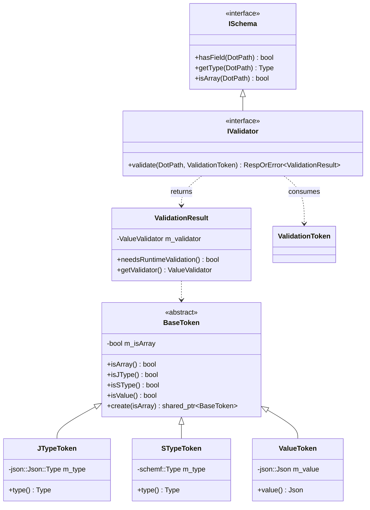
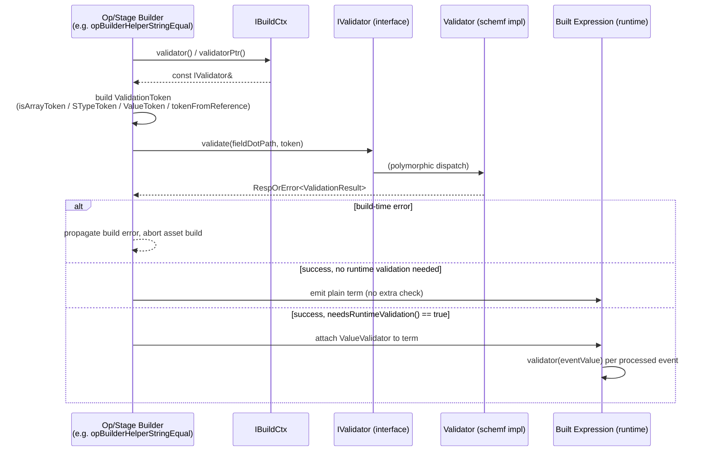
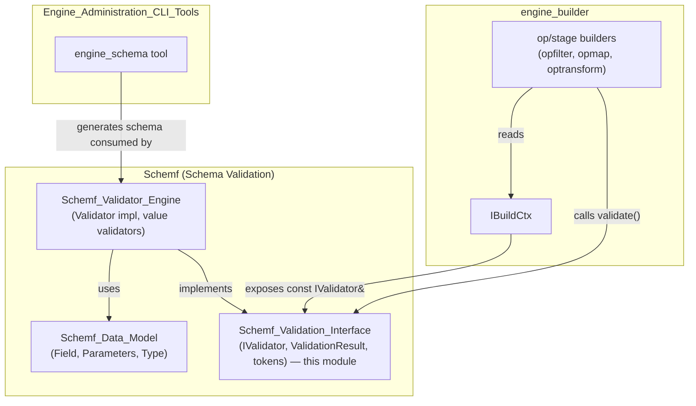

# Schemf Validation Interface

## Introduction

The **Schemf Validation Interface** is the abstract contract that decouples the Wazuh Engine's rule/decoder **builder** subsystem from the concrete schema validation implementation. It is defined in a single header, `src/engine/source/schemf/interface/schemf/ivalidator.hpp`, and provides:

- A small, composable **token** hierarchy (`BaseToken`, `JTypeToken`, `STypeToken`, `ValueToken`) that describes, at build time, what kind of value/type an operation on a field expects.
- The `IValidator` interface — the single entry point builders use to ask "is this operation valid for field X, and if so, do I also need to check it again at runtime?".
- The `ValidationResult` class, which encodes the outcome of a build-time check: either "no runtime check needed" or "here is a `ValueValidator` function to run against real event data".
- Free helper functions (`asArray`, `isArrayToken`, `isNotArrayToken`, `tokenFromReference`, `runtimeValidation`) that make it easy for callers (builders) to construct validation tokens without depending on concrete validator internals.

This module is intentionally minimal and has **no implementation logic** — it exists purely so that the [Wazuh_Engine_Core (C++)](Wazuh_Engine_Core_(C++).md) builder pipeline can be compiled and tested against an abstraction, while the actual schema-driven validation logic lives in the sibling [Schemf_Validator_Engine](Schemf_Validator_Engine.md) module, and the schema field data model lives in [Schemf_Data_Model](Schemf_Data_Model.md).

## Purpose and Core Functionality

When the engine builds a decoder/rule asset, every helper function (`opBuilderHelperStringEqual`, `opBuilderHelperIntGreaterThan`, `mapBuilder`, etc. — see [engine_builder](Wazuh_Engine_Core_(C++).md)) must decide:

1. **Is this operation type-safe** given what is known about the schema field it operates on (e.g., comparing a `string` field with a numeric literal should fail at build time)?
2. **If the field's type cannot be fully determined at build time** (e.g., it's a custom/dynamic field, or the reference points to another field that isn't in the schema), can we still emit a runtime check that validates the value/type when the pipeline actually processes an event?

The `IValidator` interface answers exactly this question through a single method:

```cpp
virtual base::RespOrError<ValidationResult> validate(const DotPath& name, const ValidationToken& token) const = 0;
```

- `name` — the dot-path to the schema field being operated on (e.g. `agent.name`).
- `token` — a `ValidationToken` (a `shared_ptr<BaseToken>`) describing the operation's expected type/value.
- Return — either an error (the operation is invalid at build time) or a `ValidationResult`, which may carry a `ValueValidator` closure to be invoked later, per event, at runtime.

Because `IValidator` extends `ISchema` (from `schemf/ischema.hpp`), it also inherits schema introspection capabilities (`hasField`, `getType`, `isArray`) used by helpers such as `tokenFromReference`.

## Architecture



### Key Types

| Type | Role |
|---|---|
| `BaseToken` | Base class holding only "is this an array" info. Created via `BaseToken::create(bool)`; used directly by `isArrayToken()`/`isNotArrayToken()` when only array-ness matters. |
| `JTypeToken` | Wraps a raw JSON type (`json::Json::Type`) — used when the operation's expected type is a generic JSON kind (string, number, bool, object), not tied to the schema's richer type system. Cannot represent `Array` (arrays are expressed via the `isArray` flag instead). |
| `STypeToken` | Wraps a `schemf::Type` (the schema's own type enum) — used when the expected type is derived directly from another schema field (see `tokenFromReference`). |
| `ValueToken` | Wraps a concrete `json::Json` value — used when the operation compares against a literal (e.g. a helper argument value); `isArray` is inferred from the value itself. |
| `ValidationToken` | Alias for `std::shared_ptr<BaseToken>` — the polymorphic handle passed to `IValidator::validate`. `nullptr` is a valid, meaningful token (see `runtimeValidation()`). |
| `ValueValidator` | `std::function<base::OptError(const json::Json&)>` — a runtime-callable predicate/validator over an actual event value. |
| `ValidationResult` | Return payload of `validate()`. If constructed with a non-null `ValueValidator`, `needsRuntimeValidation()` is `true` and the builder must attach `getValidator()` to the resulting expression term so it executes against real events. |

## Data / Control Flow



Typical usage pattern inside a builder helper:

1. Obtain the validator through the shared build context: `ctx->validator()` (see `IBuildCtx::validator()` in [engine_builder / builder_core_context](Wazuh_Engine_Core_(C++).md)).
2. Construct a `ValidationToken` appropriate to the operation:
   - `isArrayToken()` / `isNotArrayToken()` — only care about array-ness, always forces a runtime check.
   - `STypeToken::create(type, isArray)` or the convenience `tokenFromReference(reference, validator)` — when comparing against another schema field.
   - `ValueToken::create(jsonLiteral)` — when comparing against a literal argument.
   - `runtimeValidation()` (i.e., `nullptr`) — explicitly skip build-time typing and defer entirely to runtime.
3. Call `validator.validate(fieldPath, token)`.
4. On error, the builder fails immediately (asset won't compile).
5. On success, inspect `ValidationResult::needsRuntimeValidation()`; if true, wrap the built expression term with the returned `ValueValidator` so every event value is checked as data flows through the [Router](Wazuh_Engine_Core_(C++).md) pipeline.

## Helper Functions Reference

| Function | Behavior |
|---|---|
| `asArray(ValueValidator)` | Wraps a scalar `ValueValidator` so it applies the check to every element of a JSON array instead of the scalar value. Returns `nullptr` unchanged if given `nullptr`. |
| `runtimeValidation()` | Returns `nullptr` — signals "no build-time typing info; must validate this at runtime unconditionally." |
| `isArrayToken()` | Returns a bare `BaseToken` with `isArray = true`. |
| `isNotArrayToken()` | Returns a bare `BaseToken` with `isArray = false`. |
| `tokenFromReference(reference, validator)` | Looks up `reference` in the given `IValidator` (via inherited `ISchema::hasField`/`getType`/`isArray`); if the field is unknown, falls back to `runtimeValidation()`, otherwise returns an `STypeToken` mirroring the referenced field's schema type and array-ness. |

## Relationship to Other Modules

- **[Schemf_Data_Model](Schemf_Data_Model.md)** — defines `schemf::Field`, the schema tree node structure (type, array flag, nested properties) that the concrete `Validator` implementation (below) uses internally to answer `ISchema` queries. The `Type` enum referenced by `STypeToken` also originates here.
- **[Schemf_Validator_Engine](Schemf_Validator_Engine.md)** — provides the concrete `schemf::Validator` class (`schema.hpp` / `validator.hpp`) which **implements** `IValidator`, plus the internal `ValidationInfo` struct and the family of `getXValidator()` factory functions (`getStringValidator`, `getIntegerValidator`, `getIpValidator`, etc.) used to build the `ValueValidator` closures returned inside `ValidationResult`.
- **[Wazuh_Engine_Core (C++)](Wazuh_Engine_Core_(C++).md) → engine_builder** — the primary consumer. `IBuildCtx` (in `builder/src/builders/ibuildCtx.hpp`) exposes `validator()` / `validatorPtr()` so that every op/stage builder (filter, map, transform helpers under `builder_opfilter`, `builder_opmap`, `builder_optransform`) can perform schema-aware validation while constructing the expression graph for a policy asset.
- **[Engine_Administration_CLI_Tools_(Python)](Engine_Administration_CLI_Tools_(Python).md)** — the Python `engine-schema` tool (`generate`, `integrate` commands) produces/updates the schema definitions that are ultimately loaded into a `Validator` instance implementing this interface, closing the loop between schema authoring and runtime validation.

## Design Rationale

- **Interface segregation**: By isolating `IValidator`/`ValidationResult`/token types in their own header with zero dependency on the SQLite/graph-based validator internals, the builder code can be unit-tested with mock validators, and the concrete `Validator` implementation can evolve independently.
- **Deferred (lazy) runtime checks**: Not all type information is available at build time (e.g., dynamic/custom fields, cross-field references). The `ValidationResult`/`ValueValidator` pattern allows the builder to still produce a compiled artifact, deferring the final decision to runtime without sacrificing early-failure for statically-known type mismatches.
- **Token polymorphism over parameter overloading**: Using a small class hierarchy (`BaseToken` and its 3 subclasses) instead of variant/overloaded `validate()` signatures keeps the interface stable while allowing the validator to distinguish "compare against raw JSON type", "compare against schema type", and "compare against a literal value" cases through simple `isJType()/isSType()/isValue()` checks.

## Diagram: Module Position within Wazuh Engine



## Summary

This module is a thin, dependency-free interface layer. It contains:

- **4 token classes** (`BaseToken` + 3 leaf types) modeling "what to check" at a field.
- **1 core interface** (`IValidator`, extending `ISchema`) modeling "how to check it".
- **1 result wrapper** (`ValidationResult`) modeling "whether/how to check it again at runtime".
- **5 free functions** providing ergonomic token construction for builder authors.

Any change to this header has wide blast radius across the [engine_builder](Wazuh_Engine_Core_(C++).md) subsystem, since virtually every filter/map/transform helper that touches schema fields depends on it. Conversely, because it defines only an abstraction, alternative validator backends could be substituted (e.g., for testing) without modifying builder code, as long as they implement `IValidator::validate` and the inherited `ISchema` methods.
