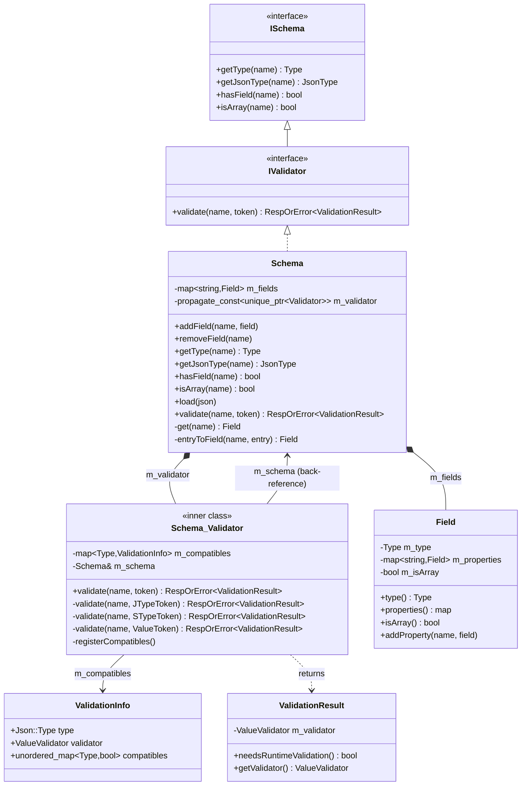
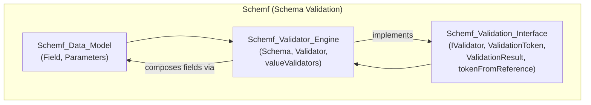
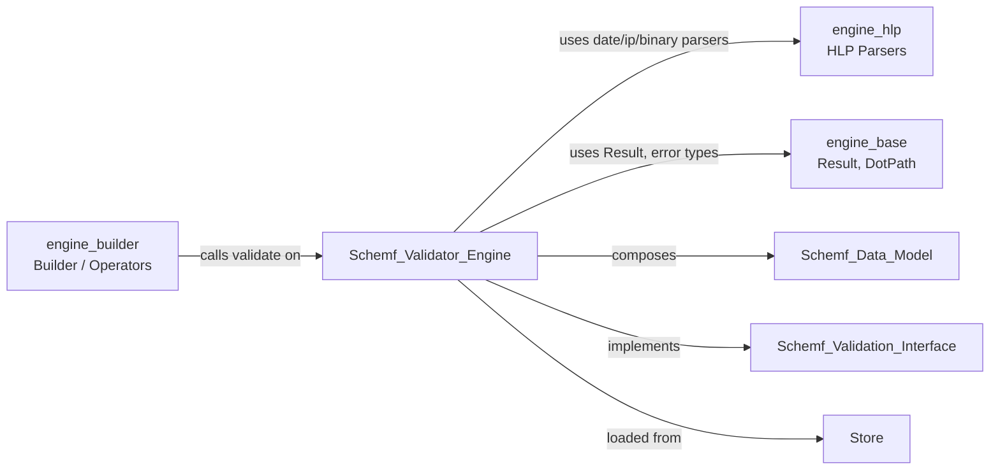
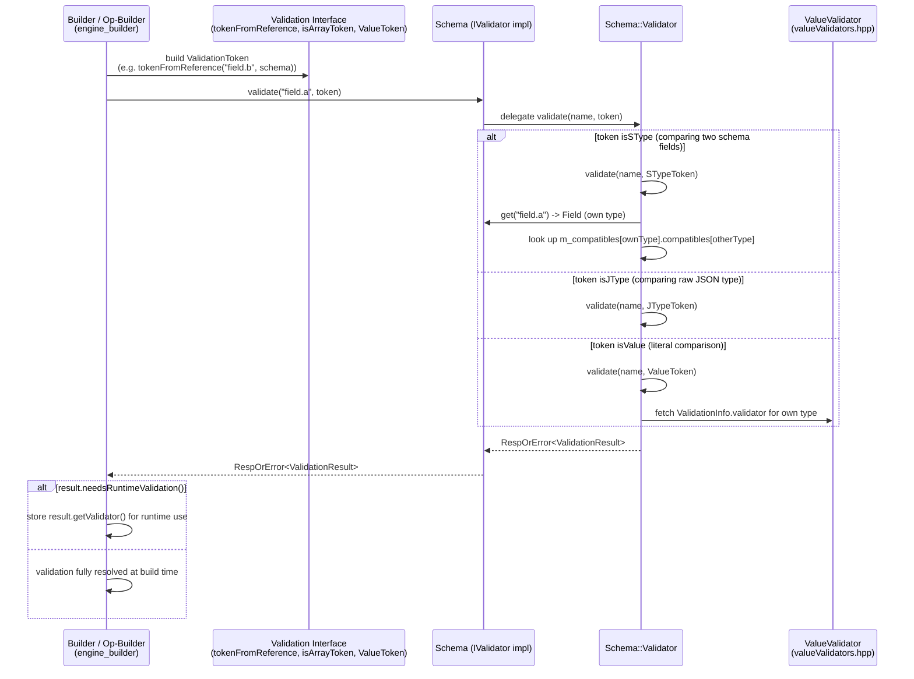
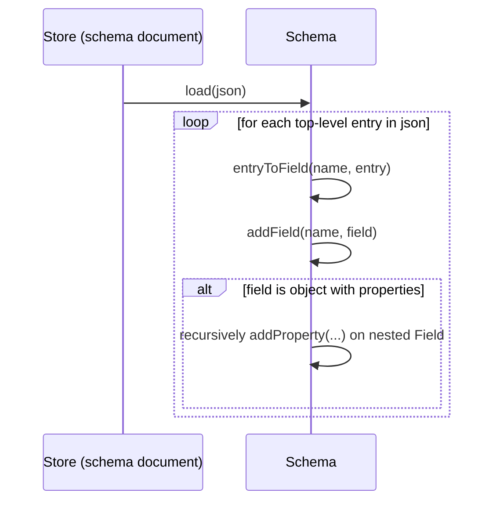
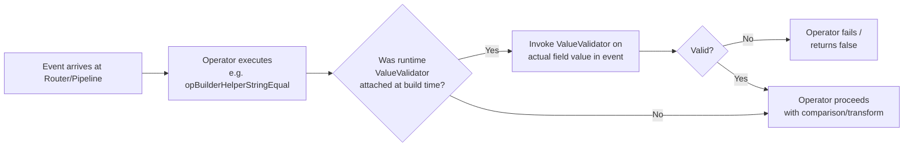
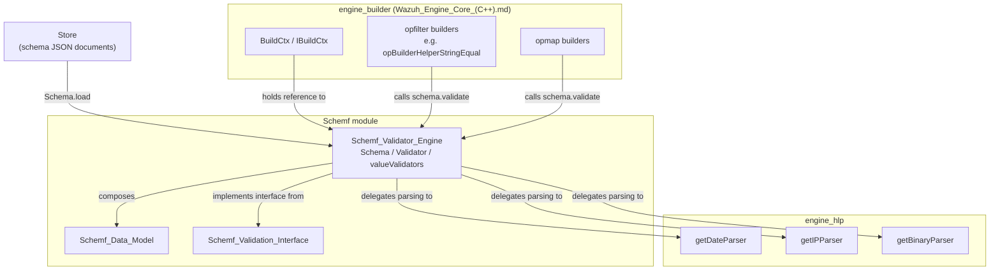

# Schemf Validator Engine

## Introduction

The **Schemf Validator Engine** is the concrete implementation core of the Wazuh Engine's schema-validation subsystem (`schemf`). It provides the `Schema` class — the primary implementation of the `IValidator`/`ISchema` interfaces — along with an internal `Validator` helper and a library of primitive **value validators** (boolean, integer, string, date, IP, binary, object, etc.).

While the schema *data model* (fields, types) and the *validation interface* (tokens, results) are defined in sibling modules, this module is where the actual **validation logic** lives: given a field path and a "validation token" describing an intended operation (e.g., "assign this literal value", "compare with this JSON type", "compare with this other schema field"), the engine determines whether the operation is type-compatible, and if runtime checking is required, returns a callable validator function.

This engine is a foundational building block used extensively by the [Wazuh_Engine_Core_(C++).md](Wazuh_Engine_Core_(C++).md) — particularly by the **Builder** module (map/filter/transform operators) to statically and dynamically validate operations against the declared event schema — and it depends on the **HLP** (High-Level Parsers) module for value-level parsing (dates, IPs, binaries).

---

## 1. Purpose and Core Functionality

The `schemf` (Schema Field) library models a hierarchical schema of event fields (see [Schemf_Data_Model.md](Schemf_Data_Model.md) for the `Field`/`Parameters` classes) and exposes a validation interface (see [Schemf_Validation_Interface.md](Schemf_Validation_Interface.md) for `IValidator`, `ValidationToken`, `ValidationResult`). The **Schemf_Validator_Engine** module ties these together by:

1. **Storing and managing the schema tree** — `Schema` holds a `std::map<std::string, Field>` of top-level fields, and supports adding, removing, loading (from JSON), and querying fields by dot-path.
2. **Implementing the `IValidator` contract** — `Schema::validate()` is the single entry point used by the rest of the engine (builders, operators) to ask: *"Is this operation valid for field X, given this token?"*
3. **Type-compatibility resolution** — the internal `Schema::Validator` class maintains a compatibility matrix (`m_compatibles`) mapping each schema `Type` to the JSON type it maps to, a `ValueValidator` function, and a set of other schema types it is compatible with (and whether that compatibility requires additional runtime checks).
4. **Providing concrete value validators** — `valueValidators.hpp` implements type-specific validation predicates (`getBoolValidator`, `getIntegerValidator`, `getDateValidator`, `getIpValidator`, `getBinaryValidator`, etc.) that operate on a `json::Json` value and return `base::OptError`.

### Key Design Goals
- **Separation of static vs. runtime validation**: Some validations can be fully resolved at build time (e.g., comparing two known schema types); others require a runtime check on the actual value (e.g., matching against a value literal). The `ValidationResult` returned by `validate()` communicates whether runtime validation is needed and provides the `ValueValidator` callable to perform it.
- **Extensibility of compatible type pairs**: `registerCompatibles()` centralizes the compatibility rules, making it a single place to reason about which schema types can interoperate (e.g., can a `short` be compared with a `long`?).
- **Reuse of HLP parsers**: Rather than reimplementing string parsing rules for dates, IPs, or binary data, the value validators are thin wrappers around HLP parser instances (`hlp::parsers::getDateParser`, `getIPParser`, `getBinaryParser`), ensuring consistent parsing semantics across the engine.

---

## 2. Architecture and Component Relationships

### 2.1 Class/Component Diagram

### 2.2 Module Placement in the Schemf Hierarchy

### 2.3 Dependency Diagram

---

## 3. Core Components

### 3.1 `Schema` (schema.hpp)

The `Schema` class is the concrete, final implementation of `IValidator` (which itself extends `ISchema`). It is the object instantiated and used throughout the engine to represent the "known" event schema (e.g., ECS-based fields).

Responsibilities:
- **Field storage**: top-level fields are kept in `m_fields`; nested fields are stored recursively inside `Field::m_properties`.
- **Field lookup**: the private `get(const DotPath&)` method walks the dot-path resolving nested `Field` objects, throwing if the path is invalid.
- **Field mutation**: `addField()` creates intermediate parent fields as needed; `removeField()` deletes a field and, transitively, its children.
- **JSON loading**: `load(const json::Json&)` bulk-populates the schema from a JSON schema definition (each entry converted via the private `entryToField()`).
- **ISchema queries**: `getType`, `getJsonType`, `hasField`, `isArray` all delegate to `get()` and the underlying `Field`.
- **Validation**: `validate(name, token)` delegates to the internal `Schema::Validator` (via `m_validator`, held with `propagate_const<unique_ptr<...>>` for const-correctness and to hide the implementation — the pImpl idiom).

### 3.2 `Schema::Validator` (validator.hpp / validator.cpp)

This private nested class does the heavy lifting of validation logic. It is constructed with a reference back to the owning `Schema` (`m_schema`) so it can query field types while validating.

- **`m_compatibles`**: An `unordered_map<Type, ValidationInfo>` populated once at construction by `registerCompatibles()`. Each entry answers:
  - What `json::Json::Type` does this schema `Type` map to?
  - What `ValueValidator` function checks a literal JSON value against this schema type?
  - Which *other* schema `Type`s can this type be compared/assigned to/from, and does that comparison require an extra runtime check (`bool` in the map value)?

- **Overloaded private `validate()` methods** dispatch based on the concrete `BaseToken` subtype carried by the `ValidationToken` (a `shared_ptr<BaseToken>`):
  - `validate(name, JTypeToken)` — validates against a raw JSON type (used when the counterpart of an operation has no schema entry, e.g., an unknown or dynamic reference — see `tokenFromReference` fallback to `runtimeValidation()` in the interface module).
  - `validate(name, STypeToken)` — validates against another schema `Type` (used when comparing two known schema fields).
  - `validate(name, ValueToken)` — validates against a concrete literal `json::Json` value (used when comparing/assigning a literal in engine rules, e.g. `field: "some value"`).

- **Public `validate(name, ValidationToken)`** — the dispatcher entry point; internally it inspects `token->isJType()`, `token->isSType()`, `token->isValue()` and calls the appropriate private overload (see [Schemf_Validation_Interface.md](Schemf_Validation_Interface.md) for `BaseToken`, `JTypeToken`, `STypeToken`, `ValueToken`, and `isArrayToken`/`isNotArrayToken`/`tokenFromReference` helper functions used by callers to build tokens).

### 3.3 `ValidationInfo` (validator.hpp)

A small POD-like struct pairing a schema type's JSON representation with its validator and its compatibility map. This structure is the backbone of the compatibility-check algorithm inside `Schema::Validator`.

### 3.4 Value Validators (valueValidators.hpp)

A set of free functions, each returning a `ValueValidator` (`std::function<base::OptError(const json::Json&)>`), used both by `ValidationInfo::validator` and directly wherever a `ValidationResult` demands runtime validation (`ValidationResult::getValidator()`):

| Function | Validates |
|---|---|
| `getBoolValidator()` | JSON value `isBool()` |
| `getShortValidator()` | Integer within `int8_t` range |
| `getIntegerValidator()` | JSON value `isInt()` |
| `getLongValidator()` | JSON value `isInt64()` |
| `getFloatValidator()` | JSON value `isFloat()` |
| `getDoubleValidator()` | JSON value `isDouble()` |
| `getStringValidator()` | JSON value `isString()` |
| `getDateValidator()` | String matches `%Y-%m-%dT%H:%M:%SZ` via HLP date parser |
| `getIpValidator()` | String is fully consumed by HLP IP parser |
| `getBinaryValidator()` | String is valid per HLP binary parser |
| `getObjectValidator()` | JSON value `isObject()` |

These validators are used both:
1. **At schema-registration time**, associated with each `Type` in `ValidationInfo` (populated in `registerCompatibles()`), and
2. **Returned to callers** wrapped inside a `ValidationResult` when `needsRuntimeValidation()` is true, so operator builders (in [engine_builder](Wazuh_Engine_Core_(C++).md)) can invoke them against actual event data during pipeline execution.

Additionally, `asArray()` (defined in the [Schemf_Validation_Interface.md](Schemf_Validation_Interface.md)) wraps any `ValueValidator` to iterate and validate each element of a JSON array — used when a schema field is marked `isArray()`.

---

## 4. Data Flow: How Validation Happens

### 4.1 Sequence: Validating an Operator Argument Against the Schema

### 4.2 Sequence: Loading a Schema from JSON

### 4.3 Runtime Validation Flow (Pipeline Execution)

---

## 5. Component Interaction with the Rest of the Engine

- **Upstream dependency**: The [Schemf_Data_Model.md](Schemf_Data_Model.md) module (`Field`, `Parameters`) provides the tree structure that `Schema` stores and manipulates.
- **Interface contract**: The [Schemf_Validation_Interface.md](Schemf_Validation_Interface.md) module defines `IValidator`, `ISchema`, `ValidationToken` and its concrete token subtypes (`BaseToken`, `JTypeToken`, `STypeToken`, `ValueToken`), plus helper constructors (`isArrayToken`, `isNotArrayToken`, `tokenFromReference`, `runtimeValidation`, `asArray`). The Validator Engine is the sole concrete implementer of this contract in the engine codebase.
- **Downstream consumer**: The `engine_builder` module (see [Wazuh_Engine_Core_(C++).md](Wazuh_Engine_Core_(C++).md)) is the primary consumer — filter/map/transform op-builders call `Schema::validate()` (through the `IValidator` interface, generally injected via `BuildCtx`/`IBuildCtx`) to type-check rule/decoder assets against the declared schema, both to catch errors early (at compile/build time) and to attach runtime validators where static resolution isn't possible.
- **External library dependency**: `engine_hlp` (High-Level Parsers) supplies the low-level parsing primitives (date, IP, binary) reused by the value validators, avoiding duplicated parsing logic across the codebase.
- **Configuration source**: Schema JSON definitions are typically loaded from the [Store](Wazuh_Engine_Core_(C++).md) module's document store (`Schema::load`).

---

## 6. Key Design Patterns

- **pImpl (Pointer to Implementation)**: `Schema` hides its `Validator` nested class behind `std::experimental::propagate_const<std::unique_ptr<Validator>>`, keeping the header lightweight and preserving const-correctness (a `const Schema` cannot mutate through the pointer either).
- **Strategy Pattern**: Each schema `Type` is associated with a `ValueValidator` strategy function (`ValidationInfo::validator`), allowing new types to be added by registering a new validator without modifying dispatch logic elsewhere.
- **Visitor-like Dispatch**: The overloaded private `validate()` methods on `Schema::Validator` act as a manual double-dispatch/visitor over the `BaseToken` hierarchy (`JTypeToken`, `STypeToken`, `ValueToken`), decided at runtime via `isJType()`/`isSType()`/`isValue()`.
- **Result/Error Monad**: All fallible operations return `base::RespOrError<T>` / `base::OptError` (from [engine_base](Wazuh_Engine_Core_(C++).md)) rather than throwing, except for schema-structure errors (invalid dot-paths) which do throw `std::runtime_error` — this is intentional: structural schema misconfiguration is a programmer/config error, while validation outcomes are expected, recoverable results.

---

## 7. Usage Notes for Maintainers

- **Adding a new schema type**: Requires updating `registerCompatibles()` in `validator.cpp` (not shown in the provided sources, but referenced by `Schema::Validator`) to add a `ValidationInfo` entry with the new type's JSON mapping, its `ValueValidator` (likely a new function added to `valueValidators.hpp`), and its compatibility set with existing types.
- **Adding a new value validator**: Follow the existing pattern in `valueValidators.hpp` — return a `ValueValidator` lambda that checks `json::Json` predicates and/or delegates to an HLP parser, returning `base::Error` or `base::noError()`.
- **Array handling**: Do not duplicate array-iteration logic in new validators; wrap the scalar validator with `asArray()` (from the Validation Interface module) when a field's `isArray()` flag is set.
- **Testing surface**: Since `Schema::Validator` is a private nested class, its behavior is only reachable indirectly through `Schema::validate()`; unit tests should exercise `Schema` end-to-end using representative `ValidationToken`s (`isArrayToken()`, `isNotArrayToken()`, `tokenFromReference()`, and direct `ValueToken`/`JTypeToken`/`STypeToken` construction).

---

## Related Documentation

- [Schemf_Data_Model.md](Schemf_Data_Model.md) — `Field` and `Parameters`, the schema tree data structures consumed by this engine.
- [Schemf_Validation_Interface.md](Schemf_Validation_Interface.md) — `IValidator`, `ISchema`, `ValidationToken`, `ValidationResult`, and token-construction helpers.
- [Wazuh_Engine_Core_(C++).md](Wazuh_Engine_Core_(C++).md) — parent module tree including `engine_builder` (the primary consumer of schema validation) and `engine_hlp` (parser primitives reused here).
