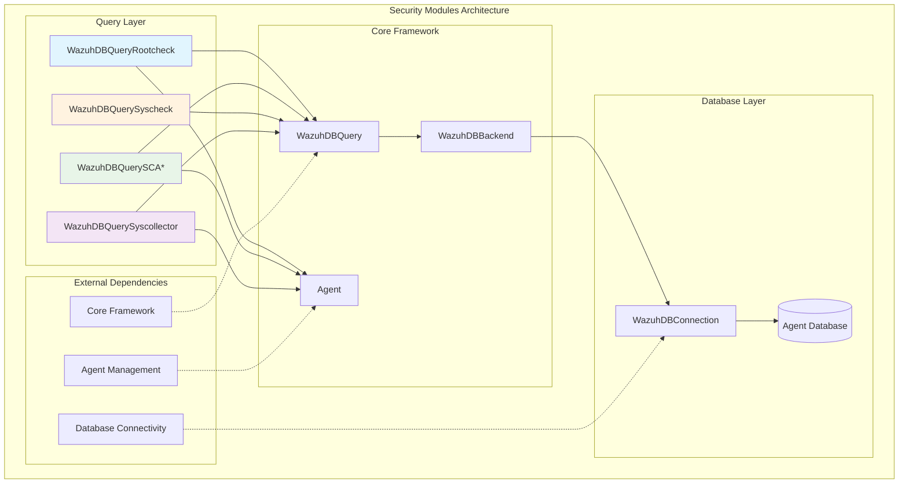
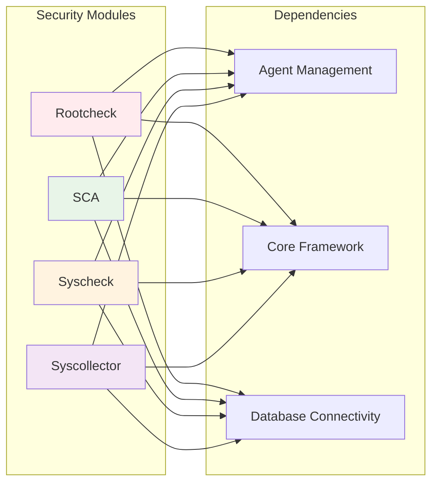
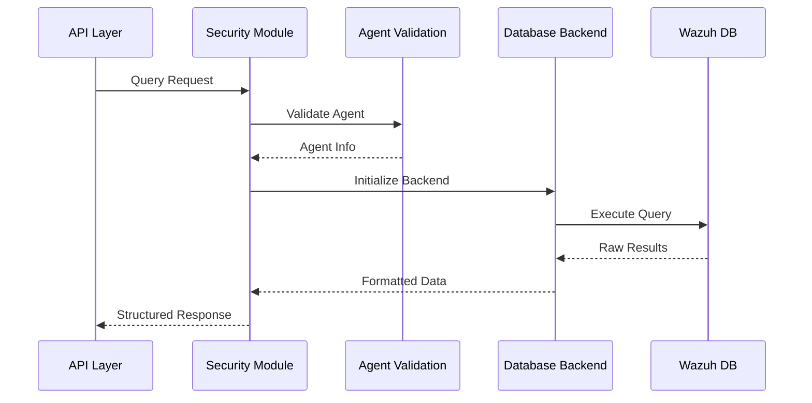

# Security Modules Documentation

## Overview

The Security Modules component is a comprehensive security monitoring and assessment framework within the Wazuh system. It provides specialized database query interfaces and monitoring capabilities for various security-related functionalities including rootcheck (rootkit detection), Security Configuration Assessment (SCA), file integrity monitoring (syscheck), and system information collection (syscollector).

## Purpose

The Security Modules serve as the core data access layer for security monitoring operations, providing:

- **Rootkit Detection**: Query and manage rootcheck scan results and policy violations
- **Security Configuration Assessment**: Comprehensive policy compliance checking and reporting
- **File Integrity Monitoring**: Track and query file system changes and modifications
- **System Information Collection**: Gather and query system inventory data including OS, hardware, packages, processes, and network information

## Architecture Overview



## Sub-modules

The Security Modules are organized into four main functional areas:

### 1. Rootcheck Module
**Documentation**: [rootcheck.md](rootcheck.md)

Handles rootkit detection and policy violation monitoring through specialized database queries and scan management. The module provides comprehensive querying capabilities for rootcheck scan results, policy violations, and scan timing information with support for status-based filtering and custom date formatting.

### 2. Security Configuration Assessment (SCA) Module  
**Documentation**: [sca.md](sca.md)

Provides comprehensive security policy compliance checking with support for multiple query types including checks, compliance rules, and policy management. Features five specialized query classes for different SCA data access patterns, from basic policy information to complex relational queries with compliance and rules data.

### 3. File Integrity Monitoring (Syscheck) Module
**Documentation**: [syscheck.md](syscheck.md)

Manages file integrity monitoring data with support for nested field structures and comprehensive change tracking. Handles JSON permission data, date field formatting, and provides agent-specific FIM database management capabilities.

### 4. System Information Collection (Syscollector) Module
**Documentation**: [syscollector.md](syscollector.md)

Handles system inventory data collection and querying across multiple resource types including OS, hardware, packages, processes, and network information. Supports dynamic field mapping based on agent operating system and provides comprehensive system resource enumeration capabilities.

## Component Relationships



## Data Flow



## Integration Points

The Security Modules integrate with several other system components:

- **[Agent Management](Agent Management.md)**: Agent validation and basic information retrieval
- **[Core Framework](Core Framework.md)**: Base query functionality and result formatting
- **[Database Connectivity](Database Connectivity.md)**: Database connection management and query execution
- **[API Framework](API Framework.md)**: RESTful API endpoints for security data access

## Key Features

### Universal Query Interface
All security modules inherit from `WazuhDBQuery`, providing consistent:
- Pagination support (offset/limit)
- Sorting capabilities
- Field filtering and selection
- Search functionality
- Date field formatting

### Agent-Centric Design
Each module requires agent validation and operates within the context of a specific agent's database.

### Flexible Data Formatting
Support for both flat and nested data structures depending on client requirements.

### Comprehensive Field Mapping
Each module maintains detailed field mappings between API and database representations.

## Usage Patterns

### Basic Query Pattern
```python
# Initialize query object
query = WazuhDBQueryRootcheck(
    agent_id="001",
    offset=0,
    limit=50,
    sort={"fields": ["date_last"], "order": "desc"},
    select=["status", "log", "date_last"]
)

# Execute query
results = query.run()
```

### Advanced Filtering
```python
# Complex filtering with status and date ranges
query = WazuhDBQuerySCA(
    agent_id="001",
    filters={"result": "failed"},
    query="date_last>2023-01-01",
    search={"fields": ["title"], "value": "password"}
)
```

## Performance Considerations

- **Agent Validation**: Each query validates agent existence, adding minimal overhead
- **Database Indexing**: Queries are optimized for common access patterns
- **Field Selection**: Supports selective field retrieval to minimize data transfer
- **Pagination**: Built-in pagination prevents memory issues with large datasets

## Security Considerations

- **Agent Isolation**: Each module operates within agent-specific database contexts
- **Input Validation**: All query parameters undergo validation before database execution
- **Access Control**: Integration with RBAC system for authorization (see [RBAC Security](RBAC Security.md))

## Error Handling

The modules implement comprehensive error handling for:
- Invalid agent IDs
- Database connection failures
- Query syntax errors
- Data formatting issues

## Future Enhancements

- Enhanced caching mechanisms for frequently accessed data
- Real-time query result streaming
- Advanced analytics and aggregation capabilities
- Cross-agent correlation features