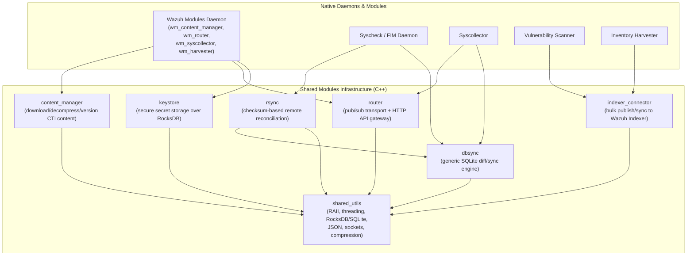
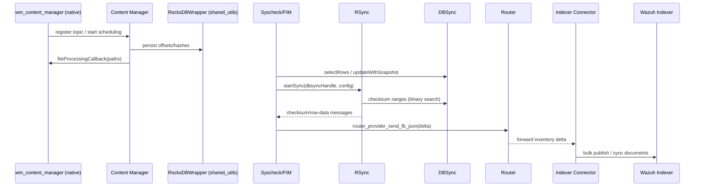

# Shared Modules Infrastructure (C++)

## 1. Purpose

The **Shared Modules Infrastructure (C++)** is a foundational layer of reusable C++ libraries that underpin many of Wazuh's higher-level native daemons and modules. It provides generic, cross-cutting capabilities—content synchronization, database diffing, remote data reconciliation, inter-process publish/subscribe messaging, secret storage, indexer connectivity, and a broad set of low-level utilities (RAII wrappers, threading primitives, JSON reflection, SQLite/RocksDB wrappers, compression, networking, etc.)—that are consumed across the codebase rather than tied to a single business domain.

This module sits between the low-level operating system/third-party libraries and the domain-specific Wazuh components (e.g., Syscheck/FIM, Syscollector, Vulnerability Scanner, Inventory Harvester, Wazuh Modules Daemon). Its goal is to eliminate duplicated infrastructure code by centralizing:

- **Content distribution and versioning** (Content Manager)
- **Generic data synchronization/diffing on top of SQLite** (DBSync)
- **Checksum-based remote reconciliation** (RSync)
- **Publish/subscribe transport and an HTTP API gateway** (Router)
- **OpenSearch/Wazuh Indexer connectivity** (Indexer Connector)
- **Secure secret storage** (Keystore)
- **Generic C++ utilities** shared by all of the above (Shared Utilities)

## 2. Architecture

The module is organized into seven cohesive sub-modules. `shared_utils` acts as the common foundation consumed by all the others, while `content_manager`, `dbsync`, `rsync`, `router`, `indexer_connector`, and `keystore` provide higher-level, purpose-specific services built on top of it.

### Data flow example: content synchronization + inventory publishing

## 3. Core Components

| Sub-module | Responsibility | Documentation |
|---|---|---|
| **Content Manager** | Fetches, decompresses, versions, and publishes external content (e.g., CTI feeds) via a chain-of-responsibility pipeline (download → decompress → version-update), with scheduling and on-demand HTTP triggering. | [content_manager](content_manager.md) |
| **DBSync** | Generic, thread-safe, SQLite-backed data synchronization engine used to persist snapshots and detect inserted/modified/deleted rows; exposes both a C API and a C++ facade. | [dbsync](dbsync.md) |
| **Indexer Connector** | Publishes and reconciles JSON documents against the Wazuh Indexer (OpenSearch) via its Bulk API, with local RocksDB-backed durability, node health-aware load balancing, and diff-based state reconciliation. | [indexer_connector](indexer_connector.md) |
| **Keystore** | Minimal library + CLI (`wazuh-keystore`) for securely storing and retrieving secrets (e.g., Indexer credentials) using RocksDB column families as namespaces. | [keystore](keystore.md) |
| **Router** | Lightweight publish/subscribe message bus (local and cross-process via Unix sockets) plus an embedded HTTP-over-Unix-socket API gateway (used by `wazuh-db`). | [router](router.md) |
| **RSync** | Checksum-based binary-search protocol for efficiently synchronizing remote datasets (built on top of DBSync), minimizing data transferred between agent and manager. | [rsync](rsync.md) |
| **Shared Utilities** | Foundational, largely header-only utilities: synchronization primitives, RAII/smart-pointer deleters, design patterns (Builder, Observer, Chain-of-Responsibility), socket networking, filesystem/OS helpers, JSON utilities (including reflection-based serialization), threading/dispatch queues, RocksDB and SQLite wrappers, and compression helpers. Consumed by every other sub-module in this infrastructure layer. | [shared_utils](shared_utils.md) |