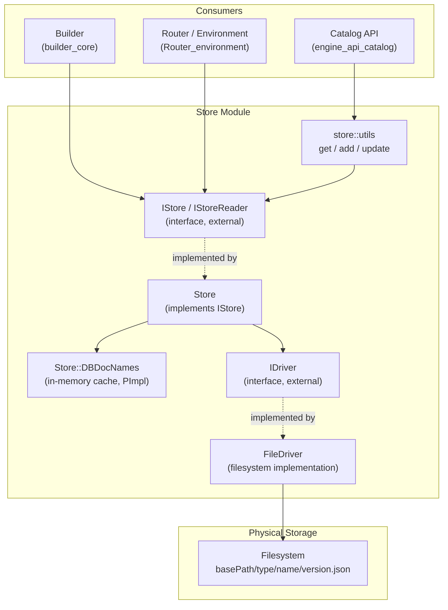
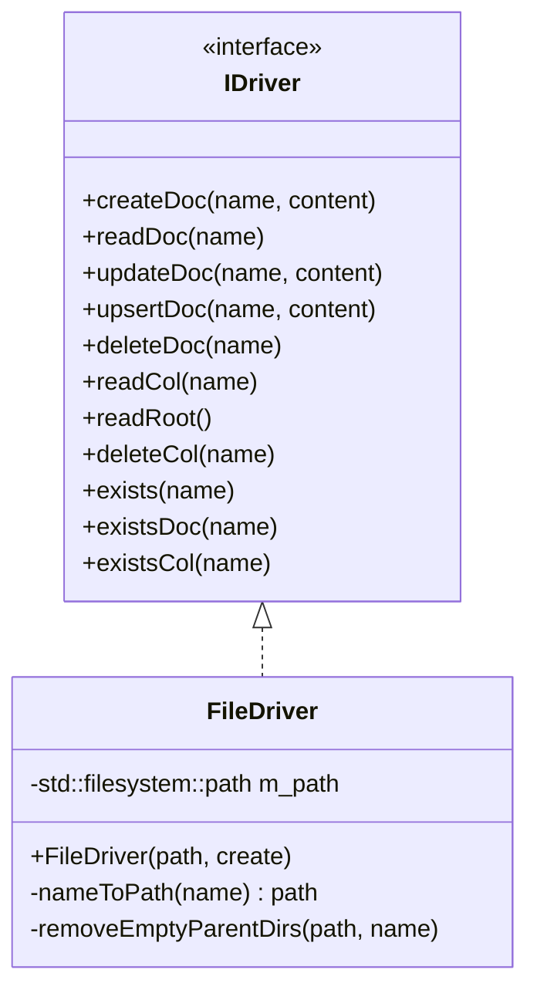
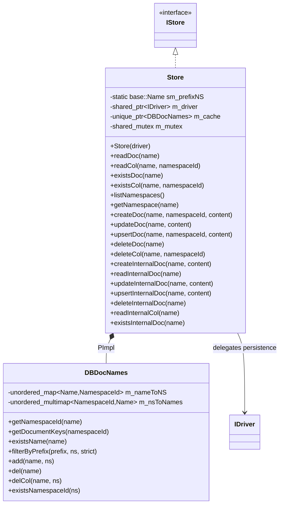
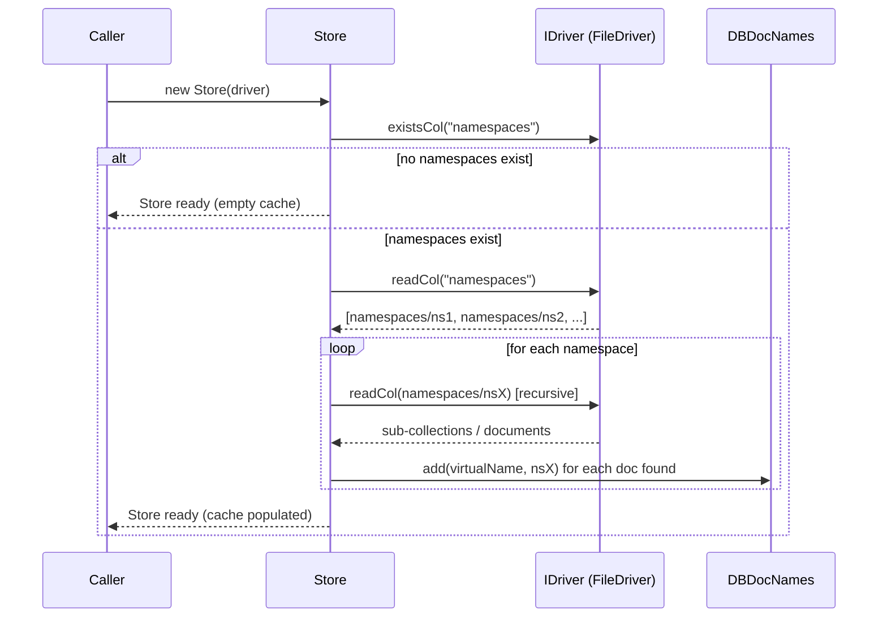
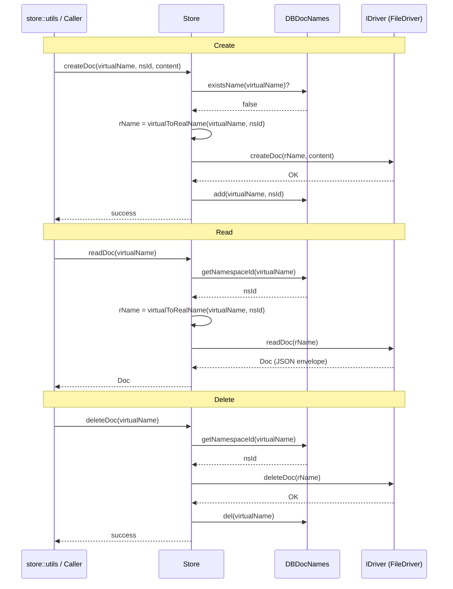
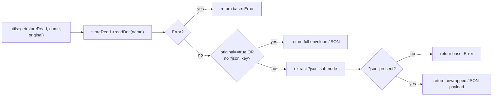
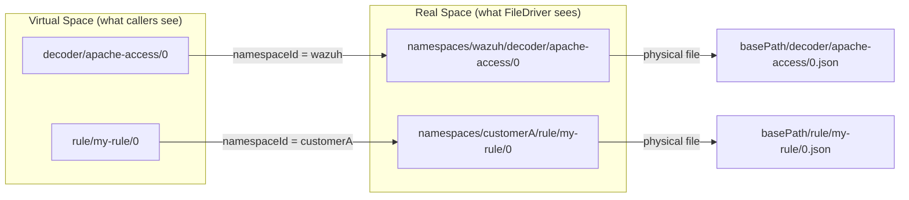

# Store Module

## 1. Introduction & Purpose

The **Store** module is the persistence abstraction layer of the **Wazuh Engine** (C++ core). It provides a
uniform, namespace-aware API for creating, reading, updating, deleting, and listing JSON documents and
collections that represent engine assets — decoders, rules, filters, outputs, policies, schemas, and other
configuration artifacts.

The module decouples *what* is stored (JSON documents identified by a hierarchical `base::Name`) from *how* it
is physically persisted (currently, the filesystem, via `FileDriver`). Consumers of the Store — such as the
Catalog API, the Builder, and the Router — never talk to the filesystem directly; they always go through
the `Store`/`IStore` interface, which additionally introduces the concept of **namespaces** to support
multi-tenant segregation of assets (e.g., different namespaces per integration or customer).

Key responsibilities of the module:

- **Abstract persistence**: Provide `IDriver`-based pluggable storage backends (only `FileDriver` exists today).
- **Namespace virtualization**: Present callers with a "virtual" flat name space per `NamespaceId`, while
  internally mapping (and physically storing) documents under a real, prefixed path
  (`namespaces/<namespaceId>/<virtualName>`).
- **In-memory indexing/caching**: Maintain a fast lookup cache (`DBDocNames`) of document name → namespace
  associations and reverse lookups, avoiding repeated disk traversals for existence/listing checks.
- **Internal (non-namespaced) documents**: Support a separate "internal" document space used for
  engine-internal bookkeeping/configuration that bypasses the namespace virtualization entirely.
- **Convenience helpers**: Offer a small `utils` API (`get`, `add`, `update`) that wraps/unwraps documents in a
  standard envelope containing the parsed JSON, the original raw text, and its format (json/yaml).

The Store is a foundational dependency for higher-level Engine components such as the
[Catalog API](engine_api_catalog.md), the [Builder core](builder_core.md), and the
[Router environment](Router_environment.md), which rely on it to load and persist assets and policies. It in
turn depends on core Engine primitives from [engine_base_core_types](engine_base_core_types.md) (e.g.
`base::Name`, `base::Result`) and error/logging utilities from
[engine_base_logging](engine_base_logging.md).

---

## 2. Architecture Overview

The Store module follows a classic **Driver / Repository** pattern: the `Store` class implements the public
`IStore` interface and orchestrates namespace logic and caching, while delegating the actual byte-level
persistence to a pluggable `IDriver` implementation (`FileDriver`).



### Design highlights

- **Two-level naming**: Callers use a *virtual name* (e.g. `decoder/apache-access/0`) scoped to a
  `NamespaceId`. Internally, `Store` translates this to a *real name* by prefixing it with
  `namespaces/<namespaceId>` before delegating to the driver. This mapping is reversible via
  `virtualToRealName` / `realToVirtualName`.
- **Thread-safety**: `Store` guards its cache (`DBDocNames`) with a `std::shared_mutex`, allowing concurrent
  reads while serializing writes.
- **Cache-first existence checks**: Operations such as `existsDoc`, `existsCol`, `readCol`, and `listNamespaces`
  are answered directly from the in-memory `DBDocNames` cache — the driver is only consulted for actual content
  reads (`readDoc`) or mutations (`create/update/upsert/deleteDoc`, `deleteCol`).
  This cache is rebuilt at construction time by walking the driver's `namespaces` collection.
- **Internal documents bypass namespaces**: A parallel set of `*InternalDoc` operations exists for documents
  that must not be namespaced (e.g., low-level engine metadata). These go straight to the driver without
  touching the cache, and are guarded against colliding with the reserved `namespaces` prefix.

---

## 3. Core Components

### 3.1 `IDriver` / `FileDriver` — Storage Driver Layer

Although `IDriver` itself is an external interface (declared in `store/idriver.hpp`, not part of this
component set), the only concrete implementation shipped is **`FileDriver`**
(`store/drivers/fileDriver/include/store/drivers/fileDriver.hpp`).

`FileDriver` persists every named document as a JSON file on disk, mapping a `base::Name` to a filesystem path
following the convention:

```
<basePath>/<Name::m_type>/<Name::m_name>/<Name::m_version>.json
```

Responsibilities:

| Method | Purpose |
|---|---|
| `createDoc` / `readDoc` / `updateDoc` / `upsertDoc` / `deleteDoc` | CRUD for a single document (file). |
| `readCol` / `readRoot` / `deleteCol` | Read/delete a "collection" — i.e., a directory level of the name hierarchy. |
| `exists` / `existsDoc` / `existsCol` | Existence checks translating `base::Name` → filesystem path. |
| `nameToPath` (private) | Converts a `base::Name` into its corresponding `std::filesystem::path`. |
| `removeEmptyParentDirs` (private) | Cleans up empty parent directories after a document/collection deletion, keeping the tree tidy. |

The constructor accepts a base path and an optional `create` flag to auto-create the root directory if it does
not exist.



### 3.2 `Store` — Namespace-aware Orchestrator

`Store` (`store/include/store/store.hpp`, implemented in `store/src/store.cpp`) is the concrete implementation
of the `IStore` interface and is the primary entry point consumers interact with.

**Construction**: `Store(std::shared_ptr<IDriver> driver)` — throws if `driver` is `nullptr`. On construction it
loads the entire `namespaces` collection tree from the driver into the `DBDocNames` cache by recursively
visiting every namespace's sub-collections.

**Public API surface** (grouped by concern):

- *Namespace-aware document/collection ops* (implement `IStore`):
  `readDoc`, `readCol`, `existsDoc`, `existsCol`, `listNamespaces`, `getNamespace`, `createDoc`, `updateDoc`,
  `upsertDoc`, `deleteDoc`, `deleteCol`.
- *Internal (non-namespaced) document ops* (implement `IStoreInternal`, a base of `IStore`):
  `createInternalDoc`, `readInternalDoc`, `updateInternalDoc`, `upsertInternalDoc`, `deleteInternalDoc`,
  `readInternalCol`, `existsInternalDoc`.

**Name translation helpers** (static, private):

- `virtualToRealName(virtualName, namespaceId)` → `sm_prefixNS + namespaceId + virtualName`
- `realToVirtualName(realName)` → strips the `namespaces/<namespaceId>` prefix, validating structure and prefix.
- `virtualToRealCol` / `realToVirtualCol` — vectorized equivalents for collections.

`sm_prefixNS` is a static `base::Name` initialized to `"namespaces"`, defining the root under which every
namespaced document actually lives in the driver.

**Concurrency model**: All cache accesses (`m_cache`) are protected by `m_mutex` (`std::shared_mutex`).
Read-only operations acquire a `shared_lock`; mutating operations acquire a `unique_lock`.

#### 3.2.1 `Store::DBDocNames` — In-memory Name/Namespace Cache

`DBDocNames` is a private, PImpl-style nested class (declared in `store.hpp`, defined in `store.cpp`) that
maintains two synchronized indices:

- `m_nameToNS: unordered_map<base::Name, NamespaceId>` — document name → owning namespace.
- `m_nsToNames: unordered_multimap<NamespaceId, base::Name>` — namespace → set of document names.

Core operations:

| Method | Behavior |
|---|---|
| `getNamespaceId(name)` | Looks up the namespace owning a document. |
| `getDocumentKeys(namespaceId)` / `getDocumentKeys()` | Lists all document names in a namespace, or globally. |
| `existsName(name)` | O(1) existence check. |
| `isPrefix(prefix, name, strict)` | Structural prefix comparison over `base::Name` parts, used for collection listing. |
| `existsPrefixName` / `filterByPrefix` | Collection-style queries (list all docs under a virtual "folder"). |
| `getNamespaceIds()` | Distinct list of known namespaces. |
| `changeNamespaceId(name, namespaceId)` | Re-associates a document with a different namespace. |
| `add(name, namespaceId)` / `del(name)` / `delCol(name, namespaceId)` | Mutations kept in sync between both maps. |
| `existsNamespaceId(namespaceId)` | Checks whether a namespace has any documents at all. |

This cache is rebuilt entirely at `Store` construction time by recursively visiting the driver's `namespaces`
collection tree (the free functions `existsNamespaceId` / `getDocumentKeys` in `store.cpp` are thin
convenience wrappers invoked during that traversal), and then incrementally kept up to date by every mutating
`Store` method.



### 3.3 `store::utils` — Convenience Helpers

Defined in `store/interface/store/utils.hpp`, this header-only namespace provides free functions that
wrap common patterns used by higher-level components (notably the Catalog):

- **`jsonGenerator(contentJson, original, format)`**: Builds a canonical envelope
  `{ "json": <parsed>, "original": <raw text>, "format": "json"|"yaml" }`. This envelope is what actually gets
  persisted for every document, allowing the Store to preserve the user's original representation alongside the
  parsed structure.
- **`get(storeRead, name, original=false)`**: Reads a document via `IStoreReader::readDoc` and, unless
  `original` is requested (or the envelope has no `/json` key), unwraps and returns just the `/json` payload.
- **`add(istore, name, namespaceId, format, contentJson, original)`**: Wraps content via `jsonGenerator` and
  calls `IStore::createDoc`.
- **`update(istore, name, format, contentJson, original)`**: Wraps content via `jsonGenerator` and calls
  `IStore::updateDoc`.

These helpers centralize the envelope format so that all Store consumers (e.g., the Catalog's asset/policy
CRUD endpoints) do not need to duplicate the wrap/unwrap logic.

---

## 4. Data Flow

### 4.1 Store Initialization (Cache Warm-up)



### 4.2 Document Create/Read/Update/Delete Flow



### 4.3 `store::utils::get` Envelope Unwrapping



---

## 5. Namespace Virtualization Model



The same virtual name can theoretically exist independently in two different namespaces (each mapped to a
distinct real path), but a given virtual name is only ever associated with **one** namespace at a time in the
cache — attempting to `upsertDoc` an existing virtual name under a different namespace than its current one
returns an error ("Document already exists in another namespace").

---

## 6. Internal vs. Namespaced Documents

| Aspect | Namespaced Documents | Internal Documents |
|---|---|---|
| Entry points | `createDoc`, `readDoc`, `updateDoc`, `upsertDoc`, `deleteDoc`, `readCol`, `deleteCol`, `existsDoc`, `existsCol` | `createInternalDoc`, `readInternalDoc`, `updateInternalDoc`, `upsertInternalDoc`, `deleteInternalDoc`, `readInternalCol`, `existsInternalDoc` |
| Cache usage | Tracked in `DBDocNames` | Not tracked at all — direct driver passthrough |
| Name restriction | Automatically prefixed with `namespaces/<nsId>/` | Must **not** start with the `namespaces` root segment (validated and rejected with an error otherwise) |
| Typical use case | Decoders, rules, filters, outputs, policies (belong to a tenant/namespace) | Engine-level or system metadata that has no namespace concept |

---

## 7. Integration with the Rest of the Engine

- **[engine_api_catalog](engine_api_catalog.md)**: The Catalog service is the primary consumer of
  `store::utils::get/add/update` and the `IStore` interface, exposing HTTP/API operations for
  creating/reading/updating/deleting engine assets and delegating persistence to the Store.
- **[builder_core](builder_core.md)**: The policy/asset Builder reads document content (decoders, rules,
  filters, outputs) from the Store (via `IStoreReader`/`get`) when compiling a running policy graph.
- **[Router_environment](Router_environment.md)**: Environment construction may read policy definitions
  persisted in the Store to build the running pipeline.
- **[engine_base_core_types](engine_base_core_types.md)**: Supplies `base::Name` (hierarchical naming),
  `base::Result`/`base::Error` (error-handling idioms used pervasively in `IDriver`/`IStore` return types), and
  JSON utilities (`base::Json`) used for the document payloads.
- **[engine_base_logging](engine_base_logging.md)**: Used by `Store` for warning/debug logging during cache
  construction (e.g., detecting duplicate document names across namespaces).

---

## 8. Summary

The Store module is a compact but critical piece of Engine infrastructure: it turns a simple filesystem-backed
key/value store (`FileDriver`) into a namespace-aware, cached, thread-safe document repository (`Store`) with a
clean, envelope-based convenience API (`store::utils`). Its design cleanly separates:

1. **Physical persistence** (`IDriver`/`FileDriver`) — how bytes are stored on disk.
2. **Logical/namespace semantics** (`Store`/`DBDocNames`) — how virtual names map to namespaces and real paths,
   with an in-memory cache for fast existence/listing operations.
3. **Content conventions** (`store::utils`) — the JSON envelope format (`json`/`original`/`format`) used
   uniformly across all stored engine assets.

This layered design allows the rest of the Engine (Catalog, Builder, Router) to work with simple, namespace-
scoped document names without any awareness of the underlying storage mechanism or file layout.
