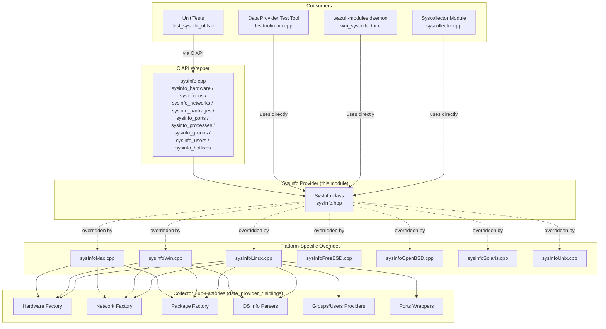
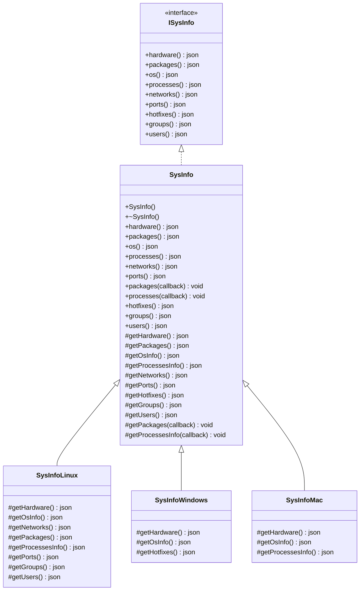
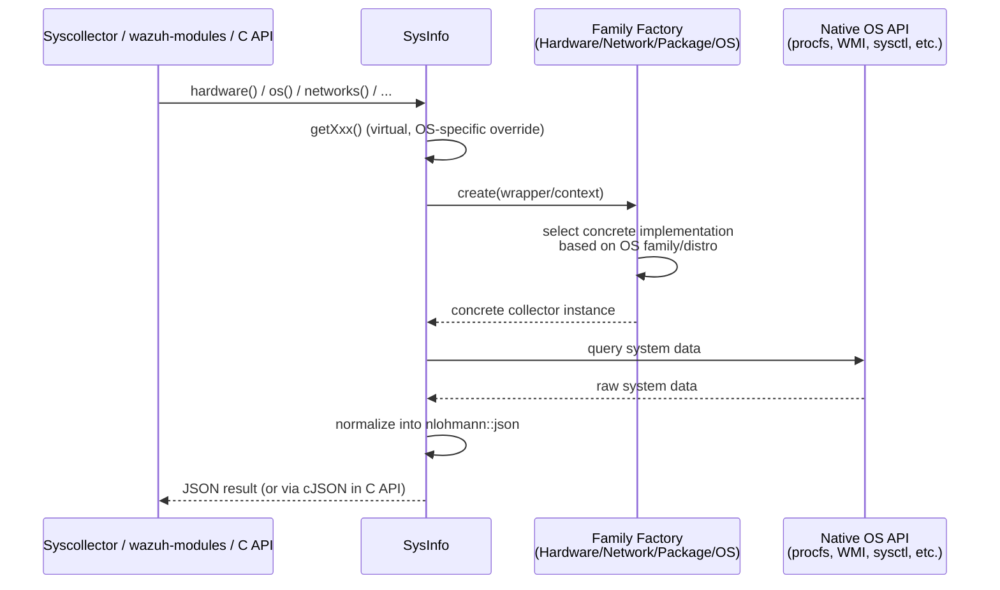
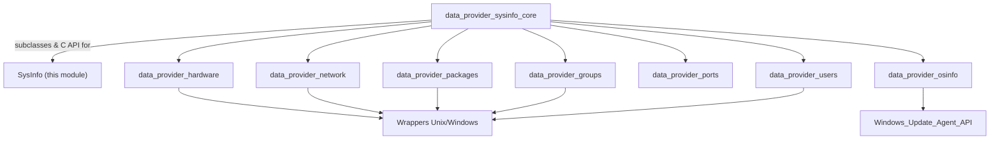
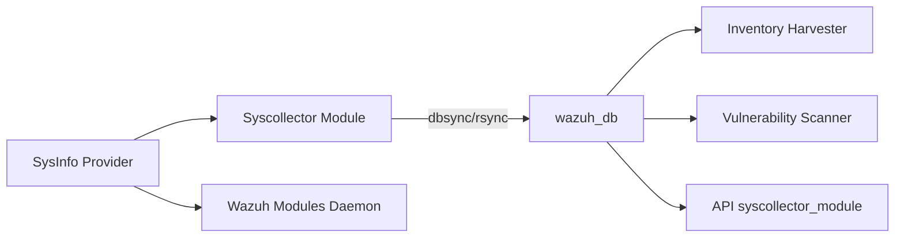

# SysInfo Provider

## Introduction

The **SysInfo Provider** module defines the primary public interface — the `SysInfo` C++ class — used by Wazuh to collect operating-system-level inventory information from a monitored endpoint. It is the *facade* of the much larger `System_Information_Data_Provider_(C++)` component (a.k.a. the "Data Provider" library), abstracting away all platform-specific complexity (Linux, Windows, macOS, BSD variants, Solaris, HP-UX, etc.) behind a small, stable, cross-platform API.

`SysInfo` is the single entry point that higher-level Wazuh components — the **Syscollector module**, the **wazuh-modules daemon**, and various unit-test/CLI tools — use to retrieve normalized JSON documents describing:

- Hardware (CPU, RAM, board serial)
- Installed packages
- Operating system identity/version
- Running processes
- Network interfaces
- Open ports
- Installed hotfixes (Windows)
- System groups and users

This document describes the responsibilities of `SysInfo`, how it composes the rest of the Data Provider subsystem, and how it is consumed by the rest of the Wazuh system.

---

## 1. Purpose and Core Functionality

### 1.1 Role in the System

`SysInfo` (declared in `src/data_provider/include/sysInfo.hpp`) implements the `ISysInfo` interface and exposes a set of public methods, each returning an `nlohmann::json` document (or invoking a callback with streamed JSON chunks for large datasets):

| Method | Returns | Description |
|---|---|---|
| `hardware()` | JSON object | CPU, memory, board information |
| `packages()` | JSON array | Installed software packages |
| `packages(callback)` | streamed | Same as above but delivered incrementally (large inventories) |
| `os()` | JSON object | OS name, version, build, kernel, architecture |
| `processes()` | JSON array | Running process list |
| `processes(callback)` | streamed | Same as above, streamed |
| `networks()` | JSON object | Network interfaces, addresses, protocols |
| `ports()` | JSON array | Open/listening ports |
| `hotfixes()` | JSON array | Installed OS hotfixes (mainly Windows) |
| `groups()` | JSON array | Local system groups |
| `users()` | JSON array | Local system users |

Each public method delegates to a matching **protected virtual** `getXxx()` method (e.g., `getHardware()`, `getOsInfo()`, `getNetworks()`, etc.). This virtual indirection is the key architectural device that allows **platform-specific translation units** (`sysInfoLinux.cpp`, `sysInfoWin.cpp`, `sysInfoMac.cpp`, `sysInfoFreeBSD.cpp`, `sysInfoOpenBSD.cpp`, `sysInfoSolaris.cpp`, `sysInfoUnix.cpp`) to each provide their own override implementation of `SysInfo`, while the header/interface and downstream consumers remain platform-agnostic.

### 1.2 Design Pattern

`SysInfo` follows the **Template Method / Strategy** pattern:

- Public methods (`hardware()`, `os()`, etc.) are the stable, non-virtual API.
- Protected `getXxx()` methods are virtual "hooks" overridden per-OS.
- Internally, OS-specific implementations rely on further **Abstract Factory** patterns (`FactoryHardwareFamilyCreator`, `FactoryNetworkFamilyCreator`, `FactoryPackageFamilyCreator`, `FactorySysOsParser`, etc., implemented in the sibling `data_provider_*` modules) to select the correct concrete collector/parser for the current OS family (Linux distro flavor, BSD variant, Windows API set, etc.).

This keeps `SysInfo` itself trivial and stable while all real complexity is pushed into replaceable, testable strategy objects.

---

## 2. Architecture

### 2.1 High-Level Position

### 2.2 Interface Inheritance

> Note: The `ISysInfo` interface lives outside this component (`sysInfoInterface.h`, part of the broader Data Provider library) and is referenced here to show the contract `SysInfo` fulfills.

---

## 3. Data Flow

### 3.1 Typical Collection Request Flow

### 3.2 C API Bridging (`sysInfo.cpp`)

Because most of Wazuh's core daemons (agent/manager) are written in C, the module exposes a thin **C wrapper layer** in `src/data_provider/src/sysInfo.cpp` that:

1. Instantiates a `SysInfo` object.
2. Calls the relevant C++ method (`info.hardware()`, `info.os()`, etc.).
3. Serializes the `nlohmann::json` result to a `cJSON*` via `cJSON_Parse(json.dump())`.
4. Returns `0` on success, `-1` on failure (all exceptions are swallowed).

Key exported C functions include:
`sysinfo_hardware`, `sysinfo_os`, `sysinfo_networks`, `sysinfo_packages`, `sysinfo_packages_cb`, `sysinfo_ports`, `sysinfo_processes`, `sysinfo_processes_cb`, `sysinfo_groups`, `sysinfo_users`, `sysinfo_hotfixes`, and `sysinfo_free_result` (used to release the returned `cJSON*`).

This C API is what the native C daemons (e.g., `wazuh_modules/wm_control.c`, `wazuh_modules/syscollector`) and the `w_sysinfo_helpers_t` struct (`src/headers/sysinfo_utils.h`) bind against via dynamic loading (`sysinfo_processes_func`, `sysinfo_free_result_func`, `sysinfo_os_func` function pointers).

---

## 4. Component Relationships

`SysInfo` sits at the root of the `System_Information_Data_Provider_(C++)` module tree. Its sibling child-modules provide the concrete collector implementations it depends on at runtime through virtual dispatch and factory selection:

| Sibling Module | Responsibility | Relationship to `SysInfo` |
|---|---|---|
| `data_provider_hardware` | CPU/board/RAM retrieval per OS family | Implements `getHardware()` overrides |
| `data_provider_network` | Network interface enumeration (Linux/BSD/Solaris/Windows) | Implements `getNetworks()` overrides |
| `data_provider_osinfo` | OS identification & distro parsing (`sysOsParsers.h`, `SysOsInfo`) | Implements `getOsInfo()` overrides |
| `data_provider_packages` | Package manager integrations (dpkg, rpm, brew, pacman, apk, Windows Appx, etc.) | Implements `getPackages()` overrides |
| `data_provider_ports` | Port/socket table retrieval (BSD/Windows) | Implements `getPorts()` overrides |
| `data_provider_groups` | Local group enumeration (Linux/Darwin/Windows) | Implements `getGroups()` overrides |
| `data_provider_users` | Local user enumeration, shadow/sudoers parsing | Implements `getUsers()` overrides |
| `data_provider_wrappers_unix` / `data_provider_wrappers_windows` | Thin OS syscall/API wrappers for testability | Used internally by all above collectors |
| `data_provider_sysinfo_core` | Platform-specific `SysInfo` subclass definitions (`sysInfoLinux.cpp`, `sysInfoWin.cpp`, etc.) and the C API bridge (`sysInfo.cpp`) | **Directly extends/overrides `SysInfo`** |
| `data_provider_testtool` | CLI test harness (`main.cpp`, `SysInfoPrinter`) | Direct consumer of `SysInfo` for manual verification |
| `Windows_Update_Agent_API` | COM interop for Windows Update/hotfix enumeration | Backing implementation for `getHotfixes()` on Windows |

---

## 5. How This Module Fits Into the Overall System

The Data Provider library — anchored by `SysInfo` — feeds inventory data into several higher-level Wazuh subsystems:

- **[syscollector_module](syscollector_module.md)**: The native `Syscollector` daemon (`src/wazuh_modules/syscollector`) calls `SysInfo` methods directly to gather hardware, OS, network, package, port, process, and hotfix data, then normalizes/syncs it into `wazuh-db` via `dbsync`/`rsync` (see [Shared_Modules_Infrastructure_(C++)](Shared_Modules_Infrastructure_CPP.md)).
- **[Wazuh_Modules_Daemon_(C)](Wazuh_Modules_Daemon_C.md)**: `wm_syscollector.c` and `wm_control.c` invoke the C API (`sysinfo_*` functions) to obtain host attributes (e.g., primary IP resolution logic tested in `test_wm_control.c`).
- **[Advanced_Security_Modules_(C++_Inventory_&_Vulnerability)](Advanced_Security_Modules_Inventory_Vulnerability.md)**: The `inventory_harvester_module` and `vulnerability_scanner_module` consume the syscollector-produced inventory (originally sourced through `SysInfo`) to build indexer documents (`OsElement`, `PackageElement`, `HwElement`, etc.) and perform vulnerability matching.
- **[API_&_Management_Framework_(Python)](API_Management_Framework.md)**: The `syscollector_module` and `experimental_controller` in the Wazuh API/Framework expose REST endpoints (`get_hardware_info`, `get_os_info`, `get_packages_info`, etc.) that query `wazuh-db` for data that ultimately originated from `SysInfo` collection cycles on the agent/manager.
- **Unit Testing**: `Unit_Tests_-_Shared_Library` (`test_sysinfo_utils.c`) and `Unit_Test_Wrappers_&_Mocks` (`sysInfo_wrappers.c`) mock the `sysinfo_*` C API to validate consumers without requiring real OS calls.

---

## 6. Usage Notes for Maintainers

- **Adding a new data field**: Extend the relevant `getXxx()` override in the platform-specific translation unit (e.g., `sysInfoLinux.cpp`), not in `sysInfo.hpp` itself, unless the field applies universally to all platforms.
- **Adding a new platform**: Create a new `sysInfoXxx.cpp` that subclasses `SysInfo` and overrides only the methods relevant/available on that platform; unimplemented methods fall back to the base class behavior (which typically returns empty JSON or throws, depending on the method).
- **Testing**: Use the `data_provider_testtool` (`SysInfoPrinter` in `testtool/main.cpp`) for manual, human-readable output validation, and the wrapper-based unit tests (`Unit_Test_Wrappers_&_Mocks` → `data_provider_wrappers`) for automated regression testing without touching real OS state.
- **Streaming methods**: `packages(callback)` and `processes(callback)` exist specifically to avoid building huge in-memory JSON documents for hosts with very large package/process counts; prefer these over the non-callback variants when handling bulk inventory syncs.

---

## Related Documentation

- [System_Information_Data_Provider_(C++)](System_Information_Data_Provider_CPP.md) — parent module overview covering hardware, network, package, OS, ports, groups, and users sub-collectors.
- [syscollector_module](syscollector_module.md) — consumer daemon that drives periodic inventory scans using `SysInfo`.
- [Wazuh_Modules_Daemon_(C)](Wazuh_Modules_Daemon_C.md) — C daemon wiring that loads the Data Provider shared library via `w_sysinfo_helpers_t`.
- [Advanced_Security_Modules_(C++_Inventory_&_Vulnerability)](Advanced_Security_Modules_Inventory_Vulnerability.md) — downstream consumers that transform inventory data into indexed documents and vulnerability findings.
- [Shared_Modules_Infrastructure_(C++)](Shared_Modules_Infrastructure_CPP.md) — `dbsync`/`rsync` infrastructure used to persist and synchronize collected inventory.
