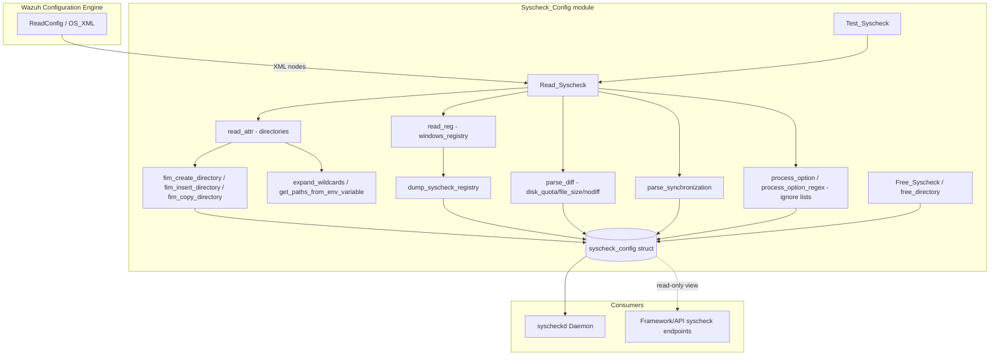
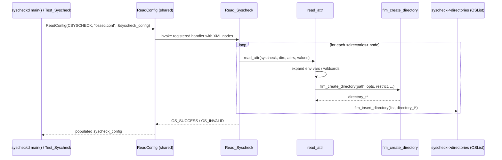
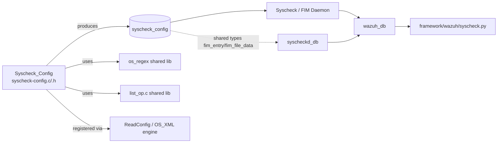

# Syscheck_Config

## 1. Purpose & Overview

`Syscheck_Config` is the **configuration model and XML parser** for Wazuh's File Integrity Monitoring (FIM) subsystem, historically known as *syscheck*. It is a small but critical C module composed of exactly two files:

| File | Role |
|---|---|
| `src/config/syscheck-config.h` | Declares all data structures that represent a fully-parsed FIM configuration (directories, Windows registries, whodata, diff/disk-quota limits, synchronization settings, etc.) and exposes the public configuration API. |
| `src/config/syscheck-config.c` | Implements the XML parsing logic (`Read_Syscheck`) that reads the `<syscheck>` block of `ossec.conf`/`agent.conf`, populates a `syscheck_config` instance, and provides supporting helpers (path expansion, wildcard handling, ignore/nodiff lists, cleanup, validation).

This module does **not** run any scans or perform any I/O against the filesystem being monitored — it exclusively deals with **turning XML configuration into in-memory data structures** that the FIM daemon (`syscheckd`) consumes at runtime. Because of this, `Syscheck_Config` sits at the boundary between the generic Wazuh configuration engine (`ReadConfig`) and the [Syscheck / FIM Daemon](Syscheck___FIM_Daemon_(C_C++).md), which is the actual consumer of the `syscheck_config` struct.

### Key Responsibilities
- Define the canonical `syscheck_config` structure holding every tunable FIM option.
- Parse `<directories>`, `<windows_registry>`, `<ignore>`, `<nodiff>`, `<registry_ignore>`, `<registry_nodiff>`, `<whodata>`, `<synchronization>`, `<diff>` (disk_quota/file_size) and top-level scalar options (frequency, scan_day, scan_time, process priority, max_eps, etc.).
- Expand environment variables and OS wildcards (`*`, `?`, `[...]`) found in monitored paths/registries into concrete `directory_t`/`registry_t` entries.
- Maintain ignore/no-diff lists (both literal strings and compiled regular expressions) for files, directories, and (on Windows) registry keys/values.
- Provide lifecycle helpers to create, copy, insert, and free directory/registry entries and to release the entire configuration (`Free_Syscheck`).
- Offer a self-test entry point (`Test_Syscheck`) used by `-t`/`--test-config` style validation commands.

## 2. Architecture Overview

### Data Flow (Parsing a `<syscheck>` Block)

## 3. Core Data Structures (`syscheck-config.h`)

| Structure | Purpose |
|---|---|
| `syscheck_config` | The root configuration object. Holds scan scheduling (`time`, `scan_day`, `scan_time`), file/registry limits, ignore/nodiff lists, diff & disk-quota settings, synchronization tuning, whodata/audit settings, the `directories`/`wildcards` `OSList`s, and (Windows-only) registry-related fields. |
| `directory_t` | A single monitored path entry: path, bitmask of `CHECK_*`/`*_ACTIVE` options, `filerestrict` regex, recursion level, tag, wildcard/expansion flags, and (Windows) `whodata_dir_status`. |
| `registry_t` *(WIN32)* | A single monitored Windows registry entry (key), analogous to `directory_t`, including architecture (32/64/both) and restrict regex for keys/values. |
| `registry_ignore` / `registry_ignore_regex` *(WIN32)* | Literal / regex ignore lists for registry keys or values, tagged by architecture. |
| `whodata` *(WIN32)* | Whodata-specific runtime state: open file descriptors hash, monitored-directories hash, scan interval, and hard-disk device/drive mappings. |
| `rtfim` / `win32rtfim` | Realtime monitoring context (inotify on Linux, `ReadDirectoryChangesW` on Windows). |
| `whodata_evt` | Represents a single whodata (audit/eBPF) event with user/process/path/inode metadata used during event correlation. |
| `fim_file_data`, `fim_registry_key`, `fim_registry_value_data` | Snapshot data captured for a file, a registry key, or a registry value (hashes, permissions, owner, timestamps, checksum) — these are the DB row models, not configuration, but are declared here because they share the header with the config types. |
| `fim_entry` | Tagged union wrapping either a file entry or a registry entry, used generically by the FIM database layer. |
| `fdb_t` / `fdb_transaction_t` | Handle and transaction bookkeeping for the FIM SQLite database connection (`fdb_stmt` enumerates all prepared statements). |

### Option Bitmask (`CHECK_*` / `*_ACTIVE`)

`directory_t.options` and `registry_t.opts` are bitmasks built from constants such as `CHECK_SIZE`, `CHECK_PERM`, `CHECK_OWNER`, `CHECK_GROUP`, `CHECK_MTIME`, `CHECK_INODE`, `CHECK_MD5SUM`, `CHECK_SHA1SUM`, `CHECK_SHA256SUM`, `CHECK_ATTRS` (Windows), `CHECK_SEECHANGES` (report_changes/diff), `CHECK_FOLLOW` (follow_symbolic_link), `REALTIME_ACTIVE`, `WHODATA_ACTIVE`, `SCHEDULED_ACTIVE`, `CHECK_TYPE`, `CHECK_DEVICE`. The helper `syscheck_opts2str()` renders this bitmask into a human-readable string (used for diagnostics/logging), while `fim_set_check_all()` sets the "check_all" default combination.

## 4. Core Functions (`syscheck-config.c`)

### 4.1 Configuration Lifecycle
- **`initialize_syscheck_configuration(syscheck_config *syscheck)`** — Populates a `syscheck_config` with safe defaults (12h frequency, file limit of 100000 entries, disk quota 1 GB, file size limit 50 MB, synchronization enabled every 300s, etc.) before XML parsing overrides them.
- **`Read_Syscheck(...)`** — The main entry point registered with the generic Wazuh config reader (`ReadConfig`). Iterates every XML child node of `<syscheck>` and dispatches to the appropriate sub-parser (see §4.2).
- **`Test_Syscheck(const char *path)`** — Loads a temporary `syscheck_config`, invokes `ReadConfig`, and frees it; used by configuration validation tooling (`-t` flag) to fail fast on malformed FIM configuration.
- **`Free_Syscheck(syscheck_config *config)`** / **`free_directory(directory_t *dir)`** — Full and per-entry teardown, releasing ignore lists, regex objects, `OSList`s, and (Windows) registry/whodata structures.

### 4.2 XML Section Parsers
- **`read_attr(...)`** *(static)* — Parses a `<directories>` element: extracts attributes (`check_all`, `check_sum`, `whodata`, `realtime`, `report_changes`, `restrict`, `recursion_level`, `tags`, `follow_symbolic_link`, `diff_size_limit`, etc.), expands environment variables, detects wildcard characters, and creates one or more `directory_t` entries via `fim_create_directory`/`fim_insert_directory`. Wildcarded paths are also tracked separately in `syscheck->wildcards` for later re-expansion by the daemon.
- **`read_reg(...)`** *(WIN32 only)* — Equivalent of `read_attr` for `<windows_registry>` elements; supports `arch` (`32bit`/`64bit`/`both`), `restrict_key`/`restrict_value`, and calls `dump_syscheck_registry`.
- **`parse_diff(const OS_XML *xml, syscheck_config *syscheck, XML_NODE node)`** — Parses the `<diff>` block: `<disk_quota><enabled/limit>`, `<file_size><enabled/limit>`, plus legacy top-level `<nodiff>` / `<registry_nodiff>` entries (supporting `type="sregex"` for regex-based rules). Ensures `disk_quota_limit >= file_size_limit`.
- **`parse_synchronization(syscheck_config *syscheck, XML_NODE node)`** *(static)* — Parses `<synchronization>`: `enabled`, `interval`, `response_timeout`, `max_eps`.
- Inline handling inside `Read_Syscheck` for: `frequency`, `scan_day`, `scan_time`, `file_limit`/`registry_limit`, `scan_on_start`, `disabled`, `skip_nfs/dev/sys/proc`, `ignore`/`registry_ignore` (literal & regex), legacy `nodiff`, `prefilter_cmd` (with command validation via `stat`), `restart_audit`, `<whodata>` block (`audit_key`, `startup_healthcheck`, `provider` [`audit`/`ebpf`], `queue_size`), `process_priority`, `max_eps`, `notify_first_scan`, `allow_remote_prefilter_cmd` (blocked when set via centralized `agent.conf`), `max_files_per_second`.

### 4.3 Directory / Registry Entry Management
- **`fim_create_directory(...)`** — Allocates and initializes a `directory_t` (compiles `filerestrict` regex, resolves symbolic links when `CHECK_FOLLOW` is set).
- **`fim_insert_directory(OSList *config_list, directory_t *new_entry)`** — Inserts into the sorted `OSList` of directories, replacing duplicates (by path) while preserving a previously resolved `symbolic_links` value.
- **`fim_copy_directory(const directory_t *_dir)`** — Deep-clones a `directory_t` (used when expanding a wildcard into multiple concrete paths).
- **`dump_syscheck_registry(...)`** *(WIN32)* — Analogous add/overwrite logic for `registry_t` entries, keyed by `(entry, arch)`.
- **`dump_registry_ignore`, `dump_registry_ignore_regex`, `dump_registry_nodiff`, `dump_registry_nodiff_regex`** *(WIN32)* — Append literal/regex entries to the corresponding ignore/nodiff arrays, deduplicating by `(entry, arch)`.

### 4.4 Path & Wildcard Utilities
- **`format_path(char *dir)`** — Normalizes a path (backslash conversion & lowercase on Windows, trailing separator trimming).
- **`expand_wildcards(const char *path)`** — Uses POSIX `glob()` (or `expand_win32_wildcards` on Windows) to resolve a wildcarded path into a `NULL`-terminated array of concrete paths.
- **`get_paths_from_env_variable(char *environment_variable)`** *(static)* — Expands `$VAR` (POSIX) or `%VAR%` (Windows) environment variables that may resolve to a delimiter-separated list of paths.
- **`fim_adjust_path(char **path)`** *(WIN32)* — Rewrites `sysnative` to `system32` so 32-bit agents monitor the correct redirected path.
- **`read_data_unit(const char *content)`** — Parses human-friendly size strings (`"100MB"`, `"2G"`, plain KB numbers) into an integer KB value, used by `disk_quota`/`file_size`/registry `diff_size_limit` options.

### 4.5 Ignore-List Helpers
- **`process_option(char ***syscheck_option, xml_node *node)`** *(static)* — Adds a literal ignore/nodiff path (with env-var expansion and path normalization) while avoiding duplicates.
- **`process_option_regex(char *option, OSMatch ***syscheck_option, xml_node *node)`** *(static)* — Compiles and appends a regex-based ignore/nodiff pattern (`type="sregex"`).

## 5. Relationship to Other Modules

- **Parent context:** `Syscheck_Config` is one of several configuration-parsing modules within [Configuration_Data_Structures_(C_Headers)](Configuration_Data_Structures_(C_Headers).md) alongside `Active_Response_Config`, `Authd_Config`, `Client_Config`, `Global_Config_Core`, `Localfile_Config`, `Remote_Config`, `Rootcheck_Config`, `Wazuh_DB_Config`, and `Wmodules_Config`. All of these plug into the same generic `ReadConfig`/`OS_XML` engine but each owns a distinct `<...>` XML section and struct family.
- **Primary consumer:** The parsed `syscheck_config` structure is consumed directly by the [Syscheck_/_FIM_Daemon_(C_C++)](Syscheck___FIM_Daemon_(C_C++).md) — specifically its core scanning loop (`syscheckd_core`), database layer (`syscheckd_db`), realtime watcher (`syscheckd_core`/`run_realtime.c`), and whodata engine (`syscheckd_whodata`, `syscheckd_ebpf`) — which read directory/registry lists, whodata settings, and diff/disk-quota limits to drive actual filesystem/registry scanning.
- **API exposure:** The Python framework/API layer (`syscheck_module` in the API & Management Framework) exposes read-only operations (`GET /syscheck`, `PUT /syscheck`, clear/last-scan) that ultimately query the FIM database populated according to this configuration; see `framework/wazuh/syscheck.py` and `framework/wazuh/core/syscheck.py` (`WazuhDBQuerySyscheck`) for the corresponding query layer, and `experimental_controller`'s `clear_syscheck_database` for administrative actions.
- **Data model overlap:** The `fim_file_data`, `fim_registry_key`, `fim_registry_value_data`, and `fim_entry` types declared in `syscheck-config.h` are also used by the FIM database module (`syscheckd_db`, e.g. `src/syscheckd/src/db/src/fimDB.hpp`) as the canonical row representations for files and registry keys/values — the configuration header effectively doubles as the shared data-model header for the whole FIM subsystem.
- **Shared low-level primitives:** Regex compilation/matching (`OSMatch_Compile`, `OSMatch_Execute`) come from the `os_regex` shared library (see [Agent_&_Manager_Native_Daemons_(C)](Agent_&_Manager_Native_Daemons_(C).md) → `os_regex`), and list management (`OSList_*`) comes from `shared_lib`'s `list_op.c`.

## 6. Notable Design Notes

- **Wildcards are first-class citizens.** Any directory/registry path containing `*`, `?`, or `[` is stored both as a template entry in `syscheck->wildcards` and expanded immediately into concrete `directory_t` entries in `syscheck->directories`. The daemon re-expands wildcard templates periodically to detect new matching paths/removed paths (see `syscheckd_core`).
- **Whodata provider is pluggable.** The `<whodata><provider>` option selects between the classic Linux Audit backend (`AUDIT_PROVIDER`) and the newer eBPF backend (`EBPF_PROVIDER`), both consumed by the `syscheckd_whodata` / `syscheckd_ebpf` sub-modules of the FIM daemon.
- **Size-unit parsing is centralized.** `read_data_unit()` is reused across `disk_quota`, `file_size`, and registry `diff_size_limit`, ensuring consistent KB-based semantics.
- **Configuration validation happens twice.** Once syntactically (during `Read_Syscheck`, returning `OS_INVALID` on malformed attributes) and once operationally via `Test_Syscheck`, which is wired into the wazuh-control / `-t` validation flow shared with other config modules (e.g. `Wazuh_DB_Config`, `Rootcheck_Config`).
- **`allow_remote_prefilter_cmd`** is a security guard: `prefilter_cmd` (a shell command used to pre-filter which files get scanned) can only be honored from a centrally pushed `agent.conf` if this flag was explicitly enabled locally, preventing remote code execution via centralized configuration.
