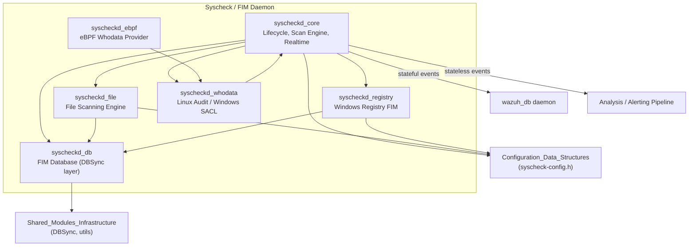
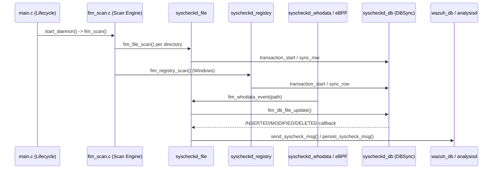

# Syscheck / FIM Daemon (C/C++)

## Purpose

The **Syscheck / FIM Daemon** module implements Wazuh's native **File Integrity Monitoring (FIM)** subsystem — the `syscheckd` binary that runs on both agents and managers. It is responsible for detecting and reporting changes to files, directories, and (on Windows) registry keys/values, and for identifying **who** made those changes when advanced auditing is enabled.

Its core responsibilities include:

- **Daemon lifecycle management**: startup, configuration loading, privilege separation, signal handling, and orchestration of scan/monitoring threads.
- **Scheduled and real-time scanning**: performing baseline and periodic full scans of monitored paths, plus continuous real-time change detection via OS-native mechanisms (inotify on Linux, `ReadDirectoryChangesW` on Windows).
- **Persistent inventory storage**: maintaining a local database (backed by the DBSync library) of files and Windows registry entries to detect additions, modifications, and deletions.
- **Who-data auditing**: correlating filesystem changes with the responsible user/process, using the Linux Audit subsystem, a modern eBPF-based provider, or Windows SACL/Event Log auditing.
- **Event generation**: producing both stateless (alerting) and stateful (inventory/checksum) JSON events that are forwarded to the analysis pipeline and to `wazuh-db` for synchronization with the manager.

This module works in close cooperation with the **Configuration_Data_Structures_(C_Headers)** module (which defines `syscheck_config`, `directory_t`, and related structures) and with the broader native agent/manager infrastructure (**Agent_&_Manager_Native_Daemons_(C)**, **Shared_Modules_Infrastructure_(C++)**, and **wazuh_db**).

## Architecture

The module is organized into six cooperating sub-components, each handling a distinct responsibility within the FIM pipeline:

### Event and Data Flow

### Sub-modules

| Sub-module | Responsibility |
|---|---|
| **syscheckd_core** | Daemon startup/shutdown, thread orchestration, scheduled scan orchestration, and real-time watch management (inotify/ReadDirectoryChangesW). |
| **syscheckd_db** | Persistence layer built on DBSync; stores file and registry inventory, computes checksums/diffs, and drives change-detection callbacks. |
| **syscheckd_file** | Core file-scanning logic: traversal, metadata/checksum collection, ignore/restrict filtering, and event generation for regular files. |
| **syscheckd_registry** | Windows-only counterpart of `syscheckd_file`, scanning registry keys/values and generating equivalent events. |
| **syscheckd_whodata** | Linux Audit-subsystem and Windows SACL-based "who made this change" auditing, feeding events into the core FIM pipeline. |
| **syscheckd_ebpf** | Modern, kernel-eBPF-based alternative to Audit for Linux who-data collection, using kprobes/LSM hooks and a ring buffer. |

## Core Components Documentation

- [syscheckd_core.md](syscheckd_core.md) — Daemon lifecycle, scan engine, and real-time monitoring
- [syscheckd_db.md](syscheckd_db.md) — FIM database facade, item adapters, and OS specialization
- [syscheckd_file.md](syscheckd_file.md) — File scanning engine and event construction
- [syscheckd_registry.md](syscheckd_registry.md) — Windows registry scanning engine
- [syscheckd_whodata.md](syscheckd_whodata.md) — Linux Audit and Windows SACL-based who-data auditing
- [syscheckd_ebpf.md](syscheckd_ebpf.md) — eBPF-based who-data provider for Linux

### Related Modules

- [Configuration_Data_Structures_(C_Headers)](Syscheck_Config.md) — Defines `syscheck_config`, `directory_t`, and other configuration structures consumed throughout this module.
- [Shared_Modules_Infrastructure_(C++)](dbsync_public_api.md) — Provides the DBSync library used by `syscheckd_db` for persistence.
- [wazuh_db](wazuh_db.md) — Receives stateful/inventory FIM events for synchronization.
- [Agent_&_Manager_Native_Daemons_(C)](shared_lib.md) — Supplies shared logging, queue, and OS utility primitives used pervasively by this module.