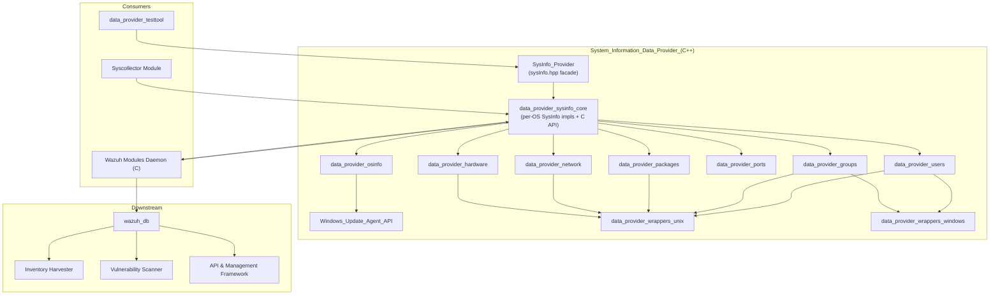
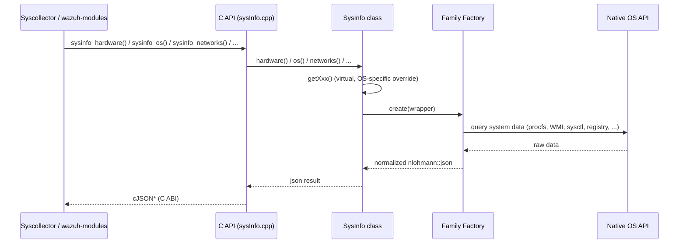
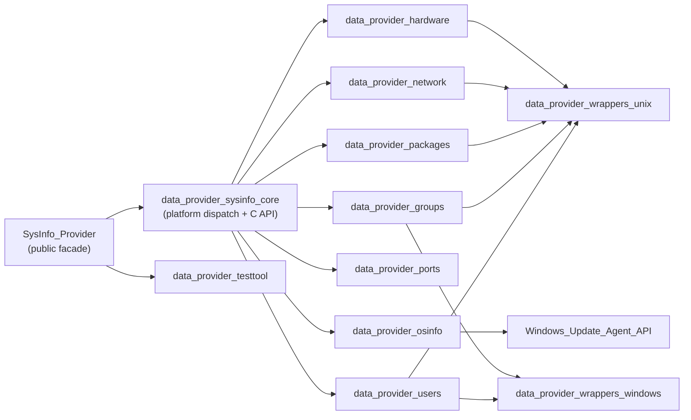

# System Information Data Provider (C++)

## Purpose

The **System Information Data Provider** (`src/data_provider`) is the cross-platform C++ library at the heart of Wazuh's host inventory collection capabilities. It abstracts away all operating-system-specific complexity (Linux distributions, Windows, macOS, BSD variants, Solaris) behind a small, stable public API — the `SysInfo` class — that returns normalized `nlohmann::json` documents describing a monitored endpoint's:

- **Hardware** (CPU, RAM, board serial)
- **Operating system** identity and version
- **Installed packages** (native package managers plus PyPI/NPM, etc.)
- **Running processes**
- **Network interfaces** and addresses/protocols
- **Open ports**
- **Installed hotfixes** (Windows, via COM/Windows Update Agent API)
- **Local groups and users**

This module is consumed directly by the native **Syscollector** wazuh module and the broader **Wazuh Modules Daemon (C)**, which periodically invoke `SysInfo` to build inventory snapshots that are synchronized to `wazuh-db` (via `dbsync`/`rsync`) and ultimately indexed by the **Inventory Harvester** and consumed by the **Vulnerability Scanner** and the **API & Management Framework**. A dedicated test tool (`data_provider_testtool`) and mock/wrapper layers support manual verification and automated unit testing across all platforms.

## Architecture

The module follows a consistent **Strategy + Abstract Factory** design: the platform-agnostic `SysInfo` facade delegates to per-OS implementations, which in turn use family-specific factories to select the correct collector for hardware, network, packages, OS parsing, ports, groups, and users. Low-level OS/library calls are isolated behind thin wrapper interfaces (Unix and Windows variants) to enable dependency injection and mocking in tests.

### Data flow

### Sub-module organization

## Core Components

- **[SysInfo_Provider](SysInfo_Provider.md)** — the `SysInfo` public facade class (`sysInfo.hpp`) exposed to all consumers.
- **[data_provider_sysinfo_core](data_provider_sysinfo_core.md)** — platform-specific `SysInfo` implementations (Linux, macOS, FreeBSD, OpenBSD, Solaris, Unix, Windows) and the C ABI bridge (`sysinfo_*` functions).
- **[data_provider_hardware](data_provider_hardware.md)** — CPU/board/RAM collection via the Abstract Factory pattern.
- **[data_provider_network](data_provider_network.md)** — network interface, address, and statistics collection across Linux/BSD/Solaris/Windows.
- **[data_provider_osinfo](data_provider_osinfo.md)** — OS identity detection and distro-specific release-file/`uname` parsers.
- **[data_provider_packages](data_provider_packages.md)** — package manager integrations (dpkg, rpm, pacman, apk, Homebrew, Appx, Solaris `pkginfo`, etc.).
- **[data_provider_ports](data_provider_ports.md)** — open port/socket enumeration (BSD/macOS and Windows).
- **[data_provider_groups](data_provider_groups.md)** — local group enumeration and user-group membership (Linux, Darwin, Windows).
- **[data_provider_users](data_provider_users.md)** — user accounts, logged-in sessions, shadow/sudoers parsing (Linux, Darwin, Windows).
- **[data_provider_wrappers_unix](data_provider_wrappers_unix.md)** — POSIX/Unix low-level OS API wrappers (passwd, group, shadow, utmpx).
- **[data_provider_wrappers_windows](data_provider_wrappers_windows.md)** — Windows Win32/NetAPI/Registry wrappers for users and groups.
- **[Windows_Update_Agent_API](Windows_Update_Agent_API.md)** — autogenerated COM interface bindings to `wuapi.dll` used for hotfix/update enumeration.
- **[data_provider_testtool](data_provider_testtool.md)** — CLI diagnostic utility (`sysinfo_test_tool`) for manually exercising `SysInfo` on any platform.