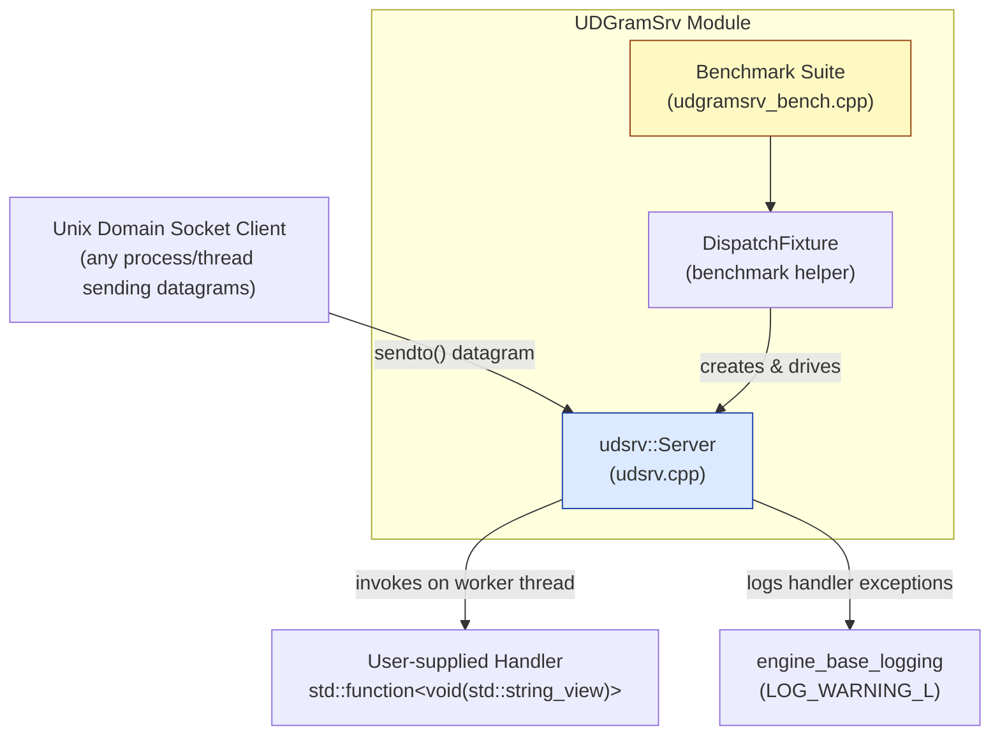
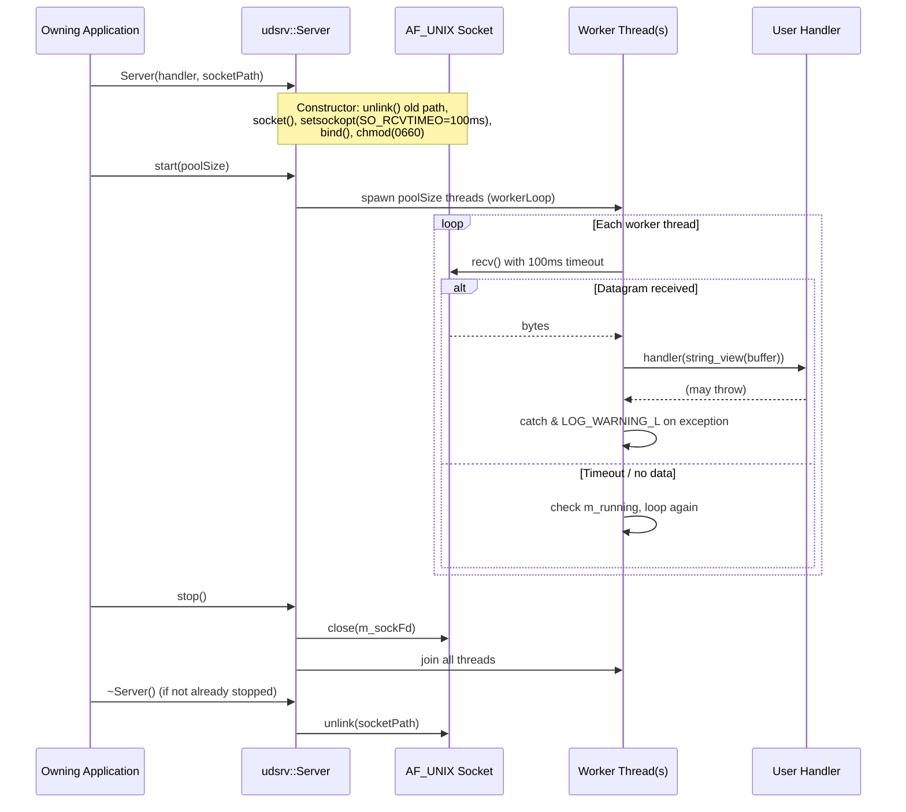

# UDGramSrv

## 1. Introduction & Purpose

**UDGramSrv** (`udgramsrv`) is a lightweight, thread-pooled **Unix Domain Datagram Socket server** utility that lives inside the [Wazuh Engine Core (C++)](Wazuh_Engine_Core_(C++).md) codebase, under `src/engine/source/udgramsrv/`.

Its single responsibility is to provide a small, embeddable, and reusable server primitive that:

- Listens on a Unix Domain Socket (`AF_UNIX`, `SOCK_DGRAM`).
- Dispatches every received datagram to a user-supplied callback (`std::function<void(std::string_view)>`), running the dispatch across a configurable pool of worker threads.
- Provides simple lifecycle control (`start()` / `stop()`), safe destruction, and non-blocking polling via socket receive timeouts so that worker threads can observe shutdown requests promptly.

This module is intentionally minimal: it does not implement any protocol, message framing, or business logic — it is a generic transport primitive that other engine subsystems can use to receive fire-and-forget messages over a local socket (e.g., internal event ingestion, IPC signaling, or lightweight command channels) without invoking heavier machinery such as the [Router](Router_orchestrator.md) or [HTTP Server interface](engine_httpsrv.md).

Because of its small, self-contained scope (two files: the server implementation and its benchmark suite), this module is documented as a single page rather than split into sub-modules.

## 2. Architecture Overview

### 2.1 Component Diagram

### 2.2 Lifecycle & Threading Model

## 3. Core Components

### 3.1 `udsrv::Server` (`src/engine/source/udgramsrv/src/udsrv.cpp`)

The `Server` class is the heart of the module. Key responsibilities and behaviors:

- **Construction**: Removes any stale socket file at the given path, creates an `AF_UNIX`/`SOCK_DGRAM` socket, sets a 100ms receive timeout (`SO_RCVTIMEO`) so worker loops can periodically check the running flag, binds to the given filesystem path, and sets the socket file permissions to `0660` (owner/group read-write). All failure paths throw `std::runtime_error` with a descriptive message (including `errno`/`strerror`).
- **`start(size_t poolSize)`**: Validates that the server is not already running and that `poolSize > 0`, then spawns `poolSize` worker threads, each running `workerLoop()`. Throws if called while already running or with a zero pool size.
- **`stop()`**: Idempotent — uses `std::atomic<bool> m_running` with `exchange()` to guard against double-stop. Closes the socket file descriptor (causing blocked `recv()` calls to return) and joins all worker threads.
- **`~Server()`**: Calls `stop()` defensively and unlinks the socket path from the filesystem, ensuring no dangling socket files are left behind.
- **`workerLoop()`** (private): Each worker allocates a 64KB (`0x1 << 16`) buffer sized for the maximum possible datagram, then loops calling `recv()` with the configured timeout. On successful receipt, the raw bytes are wrapped in a `std::string_view` (avoiding a copy) and passed to the user handler. Any exception thrown by the handler is caught and logged via `LOG_WARNING_L` (from the [engine_base_logging](engine_base_logging.md) module) rather than propagating and crashing the worker thread.

This design gives the server two important safety properties:
1. **Graceful, bounded-latency shutdown** — because `recv()` never blocks indefinitely, `stop()` can reliably join all threads within ~100ms of closing the socket.
2. **Handler exception isolation** — a misbehaving handler cannot take down a worker thread or the whole server.

### 3.2 Benchmark Suite (`src/engine/source/udgramsrv/benchmark/src/udgramsrv_bench.cpp`)

The benchmark file (built with Google Benchmark) exercises the `Server` under two scenarios:

- **`BM_ServerStartStop`**: Measures the latency of constructing, starting, and stopping a `Server` instance across different thread-pool sizes (1, 2, 4, 8), using a randomly generated socket path (`/tmp/udsrv_bench_<pid>.sock`) to avoid collisions between benchmark iterations.
- **`BM_ServerSingleDispatch`**: Measures round-trip dispatch latency — i.e., the time from a client `sendto()` call until the server-side handler is invoked and signals completion back to the benchmark loop. This uses the `DispatchFixture` helper.

#### `DispatchFixture`

`DispatchFixture` is a test/benchmark helper struct that:
- Creates and configures a client-side `AF_UNIX`/`SOCK_DGRAM` socket (`cliSock`) targeting the server's socket path.
- Exposes `sendAndWait(const std::string& msg)`, which sends a datagram via `sendto()` and then blocks on a `std::condition_variable` until the server's handler (wired up by the benchmark to set `received = true` and call `cv.notify_one()`) confirms receipt.
- Cleans up the client socket and unlinks the socket path on destruction.

This fixture pattern (synchronous send-and-wait over an inherently asynchronous datagram channel) is the standard technique used to measure single-message dispatch latency without race conditions in the benchmark loop.

## 4. Integration with the Rest of the System

`UDGramSrv` sits within the broader [Wazuh_Engine_Core_(C++)](Wazuh_Engine_Core_(C++).md) module tree as a low-level utility alongside other foundational building blocks:

- **[engine_base_logging](engine_base_logging.md)**: `Server::workerLoop()` uses `LOG_WARNING_L` to report handler exceptions without crashing, tying this module into the engine's centralized logging configuration (see `LoggingConfig`).
- **[Queue](Queue.md)**: A related but distinct primitive — `FloodingFile` (in `concurrentQueue.hpp`) provides thread-safe append-only file writing used elsewhere in the engine's queuing infrastructure. While not a direct dependency of `UDGramSrv`, both modules share the same design philosophy of small, thread-safe, mutex/atomic-guarded primitives used as building blocks by higher-level engine components (e.g., the [Router](Router_orchestrator.md) and [engine_main](engine_main.md) entry point).
- **General role**: As a generic Unix-socket datagram receiver, `UDGramSrv` is the kind of low-level transport component that higher-level engine services (event ingestion, control-plane signaling) could embed when a lightweight local IPC channel is needed, as an alternative to the more heavyweight [engine_httpsrv](engine_httpsrv.md) HTTP server interface or the [Router](Router.md) production/orchestration pipeline.

## 5. Key Design Characteristics Summary

| Aspect | Detail |
|---|---|
| Socket type | `AF_UNIX`, `SOCK_DGRAM` |
| Concurrency model | Fixed-size thread pool (`start(poolSize)`), each thread runs an independent `recv()` loop |
| Shutdown mechanism | `SO_RCVTIMEO` (100ms) + atomic `m_running` flag + socket `close()` to unblock all threads |
| Error handling | Constructor throws `std::runtime_error` on any setup failure; handler exceptions are caught and logged, not propagated |
| Buffer size | 64 KB per worker thread (maximum UDP/datagram-like payload) |
| File permissions | Socket file created with mode `0660` |
| Testing | Google Benchmark suite measuring start/stop latency and single-dispatch round-trip latency |
