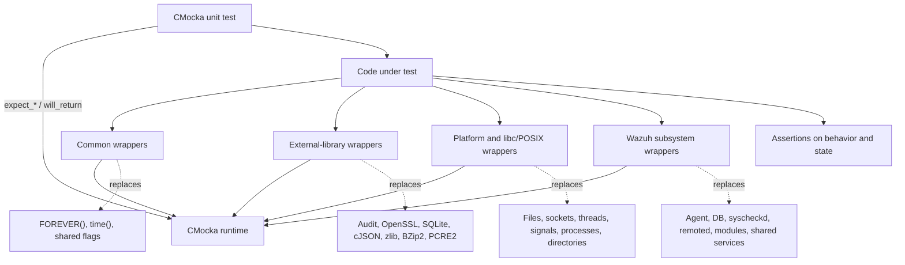
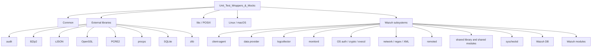
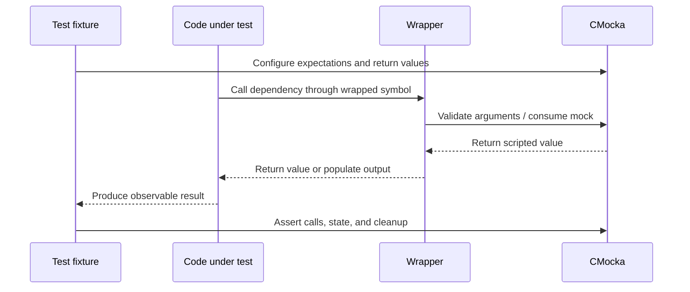

# Unit Test Wrappers & Mocks

## Purpose

`Unit_Test_Wrappers_&_Mocks` is Wazuh’s CMocka-based test-double layer located at [`src/unit_tests/wrappers`](src/unit_tests/wrappers). It provides link-time wrappers and mocks for libc, POSIX/Linux/macOS APIs, external libraries, and Wazuh subsystems.

The module enables unit tests to:

- Replace operating-system and third-party dependencies.
- Inject deterministic return values, errors, timestamps, buffers, and JSON objects.
- Verify function arguments and call order.
- Exercise subsystem behavior without real sockets, databases, filesystems, threads, daemons, audit services, or cryptographic services.

Wrappers contain test infrastructure only; production behavior remains in the corresponding Wazuh components.

## Architecture



### Wrapper families



### Typical execution flow



Wrappers generally use `check_expected`, `check_expected_ptr`, `function_called`, `mock`, and typed mock helpers. Some wrappers maintain small test-only state models or copy mocked data into caller-owned output buffers.

## Repository structure

```text
src/unit_tests/wrappers/
├── common.c
├── externals/
│   ├── audit/
│   ├── bzip2/
│   ├── cJSON/
│   ├── openssl/
│   ├── pcre2/
│   ├── procpc/
│   ├── sqlite/
│   └── zlib/
├── libc/
├── linux/
├── macos/
├── posix/
└── wazuh/
    ├── client-agent/
    ├── data_provider/
    ├── logcollector/
    ├── monitord/
    ├── os_auth/
    ├── os_crypto/
    ├── os_execd/
    ├── os_net/
    ├── os_regex/
    ├── os_xml/
    ├── remoted/
    ├── shared/
    ├── shared_modules/
    ├── syscheckd/
    ├── wazuh_db/
    └── wazuh_modules/
```

## Core component documentation

### Common and external dependencies

- [Common wrappers](wrappers_common.md)
- [Audit wrappers](wrappers_externals_audit.md)
- [BZip2 wrappers](wrappers_externals_bzip2.md)
- [cJSON wrappers](wrappers_externals_cjson.md)
- [OpenSSL wrappers](wrappers_externals_openssl.md)
- [PCRE2 wrappers](wrappers_externals_pcre2.md)
- [procps wrappers](wrappers_externals_procpc.md)
- [SQLite wrappers](wrappers_externals_sqlite.md)
- [zlib wrappers](wrappers_externals_zlib.md)

### Standard-library and platform wrappers

- [libc stdio](wrappers_libc_stdio.md), [stdlib](wrappers_libc_stdlib.md), [string](wrappers_libc_string.md), and [time](wrappers_libc_time.md)
- [Linux dynamic loading](wrappers_linux_dlfcn.md), [eBPF](wrappers_linux_ebpf.md), [inotify](wrappers_linux_inotify.md), [sockets](wrappers_linux_socket.md), and [wait](wrappers_linux_wait.md)
- [macOS stdio](wrappers_macos_libc_stdio.md), [libplist](wrappers_macos_libplist.md), [libwazuh](wrappers_macos_libwazuh.md), and [dirent](wrappers_macos_posix_dirent.md)
- [POSIX dirent](wrappers_posix_dirent.md), [groups](wrappers_posix_grp.md), [threads](wrappers_posix_pthread.md), [password database](wrappers_posix_pwd.md), [select](wrappers_posix_select.md), [signals](wrappers_posix_signal.md), [stat](wrappers_posix_stat.md), [time](wrappers_posix_time.md), and [unistd](wrappers_posix_unistd.md)

### Wazuh subsystem wrappers

- [Client-agent wrappers](client_agent_wrappers.md)
- [Data-provider wrappers](data_provider_wrappers.md)
- [Logcollector wrappers](logcollector_wrappers.md)
- [Monitord wrappers](monitord_wrappers.md)
- [OS auth wrappers](os_auth_wrappers.md)
- [OS crypto wrappers](os_crypto_wrappers.md)
- [OS execd wrappers](os_execd_wrappers.md)
- [OS network wrappers](os_net_wrappers.md)
- [OS regex wrappers](os_regex_wrappers.md)
- [OS XML wrappers](os_xml_wrappers.md)
- [Remoted wrappers](remoted_wrappers.md)
- [Shared-library wrappers](shared_wrappers.md)
- [Shared-modules wrappers](shared_modules_wrappers.md)
- [Syscheckd wrappers](syscheckd_wrappers.md)
- [Wazuh DB wrappers](wazuh_db_wrappers.md)
- [Wazuh modules wrappers](wazuh_modules_wrappers.md)