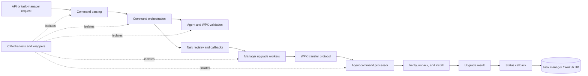
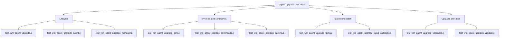
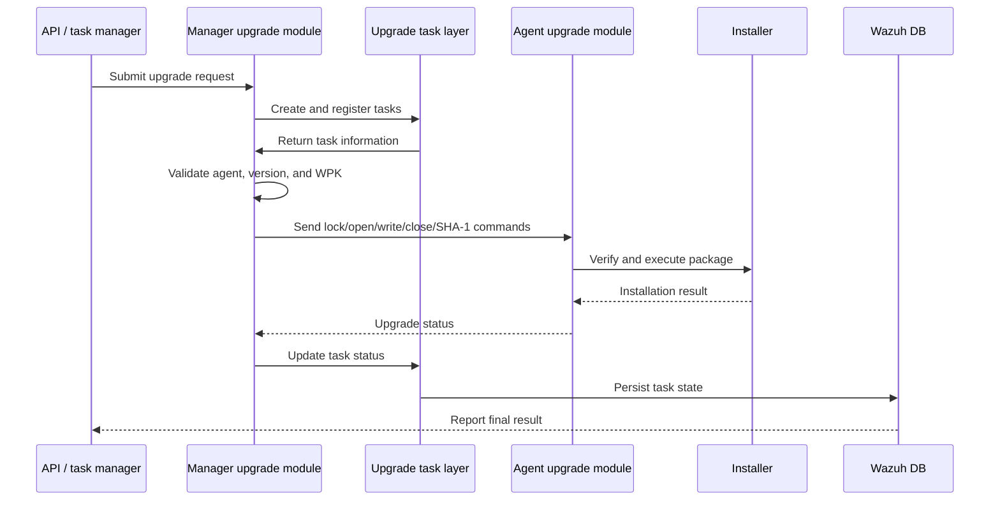

# Unit Tests – Agent Upgrade Module

## Purpose

`Unit_Tests_-_Agent_Upgrade_Module` validates the Wazuh agent-upgrade subsystem through CMocka-based unit tests and mocked external dependencies. The suite covers:

- Module lifecycle and configuration dumping.
- Manager- and agent-side startup.
- Unix-socket command handling.
- Upgrade command parsing and orchestration.
- Task creation, tracking, callbacks, and task-manager communication.
- WPK validation, version compatibility, downloads, and SHA-1 verification.
- Package transfer, installation, result reporting, and cleanup.
- Path confinement, signing, decompression, and file-operation safety.

The tests isolate upgrade logic from real sockets, filesystems, installers, databases, network services, and threads using wrappers and fixtures.

## Repository structure

```text
src/unit_tests/wazuh_modules/agent_upgrade/
├── test_wm_agent_upgrade.c
├── test_wm_agent_upgrade_agent.c
├── test_wm_agent_upgrade_com.c
├── test_wm_agent_upgrade_commands.c
├── test_wm_agent_upgrade_manager.c
├── test_wm_agent_upgrade_parsing.c
├── test_wm_agent_upgrade_tasks.c
├── test_wm_agent_upgrade_tasks_callbacks.c
├── test_wm_agent_upgrade_upgrades.c
│   ├── upgrade_args_tests
│   ├── dispatch_prepare_upgrades_tests
│   ├── send_close_tests
│   ├── send_command_generic_tests
│   ├── send_lock_restart_tests
│   ├── send_open_tests
│   ├── send_sha1_tests
│   ├── send_upgrade_tests
│   ├── send_write_tests
│   ├── send_wpk_to_agent_tests
│   └── start_upgrade_tests
└── test_wm_agent_upgrade_validate.c
```

## Architecture

### Runtime and test scope



### Test-module organization



### Manager-to-agent upgrade flow



## Core component documentation

- [Agent upgrade module](agent_upgrade_module.md) — overall manager/agent upgrade architecture.
- [Agent upgrade main](agent_upgrade_main.md) — module context, startup delegation, configuration dump, and cleanup.
- [Agent upgrade manager](agent_upgrade_manager.md) — manager listener and local socket lifecycle.
- [Agent upgrade agent](agent_upgrade_agent.md) — agent listener, result polling, backoff, and acknowledgements.
- [Agent upgrade commands](agent_upgrade_commands.md) — request orchestration and task validation.
- [Agent upgrade parsing](agent_upgrade_parsing.md) — JSON command parsing and response serialization.
- [Agent upgrade tasks](agent_upgrade_tasks.md) — task registry, dispatch, and cluster routing.
- [Agent upgrade task callbacks](agent_upgrade_tasks_callbacks.md) — status conversion and task-manager response handling.
- [Agent upgrade COM](agent_upgrade_com.md) — agent-side file operations, package processing, and installer execution.
- [Agent upgrade upgrades](agent_upgrade_upgrades.md) — package transfer, worker dispatch, and upgrade-stage errors.
- [Agent upgrade validation](agent_upgrade_validate.md) — agent eligibility, version policy, WPK resolution, and integrity checks.
- [Wmodules agent-upgrade configuration](Wmodules_Config_agent_upgrade.md) — XML configuration and defaults.
- [Task manager module](task_manager_module.md) — task lifecycle and status persistence.
- [Wazuh DB](wazuh_db.md) — agent metadata and durable task storage.
- [Framework communication](framework_core_communication.md) — queues, sockets, Wazuh DB communication, and logging.
- [OS networking](os_net.md) and [shared library networking](shared_lib_networking.md) — secure transport primitives.