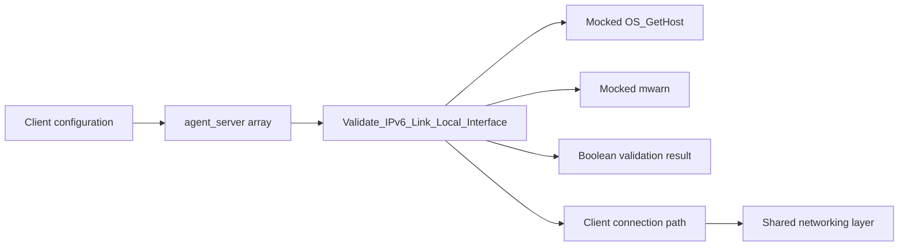
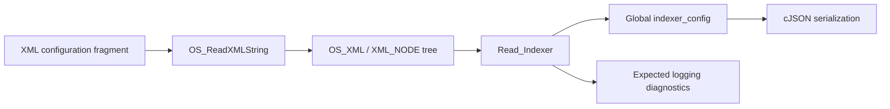

# Unit Tests – Configuration

## Purpose

The `Unit_Tests_-_Configuration` module contains CMocka-based unit tests for Wazuh’s native configuration handling. It validates:

- IPv4, global IPv6, and link-local IPv6 manager address handling.
- Required network-interface scopes for IPv6 link-local addresses.
- XML-to-JSON parsing of indexer configuration.
- Indexer hosts, enablement, SSL certificates, certificate authorities, empty fields, duplicate blocks, and repeated configuration.
- Parser return codes, generated JSON, and expected diagnostic messages without opening network connections or contacting an indexer.

## Repository structure

```text
src/unit_tests/config/
├── test_client-config_validate_ipv6_link_local_interface.c
│   └── Tests Validate_IPv6_Link_Local_Interface
└── test_indexer.c
    └── Tests Read_Indexer
```

## Architecture

### IPv6 link-local configuration validation



The suite isolates configuration validation by mocking hostname resolution and logging. Link-local IPv6 addresses are accepted only when a positive interface index is configured. Mixed address lists verify the validator’s aggregate-result behavior.

### Indexer configuration parsing



`test_indexer.c` uses per-test XML fixtures and teardown. It verifies that `<indexer>` XML is converted into the expected `cJSON` structure, including hosts and optional SSL settings. Repeated configuration blocks confirm replacement and normalization behavior.

## Core component documentation

- [Client configuration data structures](Client_Config.md) — `agent_server` and client configuration definitions.
- [Shared networking layer](os_net.md) — hostname resolution and IPv4/IPv6 connection primitives used around client configuration.
- [Shared logging](shared_lib_logging.md) — logging APIs and mocked diagnostic boundaries.
- [Global configuration core](Global_Config_Core.md) — top-level XML loading and configuration dispatch.
- [Indexer connector](indexer_connector.md) — runtime consumers of parsed indexer settings.
- [Engine indexer connector](engine_indexerconnector.md) — Wazuh Engine’s indexer integration.
- [Source test: IPv6 validation](src/unit_tests/config/test_client-config_validate_ipv6_link_local_interface.c)
- [Source test: indexer configuration](src/unit_tests/config/test_indexer.c)