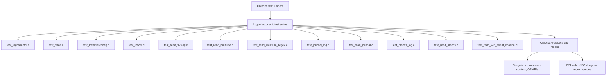
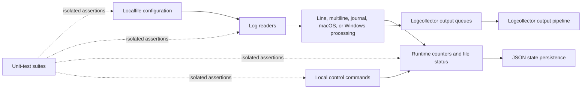

# Unit Tests – Logcollector

## Purpose

`Unit_Tests_-_Logcollector` is the CMocka-based unit-test suite for Wazuh Logcollector. It validates core state management, configuration parsing, command/control handling, file and syslog readers, multiline processing, journald, macOS logging, Windows Event Channels, persistence, filtering, and platform-specific error handling.

The tests isolate production code with wrappers and mocks for filesystem access, queues, JSON, hashing, regular expressions, operating-system APIs, systemd, macOS processes, and Windows Event APIs. This enables deterministic validation without requiring a running Logcollector daemon or platform service.

## Repository structure

```text
src/unit_tests/logcollector/
├── test_journal_log.c
│   ├── test infrastructure
│   ├── systemd journal wrappers
│   ├── library initialization
│   ├── context lifecycle and navigation
│   ├── entry processing
│   ├── filtering
│   └── time utilities
├── test_lccom.c
├── test_localfile-config.c
├── test_logcollector.c
├── test_macos_log.c
├── test_read_journal.c
├── test_read_macos.c
├── test_read_multiline.c
├── test_read_multiline_regex.c
├── test_read_syslog.c
├── test_read_win_event_channel.c
└── test_state.c
```

## Architecture

The suite is organized around focused test modules that target individual Logcollector subsystems and reader implementations.



The production-oriented flow represented by the tests is:



## Test coverage areas

| Area | Covered behavior |
|---|---|
| Core lifecycle and file state | File hashes, offsets, rotation, truncation, persistence, filtering, and macOS process cleanup |
| Configuration | Localfile, multiline, journald, macOS, and XML-related configuration validation |
| Runtime state | Counter aggregation, target drops, JSON generation, periodic dumps, and cleanup |
| Control interface | Command dispatch, configuration retrieval, state pagination, and malformed state handling |
| File readers | Syslog input, empty files, line limits, and reader state updates |
| Multiline readers | Buffer limits, framing, regular-expression modes, replacements, overflow, and context recovery |
| Journald | Dynamic library loading, journal navigation, filtering, timestamps, and entry formatting |
| macOS logging | `log show`/`log stream` command construction, process state, buffering, and recovery |
| Windows Event Channels | Publisher metadata lookup, message formatting, conversion, and cleanup |
| Test infrastructure | Wrapper expectations, fixtures, resource ownership, failure injection, and deterministic platform behavior |

## References to core component documentation

- [Logcollector](logcollector.md) — overall daemon architecture, reader threads, queues, and event flow.
- [Logcollector Core](logcollector_core.md) — shared lifecycle, file tracking, hashing, queues, and threading.
- [Logcollector Config & State](logcollector_config_state.md) — configuration and persisted runtime state.
- [Logcollector Journald](logcollector_journald.md) — systemd journal integration and formatting.
- [Logcollector macOS](logcollector_macos.md) — Unified Logging readers and process orchestration.
- [Logcollector Windows Event Log](logcollector_windows_event_log.md) — Windows Event Channel collection and bookmarks.
- [Logcollector Remote Control](logcollector_remote_control.md) — local control socket and `lccom` commands.
- [Localfile configuration](Localfile_Config.md) — local input configuration and reader options.
- [Test infrastructure](test_infrastructure.md) — shared CMocka fixtures, wrappers, and mocking conventions.

Child test documentation:

- [Journal log tests](logcollector_journal_log_tests.md)
- [Core tests](logcollector_core_tests.md)
- [State tests](logcollector_state_tests.md)
- [Localfile configuration tests](logcollector_localfile_config_tests.md)
- [Control-command tests](logcollector_lccom_tests.md)
- [Syslog reader tests](logcollector_read_syslog_tests.md)
- [Multiline reader tests](logcollector_read_multiline_tests.md)
- [Regex multiline tests](logcollector_read_multiline_regex_tests.md)
- [Journald reader tests](logcollector_read_journal_tests.md)
- [macOS log tests](logcollector_macos_log_tests.md)
- [macOS reader tests](logcollector_read_macos_tests.md)
- [Windows Event Channel tests](logcollector_read_win_event_channel_tests.md)