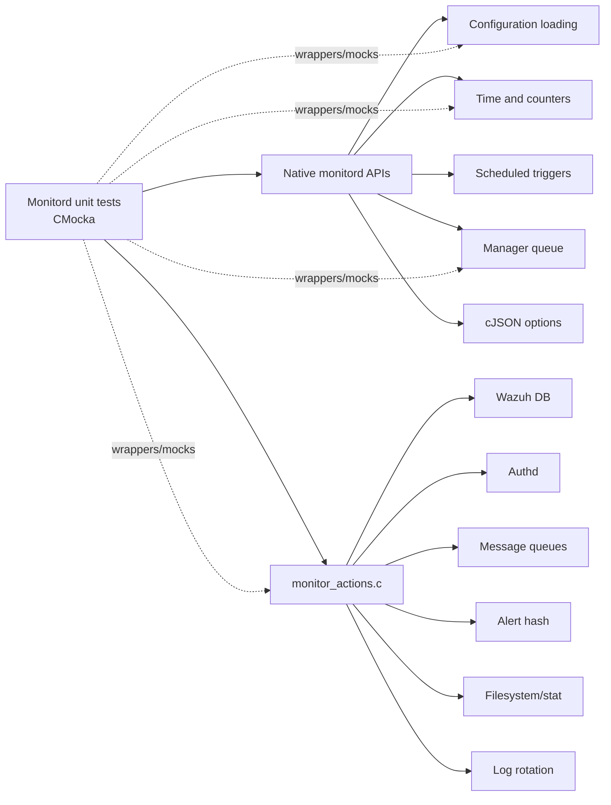
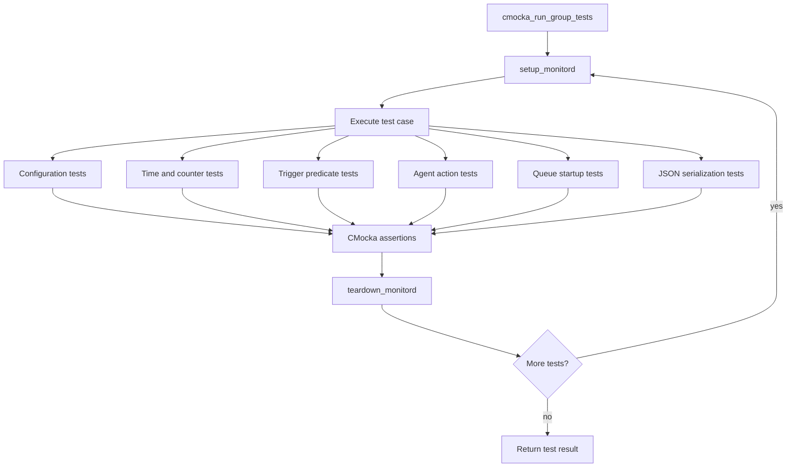
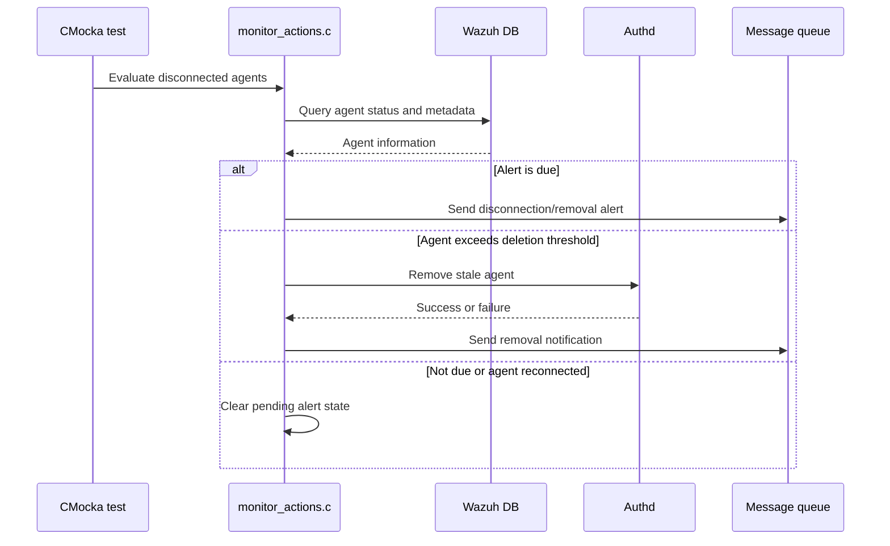

# Unit Tests – Monitord

The `Unit_Tests_-_Monitord` module contains CMocka unit tests for Wazuh’s native `monitord` daemon. It validates configuration loading, monitor time and counter management, scheduled trigger predicates, queue initialization, JSON option serialization, agent disconnection handling, stale-agent deletion, alert generation, and log-monitoring decisions.

The tests isolate production code through deterministic fixtures, global-state reset/teardown, CMocka expectations, and wrappers for queues, Wazuh DB, Authd, time, filesystem, hashing, logging, and log rotation.

## Module structure

```text
src/unit_tests/monitord/
├── test_monitor_actions.c
└── test_monitord.c
```

- `test_monitor_actions.c` — 18 tests for agent-monitoring actions, alerts, deletion, and log checks.
- `test_monitord.c` — 21 tests for configuration, time control, trigger predicates, queue startup, and option serialization.

## Architecture



Each test starts with a clean `mond` configuration and `mond_time_control` state. Wrapped dependencies allow success and failure paths to be tested without starting a real daemon, accessing real queues, or modifying agent data.

## Test execution flow



## Agent-monitoring action flow



## Core component references

- [Monitord daemon](monitord.md) — overall daemon architecture.
- [Monitord lifecycle](monitord_lifecycle.md) — configuration, scheduling, startup, and global state.
- [Monitord agent monitoring](monitord_agent_monitoring.md) — disconnection detection, alerts, and stale-agent handling.
- [Monitord log management](monitord_log_management.md) — log-size checks, rotation, and retention.
- [Wazuh DB](wazuh_db.md) — agent lookup and connection-status operations.
- [OS Auth](os_auth.md) — Authd integration and stale-agent removal.
- [Shared library](shared_lib.md) — queues, hashes, logging, filesystem, and utility services.
- [Unit-test infrastructure](test_infrastructure.md) — common CMocka fixtures and wrapper conventions.

## Summary

This module verifies the decision and integration boundaries of `monitord`. Its strongest coverage is deterministic failure-path testing, including configuration errors, queue failures, missing agents, database failures, Authd failures, malformed agent identifiers, hash-operation failures, and log-monitoring boundary conditions.