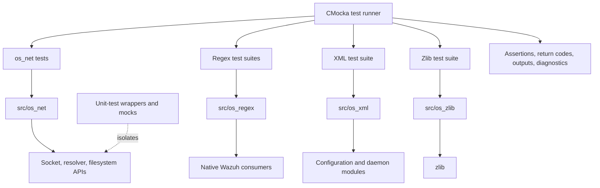
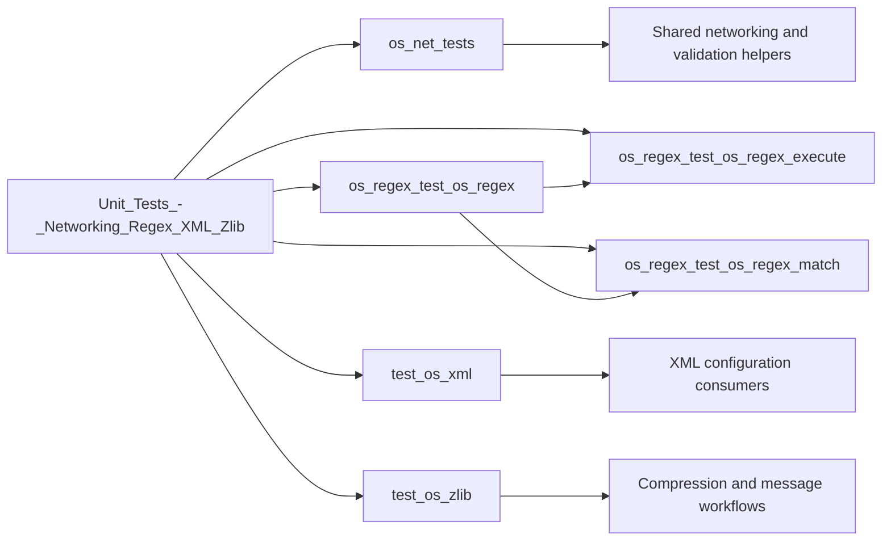

# Unit Tests – Networking, Regex, XML, and Zlib

## Purpose

This module contains focused CMocka unit tests for Wazuh’s low-level networking, native regular-expression, XML parsing/writing, and zlib compression utilities. The tests validate public API behavior, internal matching logic, error handling, boundary conditions, memory ownership, and deterministic success/failure contracts without requiring live network services or external configuration environments.

## Architecture



The module is organized by tested subsystem:



### Networking

`os_net_tests` exercises TCP, UDP, Unix-domain sockets, hostname resolution, secure framing, cluster-message validation, and IPv4/IPv6 conversion. Socket, filesystem, resolver, identity, and logging boundaries are mocked for deterministic testing.

### Regular expressions

The three regex suites provide layered coverage:

- `os_regex_test_os_regex` validates public matching, helper functions, capture extraction, and character tables.
- `os_regex_test_os_regex_execute` loads JSON-defined cases and verifies compilation, execution results, end-match values, and captured groups.
- `os_regex_test_os_regex_match` directly tests the internal `_InternalMatch` routine, including null, empty, anchored, and iterative matching behavior.

### XML

`test_os_xml` validates file and string parsing, node and attribute accessors, variable expansion, malformed-input diagnostics, line tracking, overflow handling, and XML write/read round trips. Temporary files and CMocka fixtures isolate parser state and owned allocations.

### Zlib

`test_os_zlib` verifies compression and decompression of ordinary and whitespace-containing strings. It also checks invalid pointers, zero-sized buffers, output termination, round-trip equality, and the adapter’s zero-on-failure convention.

## Repository structure

```text
src/unit_tests/
├── os_net/
│   └── test_os_net.c
├── os_regex/
│   ├── test_os_regex.c
│   ├── test_os_regex_execute.c
│   └── test_os_regex_match.c
├── os_xml/
│   └── test_os_xml.c
└── os_zlib/
    └── test_os_zlib.c
```

Shared test infrastructure is provided by `src/unit_tests/wrappers`, including socket, filesystem, regex, XML, zlib, and common Wazuh wrappers.

## References

Core component documentation:

- [os_net tests](os_net_tests.md) — networking API coverage and mocking strategy.
- [os_net](os_net.md) — production networking implementation.
- [shared networking](shared_lib_networking.md) — shared networking helpers.
- [socket networking](socket_networking.md) — reusable socket abstractions.
- [os_regex tests](os_regex_test_os_regex.md) — public regex and helper coverage.
- [regex execution tests](os_regex_test_os_regex_execute.md) — data-driven execution and capture testing.
- [internal regex matching tests](os_regex_test_os_regex_match.md) — `_InternalMatch` coverage.
- [os_regex](os_regex.md) — native regex architecture and consumers.
- [os_xml tests](test_os_xml.md) — parser, accessor, variable, and writer coverage.
- [os_xml](os_xml.md) — XML data model and production consumers.
- [zlib tests](test_os_zlib.md) — compression adapter behavior and limitations.
- [compression archive utilities](compression_archive.md) — related compression infrastructure.
- [unit-test infrastructure](test_infrastructure.md) — common CMocka and wrapper conventions.