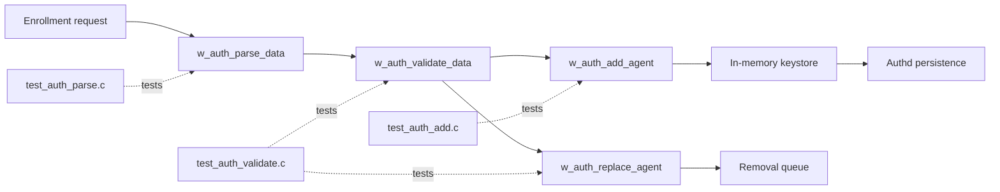
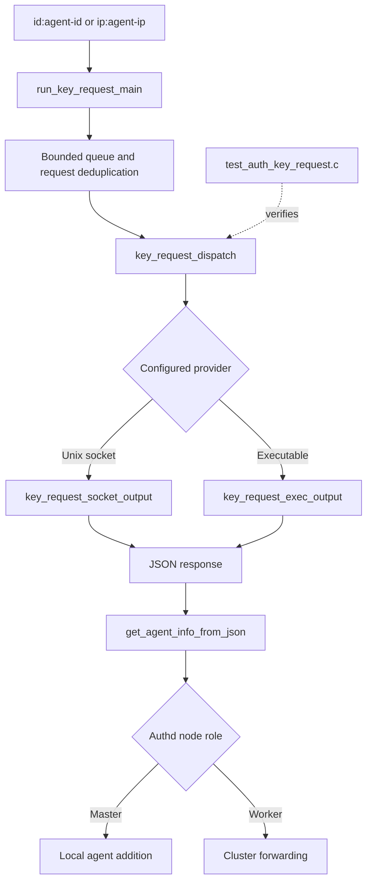
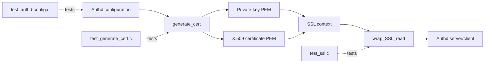

# Unit Tests – OS Auth

## Purpose

`Unit_Tests_-_OS_Auth` is the CMocka-based unit-test suite for Wazuh’s OS Auth/Authd subsystem. It validates enrollment parsing, agent validation and insertion, replacement policies, key requests, configuration handling, password generation, certificate generation, and SSL read aggregation.

The tests isolate production code with deterministic mocks and wrappers. They do not require a running Authd daemon, live TLS connections, external sockets, persistent `client.keys`, or database services.

## Architecture

### Enrollment and validation coverage



### Authd key-request coverage



### TLS and certificate coverage



## Repository structure

```text
src/unit_tests/os_auth/
├── test_auth.c
├── test_auth_add.c
├── test_auth_key_request.c
├── test_auth_parse.c
├── test_auth_validate.c
├── test_authd-config.c
├── test_generate_cert.c
└── test_ssl.c
```

| Test module | Main responsibility |
|---|---|
| `test_auth.c` | Deterministic enrollment-password generation |
| `test_auth_add.c` | Agent creation, key generation, and keystore insertion |
| `test_auth_key_request.c` | Socket/executable key providers, JSON parsing, dispatch, and cluster/local registration |
| `test_auth_parse.c` | Enrollment message parsing, password checks, fields, groups, IPs, and key hashes |
| `test_auth_validate.c` | Duplicate detection, group validation, replacement policy, and keystore mutation |
| `test_authd-config.c` | `allow_higher_versions` configuration parsing and diagnostics |
| `test_generate_cert.c` | Private-key and X.509 generation, signing, PEM persistence, and failure handling |
| `test_ssl.c` | SSL read error handling, buffer offsets, capacity tracking, and multi-record aggregation |

## Core component references

- [OS Auth subsystem](os_auth.md)
- [Enrollment core](os_auth_enrollment_core.md)
- [Authd server daemon](os_auth_server_daemon.md)
- [Authd local server](os_auth_local_server.md)
- [Authd client](os_auth_client.md)
- [SSL and certificate handling](os_auth_ssl_certificates.md)
- [Authd configuration](Authd_Config.md)
- [OS cryptography](os_crypto.md)
- [Shared unit-test infrastructure](test_infrastructure.md)