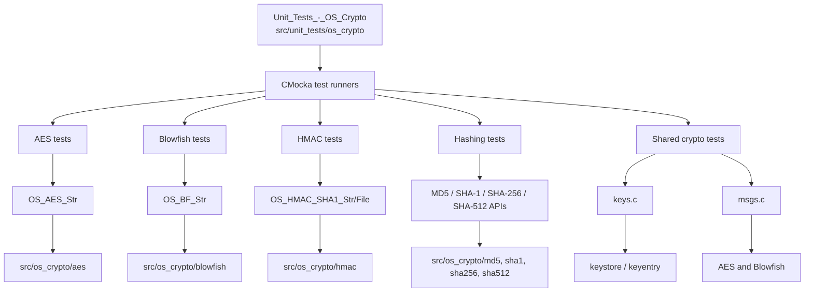
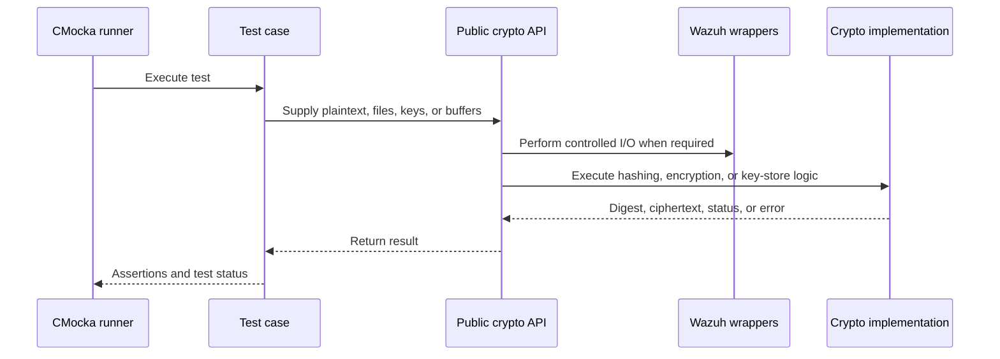

# Unit Tests – OS Crypto

## Purpose

`Unit_Tests_-_OS_Crypto` is the CMocka-based test suite for Wazuh’s native cryptographic primitives and shared crypto helpers. It validates:

- Symmetric encryption and decryption using AES and Blowfish.
- HMAC-SHA1, MD5, SHA-1, SHA-256, and SHA-512 hashing.
- Combined MD5/SHA-1 and MD5/SHA-1/SHA-256 file hashing.
- Agent key-store lookups, timestamp persistence, key fingerprints, and crypto-method configuration.
- Shared message encryption dispatch and request-ID persistence.

The tests focus on public API behavior, known digest values, round trips, error handling, and deterministic file-I/O behavior through Wazuh wrappers.

## Architecture



Each child module is an isolated executable test translation unit. CMocka provides test registration and assertions, while Wazuh wrapper functions mock filesystem, libc, logging, queue, and time operations where failure paths must be controlled.



## Repository structure

```text
src/unit_tests/os_crypto/
├── aes/test_aes_op.c
├── blowfish/test_blowfish_op.c
├── hmac/test_hmac_op.c
├── md5/test_md5_op.c
├── md5_sha1/test_md5_sha1_op.c
├── md5_sha1_sha256/test_md5_sha1_sha256_op.c
├── sha1/test_sha1_op.c
├── sha256/test_sha256_op.c
├── sha512/test_sha512_op.c
└── shared/
    ├── test_keys.c
    └── test_msgs.c
```

| Child module | Coverage |
|---|---|
| `os_crypto_aes_tests` | AES encryption/decryption round trips |
| `os_crypto_blowfish_tests` | Blowfish encryption/decryption round trips |
| `os_crypto_hmac_tests` | HMAC-SHA1 for strings/files and file-open failures |
| `os_crypto_md5_tests` | MD5 string/file hashing and errors |
| `os_crypto_md5_sha1_tests` | Combined MD5/SHA-1 file hashing and prefilter failures |
| `os_crypto_md5_sha1_sha256_tests` | Combined MD5/SHA-1/SHA-256 hashing, command input, and size limits |
| `os_crypto_sha1_tests` | File, bounded, streaming, and string SHA-1 operations |
| `os_crypto_sha256_tests` | SHA-256 string and file operations |
| `os_crypto_sha512_tests` | SHA-512 hashing and hexadecimal conversion |
| `os_crypto_shared_test_keys` | Key-store authorization, timestamps, protocol lookup, and key fingerprints |
| `os_crypto_shared_test_msgs` | RID persistence, cipher dispatch, and agent crypto-method assignment |

## References

Core implementation documentation:

- [os_crypto.md](os_crypto.md) — production cryptographic primitives, key-store management, SHA-1 hashing, and package-signature verification.
- [os_auth.md](os_auth.md) — enrollment and authentication consumers of the key store.
- [remoted.md](remoted.md) — secure agent-manager communication and key authorization consumers.
- [client_agent_native.md](client_agent_native.md) — agent-side communication consumers.

Child test documentation:

- [os_crypto_aes_tests.md](os_crypto_aes_tests.md)
- [os_crypto_blowfish_tests.md](os_crypto_blowfish_tests.md)
- [os_crypto_hmac_tests.md](os_crypto_hmac_tests.md)
- [os_crypto_md5_tests.md](os_crypto_md5_tests.md)
- [os_crypto_md5_sha1_tests.md](os_crypto_md5_sha1_tests.md)
- [os_crypto_md5_sha1_sha256_tests.md](os_crypto_md5_sha1_sha256_tests.md)
- [os_crypto_sha1_tests.md](os_crypto_sha1_tests.md)
- [os_crypto_sha256_tests.md](os_crypto_sha256_tests.md)
- [os_crypto_sha512_tests.md](os_crypto_sha512_tests.md)
- [os_crypto_shared_test_keys.md](os_crypto_shared_test_keys.md)
- [os_crypto_shared_test_msgs.md](os_crypto_shared_test_msgs.md)