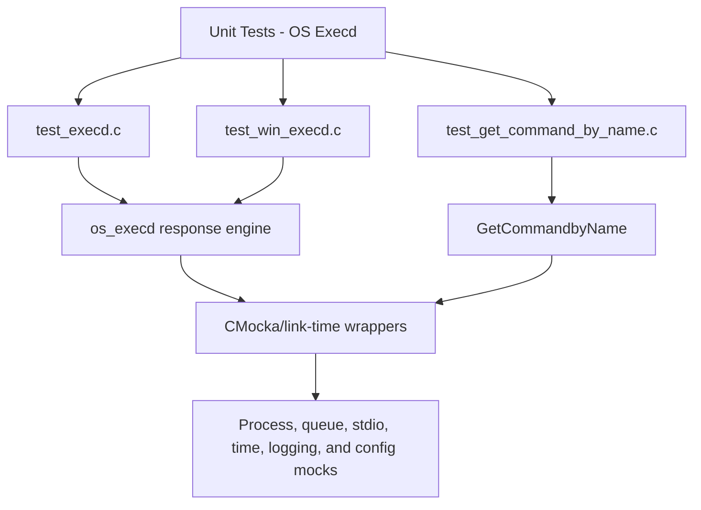
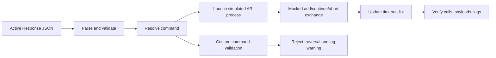

# Unit Tests – OS Execd

## Purpose

`Unit_Tests_-_OS_Execd` is the CMocka test suite for Wazuh’s `os_execd` Active Response execution daemon. It validates command resolution, POSIX and Windows execution flows, JSON message transformation, process and I/O error handling, timeout tracking, repeated-response handling, and custom-command path-traversal protection.

The tests isolate production behavior with wrappers and mocks, so they do not launch real Active Response programs or depend on real sockets, processes, or filesystem state.

## Repository structure

```text
src/unit_tests/os_execd/
├── test_execd.c
│   └── POSIX ExecdStart execution, timeout, and error-path tests
├── test_get_command_by_name.c
│   └── Custom command resolution and traversal protection tests
└── test_win_execd.c
    └── Windows ExecdRun execution, timeout, and error-path tests
```

Detailed child documentation:

- [os_execd_test_execd](os_execd_test_execd.md)
- [os_execd_test_get_command_by_name](os_execd_test_get_command_by_name.md)
- [os_execd_test_win_execd](os_execd_test_win_execd.md)

## Architecture



The suite covers two platform execution paths and one focused security/lookup path:



Each execution test uses synthetic `wfd_t` streams, controlled process wrappers, mocked queue input, and isolated timeout-list fixtures. The POSIX and Windows suites both verify successful execution, timeout insertion or refresh, repeated-command abort behavior, malformed input, command lookup failures, process-launch failures, and child-output failures.

## Core component references

- [os_execd](os_execd.md) — overall daemon architecture, responsibilities, and relationships.
- [os_execd_response_engine](os_execd_response_engine.md) — command resolution, process execution, timeout handling, repeated-offender escalation, and shutdown behavior.
- [os_execd_daemon_lifecycle](os_execd_daemon_lifecycle.md) — daemon startup and invocation of the execution loop.
- [active_response_module](active_response_module.md) — framework-side creation of Active Response messages.
- [Unit Test Wrappers & Mocks](Unit_Test_Wrappers_&_Mocks.md) — shared wrapper and mock infrastructure used to isolate native components.